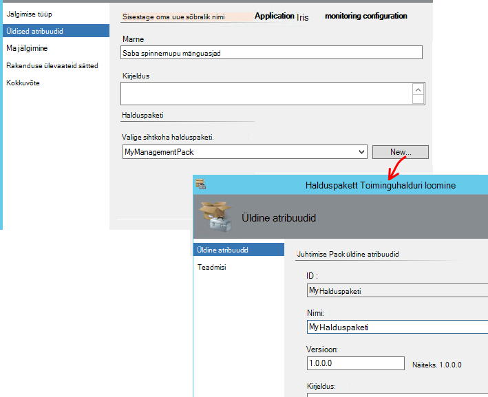

<properties 
    pageTitle="SCOM integreerimine rakenduse ülevaated | Microsoft Azure'i" 
    description="Kui olete SCOM kasutaja, jõudluse jälgimist ja diagnoosimine probleeme rakenduse ülevaated. Täielik armatuurlaudade, nutikas teatised, võimsaid diagnostikatööriistu ja analüüsi päringud." 
    services="application-insights" 
    documentationCenter=""
    authors="alancameronwills" 
    manager="douge"/>

<tags 
    ms.service="application-insights" 
    ms.workload="tbd" 
    ms.tgt_pltfrm="ibiza" 
    ms.devlang="na" 
    ms.topic="article" 
    ms.date="08/12/2016" 
    ms.author="awills"/>
 
# Rakenduse jõudluse jälgimise kasutamise SCOM rakenduse ülevaated

Kui süsteemi Center toimingute Manager (SCOM) abil saate hallata oma serverid, saate jõudluse jälgimist ja diagnoosida jõudlusprobleemide [Visual Studio rakenduse ülevaated](app-insights-asp-net.md)abil. Rakenduse ülevaated jälgib oma veebirakenduse sissetulevad taotlused, väljaminevat ülejäänud ja SQL-i kõnede, erandid ja log jälgi. Pakub armatuurlaudade argumendil diagrammide ja nutikas teatisi, kui ka võimas diagnostika otsing ja analytical päringute üle selle telemeetria. 

Klõpsake rakenduse ülevaated jälgimine on SCOM halduspaketi abil saate vahetada.

## Enne alustamist

Oleme endale:

* Olete tuttav SCOM ja teie IIS-i haldamiseks kasutada SCOM 2012 R2 või 2016 web servereid.
* Teil on juba installitud serveritesse veebirakenduse, mida soovite jälgida rakenduse ülevaated.
* Rakenduse framework versioon on .NET 4.5 või uuem versioon.
* Teil on juurdepääs tellimuse [Microsoft Azure](https://azure.com) ja [Azure portaali](https://portal.azure.com)saab sisse logida. Ettevõtte võib-olla tellimus ja saate lisada oma Microsofti kontoga.

(Selle arendusmeeskonnale võib luua [Rakenduse ülevaateid SDK](app-insights-asp-net.md) web appi. Selle koostamine / kellaaja instrumentation annab neile suurema paindlikkuse kohandatud telemeetria kirjalikult. Siiski pole oluline: te saate järgige siin kirjeldatud koos või ilma sisseehitatud SDK.)

## (Üks kord) Installige rakenduse ülevaated halduspaketi

Kui käivitate Toiminguhalduri arvutis:

2. Mis tahes management pack vanemat versiooni desinstallimiseks tehke järgmist.
 1. Avage Toiminguhalduri, Administreerimine halduse paketid. 
 2. Kustutage vana versioon.
1. Laadige alla ja installige halduspakett toiminguhalduri kataloogi.
2. Taaskäivitage Toiminguhalduri.

## Halduspakett toiminguhalduri loomine

1. Toiminguhalduri, avage **funktsiooniga**, **.NET... koos rakenduse ülevaated**, **Jälgimine viisardit**ja uuesti valida **.NET... koos rakenduse ülevaated**.

    

2. Konfiguratsiooni pärast oma rakenduse nimi. (Tuleb dokumendi korraga ühte rakendust.)
    
    

3. Sama viisardi lehel luua uue halduspaketi või valida pack, jaoks loodud rakenduse ülevaated varasemas versioonis.

     (Rakenduse ülevaated [halduspaketi](https://technet.microsoft.com/library/cc974491.aspx) on Mall, millest eksemplari loomine. Saate kasutada sama eksemplari allpool.)

    

4. Valige üks rakendus, mida soovite jälgida. Funktsioon otsib serveritesse rakenduste vahel.

    

    Valikuline jälgimis ulatus välja saab määramiseks alamhulk serverid, kui te ei soovi kõikides serverites rakendus jälgimiseks.

5. Viisardi järgmisel lehel, peate andma Microsoft Azure'i sisselogimiseks oma mandaat.

    Sellel lehel saate valida rakenduse ülevaated ressursi, kuhu soovite koguda andmeid analüüsida ja kuvada. 

 * Kui rakendus on konfigureeritud lubama rakenduse ülevaated arendamise käigus, valige oma olemasoleva ressursi.
 * Muul juhul saate luua uue ressursi rakenduse nimega. Kui leidub muid rakendusi, mis on sama süsteemi, paneb sama ressursirühm teha Accessi telemeetria lihtsam hallata.

    Neid sätteid saate hiljem muuta.

    

6. Viisardi lõpuleviimine.

    
    
Korrake seda protseduuri iga rakendus, mida soovite jälgida.

Kui teil on vaja muuta sätteid hiljem uuesti avada atribuutide kuvari kasutamisel aknast.

## Veenduge, et jälgimine

Otsib teie rakendus on installitud iga server jälgida. Kui see rakendus, leiab see konfigureerib rakenduse ülevaateid oleku jälgimine jälgida rakenduse. Vajaduse korral see esmalt installib oleku jälgimine serveris.

Saate kontrollida, milliseid rakenduse eksemplari on leitud.

## Vaate telemeetria rakenduse ülevaated

[Azure'i portaalis](https://portal.azure.com), liikuge sirvides oma rakenduse ressursile. Saate [vaadata diagrammid, mis näitavad telemeetria](app-insights-dashboards.md) rakenduste. (Kui see pole kuvatud avalehele veel, klõpsake Live mõõdikute voo.)

## Järgmised sammud

* Koondada on kõige olulisemad diagrammid jälgimine selle ja muude rakenduste [häälestamine armatuurlaua](app-insights-dashboards.md) .
* [Lisateavet mõõdikud](app-insights-metrics-explorer.md)
* [Teatiste häälestamine](app-insights-alerts.md)
* [Jõudlusega seotud probleemide diagnoosimise](app-insights-detect-triage-diagnose.md)
* [Võimas Analytics päringud](app-insights-analytics.md)
* [Kättesaadavus web testide](app-insights-monitor-web-app-availability.md)
