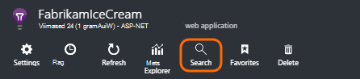
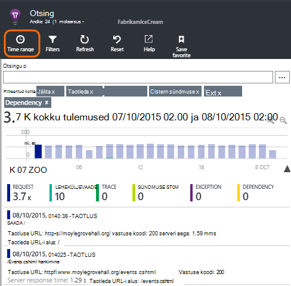
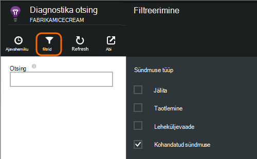
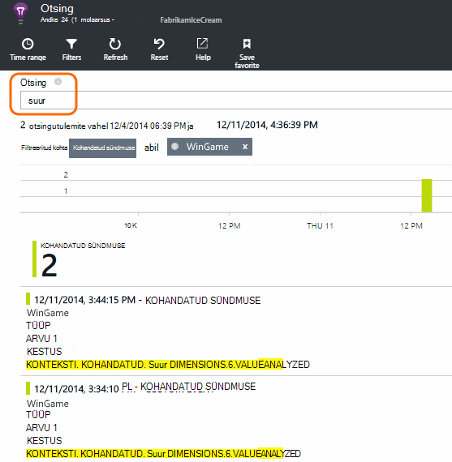
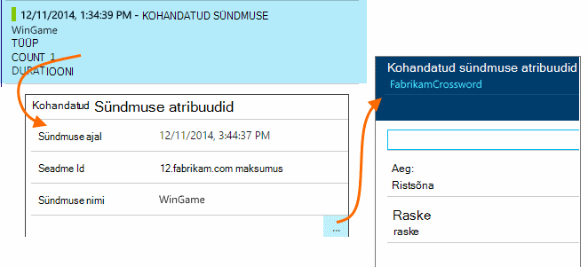
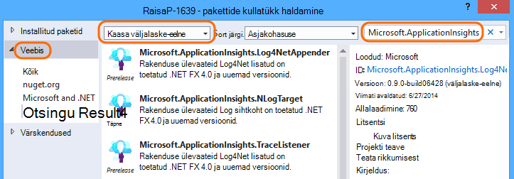
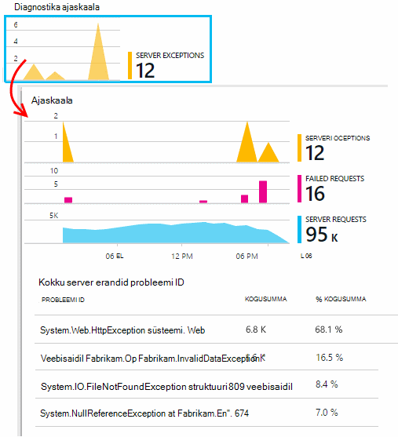
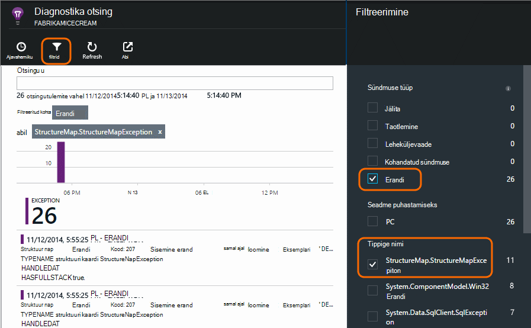

<properties 
    pageTitle="Logide, erandid ja kohandatud diagnostika ASP.net-i rakenduse ülevaated" 
    description="ASP.net-i veebirakenduste probleemid diagnoosimine taotlusi, erandid ja logid Jälita, NLog või Log4Net loodud otsingu kaudu." 
    services="application-insights" 
    documentationCenter=""
    authors="alancameronwills" 
    manager="douge"/>

<tags 
    ms.service="application-insights" 
    ms.workload="tbd" 
    ms.tgt_pltfrm="ibiza" 
    ms.devlang="na" 
    ms.topic="article" 
    ms.date="04/08/2016" 
    ms.author="awills"/>
 
# Logide, erandid ja kohandatud diagnostika ASP.net-i rakenduse ülevaated

[Rakenduse ülevaated] [ start] võimas [Diagnostika otsing] sisaldab[ diagnostic] tööriista, mis võimaldab teil uurimine ja hulgidiagrammis telemeetria rakenduse rakenduse ülevaateid SDK saadetud. Mitme sündmusi, näiteks lehe kasutajavaadete saadetakse automaatselt SDK.

Samuti saate kirjutada koodi saata kohandatud sündmused, erandi aruandeid ja jälgi. Ja kui kasutate juba logimine framework, nt log4J, log4net, NLog või System.Diagnostics.Trace, saate need logid jäädvustada ja kaasata otsingusse. See on lihtne vastavus kasutajatoimingute, erandid ja muid sündmusi log jälgi.

## Enne kui kirjutada kohandatud telemeetria

Kui te pole veel [häälestamine rakenduse ülevaated oma projekti][start], seda nüüd teha.

Kui saate rakenduse käivitada, ei saadeta mõned telemeetria, mis kuvatakse diagnostika otsing, sh edastatud server, taotluste lehel logitud kliendi, vaadete ja tabamatu erandid.

Avage diagnostika otsingu kuvamiseks telemeetria, mis saadab SDK automaatselt.

Üksikasjad erinevad ühe rakenduse tüüp. Täpsemat teavet üksikute sündmuse vältel läbi klõpsata.

## Valimite 

Kui teie taotlus saadetakse palju andmeid ja kasutate rakenduse ülevaateid SDK ASP.net-i versioon 2.0.0-beta3 või uuem versioon, kohandatava valimite funktsiooni käitamiseks ja saatmine ainult teie telemeetria protsent. [Lugege lisateavet valimite.](app-insights-sampling.md)

##Kohandatud sündmused

Kohandatud sündmused kuvatakse nii [Diagnostika] otsingus[ diagnostic] ja [Mõõdiku]Exploreris[metrics]. Saate neile saata seadmed, veebilehtede ja serveri rakenduste kaudu. Neid saab kasutada nii diagnostika tarbeks ka [mustreid]mõista[track].

Kohandatud sündmuse on nimi, ja Lisaks saate teha atribuudid, mida saab filtreerida, arvväärtusega mõõtmed koos.

JavaScripti kliendi

    appInsights.trackEvent("WinGame",
         // String properties:
         {Game: currentGame.name, Difficulty: currentGame.difficulty},
         // Numeric measurements:
         {Score: currentGame.score, Opponents: currentGame.opponentCount}
         );

C# server

    // Set up some properties:
    var properties = new Dictionary <string, string> 
       {{"game", currentGame.Name}, {"difficulty", currentGame.Difficulty}};
    var measurements = new Dictionary <string, double>
       {{"Score", currentGame.Score}, {"Opponents", currentGame.OpponentCount}};

    // Send the event:
    telemetry.TrackEvent("WinGame", properties, measurements);

VB server

    ' Set up some properties:
    Dim properties = New Dictionary (Of String, String)
    properties.Add("game", currentGame.Name)
    properties.Add("difficulty", currentGame.Difficulty)

    Dim measurements = New Dictionary (Of String, Double)
    measurements.Add("Score", currentGame.Score)
    measurements.Add("Opponents", currentGame.OpponentCount)

    ' Send the event:
    telemetry.TrackEvent("WinGame", properties, measurements)

### Käivitage rakendus ja tulemusi vaadata.

Avage diagnostika otsing.

Kohandatud sündmus ja valige kindla sündmuse nimi.

Sisestades otsingutermin on väärtus rohkem andmeid filtreerida:  

Üksikute sündmuse selle üksikasjalik atribuutide vaatamiseks minge süvitsi.

##Lehe vaated

Lehe vaate telemeetria saadetakse trackPageView() kõne [JavaScripti koodilõigu, saate lisada oma veebilehtede][usage]. Selle peamine eesmärk on osaleda loendab lehe vaadet, mida näete, klõpsake lehe Ülevaade.

Tavaliselt seda nimetatakse üks kord igale lehele HTML-vormingus, kuid saate lisada rohkem kõned – näiteks kui teil on ühe lehe rakendus ja logida uue lehe iga kord, kui kasutaja saab rohkem andmeid.

    appInsights.trackPageView(pageSegmentName, "http://fabrikam.com/page.htm"); 

Mõnikord on kasulik manustamine atribuudid, mille abil saate filtritena diagnostika otsingus:

    appInsights.trackPageView(pageSegmentName, "http://fabrikam.com/page.htm",
     {Game: currentGame.name, Difficulty: currentGame.difficulty});

##Jälita telemeetria

Jälita telemeetria on lisamisel spetsiaalselt loomiseks diagnostikalogid kood. 

Näiteks võib lisada kõnede umbes järgmine:

    var telemetry = new Microsoft.ApplicationInsights.TelemetryClient();
    telemetry.TrackTrace("Slow response - database01");

####  Adapterit oma logimine Frameworki installimine

Saate otsida ka loodud logimine raamistikuga – logid log4Net NLog või System.Diagnostics.Trace. 

1. Kui kavatsete kasutada log4Net või NLog, installige projektis. 
2. Solution Exploreris projekti paremklõpsake ja valige **Halda NuGet-paketid**.
3. Valige Online >, valige **Väljalaske-eelne kaasa** ja otsige "Microsoft.ApplicationInsights"

    

4. Valige sobiv pakett – üks:
  + Microsoft.ApplicationInsights.TraceListener (jäädvustada System.Diagnostics.Trace kõned)
  + Microsoft.ApplicationInsights.NLogTarget
  + Microsoft.ApplicationInsights.Log4NetAppender

Nugeti pakett installib vajalikud assemblereid ja ka muudab web.config või app.config.

#### Diagnostika Logi kõned lisamine

Kui kasutate System.Diagnostics.Trace, oleks tüüpiline kõne:

    System.Diagnostics.Trace.TraceWarning("Slow response - database01");

Kui eelistate log4net või NLog:

    logger.Warn("Slow response - database01");

Käivitage rakendus silumine režiimis või juurutada.

Diagnostika otsingu sõnumid kuvatakse valimisel Sõnumijälituse filter.

### Erandid

Saada erand aruannete rakenduse ülevaated pakub väga võimas kogemus, sest saate liikuda nurjunud taotlusi ja erandid ning lugeda virnas erand.

Mõnel juhul peate [sisestama mõne koodiread] [ exceptions] veendumaks, et teie erandid on püütakse automaatselt.

Samuti saate kirjutada selgesõnaline koodi saata erandi telemeetria:

JavaScripti

    try 
    { ...
    }
    catch (ex)
    {
      appInsights.TrackException(ex, "handler loc",
        {Game: currentGame.Name, 
         State: currentGame.State.ToString()});
    }

C#

    var telemetry = new TelemetryClient();
    ...
    try 
    { ...
    }
    catch (Exception ex)
    {
       // Set up some properties:
       var properties = new Dictionary <string, string> 
         {{"Game", currentGame.Name}};

       var measurements = new Dictionary <string, double>
         {{"Users", currentGame.Users.Count}};

       // Send the exception telemetry:
       telemetry.TrackException(ex, properties, measurements);
    }

VB

    Dim telemetry = New TelemetryClient
    ...
    Try
      ...
    Catch ex as Exception
      ' Set up some properties:
      Dim properties = New Dictionary (Of String, String)
      properties.Add("Game", currentGame.Name)

      Dim measurements = New Dictionary (Of String, Double)
      measurements.Add("Users", currentGame.Users.Count)
  
      ' Send the exception telemetry:
      telemetry.TrackException(ex, properties, measurements)
    End Try

Atribuudid ja mõõdud parameetrid on valikuline, kuid on abiks filtreerimise ja lisada täiendavat teavet. Näiteks, kui teil on rakendus, mis töötab mitu mängu, võib leida erandi aruannete seotud konkreetse mängu. Saate lisada nii palju üksusi, kui soovite iga sõnastikku.

#### Erandite vaatamine

Kuvatakse ülevaade enne teatatud erandid kokkuvõte ja saate klõpsata kohta täpsema teabe kuvamiseks. Näiteks:

[]

Klõpsake mis tahes erandi tüüp teatud sündmuste kuvamiseks:

[]

Saate avada otse diagnostika otsing, filtreerida erandid ja valige erandi tüüp, mida soovite vaadata.

### Aruandlusteenuste töötlemata erandid

Rakenduse ülevaateid aruannete ilmnes käsitlematu erandid kui see võib seadmest, [veebibrauserite][usage], või web servereid, kas varustatud mõõteriistadega tegemiseks, [Oleku jälgimine] [ redfield] või [Rakenduse ülevaateid SDK][greenbrown]. 

Siiski alati pole võimalik seda mõnel juhul teha, kuna .NET Frameworki püüab erandid.  Veenduge, et kõik erandid, seega tuleb kirjutada väike erand sündmuseohjuri. Parim protseduur erineb tehnoloogiaga. [Erandi telemeetria ASP.net-i jaoks] leiate[ exceptions] üksikasju. 

### Tõestusmeetodid koos mõne koostamine

Kui loete diagnostikalogid, on tõenäoline, et teie lähtekoodi muutunud Kuna reaalajas kood on juurutatud.

Seetõttu on kasulik panna Koosta teave, näiteks praegune versioon, URL-i atribuudi koos iga erandi või jälgi. 

Atribuut eraldi iga erandi kõne lisamise asemel saate teavet vaikimisi kontekstis. 

    // Telemetry initializer class
    public class MyTelemetryInitializer : ITelemetryInitializer
    {
        public void Initialize (ITelemetry telemetry)
        {
            telemetry.Properties["AppVersion"] = "v2.1";
        }
    }

Klõpsake rakenduse initializer Global.asax.cs näiteks:

    protected void Application_Start()
    {
        // ...
        TelemetryConfiguration.Active.TelemetryInitializers
        .Add(new MyTelemetryInitializer());
    }

###Server Web nõuab

Taotleda telemeetria saadetakse automaatselt kui [oleku jälgimine oma veebiserverisse installida][redfield], või kui saate [lisada rakenduse ülevaated web projekti][greenbrown]. Ka jõuaksid koosolekukutsete ja kutsele vastamise aja graafikuid meetermõõdustik Exploreris ja klõpsake lehe Ülevaade.

Kui soovite saata täiendavad sündmusi, saate kasutada TrackRequest() API-ga.

## K & v

### Kuvatakse tõrge "Instrumentation võti ei saa olla tühi"

Paistab, et teil on installitud logimine adapterit Nugeti pakett ilma installida rakenduse ülevaated.

Paremklõpsake Solution Exploreris `ApplicationInsights.config` ja klõpsake nuppu **Värskenda rakenduse ülevaated**. Kuvatakse dialoogiboks, mis palub teil sisse logida Azure ja kas loomine rakenduse ülevaated on ressurss, või kasutada mõne olemasoleva. Mida peaks seda parandada.

### Kui palju andmeid on alles?

Kuni 500 sündmused sekundis iga rakendusest. Sündmused on alles seitse päeva.

### Mõne oma sündmused või jälgi ei kuvata

Kui teie taotlus saadetakse palju andmeid ja kasutate rakenduse ülevaateid SDK ASP.net-i versioon 2.0.0-beta3 või uuem versioon, kohandatava valimite funktsiooni käitamiseks ja saatmine ainult teie telemeetria protsent. [Lugege lisateavet valimite.](app-insights-sampling.md)

## Järgmised sammud

* [Kättesaadavus ja tundlikkuse kontrollib häälestamine][availability]
* [Tõrkeotsing][qna]

<!--Link references-->

[availability]: app-insights-monitor-web-app-availability.md
[diagnostic]: app-insights-diagnostic-search.md
[exceptions]: app-insights-asp-net-exceptions.md
[greenbrown]: app-insights-asp-net.md
[metrics]: app-insights-metrics-explorer.md
[qna]: app-insights-troubleshoot-faq.md
[redfield]: app-insights-monitor-performance-live-website-now.md
[start]: app-insights-overview.md
[track]: app-insights-api-custom-events-metrics.md
[usage]: app-insights-web-track-usage.md

 
