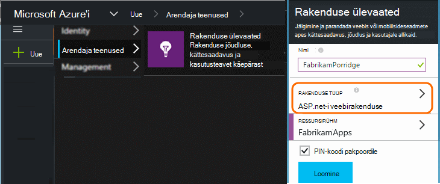
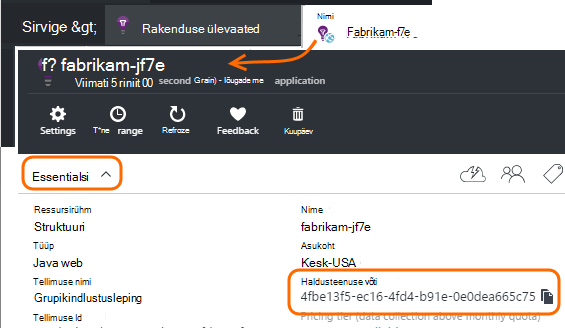

<properties 
    pageTitle="Eraldi rakenduse ülevaated ressursid arendaja-, testi-ja" 
    description="Jõudlus ja rakenduse erineval tasemel arenduse kasutamist jälgimine" 
    services="application-insights" 
    documentationCenter=""
    authors="alancameronwills" 
    manager="douge"/>

<tags 
    ms.service="application-insights" 
    ms.workload="tbd" 
    ms.tgt_pltfrm="ibiza" 
    ms.devlang="na" 
    ms.topic="article" 
    ms.date="05/04/2016" 
    ms.author="awills"/>

# Rakenduse ülevaated ressursside eraldamise kohta

Tuleks telemeetria erinevate osade ja rakenduse versiooni kaudu saadetud erinevate rakenduse ülevaated ressursid, või ühendada ühe? Käesolevas artiklis käsitletakse parimal headest tavadest ja vajalikud meetodite abil.

Kõigepealt loome mõista küsimus. Rakenduse saadud andmed salvestatakse ja töödelda rakenduse ülevaated Microsoft Azure'i *Ressursi*. Iga ressursi tuvastatakse *instrumentation klahv* (iKey). Rakenduste korral saadetakse võti rakenduse ülevaateid SDK, et seda saaks saata õige ressursi abil kogutud andmete. Võti on saadaval koodi või ApplicationInsights.config. Sisestage SDK muutes saate suunata andmete erinevad ressursid. 

Lihtne juhul koodi mõne uue rakenduse loomisel ka loote uue ressursi rakenduse ülevaated sisse. Visual Studio *uue projekti* dialoogiboksi see teie eest.

Kui see on suure mahu veebisait, võib see kasutusele mitme serveri eksemplar.

Keerukamaid stsenaariumid, peate süsteemi, mis koosneb mitmest osast – näiteks veebisaidi ja tagaandmebaas protsessor. 

## Millal kasutada eraldi iKeys

Siin on mõned üldised juhised.

* Kui teil on sõltumatult käivituva rakenduse üksus, mis töötab kogumi serveri eksemplari, mida saate mastaabitud üles/alla sõltumatult muud komponendid, siis te tavaliselt vastendamine mis ühe ressursi - st, see on ühe instrumentation klahvi (iKey).
* Seevastu kasutamise eraldi iKeys põhjused on järgmised:
 - Hõlpsalt lugeda eraldi mõõdikute eraldi komponendid.
 - Hoida alumises mahuga telemeetria eraldi suure mahu, et pidurdamise, kvootide, ja klõpsake ühe voo valimite ei mõjuta teise.
 - Eraldi teatised, eksportimine ja töö üksuse konfiguratsioone.
 - Levinud [piirangud](app-insights-pricing.md#limits-summary) , näiteks telemeetria kvoodi, pidurdamise ja web testida arv.
 - Koodi väljatöötamisel ja testi saatma eraldi iKey kui tootmise tempel.  

Rakenduse ülevaated portaali kogemusi palju on välja töötatud meeles järgmisi juhiseid. Näiteks serverid vaadata segmente serveri eksemplar, teha eeldusel selle telemeetria üks loogiline komponent võivad pärineda mitu serveri eksemplari kohta.

## Ühe iKey

Kui saadate telemeetria mitme komponentidest ühe iKey:

* Atribuut lisada telemeetria, mis võimaldab teil lõigu ja komponent identiteedi filter. Rolli ID-d lisatakse automaatselt telemeetria serveri rolli aknad, kuid muudel juhtudel on [telemeetria initializer](app-insights-api-filtering-sampling.md#add-properties) abil saate lisada atribuudi.
* Värskendage soovitud rakenduse ülevaateid SDK-d erinevate osade samal ajal. Telemeetria jaoks ühe iKey peaks pärinevad SDK sama versiooni.

## Eraldi iKeys

Kui teil on mitme eri rakenduse komponentide iKeys:

* Kombineerida erinevate rakenduse komponentide oma loogilise rakendusest ülevaate põhilistest telemeetria [armatuurlaua](app-insights-dashboards.md) loomine Armatuurlaudade saab jagada, üks loogiline system vaate saate kasutada erinevate meeskondade.
* [Ressursi rühmade](app-insights-resources-roles-access-control.md) meeskonnatöö tasemel korraldada. Juurdepääsuõigused on määratud ressursirühm ja nendeks õiguste häälestada teatised. 
* Esemeid, nt teatiste reeglite haldamiseks ja web testide [Azure ressursihaldur Mallid ja PowerShelli](app-insights-powershell.md) abil.

## Arendaja katsetamiseks ja eraldi iKeys

Lihtsam muutmine võti automaatselt, kui teie rakendus on välja, et määrata iKey koodi, mitte ApplicationInsights.config.

### Dünaamiliste instrumentation võti

Lähtestamine meetodi, nt global.aspx.cs teenuse ASP.net-i võtme seadmiseks:

*C#:*

    protected void Application_Start()
    {
      Microsoft.ApplicationInsights.Extensibility.
        TelemetryConfiguration.Active.InstrumentationKey = 
          // - for example -
          WebConfigurationManager.AppSettings["ikey"];
      ...

Selles näites paigutatakse ikeys eri ressursid web konfiguratsioonifail erinevates versioonides. Vahetamine – mida saate teha osana skripti Väljalaske - web konfiguratsioonifail on Vaheta target ressursi.

### Veebilehed

Funktsiooni iKey kasutatakse ka oma rakenduse veebilehtede [skripti, mis teil Lühijuhend keelest](app-insights-javascript.md). Asemel koodis sõna-sõnalt skripti, luua selle serveri olek. Näiteks ASP.net-i rakenduses:

*JavaScripti Razori*

    <script type="text/javascript">
    // Standard Application Insights web page script:
    var appInsights = window.appInsights || function(config){ ...
    // Modify this part:
    }({instrumentationKey:  
      // Generate from server property:
      "@Microsoft.ApplicationInsights.Extensibility.
         TelemetryConfiguration.Active.InstrumentationKey"
    }) // ...

## Täiendav rakenduse ülevaated ressurss loomine
  
Kui otsustate eraldi telemeetria eri komponendid või muu sama komponendi templite (arendaja/tootmiskatsete), siis tuleb teil luua uue rakenduse ülevaated ressursi.

Lisage [portal.azure.com](https://portal.azure.com)on rakenduse ülevaated ressurss:

* **Rakenduse tüüp** mõjutab kuvatakse ülevaade tera ja atribuutide [argumendil](app-insights-metrics-explorer.md)Exploreris saadaval. Kui te ei näe oma tüüpi rakendus, valige üks veebitüübid veebilehtedel.
* **Ressursirühm** on mugavam haldamise atribuudid nagu [juurdepääsu reguleerimine](app-insights-resources-roles-access-control.md). Võite kasutada eraldi ressursirühma arengu, testimine ja tootmise.
* **Tellimus** on teie makse konto Azure.
* On **koht** , kus teie andmeid säilitatakse. Praegu ei saa muuta. 
* **Lisa armatuurlaua** paneb kiire-juurdepääsu oma ressursi paani Azure'i avalehel. 

Ressursi loomine võtab mõne hetke. Kui seda, kuvatakse vastav teade.

(Saate kirjutada [PowerShelli skripti](app-insights-powershell-script-create-resource.md) loomiseks ressursi automaatselt.)

## Saada instrumentation võti

Haldusteenuse võti tuvastab teie loodud ressursi. 

Peate instrumentation võtmed kõik ressurssi mis saadab rakenduse andmeid.

 
