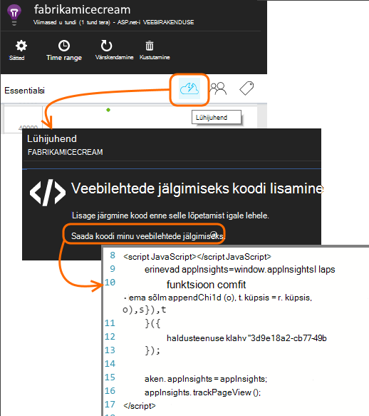

<properties 
    pageTitle="Rakenduse ülevaated SharePointi saidi jälgimine" 
    description="Uus rakendus jälgimist uue instrumentation võti alustada" 
    services="application-insights" 
    documentationCenter=""
    authors="alancameronwills" 
    manager="douge"/>

<tags 
    ms.service="application-insights" 
    ms.workload="tbd" 
    ms.tgt_pltfrm="ibiza" 
    ms.devlang="na" 
    ms.topic="article" 
    ms.date="03/24/2016" 
    ms.author="awills"/>

# <a name="monitor-a-sharepoint-site-with-application-insights"></a>Rakenduse ülevaated SharePointi saidi jälgimine


Visual Studio rakenduse ülevaated jälgib kättesaadavust, jõudlus ja rakenduste kasutamist. Siit saate teada, kuidas luua selle SharePointi saidi.


## <a name="create-an-application-insights-resource"></a>Looge on rakenduse ülevaated ressurss


[Azure'i portaalis](https://portal.azure.com)luua uue rakenduse ülevaated ressursi. ASP.net-i valida rakenduse tüüp.


Tera, mis avab on koht, kus näete jõudlus ja kasutusandmete oma rakenduse kohta. Juurde naasmiseks see järgmine kord, kui olete sisse loginud Azure, tuleks leida paani seda avakuvalt. Teine võimalus nuppu Sirvi, otsige see üles.
    


## <a name="add-our-script-to-your-web-pages"></a>Veebilehtede meie skripti lisamine

Kiirkäivituse, saada veebilehtedel skripti:



Skripti lisada ainult enne selle &lt;/pea&gt; sildi iga lehekülje, mida soovite jälgida. Kui teie veebisait on juhtlehte, saab luua skripti seal. Näiteks ASP.NET MVC Projectis te pange see sisse View\Shared\_Layout.cshtml

Skript sisaldab instrumentation võtit, mis suunab telemeetria oma rakenduse ülevaated ressursi.

### <a name="add-the-code-to-your-site-pages"></a>Koodi lisamine oma saidi lehtedele

#### <a name="on-the-master-page"></a>Juhtlehe

Kui saate redigeerida selle saidi juhtlehe, mis annab saidi iga lehe jälgimine.

Juhtlehe väljamöllimine ja redigeerimine SharePoint Designeris või mõni muu editor abil.


Lisada koodi just enne selle </head> silt. 


#### <a name="or-on-individual-pages"></a>Üksikute lehtede või

Piiratud hulk lehtede jälgimiseks lisada skripti eraldi igale lehele. 

Veebiosa lisamine ja manustada selle koodilõigu.


## <a name="view-data-about-your-app"></a>Andmete kuvamine rakenduse kohta

Juurutage uuesti oma rakenduse.

Naaske oma rakenduse blade [Azure portaali](https://portal.azure.com).

Esimese sündmused kuvatakse otsing. 


Kui te ootate rohkem andmeid, klõpsake nuppu Värskenda mõne sekundi pärast.

Klõpsake keelest ülevaade **Kasutusanalüüsi** kuvamiseks diagrammides kasutajate, seansid ja lehe vaated.


Klõpsake mis tahes diagrammi soovite vaadata täpsemat – näiteks lehe vaated.


Kasutajate või tehke järgmist.


## <a name="capturing-user-id"></a>Kasutaja Id hõivamine


Standardse veebilehe koodilõigu ei jäädvustada kasutaja ID-d, SharePointi, kuid saate seda teha väike muutmise abil.


1. Kopeerige oma rakenduse instrumentation klahvi Essentialsi rakenduse ülevaated rippmenüü. 


    

2. "XXXX" allpool koodilõigu instrumentation võti asendada. 
3. Manustada skripti koodilõigu, saate portaalist asemel rakenduse SharePoint.


```


<SharePoint:ScriptLink ID="ScriptLink1" name="SP.js" runat="server" localizable="false" loadafterui="true" /> 
<SharePoint:ScriptLink ID="ScriptLink2" name="SP.UserProfiles.js" runat="server" localizable="false" loadafterui="true" /> 
  
<script type="text/javascript"> 
var personProperties; 
  
// Ensure that the SP.UserProfiles.js file is loaded before the custom code runs. 
SP.SOD.executeOrDelayUntilScriptLoaded(getUserProperties, 'SP.UserProfiles.js'); 
  
function getUserProperties() { 
    // Get the current client context and PeopleManager instance. 
    var clientContext = new SP.ClientContext.get_current(); 
    var peopleManager = new SP.UserProfiles.PeopleManager(clientContext); 
     
    // Get user properties for the target user. 
    // To get the PersonProperties object for the current user, use the 
    // getMyProperties method. 
    
    personProperties = peopleManager.getMyProperties(); 
  
    // Load the PersonProperties object and send the request. 
    clientContext.load(personProperties); 
    clientContext.executeQueryAsync(onRequestSuccess, onRequestFail); 
} 
     
// This function runs if the executeQueryAsync call succeeds. 
function onRequestSuccess() { 
var appInsights=window.appInsights||function(config){
function s(config){t[config]=function(){var i=arguments;t.queue.push(function(){t[config].apply(t,i)})}}var t={config:config},r=document,f=window,e="script",o=r.createElement(e),i,u;for(o.src=config.url||"//az416426.vo.msecnd.net/scripts/a/ai.0.js",r.getElementsByTagName(e)[0].parentNode.appendChild(o),t.cookie=r.cookie,t.queue=[],i=["Event","Exception","Metric","PageView","Trace"];i.length;)s("track"+i.pop());return config.disableExceptionTracking||(i="onerror",s("_"+i),u=f[i],f[i]=function(config,r,f,e,o){var s=u&&u(config,r,f,e,o);return s!==!0&&t["_"+i](config,r,f,e,o),s}),t
    }({
        instrumentationKey:"XXXX"
    });
    window.appInsights=appInsights;
    appInsights.trackPageView(document.title,window.location.href, {User: personProperties.get_displayName()});
} 
  
// This function runs if the executeQueryAsync call fails. 
function onRequestFail(sender, args) { 
} 
</script> 


```


## <a name="next-steps"></a>Järgmised sammud

* Kättesaadavus saidi jälgimiseks [web kontrollib](app-insights-monitor-web-app-availability.md) .

* [Rakenduse ülevaated](app-insights-overview.md) muud tüüpi rakendus.


<!--Link references-->


 