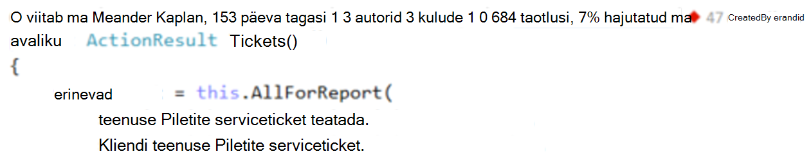

<properties 
    pageTitle="Rakenduse Visual Studio CodeLens ülevaateid telemeetria | Microsoft Azure'i" 
    description="Kiiresti juurde oma rakenduse ülevaated taotlus ja erandi telemeetria CodeLens Visual Studio abil." 
    services="application-insights" 
    documentationCenter=".net"
    authors="numberbycolors" 
    manager="douge"/>

<tags 
    ms.service="application-insights" 
    ms.workload="tbd" 
    ms.tgt_pltfrm="ibiza" 
    ms.devlang="na" 
    ms.topic="get-started-article" 
    ms.date="08/30/2016" 
    ms.author="daviste"/>
    
# Rakenduse Visual Studio CodeLens ülevaateid telemeetria

Kood oma veebirakenduse saab olema märgitud telemeetria kohta käitusaja erandid ja taotleda vastuse korda. Kui installite rakenduse [Visual Studio rakenduse ülevaated](app-insights-overview.md) , kuvatakse telemeetria Visual Studio [CodeLens](https://msdn.microsoft.com/library/dn269218.aspx) - märkmete ülaosas iga funktsiooni, kui olete harjunud näha kasulikku teavet, näiteks arv paigutab funktsiooni viidatud või viimane inimene, kes seda redigeerida.

> [AZURE.NOTE] Rakenduse ülevaated rakenduses CodeLens on saadaval Visual Studio 2015 Update 3 ja uuemad versioonid, või [arendaja Analytics tööriistad laiend](https://visualstudiogallery.msdn.microsoft.com/82367b81-3f97-4de1-bbf1-eaf52ddc635a)uusim versioon. CodeLens on Visual Studio Enterprise ja Professional versioonides saadaval.

## Kust leida rakenduse ülevaated andmed

Otsige üles rakenduse ülevaated telemeetria CodeLens näidikud oma veebirakenduse avaliku taotluse meetoditest. CodeLens näidikud kuvatakse kohal meetod ja muud deklaratsioon C# ja Visual Basicu kood. Kui rakenduse ülevaated andmed on saadaval meetodi, kuvatakse teile taotlusi ja erandid, näiteks "100 taotleb, 1% nurjus" või "10 erandid." Klõpsake CodeLens indikaator üksikasjalikumat teavet. 

> [AZURE.TIP] Rakenduse ülevaated taotlemine ja erandi näidikud võib võtta mõne hetke eest laadimine pärast muude CodeLens näidikud kuvatakse.

## CodeLens erandid

Erandi CodeLens indikaator näitab arv 15 kõige sagedamini esinev erandid ajal kätte meetodit päringu töötlemise ajal oma rakenduse viimase 24 tunni jooksul ilmnenud erandid.

Täpsema teabe kuvamiseks klõpsake erandid CodeLens indikaator:

* Muutus arvu erandid viimase 24 tunni suhtes eelneva 24 tundi.
* Valige **minge kood** erandi korrutamine funktsiooni lähtekoodi liikumiseks
* Valige **Otsingu** päringu seda erandit kõik eksemplarid, mis on toimunud viimase 24 tunni
* Valige **trendi** kuvamiseks trendi visualiseeringu seda erandit viimase 24 tunni jooksul sündmuste jaoks
* Valige päringu kõik erandid viimase 24 tunni jooksul toimunud **vaadata kõiki selle rakenduse erandid**
* Valige **Uuri erandi trende** vaadata trendi visualiseeringu jaoks kõik erandid, mis on toimunud viimase 24 tunni. 

> [AZURE.TIP] Kui näete CodeLens "0 erandid", kuid te ei tea, on erandid, kontrollige õige rakenduse ülevaated ressursi on valitud CodeLens. Valige mõni muu ressurss, paremklõpsake Solution Exploreris projektiga ja valige **Rakenduse ülevaated > valige telemeetria andmeallika**. CodeLens kuvatakse ainult 15 kõige sagedamini esinevate erandid viimase 24 tunni, nii et kui erandi on 16 kõige sagedamini või oma rakenduses, kuvatakse "0 erandid." ASP.net-i vaadete erandid ei pruugita selle domeenikontrolleri meetodite loonud need vaated.

> [AZURE.TIP] Kui näete "? erandid"CodeLens, peate konto Azure seostada Visual Studio või oma Azure'i konto mandaat võib olla aegunud. Mõlemal juhul valige "? erandid"ja valige käsk **Lisa konto...** sisestage oma kasutajanimi ja parool.

## CodeLens taotlustest

Taotluse CodeLens indikaator näitab HTTP taotluste arv on teenindatud meetodil viimase 24 tunni jooksul, millele need taotlused, mida ei saanud protsent.

Täpsema teabe kuvamiseks klõpsake taotlusi CodeLens indikaator:

* Absoluutsete ja protsent muudatused arv taotlusi, nurjunud taotlusi ja Keskmine vastamise aeg viimase 24 tunni jooksul võrreldes eelneva 24 tunni
* Usaldusväärsuse meetod, mis on arvutatud protsendina taotlusi, mis ei ole viimase 24 tunni jooksul
* Valige link **Otsi** päringuid või nurjunud taotluste päringu (nurjunud) taotlusi, viimase 24 tunni jooksul tehtud
* Valige **trendi** kuvamiseks trendi päringuid, nurjunud taotlusi või keskmise korda viimase 24 tunni jooksul.
* Valige vasakus ülanurgas CodeLens üksikasjavaate muutmiseks, milline ressurss on CodeLens andmete allikas rakenduse ülevaated ressursi nimi.

## Järgmised sammud

||
|---|---
|**[Töötamine Visual Studio rakenduse ülevaated](app-insights-visual-studio.md)** Otsige telemeetria, leiate teemast andmete CodeLens ja rakenduse ülevaated konfigureerimine. Kõik asuvad Visual Studio. |
|**[Lisateavet andmete lisamine](app-insights-asp-net-more.md)** Jälgida kasutus, kättesaadavus, sõltuvused erandid. Integreerida logimine raamistiku jälgi. Kirjutage kohandatud telemeetria. | 
|**[Töötamine rakenduse ülevaated portaal](app-insights-dashboards.md)** Armatuurlaudade, diagnostika- ja analüütiline tööriistakomplekti, teatiste, rakenduse ja telemeetria kaardil reaalajas sõltuvus eksportida. |
