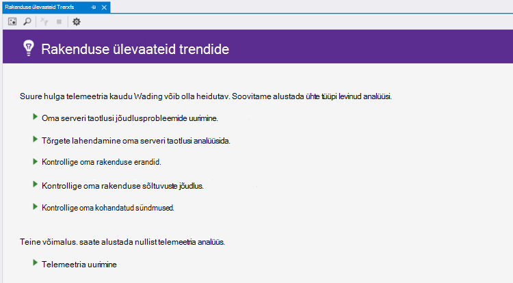
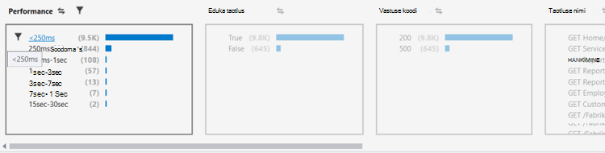
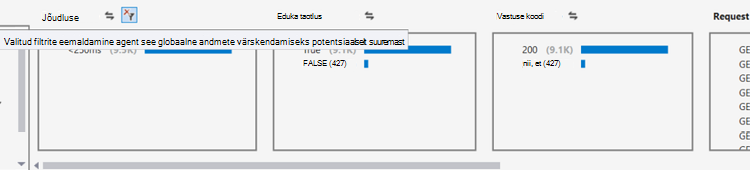
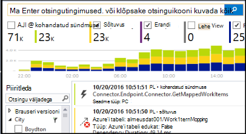

<properties 
    pageTitle="Visual Studio trendide analüüsimine | Microsoft Azure'i" 
    description="Analüüsimine, visualiseerimine ja uurimine oma rakenduse ülevaated telemeetria Visual Studio trende." 
    services="application-insights" 
    documentationCenter=".net"
    authors="numberbycolors" 
    manager="douge"/>

<tags 
    ms.service="application-insights" 
    ms.workload="tbd" 
    ms.tgt_pltfrm="ibiza" 
    ms.devlang="na" 
    ms.topic="get-started-article" 
    ms.date="10/25/2016" 
    ms.author="daviste"/>
    
# Visual Studio trendide analüüsimine

Rakenduse ülevaateid trendide tööriista tänav visualiseeritakse, kuidas oma rakenduse telemeetria olulised sündmused aja jooksul muutuda, aidates teil kiiresti tuvastada probleeme ja kõrvalekaldeid. Kui lingite üksikasjalikuma diagnostikateabe, trendide aitavad teil oma rakenduse jõudluse parandamiseks, erandid põhjused välja selgitada ja leida uusi teadmisi oma kohandatud sündmused.

> [AZURE.NOTE] Rakenduse ülevaateid trendide on saadaval Visual Studio 2015 Update 3 ja uuemad versioonid, või [arendaja Analytics tööriistad laiend](https://visualstudiogallery.msdn.microsoft.com/82367b81-3f97-4de1-bbf1-eaf52ddc635a) versiooniga 5.209 ja uuemad versioonid.

## Avage rakendus ülevaateid trendide

Rakenduse ülevaateid trendide akna avamiseks:

* Valige nupp rakenduse ülevaated tööriistariba **Uurimine telemeetria trende**, või
* Valige kontekstimenüüst projekti **Rakenduse ülevaated > uurimine telemeetria trendide**, või
* Valige menüüribal Visual Studio **Vaade > muud Windows > rakenduse ülevaateid trendide**.

Teile võidakse kuvada järgmine viip, et valida ressursi. Klõpsake **Valige ressursi**, logige sisse Azure tellimuse ning seejärel valige loendist, mille jaoks soovite analüüsida telemeetria trende on rakenduse ülevaated ressurss.

## Valige trendi analüüs

Töö alustamine, valides üks viis levinud trend analüüside iga viimase 24 tunni analüüsimine andmeid:

* **Jõudlusprobleeme uurida oma serveri taotlusi** - teenust, taotlused Rühmitusalus vastamise aeg
* **Analüüsi tõrgete lahendamine oma serveri taotlused** - teenust, taotlused Rühmitusalus HTTP vastuse koodi
* **Uurida oma rakenduse erandid** - teenusepakkuja, erandid rühmitatud erandi tüüp
* **Kõigi teie taotlus sõltuvused** - teenuseid teenust, mida nimetatakse Rühmitusalus vastamise aeg
* Sündmuse tüüp **kontrollida oma kohandatud sündmused** - olete häälestanud teie teenuse jaoks kohandatud sündmused Rühmitusalus.

Valmismallide analüüside on saadaval hiljem trendide akna ülemises vasakus nurgas nuppu **Vaade levinumat telemeetria analüüs** .

## Rakenduse trende visualiseerimine

Rakenduse ülevaateid trendide loob teie rakendus telemeetria visualiseeringu aja sarja. Igal ajal sarja visualiseeringu kuvab ühte tüüpi telemeetria ja selle telemeetria atribuudi rühmitatud teatud ajavahemiku jooksul. Näiteks soovite vaadata serveri taotlusi, Rühmitusalus riik, kust need pärit on, viimase 24 tunni jooksul. Selles näites moodustab iga mulli visualiseerimine arv serveri taotlusi mõne riigi/regiooni jaoks ühe tunni jooksul.

Saate reguleerida, millist tüüpi telemeetria vaatate kasutada akna ülaosas juhtelemente. Valige esmalt telemeetria tüübid, mis teile huvi:

* **Telemeetria tüüp** - Server taotlusi, erandid, depdendencies või kohandatud sündmused
* **Ajavahemiku** – igal pool viimase 30 minutit kuni viimased 3 päeva
* **Group By** - erandi tüüp, probleemi ID riigi/regiooni ja muu.

Klõpsake päringu käivitamiseks **Telemeetria analüüsida** .

Visualiseeringu mullid vahel liikumiseks:

* Klõpsake mulli, mis värskendab kindla ajavahemiku jooksul ilmnenud sündmuste kokkuvõttev sõnum akna allosas filtrid
* Topeltklõpsake mull liikuda otsinguväljale ja vaadata kõik selle aja jooksul tehtud üksikuid telemeetria sündmused
* CTRL-nuppu mull tühistage valige see visualiseeringul.

> [AZURE.TIP] Trendide ja otsing tööriistad töötavad koos, et aidata teil Pinpointi probleemid teenust vahel tuhandeliste telemeetria sündmuste põhjused. Näiteks kui üks pärastlõunal klientide teade rakenduse on vähem tundlik, alustage trende. Analüüsimine taotlusi teenust viimase mitme tunni jooksul vastuse kellaaja alusel rühmitatud. Kontrollige, kas seal on aeglane taotluste suuremahulistele kobar. Seejärel topeltklõpsake selle avamiseks tööriista otsing, filtreeritud, et need taotluse sündmuste mull. Otsing, saate nende taotluste sisu uurimiseks ja liikuge seotud probleemi lahendamiseks koodi.

## Filtreerimine

Vaadake täpsemale trendide akna allosas juhtelementidega filter. Filtri rakendamiseks klõpsake selle nime. Mida saab vahetada kiiresti avastada trende, mis võivad peita teie telemeetria kindla mõõtme erinevad filtrid. Kui rakendate filtri ühe dimensiooni, nt erandi tüüp, muud mõõtmed filtrid jäävad klõpsatava isegi juhul, kui need kuvatakse hallid välja. Kui soovite tühjendada-filtri rakendamine, klõpsake uuesti nuppu. CTRL-klõpsake valimiseks mitu filtrit dimensiooni.

Mida teha, kui soovite rakendada mitu filtrit? 

1. Esimese filtri rakendamine 
2. Klõpsake nuppu **Rakenda valitud filtrid ja päringu uuesti** mõõde oma esimese filtri nimi. See on päring uuesti oma telemeetria ainult esimese filtrile sündmuste jaoks. 
3. Teine filtri rakendamine. 
4. Korrake toimingut leida kindla kohta oma telemeetria trende. Näiteks serveri taotlusi nimega "GET Home/Index" _ja_ mis pärineb Saksamaa _ning_ 500 vastuse koodi. 

Kui soovite tühjendada-rakendada mõne need filtrid, dimensiooni nuppu **Eemalda valitud filtrid ja päringu uuesti** .

## Kõrvalekaldeid otsimine

Trendide tööriista saate esile tõsta mullide sündmusi, mis on Anomaalne võrreldes teiste mullide samal ajal sarja. Valige vaate tüüp ripploendit, **loeb aega kopp (tõsta kõrvalekaldeid)** või **protsenti kord kopp (tõsta kõrvalekaldeid)**. Punane mullid on Anomaalne. Kõrvalekaldeid on määratletud mullide loendab/protsentide möödunud loendab/protsentide standardhälve 2.1 korda üle kahe kellaajaperioodi (48 tundi, kui vaatate viimased 24 tundi jne.).

> [AZURE.TIP] Esiletõstmine kõrvalekaldeid on eriti kasulik otsimise ajal sarja väikesed mullid, mis muidu võib välja näha võõrväärtuste sarnase suurusega.  

## Järgmised sammud

||
|---|---
|**[Töötamine Visual Studio rakenduse ülevaated](app-insights-visual-studio.md)** Otsige telemeetria, leiate teemast andmete CodeLens ja rakenduse ülevaated konfigureerimine. Kõik asuvad Visual Studio. |
|**[Lisateavet andmete lisamine](app-insights-asp-net-more.md)** Jälgida kasutus, kättesaadavus, sõltuvused erandid. Integreerida logimine raamistiku jälgi. Kirjutage kohandatud telemeetria. | 
|**[Töötamine rakenduse ülevaated portaal](app-insights-dashboards.md)** Armatuurlaudade, diagnostika- ja analüütiline tööriistakomplekti, teatiste, rakenduse ja telemeetria kaardil reaalajas sõltuvus eksportida. |
