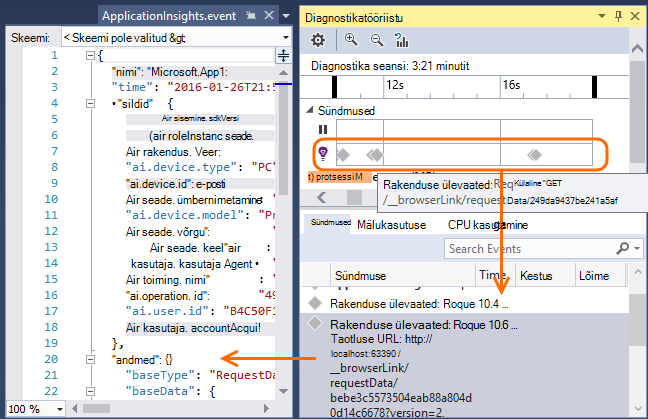

<properties 
    pageTitle="Töötamine Visual Studio rakenduse ülevaated" 
    description="Jõudluse analüüs ja diagnostika ajal silumine ja." 
    services="application-insights" 
    documentationCenter=".net"
    authors="alancameronwills" 
    manager="douge"/>

<tags 
    ms.service="application-insights" 
    ms.workload="tbd" 
    ms.tgt_pltfrm="ibiza" 
    ms.devlang="na" 
    ms.topic="get-started-article" 
    ms.date="06/21/2016" 
    ms.author="awills"/>

# Töötamine Visual Studio rakenduse ülevaated

Visual Studio (2015 ja uuemad versioonid), saate diagnoosimine probleemid nii silumine ja, kasutades telemeetria [Visual Studio rakenduse](app-insights-overview.md)ülevaated ja jõudluse analüüs.

Kui te pole veel [Installitud rakenduse ülevaated rakenduse](app-insights-asp-net.md), et nüüd ära.

## Projekti silumine

Käivitage rakenduse abil klahvi F5 ja proovi: Avage erinevate lehtede loomiseks mõned telemeetria.

Visual Studio, kuvatakse teile arv sündmused, mis on sisse logitud.

Klõpsake seda nuppu diagnostika otsing avada. 

## Diagnostika otsing

Otsingu aken näitab sündmused, mis on sisse logitud. (Kui te sisse logitud Azure rakenduse ülevaated häälestamisel, saate küll otsida sama sündmuste portaalis.)

Otsingu tasuta teksti toimib kõik väljad sündmused. Näiteks otsida osa URL-i lehe; või väärtus atribuudi nt kliendi linn; või Jälita Logi leiduvad teatud sõnad.

Klõpsake selle üksikasjalik atribuutide kuvamiseks sündmuse.

Samuti saate avada menüü seostuvad üksused, et aidata diagnoosida nurjunud taotlusi või erandid.

## Diagnostika jaoturi

Diagnostika jaoturi (Visual Studio 2015 või uuem versioon) kuvatakse rakenduse ülevaated serveri telemeetria, nagu see on loodud. See töötab ka siis, kui te liitunud ainult installimiseks Tarkvaraarenduskomplektist, ilma ühenduse ressursi Azure'i portaalis.

## Erandid

Kui teil on [häälestamine erandi jälgimine](app-insights-asp-net-exceptions.md), kuvatakse aknas Otsing erandi aruandeid. 

Klõpsake erandi virnas jälitusteabe saamiseks. Kui rakenduse kood on avatud Visual Studios, võite klõpsata kaudu virnas teekonna koodi oluline rida.

Lisaks koodi Lens rida iga meetodi kohal, kuvatakse teile arv on sisse logitud rakenduse ülevaated viimase 24 h erandid.

## Kohalik jälgimine

(Visual Studio 2015 värskenduse 2): Kui teil pole konfigureeritud SDK saata telemeetria rakenduse ülevaated portaali (nii, et ei ole haldusteenuse võti ApplicationInsights.config) seejärel diagnostika aknas kuvatakse telemeetria Viimane silumine seansi kaudu. 

See on soovitatav, kui teil juba on avaldatud rakenduse varasema versiooni. Te ei soovi telemeetria kaudu oma silumine seansid telemeetria rakenduse ülevaated portaalis avaldatud rakendusest segada.

See on kasulik, kui teil on mõne [kohandatud telemeetria](app-insights-api-custom-events-metrics.md) , mida soovite silumine enne saatmist telemeetria portaali.

* *Esialgu ma täielikult konfigureeritud rakenduse ülevaated saata telemeetria portaali. Kuid nüüd ma soovite näha ainult Visual Studio telemeetria.*

 * Aken otsing sätetes on võimalus otsida kohalike diagnostika isegi juhul, kui teie rakendus saadab telemeetria portaali.
 * Telemeetria saadetakse portaali peatamiseks kommentaaride välja rida `<instrumentationkey>...` ApplicationInsights.config kaudu. Kui olete valmis saatma telemeetria portaali uuesti, kommenteerige välja.

## Trendide

Trendide on vahend visualiseerimine rakenduse käitumise aja jooksul. 

Valige rakenduse ülevaated tööriistariba nuppu või rakenduse ülevaateid otsinguakna **Uurimine telemeetria trende** . Valige üks viis levinud päringud alustada. Saate analüüsida eri andmekomplektide telemeetria tüübid, aeg vahemike ja muid atribuute. 

Andmete otsimine kõrvalekaldeid, valige üks normaalne Suvandid jaotises "Vaate tüüp" ripploend. Filtreerimise suvandite akna allosas oleks hõlpsam Viimistlege sisse oma telemeetria teatud mitmeid.

[Lisateavet leiate teemast trende](app-insights-visual-studio-trends.md).

## Mis saab edasi?

||
|---|---
|**[Lisateavet andmete lisamine](app-insights-asp-net-more.md)** Jälgida kasutus, kättesaadavus, sõltuvused erandid. Integreerida logimine raamistiku jälgi. Kirjutage kohandatud telemeetria. | 
|**[Töötamine rakenduse ülevaated portaal](app-insights-dashboards.md)** Armatuurlaudade, diagnostika- ja analüütiline tööriistakomplekti, teatiste, rakenduse ja telemeetria kaardil reaalajas sõltuvus eksportida. |

 
