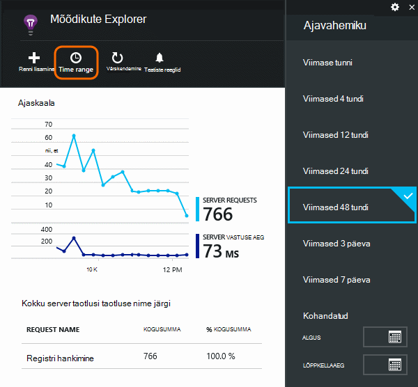
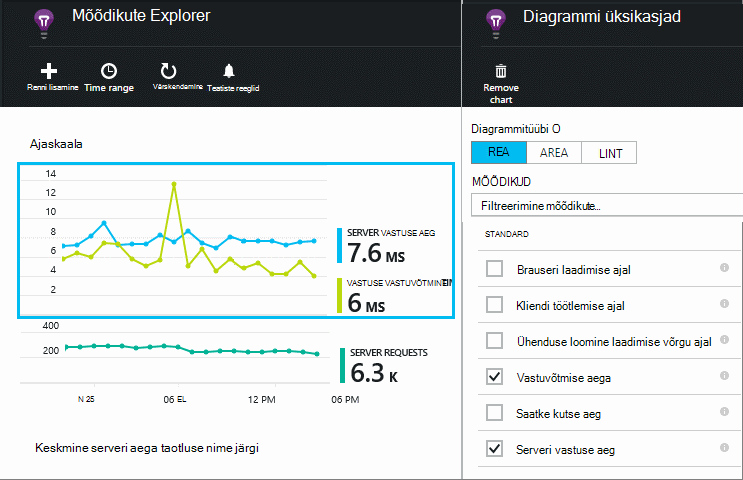
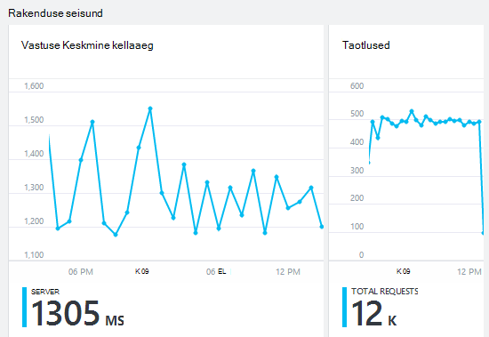
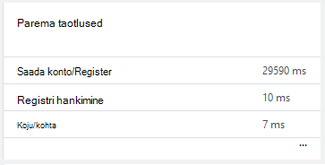
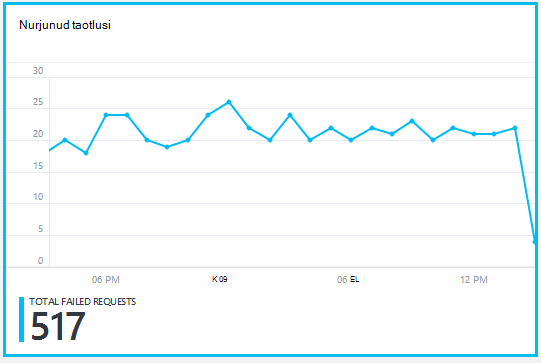
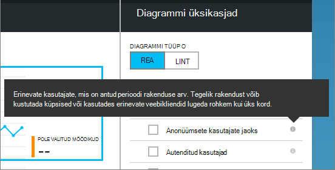
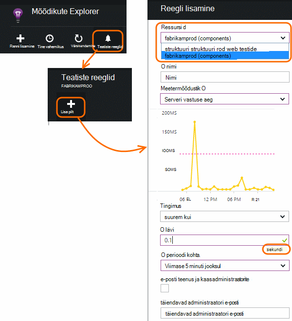

<properties 
    pageTitle="Jälgida oma rakenduse seisundi ja rakenduse ülevaated kasutus" 
    description="Alustamine rakenduse ülevaated. Analüüsimine kasutus, kättesaadavus ja teie asutusesisese või Microsoft Azure'i rakenduste jõudlust." 
    services="application-insights" 
    documentationCenter=""
    authors="alancameronwills" 
    manager="douge"/>

<tags 
    ms.service="application-insights" 
    ms.workload="tbd" 
    ms.tgt_pltfrm="ibiza" 
    ms.devlang="na" 
    ms.topic="article" 
    ms.date="11/25/2015" 
    ms.author="awills"/>
 
# Veebirakenduste jõudluse jälgimine

*Rakenduse ülevaated on eelvaade.*

Veenduge, et teie taotlus on hästi ja mis tahes tõrkeid kiiresti teada. [Rakenduse ülevaated] [ start] teavitamine mis tahes jõudlusprobleeme ja erandid ja leida ja diagnoosimine põhjused.

Rakenduse ülevaated saate jälgida Java nii ASP.net-i veebirakenduste ja teenuseid, WCF teenused. Need võivad olla majutatud kohapealne, virtuaalmasinates või Microsoft Azure'i veebisaiti. 

Kliendi poolel rakenduse ülevaated võib kuluda telemeetria veebilehtede ja mitmesuguseid seadmed, sh iOS-i, Androidi ja Windowsi poe rakenduste kaudu.

## Jõudluse jälgimise häälestamine

Kui te pole veel lisanud rakenduse ülevaated projekti (st kui see pole ApplicationInsights.config), valige üks järgmistest viisidest alustamiseks:

* [ASP.net-i veebirakenduste](app-insights-asp-net.md)
 * [Lisa erand jälgimine](app-insights-asp-net-exceptions.md)
 * [Lisage sõltuvus jälgimine](app-insights-monitor-performance-live-website-now.md)
* [J2EE veebirakendustes](app-insights-java-get-started.md)
 * [Lisage sõltuvus jälgimine](app-insights-java-agent.md)

## Jõudluse mõõdikute uurimine

[Azure portaali](https://portal.azure.com), otsige üles rakenduse ülevaated ressurss, mis rakenduse häälestamine. Tavaline jõudluse andmed kuvatakse ülevaade tera:

Klõpsake mis tahes diagrammi täpsemaks vaatamiseks ja tulemuste vaatamiseks pikemaks ajaks. Näiteks klõpsake paani taotlusi ja seejärel valige ajavahemiku.

Klõpsake diagrammi, mis mõõdikute kuvatakse, või lisada uue diagrammi ja valige oma mõõdikute valimiseks.

> [AZURE.NOTE] **Tühjendage kõik mõõdikud** Vaata täielik valik, mis on saadaval. Mõõdikud jagunevad rühmad; mis tahes rühma liige valimisel kuvatakse ainult teiste liikmete selle rühma.

## Mida see kõik tähendab? Jõudluse paanid ning aruanded

On mitmesuguseid jõudluse mõõdikute saate avada. Alustame need, mis kuvatakse vaikimisi rakenduse enne.

### Taotlused

Arv HTTP päringuid, mis on saadud määratud perioodi kohta. Võrrelda tulemuste kuvamiseks rakenduse koormus käitumise aruannetes muutub.

HTTP-päringud kaasata kõik GET- või POST taotlused lehtede, andmed ja pildid.

Klõpsake paani loendab saamiseks teatud URL-id.

### Vastuse Keskmine kellaaeg

Meetmed aeg web taotlus, sisestades rakenduse ja tagastatavate vastuse vahel.

Punktide Kuva liikudes Keskmine. Kui palju taotlusi, võib olla mõned, et erineda keskmise ilma on selge tippväärtus või pane graafik.

Otsige ebatavalised peaks. Üldiselt eeldavad vastuse aja koos õppurid tõusu. Kui tõus on ebaproportsionaalselt, rakenduse pihta ressursside limiit nagu CPU või teenuse kasutab võimsus.

Klõpsake paani korda saamiseks teatud URL-id.

### Parema taotlused

Näitab, milliseid taotlusi võib-olla jõudluse parandamine.

### Nurjunud taotlusi

Taotluste, et viskas tabamatu erandid arv.

Klõpsake paani kindlate tõrgete üksikasjade vaatamiseks ja valige selle üksikasjade kuvamiseks taotluse alusel. 

Üksikute kontrollimiseks alles ainult esindaja valimi tõrkeid.

### Muud mõõdikud

Kui soovite vaadata, mida saab kuvada, klõpsake diagrammi ja seejärel tühjendage ruut Kõik mõõdikud kuvamiseks saadaval kõiki muid mõõdikute seadmine. Klõpsake (i), et kuvada iga mõõdiku määratlus.

Valige mis tahes meetermõõdustik keelata teised samal diagrammil kuvatavate ei saa.

## Teatiste seadmine

Teavitama mis tahes meetermõõdustik ebatavalised väärtuste e-posti teel, lisage teatise. Saate valida, kas saata e-posti konto administraatorid või teatud meiliaadressid.

Määrata muid atribuute enne ressursi. Lisandmooduli webtest ressursid ei vali, kui soovite jõudluse ega kasutus mõõdikute teatiste seadmine.

Olge ettevaatlik, et üksused, kus teil palutakse sisestada piirmäärast Märkus.

*Ma ei näe nupp Lisa teatis.* – See on rühm konto, millele teil on kirjutuskaitstud juurdepääs? Pöörduge administraatori konto.

## Diagnoosimise probleemid

Siin on mõned näpunäited otsimine ja diagnoosimise jõudlusprobleeme.

* Häälestamine [web testide] [ availability] teatisi, kui teie veebisait katkeb või vastab valesti või aeglaselt. 
* Võrrelge taotluse count koos muude mõõdikute kas laadimiseks on seotud tõrgete või aeglane vastus.
* [Lisamine ja otsige Jälita laused] [ diagnostic] koodi aidata Pinpointi probleeme.

## Järgmised sammud

[Web testide] [ availability] -on saadetud intervalliga kaudu kogu maailmas rakenduse web nõuab.

[Jäädvustada ja otsida diagnostika jälgi] [ diagnostic] – lisada kutsete jälgimiseks ja näida tulemused täpselt probleemid.

[Kasutus jälgimise] [ usage] – siit saate teada, kuidas kasutada rakendust.

[Tõrkeotsing] [ qna] -, K ja v

## Video

[AZURE.VIDEO performance-monitoring-application-insights]

<!--Link references-->

[availability]: app-insights-monitor-web-app-availability.md
[diagnostic]: app-insights-diagnostic-search.md
[greenbrown]: app-insights-asp-net.md
[qna]: app-insights-troubleshoot-faq.md
[redfield]: app-insights-monitor-performance-live-website-now.md
[start]: app-insights-overview.md
[usage]: app-insights-web-track-usage.md

 
