<properties 
    pageTitle="Veebirakenduste rakenduse ülevaated Kasutusanalüüs" 
    description="Veebirakenduste rakenduse ülevaated Kasutusanalüüsi ülevaade" 
    services="application-insights" 
    documentationCenter=""
    authors="alancameronwills" 
    manager="douge"/>

<tags 
    ms.service="application-insights" 
    ms.workload="tbd" 
    ms.tgt_pltfrm="ibiza" 
    ms.devlang="na" 
    ms.topic="article" 
    ms.date="06/12/2016" 
    ms.author="awills"/>
 
# <a name="usage-analysis-for-web-applications-with-application-insights"></a>Kasutusanalüüsi veebirakenduste rakenduse ülevaated

Teada, kuidas kasutada rakenduse abil saate keskenduda stsenaariumid, mis on kõige olulisem neile arengu töö ja saada ülevaate eesmärke, et need oleks lihtsam või raskem saavutada otsimine. 

Visual Studio rakenduse ülevaated pakub kahte taset kasutamise jälgimine.

* **Kasutaja, seanss ja lehe andmeid vaadata** - esitatud välja kasti.  
* **Kohandatud telemeetria** - [koodi kirjutamine] [ api] kasutajate kaudu oma rakenduse kasutuskogemus jälgida. 

## <a name="setting-up"></a>Kuidas häälestada

Avage rakenduse ülevaated on ressurss [Azure portaali](https://portal.azure.com), klõpsake tühja brauseris lehe laadimise diagrammi ja järgige juhiseid.

[Lisateave](app-insights-javascript.md) 


## <a name="how-popular-is-my-web-application"></a>Kuidas populaarsed on minu veebirakenduse?

[Azure'i portaali]sisselogimine[portal], liikuge sirvides oma ressurssi ja klõpsake linki kasutamine:

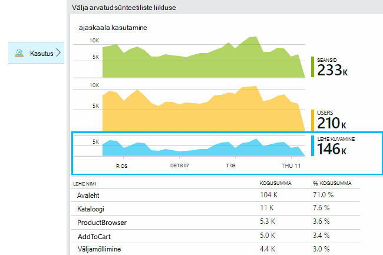

* **Kasutajad:** Arvu ajavahemiku diagrammi erinevad aktiivsed kasutajad. 
* **Seansid:** Aktiivsete seansside arv
* **Lehe vaated** Loendab kõned trackPageView(), tavaliselt ehk üks kord igale lehele.

Klõpsake diagrammidel täpsemaks vaatamiseks. Pange tähele, et saate muuta ajavahemiku diagrammid.

### <a name="where-do-my-users-live"></a>Kus mu kasutajate live?

Klõpsake keelest kasutamine kasutajate diagrammi täpsemaks vaatamiseks.

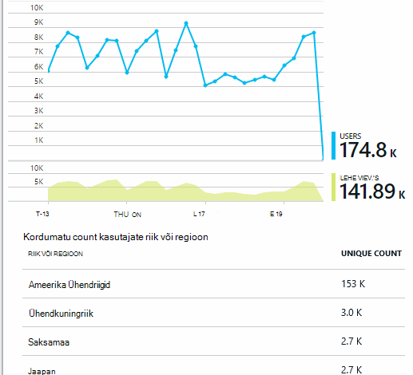
 
### <a name="what-browsers-or-operating-systems-do-they-use"></a>Millised brauserid või operatsioonisüsteemid nad kasutavad?

Andmete rühmitamine (lõigu), nt brauseri, operatsioonisüsteemi või City atribuut:

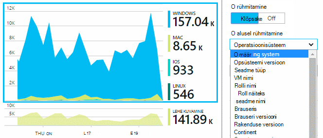


## <a name="sessions"></a>Seansid

Seanss on rakenduse ülevaated, mis püüab seostada iga telemeetria sündmuse – näiteks taotlusi, lehe vaateid, erandid või kohandatud sündmused selle koodi ise - teatud kasutaja seansi mõiste. 

RTF-vormingus kontekstis teavet kogutakse kohta iga seansi, nt seadme omadused, geo asukoht, operatsioonisüsteem ja jne.

Kui teie dokumendi klient ja server ([ASP.net-i] [ greenbrown] või [J2EE][java]), et SDK-d seansi id kliendi ja serveri vahel ütleb, et sündmuste mõlemal saab üle kanda.

Kui [probleemide tuvastamisel][diagnostic], saate otsida kõik telemeetria, mis on seotud probleem ilmnes, sh kõik kutsed ja sündmusi, erandid seansi või jälgi, mis on sisse logitud.

Seansid andma hea populaarsus kontekstides, nt seadet, operatsioonisüsteemi või asukoht. Seansid Rühmitusalus seadme arvu kuvades näiteks saate Täpsem arv sageduse seadmes kasutatakse rakendus, kui lugedes lehe vaated. See oleks kasulik sisendi kaudu, mis tahes seadme probleemi alusel järjestada.


#### <a name="whats-a-session"></a>Mis on seanss?

Seansi lõpetamine tähistab ühe kohtumine kasutaja ja rakenduse vahel. Lihtsaim kujul seansi käivitamine rakenduse kasutaja algab ja lõppemist, kui kasutaja lahkub rakenduse. Veebirakendustes vaikimisi seanss lõpeb pärast 30 minutit tegevusetuse või 24 tunni tegevuse. 

Saate muuta nende vaikesätted, redigeerides koodilõigu:

    <script type="text/javascript">
        var appInsights= ... { ... }({
            instrumentationKey: "...",
            sessionRenewalMs: 3600000,
            sessionExpirationMs: 172800000
        });

* `sessionRenewalMs`: Aeg millisekundites aegumist seansi kasutaja tegevusetuse tõttu. Vaikimisi: 30 minutit.
* `sessionExpirationMs`: Seansi maksimaalne pikkus, millisekundites. Kui kasutaja on pärast seda aktiivne, arvestatakse teise seansi. Vaikimisi: 24 tundi.

**Seansi kestus** on [meetermõõdustik] [ metrics] mis ajavahemiku seansi esimese ja viimase telemeetria üksuste vahel kirjeid. (See ei sisalda aja.)

Kindla ajaintervalliga **seansside arv** on määratletud kordumatu seansside teatud toimingute selles ajavahemikus arv. Kui vaatate näiteks igapäevane seansside arv vahemikus kaua aega möödunud nädalal, see on tavaliselt võrdne seansid koguarv. 

Siiski kui te uurida lühemaks kellaaja vahemike nagu kord tunnis teravili, loendatakse kestvad mitu tundi pikk seanss iga tund, kus seansi on aktiivne. 

## <a name="users-and-user-counts"></a>Kasutajate ja kasutajale loendab


Iga kasutaja seansi on kordumatu kasutaja ID-ga seostatud. 

Vaikimisi on kasutaja tuvastatud salvestatava küpsise. Kasutaja, kes kasutab mitu brauserid või seadmete loendatakse rohkem kui üks kord. (Kuid [autenditud kasutajad](#authenticated-users)vaadata)


**Kasutajate arv** meetermõõdustik teatud ajavahemiku jooksul määratletakse selles ajavahemikus salvestatud toimingute kordumatute kasutajate arv. Selle tulemusena kasutajatele pikkade tõusu põhjuseks võib olla mitu korda, kui saate määrata ajavahemiku, et selle on vähem kui tund või nii, et.

**Uute kasutajate** loendab kasutajad, kelle esimese seansid rakendusega ilmnes ajavahemik. Kui kasutatakse vaikemeetod loendada kasutajate poolt küpsised, siis sisaldab see kasutajad, kes on tühjendatud küpsiste või kasutavad uuele seadmele või brauseri juurde pääseda rakenduse esimest korda.
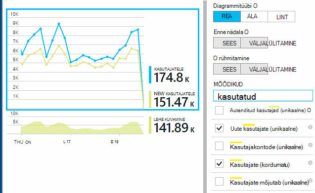

### <a name="authenticated-users"></a>Autenditud kasutajad

Kui teie web app võimaldab kasutajatel sisse logida, saate Täpsem count pakkuda rakenduse ülevaated kordumatu kasutajatunnus. See ei pea olema tema nime või sama id, mida kasutate oma rakenduses. Kui teie rakendus on kindlaks kasutaja, kood:


*JavaScripti kliendi*

      appInsights.setAuthenticatedUserContext(userId);

Kui teie rakendus rühmitab kasutajate kontod, samuti saab edastada identifikaatori konto. 

      appInsights.setAuthenticatedUserContext(userId, accountId);

Kasutaja- ja konto ID-d ei tohi sisaldada tühikuid ega märke`,;=|`


[Mõõdikute explorer](app-insights-metrics-explorer.md), saate luua diagrammi **Autenditud kasutajad** ja **kontod**. 

## <a name="synthetic-traffic"></a>Sünteetiline liikluse

Sünteetiline liikluse sisaldab kättesaadavus ja laadi, Ümbersuunamisteade ja teiste. 

Rakenduse ülevaateid üritab püüab automaatselt määratleda ja liigitada sünteetiliste liikluse ning märkida õigesti. Enamikul juhtudel sünteetiliste liikluse autonoomsest JavaScripti Tarkvaraarenduskomplektist, nii, et see tegevus välistatud kasutajate ja seansi lugedes. 

Siiski jaoks rakenduse ülevaated [web testide][availability], kasutaja ID-d on seatud vastavalt automaatselt POP asukoht ja seansi id on seatud vastavalt katse ID-d. Vaikimisi aruannete sünteetiliste liikluse on välja filtreeritud vaikimisi, mis ei sisalda neid kasutajaid ja seansid. Siiski kui sünteetiliste liikluse on kaasatud, see võib põhjustada small üldine kasutajad ja seansi loeb.
 
## <a name="page-usage"></a>Lehe kasutamine

Klõpsake lehe vaated diagrammi rohkem suumituna lisandmooduli versiooni koos jaotus kõige populaarsemate lehtede kaudu.


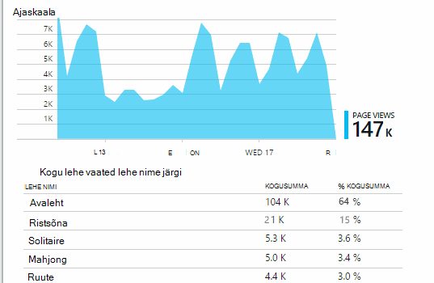
 
Ülaltoodud näites on visualiseerimine veebisaidilt. See kohe näeme:

* Kasutus pole täiustatud viimase nädala jooksul. Võib-olla peaksite mõtlema otsimootori optimeerimine?
* Vähem paljudele leiate lehelt visualiseerimine kui avalehele. Miks ei kodulehele meelitada mängida?
* "Ristsõna" on kõige populaarsemate aeg. Meil peaks eelistada uute ideede ja seal täiustused.

## <a name="custom-tracking"></a>Kohandatud jälitus

Oletame, et asemel rakendamisel iga mängu eraldi veebilehele, te otsustate refaktoorime kõik rakendusse sama ühe lehe, kus enamik funktsioone andmetena JavaScripti veebilehele. See võimaldab kasutajal kiiresti vaheldumisi üks aeg ja teine või isegi on mitu mängu ühele lehele. 

Kuid soovite rakenduse ülevaated logige mitu korda iga mängu on avatud, täpselt samamoodi nagu kui need olid eraldi veebilehtedel. Mis on lihtne: lihtsalt telemeetria mooduli kõne oma JavaScripti, kuhu soovite kirje, mis on avatud uue lehe lisamiseks:

    appInsights.trackPageView(game.Name);

## <a name="custom-events"></a>Kohandatud sündmused

Kirjutage kohandatud telemeetria teatud sündmuste logi. Eriti ühe lehe rakenduses, peaksite teadma sageduse kasutaja teatud toiminguid või saavutab teatud eesmärgid: 

    appInsights.trackEvent("GameEnd");

Näiteks sisselogimiseks klõpsake linki:

    <a href="target.htm" onclick="appInsights.trackEvent('linkClick');return true;">my link</a>


## <a name="view-counts-of-custom-events"></a>Vaate loendab kohandatud sündmused

Avage mõõdikute Explorer ja sündmuste kuvamiseks diagrammi lisamine. Segmendi nime järgi:

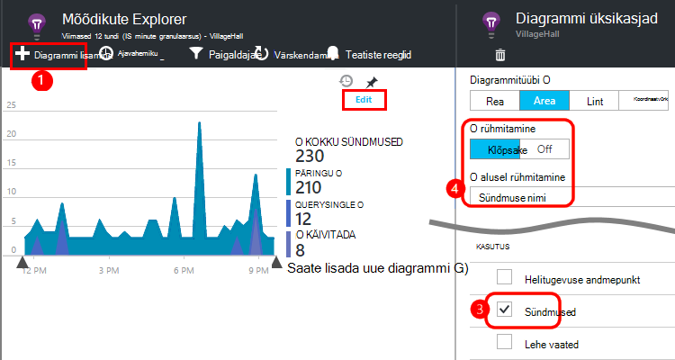


## <a name="drill-into-specific-events"></a>Teatud sündmuste süvitsi

Paremini mõista, kuidas tüüpiline seansi läheb saamiseks võite keskenduda teatud kasutaja seansi, mis sisaldab teatud tüüpi sündmus. 

Selles näites me kodeeritud kohandatud sündmuse "NoGame", mida nimetatakse, kui kasutaja logib alustamata tegelikult mängu. Miks kasutaja seda teha? Võib-olla kui me üldiseks mõne kindla juhud, me saame aimu. 

Kohandatud sündmused, mis on saanud rakendusest on loetletud ülevaade enne nime järgi:


 
Sündmuse huvi kaudu, ja valige viimaste teatud esinemiskord.


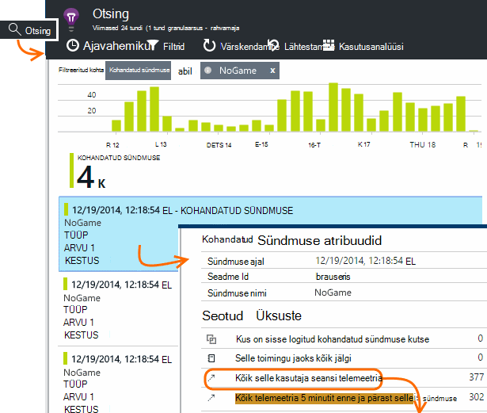
 
Vaatame kõik telemeetria, kus selle kindla NoGame sündmusele seanss. 


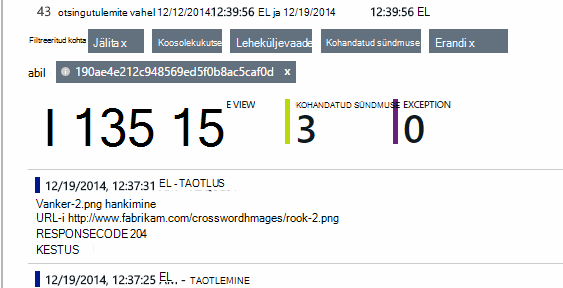
 
Nii, et kasutaja ei saa esitamise mõni tõrge, ei ole erandeid.
 
Me saate filtreerida välja igat tüüpi telemeetria lehe vaadetes peale selle seansi jaoks.


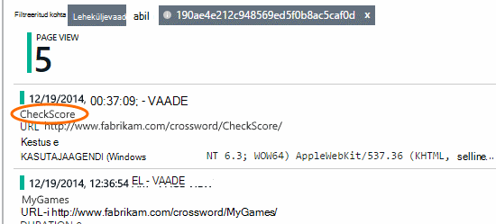
 
Ja nüüd näeme, lihtsalt kontrollitavad viimased hinded sisseloginud selle kasutaja. Võib-olla peaks kaaluma, arendamise kasutaja lugu, mis hõlbustab seda teha. (Ja meil tuleks rakendada kohandatud sündmuse aruandesse selle kindlat ilmnemisel.)

## <a name="filter-search-and-segment-your-data-with-properties"></a>Filtreerimine, otsimine ja segmendi andmete atribuudid
Saate manustada suvalise siltide ja arvväärtused sündmused.
 

*JavaScripti kliendi*

```JavaScript

    appInsights.trackEvent("WinGame",
        // String properties:
        {Game: currentGame.name, Difficulty: currentGame.difficulty},
        // Numeric measurements:
        {Score: currentGame.score, Opponents: currentGame.opponentCount}
    );
```

*C# server*

```C#

    // Set up some properties:
    var properties = new Dictionary <string, string> 
        {{"game", currentGame.Name}, {"difficulty", currentGame.Difficulty}};
    var measurements = new Dictionary <string, double>
        {{"Score", currentGame.Score}, {"Opponents", currentGame.OpponentCount}};

    // Send the event:
    telemetry.TrackEvent("WinGame", properties, measurements);
```

*VB server*

```VB

    ' Set up some properties:
    Dim properties = New Dictionary (Of String, String)
    properties.Add("game", currentGame.Name)
    properties.Add("difficulty", currentGame.Difficulty)

    Dim measurements = New Dictionary (Of String, Double)
    measurements.Add("Score", currentGame.Score)
    measurements.Add("Opponents", currentGame.OpponentCount)

    ' Send the event:
    telemetry.TrackEvent("WinGame", properties, measurements)
```

Atribuutide lehe vaated manustamine samal viisil:

*JavaScripti kliendi*

```JS

    appInsights.trackPageView("Win", 
        url,
        {Game: currentGame.Name}, 
        {Score: currentGame.Score});
```

Diagnostika otsing, klõpsates kaudu üksikute esinemise sündmuse atribuutide vaatamiseks.


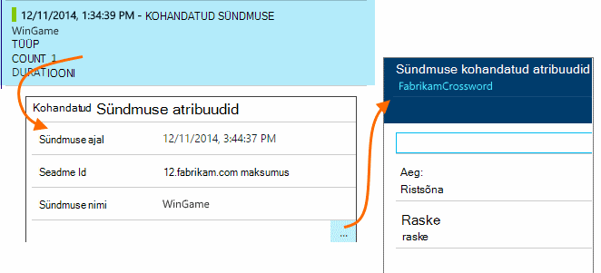
 
Väli otsingu abil saate vaadata sündmuse esinemisjuhud teatud atribuudi väärtus.


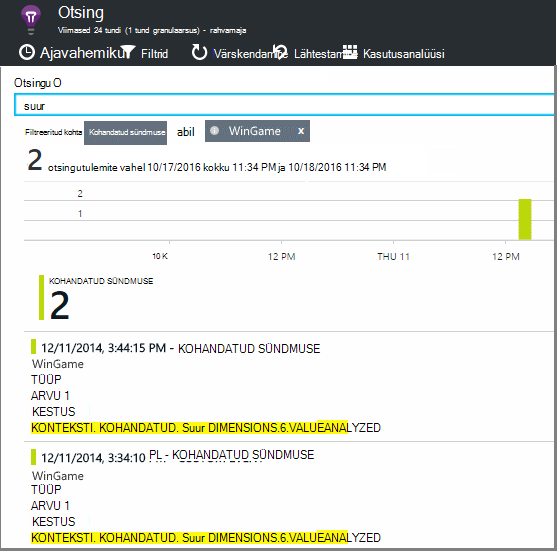


## <a name="a--b-testing"></a>A | B testimine

Kui te ei tea, millise variandi funktsiooni edukamaks, vabastage mõlemad, muutes iga kättesaadavaks erinevate kasutajate. Mõõtke edu iga ja seejärel liigutage ühendatud versiooni.

Selle meetodi korral manustada erinevate siltide telemeetria, iga rakenduse versiooni saadetud. Saate seda teha atribuudid määratledes aktiivse TelemetryContext sisse. Atribuutidest vaikimisi lisatakse iga telemeetria teade, mis saadab soovitud rakendus – mitte ainult oma kohandatud sõnumeid, kuid standard telemeetria ka. 

Rakenduse ülevaated portaalis, mida seejärel juurde filter ja rühm (lõigu) oma andmeid silte, et võrrelda erinevaid versioone.

*C# server*

```C#

    using Microsoft.ApplicationInsights.DataContracts;

    var context = new TelemetryContext();
    context.Properties["Game"] = currentGame.Name;
    var telemetry = new TelemetryClient(context);
    // Now all telemetry will automatically be sent with the context property:
    telemetry.TrackEvent("WinGame");
```

*VB server*

```VB

    Dim context = New TelemetryContext
    context.Properties("Game") = currentGame.Name
    Dim telemetry = New TelemetryClient(context)
    ' Now all telemetry will automatically be sent with the context property:
    telemetry.TrackEvent("WinGame")
```

Üksikute telemeetria saate alistada vaikeväärtused.

Universaalne initializer saate häälestada nii, et kõik uued TelemetryClients automaatselt kasutada kontekstis.

```C#


    // Telemetry initializer class
    public class MyTelemetryInitializer : ITelemetryInitializer
    {
        public void Initialize (ITelemetry telemetry)
        {
            telemetry.Properties["AppVersion"] = "v2.1";
        }
    }
```

Klõpsake rakenduse initializer Global.asax.cs näiteks:

```C#

    protected void Application_Start()
    {
        // ...
        TelemetryConfiguration.Active.TelemetryInitializers
        .Add(new MyTelemetryInitializer());
    }
```


## <a name="build---measure---learn"></a>Koosta - mõõt – siit saate teada

Kasutusanalüüsi kasutamisel muutub arvate, et aidata seotud probleemide lahendamine on integreeritud osa oma arengutsükli – mitte ainult midagi. Siin on mõned näpunäited.

* Määratlege võtme mõõdiku rakenduse. Kas soovite kasutajad nii palju kui võimalik või soovite võrdlemisi väike hulk väga head kasutajad? Kas soovite külastada või müük maksimeerimine?
* Mõõtke iga lugu kavandamine. Kui te visandamine Loo uus kasutaja või funktsiooni või värskendada olemasolevat lepingut alati mõelda kuidas mõõta edu muutmine. Küsi enne koodis algust, "millist mõju see on meie mõõdikute klõpsake kas see töötab? Peaks me jälgida mis tahes uute sündmuste?"
Ja muidugi, kui see funktsioon on reaalajas, veenduge, et vaadata selle Kasutusanalüüsi ja toimivad tulemused. 
* Muude mõõdikute seotud võtme väärtuseks meetermõõdustik. Näiteks, kui lisate funktsiooni "lemmikud", soovite teada, kui sageli kasutajad lisamine lemmikute hulka. Kuid see on võib-olla rohkem huvitav teada, kui sageli nad tulevad tagasi oma lemmikute hulka. Ja kõige olulisem, tehke klientidele, kes kasutavad lemmikud ostavad rohkem toote?
* Kanaari testimine. Funktsiooni aktiveerimine, mis võimaldab teil teha uus funktsioon nähtav ainult teatud kasutajate häälestamine. Rakenduse ülevaated abil vaadata, kas uue funktsiooni kasutatakse nii saate kavandatud. Tehke muudatused ja seejärel vabastage see laiemalt.
* Rääkige kasutajate! Kasutusanalüüsi ei piisa oma, kuid säilitades hea kliendi seose täiendavad.


## <a name="references"></a>Viited

* [Kasutades API - ülevaade][api]
* [JavaScripti API viide](https://github.com/Microsoft/ApplicationInsights-JS/blob/master/API-reference.md)

## <a name="video"></a>Video

> [AZURE.VIDEO usage-monitoring-application-insights]


<!--Link references-->

[api]: app-insights-api-custom-events-metrics.md
[availability]: app-insights-monitor-web-app-availability.md
[client]: app-insights-javascript.md
[diagnostic]: app-insights-diagnostic-search.md
[greenbrown]: app-insights-asp-net.md
[java]: app-insights-java-get-started.md
[metrics]: app-insights-metrics-explorer.md
[portal]: http://portal.azure.com/
[windows]: app-insights-windows-get-started.md

 
