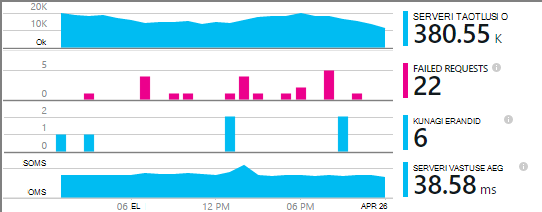
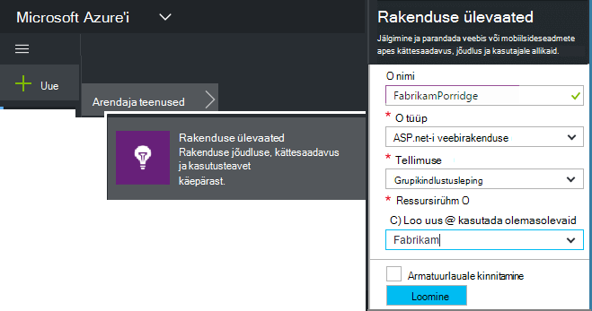
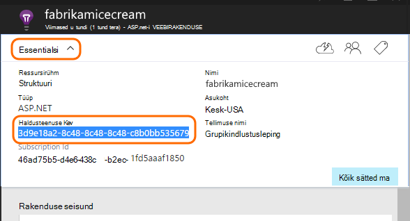
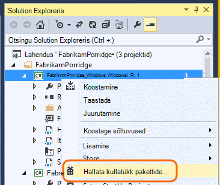
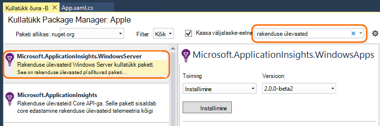
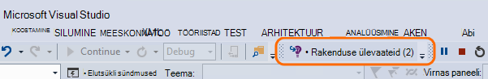
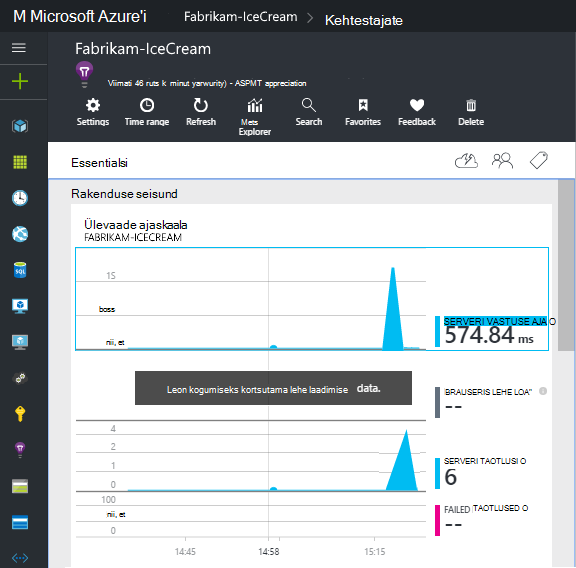
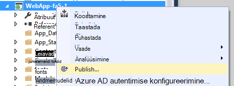

<properties
    pageTitle="Windowsi jaoks mõeldud ülevaateid rakendusteenuste ja töötaja rollide | Microsoft Azure'i"
    description="ASP.net-i rakenduse kasutamine, kättesaadavus ja jõudluse analüüsimiseks rakenduse ülevaateid SDK käsitsi lisada."
    services="application-insights"
    documentationCenter=".net"
    authors="alancameronwills"
    manager="douge"/>

<tags
    ms.service="application-insights"
    ms.workload="tbd"
    ms.tgt_pltfrm="ibiza"
    ms.devlang="na"
    ms.topic="get-started-article"
    ms.date="08/30/2016"
    ms.author="awills"/>

# ASP.net-i 4 rakenduste rakenduse ülevaated käsitsi konfigureerimine

*Rakenduse ülevaated on eelvaade.*

[AZURE.INCLUDE [app-insights-selector-get-started](../../includes/app-insights-selector-get-started.md)]

Saate jälgida Windows teenused, töötaja rollid ja muude rakenduste ASP.net-i [Visual Studio rakenduse ülevaated](app-insights-overview.md) käsitsi konfigureerida. Veebirakendustes käsitsi konfigureerimine on alternatiivne [automaatse häälestamise](app-insights-asp-net.md) pakutud Visual Studio.

Rakenduse ülevaated aitab teil diagnoosimine probleemid ja kuvari jõudlus ja reaalajas rakenduse kasutamine.

#### Enne alustamist

Sa vajad:

* [Microsoft Azure'i](http://azure.com)tellimust. Kui teie meeskond või ettevõte on Azure tellimuse, omanik lisamiseks saate seda oma [Microsofti kontoga](http://live.com).
* Visual Studio 2013 või uuem versioon.

## 1. loomine on rakenduse ülevaated ressurss

[Azure'i portaali](https://portal.azure.com/)sisse logida ja luua uue rakenduse ülevaated ressursi. ASP.net-i valida rakenduse tüüp.

[Ressursi](app-insights-resources-roles-access-control.md) Azure on teenuse eksemplari. Selle ressursi on, kus teie rakenduse telemeetria analüüsida ja esitatakse.

Rakenduse tüüp valik määrab vaikimisi sisu ressursi noad ja atribuutide [Mõõdikute](app-insights-metrics-explorer.md)Exploreris nähtavad.

#### Kopeerige Instrumentation võti

Võti tuvastab ressursi ja saate installida selle kiiresti SDK andmete ressursile suunamiseks.

Olete teinud lihtsalt luua uue ressursi juhiseid on hea viis mis tahes rakenduse jälgimise alustamiseks. Nüüd saate selle saata andmed.

## 2 rakenduse installimiseks SDK

Installimine ja konfigureerimine rakenduses ülevaateid SDK erineb sõltuvalt platvormi, millega töötate. ASP.net-i rakendused, on lihtne.

1. Visual Studio, redigeerige web app projekti NuGet-paketid.

    

2. Installige rakenduse ülevaated SDK Web Apps.

    

    *Saab kasutada muude pakettide?*

    Jah. Valige Core API (Microsoft.ApplicationInsights), kui soovite saata oma telemeetria API abil. Windows Server pakett sisaldab automaatselt Core API ja mitmesuguseid muid pakette, nagu näiteks jõudluse counter kogumine ja sõltuvus jälgimine. 

#### Võtta kasutusele tulevaste SDK versioonid

Anname aeg-ajalt SDK uus versioon.

[SDK uus versioon](https://github.com/Microsoft/ApplicationInsights-dotnet-server/releases/)uuendada, avage Nugeti package manager uuesti ja filtreerida installitud paketid. Valige **Microsoft.ApplicationInsights.Web** ja **uuendada**.

Kui olete teinud kõik kohandused ApplicationInsights.config, salvestada selle koopia enne täiendamine ja hiljem muudatuste ühendamine uue versiooni.

## 3. telemeetria saatmine

**Kui teil on installitud ainult core API pakett:**

* Seadmine instrumentation sisestage kood, nt `main()`: 

    `TelemetryConfiguration.Active.InstrumentationKey = "`*tootevõti*`";` 

* [Kirjutage oma telemeetria API abil](app-insights-api-custom-events-metrics.md#ikey).

**Kui installisite rakenduse ülevaated muude pakettide,** saate soovi korral kasutada .config faili instrumentation võtme seadmiseks:

* Redigeeri ApplicationInsights.config (mis on lisatud, Nugeti installi). Lisage see ainult sulgeda sildi ette:

    `<InstrumentationKey>`*kopeeritud võtit instrumentation*`</InstrumentationKey>`

* Veenduge, et ApplicationInsights.config Solution Exploreris atribuutide määramine **koostada toimingu Kopeeri väljundi kataloogi sisu = = Kopeeri**.

## Projekti käivitamine

Rakenduse käivitada ja seda proovida **F5** abil: Avage erinevate lehtede loomiseks mõned telemeetria.

Visual Studio, näete sündmusi, mis on saadetud arv.

## Saate vaadata oma telemeetria

[Azure'i portaal](https://portal.azure.com/) ja liikuge sirvides oma rakenduse ülevaated ressursi.

Otsige andmeid diagrammides ülevaade. Esialgu näete ainult ühe või kaks. Näiteks:

Klõpsake mis tahes diagrammi üksikasjalikumat mõõdikute kuvamiseks. [Lugege lisateavet mõõdikute.](app-insights-web-monitor-performance.md)

#### Pole andmeid?

* Kasutage rakendust, avades erinevate lehtede, et see tekitab mõned telemeetria.
* Avage paani [Otsi](app-insights-diagnostic-search.md) teemast üksikute sündmuste. Mõnikord kulub sündmuste veidi pikem, et saada mõõdikute müügivõimaluste kaudu.
* Oodake paar minutit ja klõpsake nuppu **Värskenda**. Diagrammide värskendamine ise aeg-ajalt, kuid saate värskendada käsitsi kui ootate teatud andmeid kuvada.
* Vaadake teemat [tõrkeotsing](app-insights-troubleshoot-faq.md).

## Rakenduse avaldamine

Nüüd juurutada rakendust oma serveri või Azure'i ja vaadata koguda andmeid.

Kui käivitate silumine režiimis, telemeetria saab kiirendada kohaletoimetamisel, et näeksite andmeid, kuvataks sekunditega. Kui juurutate oma rakenduse väljaanne konfiguratsiooni, andmete liidetakse aeglasemalt.

#### Andmete pärast avaldada oma serveris?

Avage oma serveri tulemüüris järgmised pordid väljamineva liikluse jaoks.

+ `dc.services.visualstudio.com:443`
+ `f5.services.visualstudio.com:443`

#### Teil on probleeme oma Koosta serveris?

Lugege [seda üksust tõrkeotsing](app-insights-asp-net-troubleshoot-no-data.md#NuGetBuild).

> [AZURE.NOTE]Kui teie rakendus loob palju telemeetria (ja kasutate ASP.net-i SDK versioon 2.0.0-beta3 või uuem versioon), kohandatava valimite mooduli vähendab automaatselt maht, mis saadetakse portaali, saates tüüpilised murdosa sündmused. Siiski sündmused, mis on seotud sama kutse valitud või märkimata rühmana, et seotud sündmused seas saate liikuda. 
> [Vaadake, kuidas valimite](app-insights-sampling.md).

## Järgmised sammud

* [Lisage veel telemeetria](app-insights-asp-net-more.md) rakenduse 360-kraadise ülevaate.

