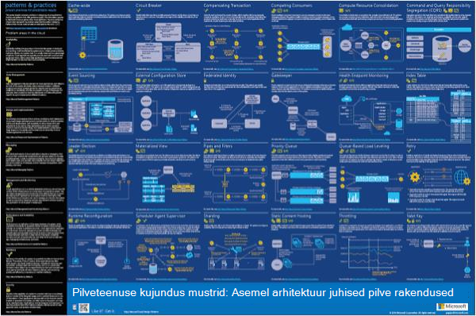
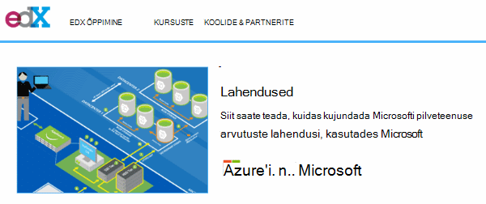
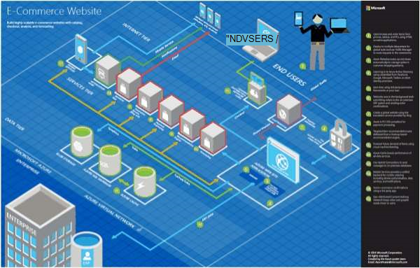
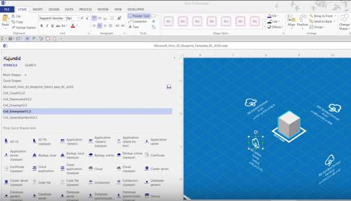
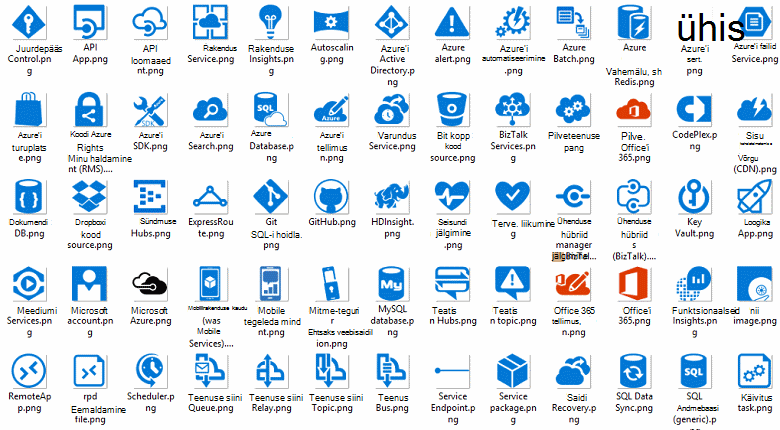
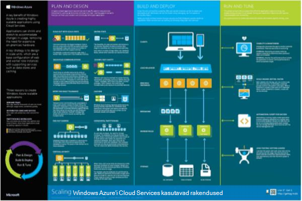

<properties 
    pageTitle="Rakenduse arhitektuur Microsoft Azure | Microsoft Azure'i" 
    description="Levinud kujundus mustrite katva arhitektuuri ülevaade" 
    services="" 
    documentationCenter="" 
    authors="Rboucher" 
    manager="jwhit" 
    editor="mattshel"/>

<tags 
    ms.service="multiple" 
    ms.workload="na" 
    ms.tgt_pltfrm="na" 
    ms.devlang="na" 
    ms.topic="article" 
    ms.date="09/13/2016" 
    ms.author="robb"/>

#Microsoft Azure rakenduse arhitektuur
Rakenduste, mis kasutavad Microsoft Azure ressursse. See sisaldab tööriistu, mis aitavad teil tarkvara süsteemide visuaalselt kirjeldamiseks diagrammide joonistamine. 

##Kujundus mustrite plakat

Microsoft mustrite ja tavad on avaldatud raamat [Pilveteenuse kujundus mustrite](http://msdn.microsoft.com/library/dn568099.aspx) , mis on saadaval MSDN-is ja PDF-faili alla laadida. Olemas on ka suur vorming plakati saadaval, mis loetleb kõik mudelid. 

##Microsoft arhitektuur sertimine kursuse

Microsofti loodud arhitektuur kursuse, mis toetavad Microsoft sertimine serdikontrolli 70-534. See on [saadaval tasuta EDX.ORG](https://www.edx.org/course/architecting-microsoft-azure-solutions-microsoft-dev205x).  Seda kasutatakse [3D näidis Visio malli](#3d-blueprint-visio-template). 

##Microsofti lahenduste

Microsoft avaldab kõrge taseme [lahenduse arhitektuurides](http://aka.ms/azblueprints) , mis näitab, kuidas koostada kindlat tüüpi kasutades Microsofti toodete kogum. 

Varem avaldatud Microsoft kogumi jooniste näide arhitektuurides nähtaval. Need on asendatud lahenduse arhitektuurides, eelnevalt mainitud ja näidis lingi neile osutama suunatakse ümber. Kui teil on vaja juurdepääsu eelmise jooniste materjalid mingil põhjusel, saatke [CnESymbols@microsoft.com](mailto:CnESymbols@microsoft.com) taotlusele.   

Funktsiooni jooniste ja lahenduse arhitektuurides diagrammid kasutada osad [pilveteenuste ja ettevõtte sümbol seadmine](#Drawing-symbol-and-icon-sets).   

##3D näidis Visio Mall

Nüüd kaotatud [Microsoft arhitektuur jooniste](http://aka.ms/azblueprints) 3D versiooni ja mitte-Microsofti tööriista algselt loodi. Visio 2013 (ja uuemad versioonid) malli saadetud 5 august 2015 [Microsoft arhitektuur sertimine kursuse jaotatud EDX.ORG](#microsoft-architecture-certification-course)osana.

Mall on saadaval väljaspool. 

- [Kuva video koolituse](http://aka.ms/3dBlueprintTemplateVideo) esimene nii, et te ei tea, mida ta saab teha   
- Laadige alla soovitud [Microsoft 3d näidis Visio malli](http://aka.ms/3DBlueprintTemplate)
- Laadige alla [pilveteenuste ja ettevõtte sümbolid](#drawing-symbol-and-icon-sets) 3D malli kasutada. 

Saada meile aadressil [CnESymbols@microsoft.com](mailto:CnESymbols@microsoft.com) jaoks teatud küsimused ja vastused pole poolt koolituse materjale või tagasiside. Mall pole enam aktiivne arendustegevus, kuid on endiselt kasulik ja oluline, kuna see saab kasutada mis tahes PNG või [pilve ja ettevõtte sümbolid](#drawing-symbol-and-icon-sets), mis on värskendatud.  

##Joonistamise sümbol ja ikoon 

[Visio ja sümbolid koolitus video vaatamine](http://aka.ms/CnESymbolsVideo) ja seejärel [pilve alla laadida ja ettevõtte sümbol seadmine](http://aka.ms/CnESymbols) abil saate luua tehnilise materjalid, mis kirjeldavad Azure, Windows Server, SQL serveri ja muu. Saate sümbolid arhitektuur diagrammid, koolitusmaterjalid, esitlusi, andmelehtedel, infographics, tehnilised ülevaated ja isegi 3. tootja raamatuid kui raamat rongid inimesed kasutada Microsofti toodetes. Aga need on mõeldud kasutamiseks kasutajaliidese.

CnE sümbolid on Visio, SVG ja PNG-vormingus. Täiendavad juhised, kuidas kasutada hõlpsalt sümbolid kasutamine PowerPointis kaasatud määramine. 

Sümboli määramine teenusega kvartali ja värskendatakse, kui uusi teenuseid väljastatakse. 

Täiendavad sümbolid Microsoft Office'i ja seotud tehnoloogiad on saadaval rakenduses [Microsoft Office Visio värvid suurused](http://www.microsoft.com/en-us/download/details.aspx?id=35772), kuigi ta ei ole arhitektuuri skeemid CnE määramine on optimeeritud.   

**Tagasiside:** Kui olete kasutanud CnE sümboleid, täitke lühike 5 küsimus [küsitluse](http://aka.ms/azuresymbolssurveyv2) või saada meile aadressil [CnESymbols@microsoft.com](mailto:CnESymbols@microsoft.com) teatud küsimuste ja probleemide. Soovime teada, mida te arvate, sh positiivne tagasiside nii, et me leida aega nende jätkama. 

##Arhitektuur Infographics

Microsoft avaldab arhitektuur mitme seotud plakatid/infographics. Neis [Building tegelike pilv rakendusi](https://azure.microsoft.com/documentation/infographics/building-real-world-cloud-apps/) ja [mastaapimine pilveteenustega](https://azure.microsoft.com/documentation/infographics/cloud-services/) . 

