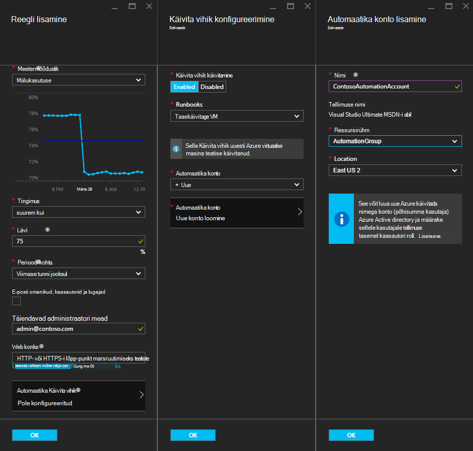
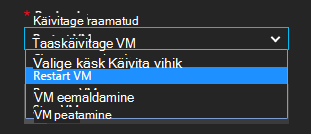
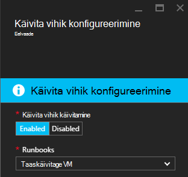
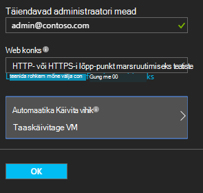

<properties
    pageTitle=" Azure'i VM teatiste abil automaatika tegevusraamatud migreerimisel ning probleemide lahendamisel | Microsoft Azure'i"
    description="Selles artiklis näitab, kuidas Azure'i automaatika tegevusraamatud integreerimine Azure virtuaalse masina teatised ja automaatne-migreerimisel ning probleemide lahendamisel probleemid"
    services="automation"
    documentationCenter=""
    authors="mgoedtel"
    manager="jwhit"
    editor="tysonn" />    
<tags
    ms.service="automation"
    ms.devlang="na"
    ms.topic="article"
    ms.tgt_pltfrm="na"
    ms.workload="infrastructure-services"
    ms.date="06/14/2016"
    ms.author="csand;magoedte" />

# <a name="azure-automation-scenario---remediate-azure-vm-alerts"></a>Azure'i automaatika stsenaarium - migreerimisel ning probleemide lahendamisel Azure VM teatised

Azure'i automatiseerimine ja Azure'i Virtuaalmasinates on välja uus funktsioon, mis võimaldab teil konfigureerida virtuaalse masina (VM) teatiste automaatika tegevusraamatud käivitamiseks. Selle uue võimaluse saate automaatselt sooritada standard parandamise vastuseks VM teatised, nt taaskäivitada või peatamine VM.

Varem VM reegli loomise ajal teil oli võimalus [määrata ka automatiseerimise webhook](https://azure.microsoft.com/blog/using-azure-automation-to-take-actions-on-azure-alerts/) on käitusjuhendi käivitamiseks käitusjuhendi iga kord, kui selle teatise käivitamine. Kuid see vaja te ei tööta käitusjuhendi loomise, loomise webhook jaoks käitusjuhendi, ja seejärel kopeerimise ja kleepimise funktsiooni webhook reegli loomise ajal. Uue väljaandesse protsess on märksa lihtsam, kuna otse valida mõne käitusjuhendi loendi reegli loomise ajal ja saate valida automatiseerimise kontot, mis käivitada käitusjuhendi või kerge vaevaga luua konto.

Selles artiklis näitame teile, kui lihtne on Azure VM teatise häälestada ja konfigureerida mõne automatiseerimise käitusjuhendi käivitamise teatise käivitab. Näidisstsenaariumid kaasata VM taaskäivitada, kui mälukasutust ületab teatud piiri tõttu rakenduse VM koos põhjus või peatamine VM, kui kasutaja CPU aeg on väiksem kui 1% tunnis ja ei kasuta. Samuti selgitame, kuidas põhisumma kontol automatiseerimine teenuse automaatne loomine lihtsustab tegevusraamatud rakenduses Azure teatiste parandamise kasutamist.

## <a name="create-an-alert-on-a-vm"></a>Teatise loomine VM

Järgmiste toimingute konfigureerimiseks teatise käivitamiseks on käitusjuhendi, siis selle on täidetud.

>[AZURE.NOTE] Selles versioonis ainult toetame V2 virtuaalmasinates ja tugiteenuste Classic VMs lisatakse peagi.  

1. Azure portaali sisse logida ja klõpsake nuppu **Virtuaalmasinates**.  
2. Valige üks teie virtuaalmasinates.  Kuvatakse virtuaalse masina armatuurlaua tera ja **sätted** blade paremale.  
3. Valige keelest **sätted** jaotises jälgimine **teatiste reeglid**.
4. **Teatiste reeglid** enne, klõpsake nuppu **Lisa teatis**.

See avab **reegli lisamine** tera, kus saate konfigureerida teatise tingimused ja valida ühte või kõiki järgmistest suvanditest: e-posti saatmiseks, on webhook abil edasi mõnele teisele süsteemile teatise ja/või vastuse katse migreerimisel ning probleemide lahendamisel probleem on automatiseerimise käitusjuhendi läbiviimisel.

## <a name="configure-a-runbook"></a>Mõne käitusjuhendi konfigureerimine

Valige käitusjuhendi, kui VM teatiste lävi on täidetud konfigureerimiseks **Automatiseerimise Käitusjuhendi**. **Konfigureerimine käitusjuhendi** tera, saate valida käitusjuhendi käivitamiseks ja automatiseerimise konto käitusjuhendi käivitamiseks.



>[AZURE.NOTE] Selles versioonis saate valida pakutav teenus – taaskäivitage VM, VM peatada või eemaldada VM kolme tegevusraamatud (Kustuta).  Valige muud tegevusraamatud või oma tegevusraamatud üks võimalus on saadaval tulevikus.



Valige üks kolmest saadaval tegevusraamatud, ripploendist **automatiseerimise konto** kuvatakse ja valige konto automatiseerimise käitusjuhendi käivitavad nimega. Tegevusraamatud peate käivitama [automatiseerimise konto](automation-security-overview.md) , mis on Azure tellimuse kontekstis. Saate valida automatiseerimise konto juba loodud, või peate uue automatiseerimise konto teie jaoks loodud.

Tegevusraamatud, mis on esitatud autentida Azure'i teenuse põhilise abil. Kui valite ühes olemasolevad automatiseerimise kontode käitusjuhendi käivitamiseks, automaatselt loome teenuse põhisumma teie eest. Kui valite automatiseerimise uue konto loomiseks, siis me loob automaatselt konto ja teenus põhisumma. Mõlemal juhul kaks varad luuakse ka automatiseerimise konto – serdi varade, **AzureRunAsCertificate** nimega ja ühenduse varade, nimega **AzureRunAsConnection**. Funktsiooni tegevusraamatud kasutatakse **AzureRunAsConnection** selleks, et halduse toimingu suhtes VM Azure autentida.

>[AZURE.NOTE] Teenuse põhilise tellimuse ulatus on loodud ja määratud kaasautori roll. Sellel rollil on nõutav selleks, et konto, mida soovite käivitada automaatika tegevusraamatud õigust Azure VMs haldamine.  Automaadi konto ja/või teenuse põhisumma on ühekordne. Kui need on loodud, saate selle konto jaoks muud Azure VM teatised tegevusraamatud käivitamiseks.

Nupu **OK** klõpsamisel teatise on konfigureeritud ja kui olete valinud suvandi automatiseerimise uue konto loomiseks, luuakse koos teenuse põhisumma.  See võib võtta mõne hetke lõpuleviimiseks.  



Pärast konfiguratsiooni on lõpule viidud, kuvatakse käitusjuhendi nimi kuvatakse tera **reegli lisamine** .



Klõpsake nuppu **OK** **reegli lisamine** blade ja reegli luuakse ja aktiveerida, kui virtuaalse masina on töötab.

### <a name="enable-or-disable-a-runbook"></a>Lubada või keelata käitusjuhendi lisamine

Kui teil on käitusjuhendi, mis on konfigureeritud lubama teatise, saate selle keelata käitusjuhendi konfiguratsiooni eemaldamata. See võimaldab teil hoida teade, kus töötab ja võib-olla mõned teatiste reeglid ja seejärel hiljem uuesti lubamiseks käitusjuhendi.

## <a name="create-a-runbook-that-works-with-an-azure-alert"></a>Käitusjuhendi, mis töötab Azure teatise loomine

Kui valite mõne käitusjuhendi Azure reegli osana, käitusjuhendi peab olema loogika see teatis andmete, mis selle haldamiseks.  Mõne käitusjuhendi konfigureerimisel reegli lisamine webhook luuakse käitusjuhendi; selle webhook kasutatakse iga kord, kui teatise käivitab käitusjuhendi käivitamiseks.  Tegelik kõne alustamiseks käitusjuhendi on HTTP POST-taotluse webhook URL. POSTITUSE koosolekukutse kehasse sisaldab JSON-vormindatavat objekti, mis sisaldab seotud teade kasu atribuudid.  Nagu allpool näha, teatiste andmed sisaldavad näiteks subscriptionID, resourceGroupName, resourceName ja resourceType üksikasjad.

### <a name="example-of-alert-data"></a>Teatise andmete näide
```
{
    "WebhookName": "AzureAlertTest",
    "RequestBody": "{
    \"status\":\"Activated\",
    \"context\": {
        \"id\":\"/subscriptions/<subscriptionId>/resourceGroups/MyResourceGroup/providers/microsoft.insights/alertrules/AlertTest\",
        \"name\":\"AlertTest\",
        \"description\":\"\",
        \"condition\": {
            \"metricName\":\"CPU percentage guest OS\",
            \"metricUnit\":\"Percent\",
            \"metricValue\":\"4.26337916666667\",
            \"threshold\":\"1\",
            \"windowSize\":\"60\",
            \"timeAggregation\":\"Average\",
            \"operator\":\"GreaterThan\"},
        \"subscriptionId\":\<subscriptionID> \",
        \"resourceGroupName\":\"TestResourceGroup\",
        \"timestamp\":\"2016-04-24T23:19:50.1440170Z\",
        \"resourceName\":\"TestVM\",
        \"resourceType\":\"microsoft.compute/virtualmachines\",
        \"resourceRegion\":\"westus\",
        \"resourceId\":\"/subscriptions/<subscriptionId>/resourceGroups/TestResourceGroup/providers/Microsoft.Compute/virtualMachines/TestVM\",
        \"portalLink\":\"https://portal.azure.com/#resource/subscriptions/<subscriptionId>/resourceGroups/TestResourceGroup/providers/Microsoft.Compute/virtualMachines/TestVM\"
        },
    \"properties\":{}
    }",
    "RequestHeader": {
        "Connection": "Keep-Alive",
        "Host": "<webhookURL>"
    }
}
```

Kui automatiseerimine webhook teenuse saab HTTP postituse ekstraktib teatise andmete ja edastab selle käitusjuhendi WebhookData käitusjuhendi sisendparameetrile sisse.  Allpool on valimi käitusjuhendi, mis näitab, kuidas kasutada parameetrit WebhookData ja saada teatis andmeid ja kasutage seda hallata teatise käivitanud Azure ressursi.

### <a name="example-runbook"></a>Näide käitusjuhendi

```
#  This runbook will restart an ARM (V2) VM in response to an Azure VM alert.

[OutputType("PSAzureOperationResponse")]

param ( [object] $WebhookData )

if ($WebhookData)
{
    # Get the data object from WebhookData
    $WebhookBody = (ConvertFrom-Json -InputObject $WebhookData.RequestBody)

    # Assure that the alert status is 'Activated' (alert condition went from false to true)
    # and not 'Resolved' (alert condition went from true to false)
    if ($WebhookBody.status -eq "Activated")
    {
        # Get the info needed to identify the VM
        $AlertContext = [object] $WebhookBody.context
        $ResourceName = $AlertContext.resourceName
        $ResourceType = $AlertContext.resourceType
        $ResourceGroupName = $AlertContext.resourceGroupName
        $SubId = $AlertContext.subscriptionId

        # Assure that this is the expected resource type
        Write-Verbose "ResourceType: $ResourceType"
        if ($ResourceType -eq "microsoft.compute/virtualmachines")
        {
            # This is an ARM (V2) VM

            # Authenticate to Azure with service principal and certificate
            $ConnectionAssetName = "AzureRunAsConnection"
            $Conn = Get-AutomationConnection -Name $ConnectionAssetName
            if ($Conn -eq $null) {
                throw "Could not retrieve connection asset: $ConnectionAssetName. Check that this asset exists in the Automation account."
            }
            Add-AzureRMAccount -ServicePrincipal -Tenant $Conn.TenantID -ApplicationId $Conn.ApplicationID -CertificateThumbprint $Conn.CertificateThumbprint | Write-Verbose
            Set-AzureRmContext -SubscriptionId $SubId -ErrorAction Stop | Write-Verbose

            # Restart the VM
            Restart-AzureRmVM -Name $ResourceName -ResourceGroupName $ResourceGroupName
        } else {
            Write-Error "$ResourceType is not a supported resource type for this runbook."
        }
    } else {
        # The alert status was not 'Activated' so no action taken
        Write-Verbose ("No action taken. Alert status: " + $WebhookBody.status)
    }
} else {
    Write-Error "This runbook is meant to be started from an Azure alert only."
}
```

## <a name="summary"></a>Kokkuvõte

Teatise konfigureerimisel on Azure VM saate nüüd ka hüpikmenüüsid mõne automatiseerimise käitusjuhendi parandamise toimingu automaatselt teha, kui teatise käivitab hõlpsalt konfigureerimiseks. Selles versioonis saate valida tegevusraamatud taaskäivitage, peatamiseks või VM, sõltuvalt sellest, milline olukord teie teatiste kustutamine. See on alles algus lubada stsenaariumid, kus saate määrata toiminguid (teatis tõrkeotsing, parandamise), mida võetakse automaatselt kui teatise käivitab.

## <a name="next-steps"></a>Järgmised sammud

- Alustamine graafiline tegevusraamatud, lugege teemat [minu esimene graafiline käitusjuhendi](automation-first-runbook-graphical.md)
- Alustamine PowerShelli töövoo tegevusraamatud, lugege teemat [minu esimese PowerShelli töövoo käitusjuhendi](automation-first-runbook-textual.md)
- Käitusjuhendi tüüpi eeliste ja piirangute kohta leiate lisateavet teemast [Azure automatiseerimine käitusjuhendi tüübid](automation-runbook-types.md)
