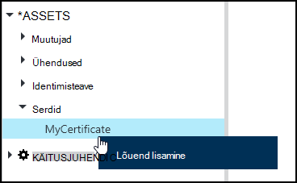

<properties 
   pageTitle="Serdi varasid Azure automatiseerimine | Microsoft Azure'i"
   description="Sertide saab salvestada turvaliselt Azure automatiseerimine nii, et nad pääsevad juurde tegevusraamatud või DSC konfiguratsioone autentimiseks Azure ja kolmanda osapoole ressursid.  Selles artiklis selgitatakse serdid ja kuidas nendega töötada nii teksti kui ka graafilise loome üksikasju."
   services="automation"
   documentationCenter=""
   authors="mgoedtel"
   manager="stevenka"
   editor="tysonn" />
<tags 
   ms.service="automation"
   ms.devlang="na"
   ms.topic="article"
   ms.tgt_pltfrm="na"
   ms.workload="infrastructure-services"
   ms.date="02/23/2016"
   ms.author="magoedte;bwren" />

# Serdi varasid Azure automatiseerimine

Sertide saab salvestada turvaliselt Azure automatiseerimine nii, et nad pääsevad juurde tegevusraamatud või DSC konfiguratsioone **Get-AutomationCertificate** tegevuse abil. See võimaldab teil luua tegevusraamatud ja DSC konfiguratsioone kasutavate serdid autentimine või lisatakse Azure'i või muude tootjate ressursid.

>[AZURE.NOTE] Turvaline varasid Azure automatiseerimine kaasata mandaat, serdid, ühendused ja krüptitud muutujate. Varade krüptitud ning talletatud Azure'i automaatika kordumatu võti, mis luuakse iga automatiseerimise konto abil. See võti krüptitud juhtslaidi sertifikaadiga ja talletatud Azure automatiseerimine. Kui kavatsete turvaline vara, automatiseerimise konto võti on lahtikrüptitud juhtslaidi serdiga ja seejärel kasutatud vara krüptimiseks.

## Windows PowerShelli cmdlet-käsud

Järgmises tabelis cmdlet-käskude kasutatakse luua ja hallata serdi automatiseerimine varasid ning Windows PowerShelli abil. Need saata [Azure PowerShelli moodul](../powershell-install-configure.md) , mis on saadaval kasutamiseks automaatika tegevusraamatud ja DSC konfiguratsioone osana.

|Cmdlet-käsud|Kirjeldus|
|:---|:---|
|[Get-AzureAutomationCertificate](http://msdn.microsoft.com/library/dn913765.aspx)|Kuvatakse teave serdi kohta. Saate tuua ainult sertifikaati Get-AutomationCertificate tegevuse.|
|[Uue AzureAutomationCertificate](http://msdn.microsoft.com/library/dn913764.aspx)|Impordib uut serti Azure automatiseerimine.|
|[Eemalda – AzureAutomationCertificate](http://msdn.microsoft.com/library/dn913773.aspx)|Eemaldab serdi Azure automatiseerimine.|
|[Set - AzureAutomationCertificate](http://msdn.microsoft.com/library/dn913763.aspx)|Määrab atribuutide lüüsiarvutis olemasolev sert, sh serdi faili üleslaadimine ja säte on pfx parool.|

## Tegevuste juurde pääseda serdid

Järgmises tabelis tegevuste kasutatakse juurdepääsu serdid käitusjuhendi või DSC konfigureerimine.

|Tegevuste|Kirjeldus|
|:---|:---|
|Get-AutomationCertificate|Saab kasutada käitusjuhendi või DSC konfiguratsiooni sert.|

>[AZURE.NOTE] Peaks Vältige muutujat – nimi parameetris Get-AutomationCertificate, kuna see raskendada avastanud sõltuvuste tegevusraamatud või DSC konfiguratsioone ja serdi varasid koostamise ajal.

## Uue serdi loomine

Kui loote uue sert, mida CER- või pfx faili üleslaadimine Azure automatiseerimine. Kui märgite tunnistust eksporditav, siis saate edastada selle serdi automatiseerimine Azure'i poest välja. Kui see pole eksporditav, siis seda saab kasutada ainult allkirjastamiseks käitusjuhendi või DSC konfigureerimine.

### Azure'i klassikaline portaali luua uut serti

1. Klõpsake konto automatiseerimise **varasid** akna ülaosas.
1. Klõpsake akna allosas **Lisada säte**.
1. Klõpsake **Lisa identimisteavet**.
2. **Mandaadi tüüp** ripploendit, valige **sert**.
3. Tippige väljale **nimi** serdi nimi ja klõpsake paremnoolt.
4. Sirvige CER või pfx-faili.  Kui valite pfx-fail, määrake parool ja kas see peaks olema lubatud eksportida.
1. Seejärel klõpsake märkeruutu serdi faili üles laadida ja salvestada uut serti vara.

### Azure'i portaalis luua uut serti

1. Klõpsake automatiseerimise kontolt **varad** osa **varad** tera avamiseks.
1. Klõpsake nuppu **serdid** osa **serdid** tera avamiseks.
1. Klõpsake nuppu **Lisa serdi** tera ülaosas.
2. Tippige väljale **nimi** nimi serti.
2. Klõpsake jaotises **serdi faili üleslaadimine** CER- või pfx faili otsimiseks nuppu **Faili valimiseks** .  Kui valite pfx-fail, määrake parool ja kas see peaks olema lubatud eksportida.
1. Klõpsake nuppu **Loo** uus sert vara salvestamiseks.

### Uue serdi loomine Windows PowerShelli abil

Valimi järgmised käsud näitab, kuidas luua uus serdi automatiseerimine ja see tähistab eksporditav. See impordib olemasoleva pfx-fail.

    $certName = 'MyCertificate'
    $certPath = '.\MyCert.pfx'
    $certPwd = ConvertTo-SecureString -String 'P@$$w0rd' -AsPlainText -Force
    
    New-AzureAutomationCertificate -AutomationAccountName "MyAutomationAccount" -Name $certName -Path $certPath –Password $certPwd -Exportable

## Serdi abil

Kasutage **Get-AutomationCertificate** tegevuse kasutada sert. [Get-AzureAutomationCertificate](http://msdn.microsoft.com/library/dn913765.aspx) cmdlet-käsk ei saa kasutada, kuna annab teavet serdi varade, kuid mitte sert.

### Teksti käitusjuhendi näidis

Järgmine proovi kood näitab, kuidas serdi lisamine rakenduses on käitusjuhendi pilveteenusesse. Selles näites tuuakse parool on krüptitud automatiseerimise muutujat.

    $serviceName = 'MyCloudService'
    $cert = Get-AutomationCertificate -Name 'MyCertificate'
    $certPwd = Get-AutomationVariable –Name 'MyCertPassword'
    Add-AzureCertificate -ServiceName $serviceName -CertToDeploy $cert

### Graafilised käitusjuhendi näidis

Saate lisada mõne **Get-AutomationCertificate** graafilise käitusjuhendi serdi teegi paanil pildiredaktor paremklõpsata ja valida käsu **Add lõuend**.

Järgmisel pildil on kujutatud serdiga graafiline käitusjuhendi.  See on mõeldud serdi lisamine pilveteenus teksti käitusjuhendi sama näite.  

Selles näites kasutatakse **UseConnectionObject** parameetri **Saada-TwilioSMS** tegevust, mis kasutab autentimiseks teenusega ühenduse objekti seadmine.  [Müügivõimaluste link](automation-graphical-authoring-intro.md#links-and-workflow) tuleb kasutada siin Kuna lingi jada tagasi kogumik, mis sisaldab ühte objekti, mis on andmeühenduse parameeter ei oodanud.

## Vt ka

- [Linkide graafiline koostamine](automation-graphical-authoring-intro.md#links-and-workflow) 
