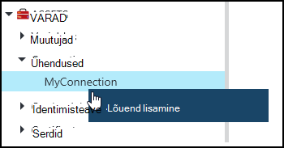
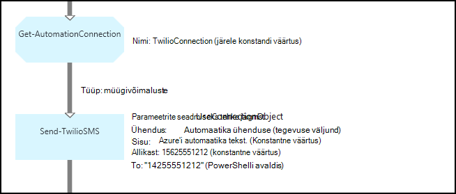
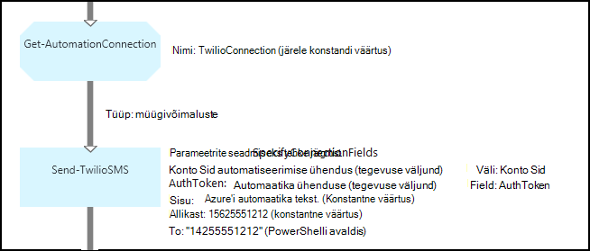

<properties 
   pageTitle="Ühenduse varasid Azure automatiseerimine | Microsoft Azure'i"
   description="Ühenduse varasid Azure automatiseerimine sisaldavad käitusjuhendi või DSC konfiguratsiooni rakenduse või teenuse välise ühenduse loomiseks vajalik teave. Selles artiklis selgitatakse ühendusi ja kuidas nendega töötada nii teksti kui ka graafilise loome üksikasju."
   services="automation"
   documentationCenter=""
   authors="bwren"
   manager="stevenka"
   editor="tysonn" />
<tags 
   ms.service="automation"
   ms.devlang="na"
   ms.topic="article"
   ms.tgt_pltfrm="na"
   ms.workload="infrastructure-services"
   ms.date="01/27/2016"
   ms.author="bwren" />

# Ühenduse varasid Azure automatiseerimine

Automaatika ühenduse vara sisaldab käitusjuhendi või DSC konfiguratsiooni rakenduse või teenuse välise ühenduse loomiseks vajalik teave. See võib sisaldada autentimine, nt kasutajanime ja parooli Lisaks ühenduseteavet, nt URL-i või pordi vajalik teave. Ühenduse väärtus on hoides kõik konkreetse rakenduse ühe vara asemel looma mitut muutujat ühenduse atribuudid. Kasutaja saab redigeerida ühenduse ühes kohas väärtused ja te kaotate ühenduse nimi käitusjuhendi või ühe parameetri DSC konfigureerimine. Ühenduse atribuudid pääseb käitusjuhendi või DSC konfiguratsiooni **Get-AutomationConnection** tegevusega.

Kui loote ühenduse, peate määrama *ühenduse tüüp*. Ühenduse tüüp on Mall, mis määratleb atribuutide kogum. Ühenduse määratleb iga selle ühendusetüübi määratletud atribuudi väärtuste jaoks. Azure'i automaatika integreerimine moodulid lisanud või [Azure'i automaatika API](http://msdn.microsoft.com/library/azure/mt163818.aspx)loodud ühendus failitüübid. Ainult ühenduse tüüpi, mis on saadaval, kui loote ühenduse on need installitud konto automatiseerimine.

>[AZURE.NOTE] Turvaline varasid Azure automatiseerimine kaasata mandaat, serdid, ühendused ja krüptitud muutujate. Varade krüptitud ning talletatud Azure'i automaatika kordumatu võti, mis luuakse iga automatiseerimise konto abil. See võti krüptitud juhtslaidi sertifikaadiga ja talletatud Azure automatiseerimine. Kui kavatsete turvaline vara, automatiseerimise konto võti on lahtikrüptitud juhtslaidi serdiga ja seejärel kasutatud vara krüptimiseks.

## Windows PowerShelli cmdlet-käsud

Järgmises tabelis cmdlet-käskude kasutatakse Windows PowerShelli abil automatiseerimise ühenduste loomine ja haldamine. Need saata [Azure PowerShelli moodul](../powershell-install-configure.md) , mis on saadaval kasutamiseks tegevusraamatud automatiseerimine ja DSC konfiguratsioone osana.

|Cmdlet-käsk|Kirjeldus|
|:---|:---|
|[Get-AzureAutomationConnection](http://msdn.microsoft.com/library/dn921828.aspx)|Toob ühenduse. Sisaldab räsi tabel koos selle ühenduse väljad.|
|[Uue AzureAutomationConnection](http://msdn.microsoft.com/library/dn921825.aspx)|Luuakse uus ühendus.|
|[Eemalda – AzureAutomationConnection](http://msdn.microsoft.com/library/dn921827.aspx)|Olemasoleva ühenduse eemaldada.|
|[Set-AzureAutomationConnectionFieldValue](http://msdn.microsoft.com/library/dn921826.aspx)|Määrab teatud välja jaoks mõne olemasoleva ühenduse väärtus.|

## Tegevuste

Järgmises tabelis tegevuste kasutatakse juurdepääsu ühendused käitusjuhendi või DSC konfigureerimine.

|Tegevuste|Kirjeldus|
|---|---|
|Get-AutomationConnection|Saab kasutada-ühendus. Tagastab räsi tabel koos selle ühenduse atribuudid.|

>[AZURE.NOTE] Peaks Vältige muutujat – nimi parameetris **Get-AutomationConnection** , kuna see võib raskendada avastanud sõltuvuste tegevusraamatud või DSC konfiguratsioone ja ühenduse varade koostamise ajal.

## Uue ühenduse loomine

### Azure'i klassikaline portaalis uue ühenduse loomiseks

1. Klõpsake automatiseerimise kontolt **varad** akna ülaservas.
1. Klõpsake akna allosas **Lisada säte**.
1. Klõpsake nuppu **Lisa ühendus**.
2. Valige rippmenüüst **Ühendusetüübi** soovite luua ühenduse tüübist.  Viisardi esitab seda teatud tüüpi atribuudid.
1. Viisardi lõpuleviimine ja märkige ruut salvestamiseks uus ühendus.

### Azure'i portaalis uue ühenduse loomiseks

1. Klõpsake automatiseerimise kontolt **varad** osa **varad** tera avamiseks.
1. **Ühenduste** osa tera **ühendused** avamiseks klõpsake.
1. Klõpsake nuppu **Lisa ühendus** tera ülaosas.
2. Valige rippmenüüst **Tüüp** loodava ühenduse tüübist. Vormi esitab seda teatud tüüpi atribuudid.
1. Täitke vorm ja klõpsake nuppu **Loo** uus ühendus salvestamiseks.

### Uue ühenduse loomine Windows PowerShelli abil

Uue ühenduse loomine Windows PowerShelli cmdlet-käsu [New-AzureAutomationConnection](http://msdn.microsoft.com/library/dn921825.aspx) abil. Selle cmdlet-käsu on parameeter nimega **ConnectionFieldValues** , mis eeldab, et [räsi tabeli](http://technet.microsoft.com/library/hh847780.aspx) määratlemine väärtused iga määratletud tüüp ühenduse atribuudid.

Valimi järgmised käsud [Twilio](http://www.twilio.com) on telefoniside teenus, mis võimaldab saata ja vastu võtta tekstsõnumeid uue ühenduse loomiseks.  Valimi integreerimine moodul, mis sisaldab Twilio ühenduse tüüp on saadaval [Skripti](http://gallery.technet.microsoft.com/scriptcenter/Twilio-PowerShell-Module-8a8bfef8)kaudu.  Selle ühendusetüübi määratleb atribuudid konto-SID ja luba Turbeloa, mis on vajalikud Twilio ühendamisel konto kinnitada.  Peate [selle mooduli alla laadida](http://gallery.technet.microsoft.com/scriptcenter/Twilio-PowerShell-Module-8a8bfef8) ja installida selle proovi kood töötamiseks kontol automatiseerimine.

    $AccountSid = "DAf5fed830c6f8fac3235c5b9d58ed7ac5"
    $AuthToken  = "17d4dadfce74153d5853725143c52fd1"
    $FieldValues = @{"AccountSid" = $AccountSid;"AuthToken"=$AuthToken}

    New-AzureAutomationConnection -AutomationAccountName "MyAutomationAccount" -Name "TwilioConnection" -ConnectionTypeName "Twilio" -ConnectionFieldValues $FieldValues

## Abil luua ühendus käitusjuhendi või DSC konfigureerimine

Saate tuua ühenduse käitusjuhendi või DSC konfiguratsiooni **Get-AutomationConnection** cmdlet-käsk.  See tegevus toob ühenduse erinevate väljade väärtused, ja tagastab nende [räsi tabel](http://go.microsoft.com/fwlink/?LinkID=324844) , mida saab kasutada koos käitusjuhendi või DSC konfiguratsiooni vajalikud käsud.

### Teksti käitusjuhendi näidis
Valimi järgmised käsud näitab, kuidas kasutada Twilio ühendust eelmises näites on käitusjuhendi teksti sõnumi saatmine.  Saada-TwilioSMS kohandatuna siin on kahe parameetri komplekti iga muu meetodi kasutamise autentimiseks Twilio teenusega.  Üks kasutab ühenduse objekt ja teise kasutab üksikute parameetrite konto-SID ja luba Turbeloa.  Selles näites kuvatakse allpool on mõlema meetodi.

    $Con = Get-AutomationConnection -Name "TwilioConnection"
    $NumTo = "14255551212"
    $NumFrom = "15625551212"
    $Body = "Text from Azure Automation."

    #Send text with connection object.
    Send-TwilioSMS -Connection $Con -From $NumFrom -To $NumTo -Body $Body

    #Send text with connection properties.
    Send-TwilioSMS -AccountSid $Con.AccountSid -AuthToken $Con.AuthToken -From $NumFrom -To $NumTo -Body $Body

### Graafilised käitusjuhendi näidised

Saate lisada **Get-AutomationConnection** tegevuste graafiline käitusjuhendi ühendamine teegi paanil pildiredaktor paremklõpsata ja valida käsu **Add lõuend**.

Järgmisel pildil on kujutatud graafiline käitusjuhendi ühenduse kasutamine.  See on sama teksti sõnumi tekstis käitusjuhendi Twilio kaudu näite.  Selles näites kasutatakse **UseConnectionObject** parameetri **Saada-TwilioSMS** tegevust, mis kasutab autentimiseks teenusega ühenduse objekti seadmine.  Kuna andmeühenduse parameeter ootab ühele objektile kasutatakse [müügivõimaluste linki](automation-graphical-authoring-intro.md#links-and-workflow) siin.

Mis on PowerShelli avaldis kasutatakse konstantne väärtus asemel **et** parameetri väärtus on eeldab see parameeter stringi massiivi väärtuse tüüp, nii, et saate saata mitmele põhjus.  PowerShelli avaldis, mis võimaldab teil ühe väärtuse või massiivi.

Alloleval pildil on näha sama nagu Ülaltoodud näites kuid kasutab parameetri **SpecifyConnectionFields** määratud, mis eeldab, et erinevalt ühenduse objekti abil autentimise eraldi määratud AccountSid ja AuthToken parameetrid.  Sel juhul ühenduse väljad on määratud mitte objektile.  

## Seotud artiklid

- [Linkide graafiline koostamine](automation-graphical-authoring-intro.md#links-and-workflow)
 
