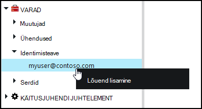
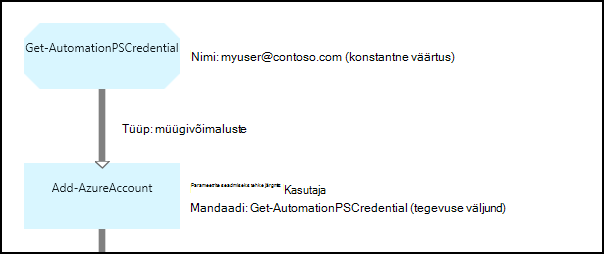

<properties 
   pageTitle="Mandaadi varasid Azure automatiseerimine | Microsoft Azure'i"
   description="Mandaadi varasid Azure automatiseerimine sisaldavad turvalisus identimisteavet, mida saab kasutada autentimiseks juurde käitusjuhendi või DSC konfiguratsiooni ressursid. Selles artiklis kirjeldatakse mandaadi varad luua ja kasutada neid käitusjuhendi või DSC konfigureerimine."
   services="automation"
   documentationCenter=""
   authors="mgoedtel"
   manager="jwhit"
   editor="tysonn" />
<tags 
   ms.service="automation"
   ms.devlang="na"
   ms.topic="article"
   ms.tgt_pltfrm="na"
   ms.workload="infrastructure-services"
   ms.date="06/09/2016"
   ms.author="bwren" />

# Mandaadi varasid Azure automatiseerimine

Automaatika mandaati vara hoiab [PSCredential](http://msdn.microsoft.com/library/system.management.automation.pscredential) objekti, mis sisaldab turvalisus identimisteabe nagu kasutajanimi ja parool. Tegevusraamatud ja DSC konfiguratsioone kasutada cmdlet-käsud Aktsepteeri PSCredential objekti autentimise või need võivad ekstraktida kasutajanime ja parooli PSCredential objekti anda mõned rakenduse või teenuse, mis nõuab autentimist. Atribuutide mandaati säilitatakse turvaliselt Azure automatiseerimine ja pääseb käitusjuhendi või DSC konfiguratsiooni [Get-AutomationPSCredential](http://msdn.microsoft.com/library/system.management.automation.pscredential.aspx) tegevusega.

>[AZURE.NOTE] Turvaline varasid Azure automatiseerimine kaasata mandaat, serdid, ühendused ja krüptitud muutujate. Varade krüptitud ning talletatud Azure'i automaatika kordumatu võti, mis luuakse iga automatiseerimise konto abil. See võti krüptitud juhtslaidi sertifikaadiga ja talletatud Azure automatiseerimine. Kui kavatsete turvaline vara, automatiseerimise konto võti on lahtikrüptitud juhtslaidi serdiga ja seejärel kasutatud vara krüptimiseks. 

## Windows PowerShelli cmdlet-käsud

Järgmises tabelis cmdlet-käskude kasutatakse luua ja hallata automatiseerimise mandaati varad Windows PowerShelli abil.  Need saata [Azure PowerShelli moodul](../powershell-install-configure.md) , mis on saadaval kasutamiseks tegevusraamatud automatiseerimine ja DSC konfiguratsioone osana.

|Cmdlet-käsud|Kirjeldus|
|:---|:---|
|[Get-AzureAutomationCredential](http://msdn.microsoft.com/library/dn913781.aspx)|Toob mandaati varade teavet. **Get-AutomationPSCredential** tegevusest saate tuua ainult ise mandaat.|
|[Uue AzureAutomationCredential](http://msdn.microsoft.com/library/azure/jj554330.aspx)|Loob uue automatiseerimise mandaati.|
|[Eemalda – AzureAutomationCredential](http://msdn.microsoft.com/library/azure/jj554330.aspx)|Eemaldab mõne automatiseerimise mandaati.|
|[Set - AzureAutomationCredential](http://msdn.microsoft.com/library/azure/jj554330.aspx)|Määrab mõne olemasoleva automatiseerimine mandaadi atribuudid.|

## Käitusjuhendi tegevuste

Järgmises tabelis tegevuste kasutatakse juurde turbesalves on käitusjuhendi ja DSC konfiguratsioone.

|Tegevuste|Kirjeldus|
|:---|:---|
|Get-AutomationPSCredential|Saab kasutada käitusjuhendi või DSC konfiguratsiooni mandaati. Tagastab [System.Management.Automation.PSCredential](http://msdn.microsoft.com/library/system.management.automation.pscredential) objekti.|

>[AZURE.NOTE] Peaks Vältige muutujat – nimi parameetris toomine AutomationPSCredential, kuna see raskendada avastanud sõltuvuste tegevusraamatud või DSC konfiguratsioone ja mandaadi varad koostamise ajal.

## Uue mandaadi varade loomine

### Luua uue mandaadi varade Azure klassikaline portaal

1. Klõpsake automatiseerimise kontolt **varad** akna ülaservas.
1. Klõpsake akna allosas **Lisada säte**.
1. Klõpsake **Lisa mandaati**.
2. Valige rippmenüüst **Mandaadi tüüp** **PowerShelli mandaati**.
1. Viisardi lõpuleviimine ja ruut, et salvestada uut mandaati.

### Luua uue mandaadi varade Azure'i portaal

1. Klõpsake automatiseerimise kontolt **varad** osa **varad** tera avamiseks.
1. Klõpsake **mandaadi** osa **identimisteabe** tera avamiseks.
1. Klõpsake nuppu **Lisa mandaati** tera ülaosas.
1. Täitke vorm ja klõpsake nuppu **Loo** uus mandaati salvestada.

### Luua uue mandaadi varade Windows PowerShelli abil

Valimi järgmised käsud näitab, kuidas luua uus automatiseerimise identimisteavet. PSCredential objekti esmalt loodud nimi ja parool ja seejärel saab luua varade mandaati. Teise võimalusena võite cmdleti **Get-mandaati** palutakse sisestada nimi ja parool.

    $user = "MyDomain\MyUser"
    $pw = ConvertTo-SecureString "PassWord!" -AsPlainText -Force
    $cred = New-Object –TypeName System.Management.Automation.PSCredential –ArgumentList $user, $pw
    New-AzureAutomationCredential -AutomationAccountName "MyAutomationAccount" -Name "MyCredential" -Value $cred

## PowerShelli mandaati kasutades

Saate tuua mandaati varade käitusjuhendi või DSC konfiguratsiooni **Get-AutomationPSCredential** tegevusega. See tagastab [PSCredential objekti](http://msdn.microsoft.com/library/system.management.automation.pscredential.aspx) , mida saate kasutada cmdlet, mis nõuab PSCredential parameetrit või tegevuse. Saate kuulata ka kasutada eraldi mandaadi objekti atribuudid. Objekt on kasutajanimi ja parool turvaline atribuudi või **GetNetworkCredential** meetodi abil saate tagastada [NetworkCredential](http://msdn.microsoft.com/library/system.net.networkcredential.aspx) objekti, mis annab Office'i turvamata versiooni parool.

### Teksti käitusjuhendi näidis

Valimi järgmised käsud Kuva mandaati PowerShelli kasutamine on käitusjuhendi. Selles näites mandaadi tuuakse ja muutujate määratud oma kasutajanimi ja parool.

    $myCredential = Get-AutomationPSCredential -Name 'MyCredential'
    $userName = $myCredential.UserName
    $securePassword = $myCredential.Password
    $password = $myCredential.GetNetworkCredential().Password

### Graafilised käitusjuhendi näidis

Saate lisada **Get-AutomationPSCredential** tegevuse graafilise käitusjuhendi mandaati teegi paanil pildiredaktor paremklõpsata ja valida käsu **Add lõuend**.

Järgmisel pildil on kujutatud graafiline käitusjuhendi mandaati kasutades.  Sel juhul seda kasutatakse esitada autentimise on käitusjuhendi Azure ressursse kirjeldatud [Autentida tegevusraamatud Azure AD kasutajakonto](automation-sec-configure-aduser-account.md).  Esimese tegevusega toob identimisteavet, kellel on juurdepääs Azure'i tellimus.  **Lisa-AzureAccount** tegevuse kasutab seda identimisteavet seejärel autentimise tegevust, mis tulevad pärast seda.  [Müügivõimaluste link](automation-graphical-authoring-intro.md#links-and-workflow) on siin, kuna **Get-AutomationPSCredential** ootab ühele objektile.  

## DSC mandaati PowerShelli kasutamine
Ajal DSC konfiguratsioone Azure'i automaatika viitamiseks mandaati varad abil **Get-AutomationPSCredential**, mandaati varad ka võib edastada kaudu parameetrid, kui soovitud. Lisateabe saamiseks vt [Kompileerimine konfiguratsioone Azure automatiseerimine DSC sisse](automation-dsc-compile.md#credential-assets).

## Järgmised sammud

- Linkide graafiline loomise kohta leiate lisateavet teemast [linkide graafiline koostamine](automation-graphical-authoring-intro.md#links-and-workflow)
- Mõistmaks erinevate autentimismeetodite automatiseerimine, lugege teemat [Azure automatiseerimine turvalisus](automation-security-overview.md)
- Alustamine graafiline tegevusraamatud, lugege teemat [minu esimene graafiline käitusjuhendi](automation-first-runbook-graphical.md)
- Alustamine PowerShelli töövoo tegevusraamatud, lugege teemat [minu esimese PowerShelli töövoo käitusjuhendi](automation-first-runbook-textual.md) 

 
