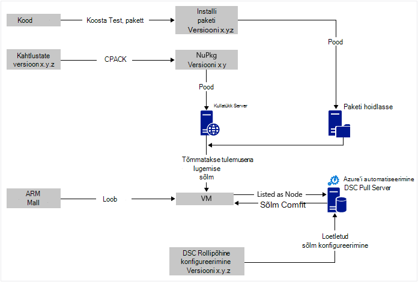
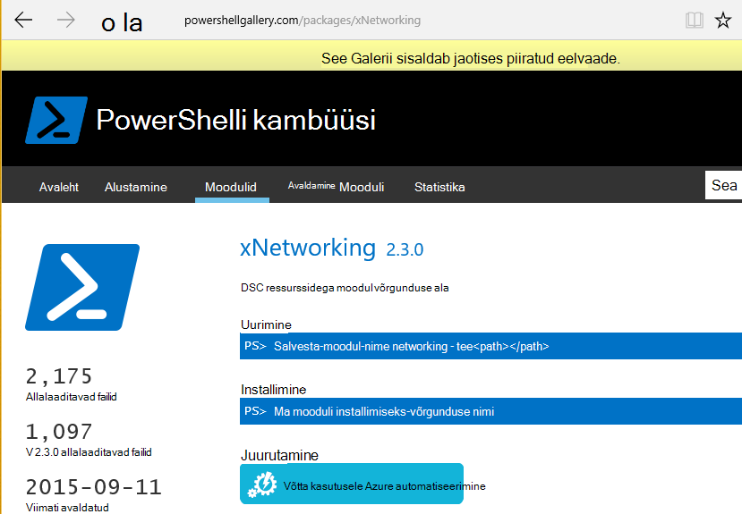

<properties
   pageTitle="Azure'i automaatika DSC pidev juurutus, nii et Chocolatey | Microsoft Azure'i"
   description="DevOps pidev juurutus Azure automatiseerimine DSC ja Chocolatey paketi halduri abil.  Näiteks täielik JSON ARM Mall ja PowerShelli allikas."
   services="automation"
   documentationCenter=""
   authors="sebastus"
   manager="stevenka"
   editor=""/>

<tags
   ms.service="automation"
   ms.devlang="na"
   ms.topic="article"
   ms.tgt_pltfrm="vm-windows"
   ms.workload="na"
   ms.date="08/08/2016"
   ms.author="golive"/>

# Kasutus näide: Pidev juurutamine Virtuaalmasinates automatiseerimise DSC ja Chocolatey abil

DevOps maailmas on palju tööriistu abistamine erinevate punktide pidev integreerimise teel.  Azure'i automaatika soovitud riik konfiguratsioon (DSC) on Tere tulemast uus täiendus DevOps meeskondadel rakendada soovitud suvandid.  Selles artiklis tutvustatakse Windowsi arvuti sätte pidev juurutamise ülespoole (CD).  Saate laiendada hõlpsalt lisada nii palju Windowsi arvutisse vastavalt vajadusele roll (veebisait, näiteks) ja sealt ka täiendavad rollidele meetod.

## Kõrge

On üsna natuke siin toimub, kuid õnneks saab jagada kaks peamist protsessidest. 

  - Koodi kirjutamine ja katsetamine seda, seejärel loomise ja avaldamise install pakette süsteemi põhi- ja vaheversioonid versioonide jaoks. 
  - Loomise ja haldamise VMs, mis installitakse ja pakette koodi käivitada.  

Kui mõlemad need protsessid core on kohas, on lühike samm töötab mis tahes kindla VM uus versioon on loodud ja juurutatud paketi automaatselt värskendada.

## Komponendi ülevaade

Paketi haldurid nagu [apt toomine](https://en.wikipedia.org/wiki/Advanced_Packaging_Tool) on päris tuntud Linux maailmas, kuid mitte nii palju Windows geograafiline asukoht.  [Chocolatey](https://chocolatey.org/) on sellist ja Scott Hanselman [ajaveebi](http://www.hanselman.com/blog/IsTheWindowsUserReadyForAptget.aspx) teema on hea sissejuhatav.  Lühidalt, Chocolatey võimaldab teil Windows süsteemi käsurea kaudu keskses hoidlas pakettide pakettide installimiseks.  Saate luua ja hallata oma hoidla ja Chocolatey saate installida pakettide hoidlate määrate suvalist arvu.

Soovitud oleku konfiguratsioon (DSC) ([Ülevaade](https://technet.microsoft.com/library/dn249912.aspx)) on PowerShelli tööriista, mis võimaldab teil konfiguratsioon, mida soovite masina deklareerida.  Näiteks saate öelda, "Soovin Chocolatey installitud, soovin, et IIS-i installitud, soovin port 80 on avatud, soovin installitud veebisaiti versioon 1.0.0."  DSC kohaliku Configuration Manager (LCM) rakendab selle konfiguratsiooni. DSC tõmmata Server hoiab teie masinad konfiguratsiooni hoidla. LCM igas arvutis, kontrollib perioodiliselt, kui selle konfiguratsioon vastab salvestatud konfiguratsiooni kuvamiseks. Selle saate olekust või üritavad tuua masina tagasi joondus salvestatud konfiguratsioon. Saate redigeerida põhjustada arvuti või kogumi masinad satuvad joondus muudetud konfiguratsioon pull serveris talletatud konfiguratsiooni.

Azure automatiseerimine on hallatav teenus Microsoft Azure, mis võimaldab teil abil tegevusraamatud, sõlmed, mandaat, ressursside ja varade nagu ajakavasid ja globaalsed muutujad mitmesuguste toimingute automatiseerimiseks. Azure'i automaatika DSC laiendab selle automatiseerimise võimalus kaasata PowerShelli DSC tööriistad.  Siin on hea [Ülevaade](automation-dsc-overview.md).

DSC ressursi on mooduli kood, mis sisaldab teatud võimalusi, nagu võrgunduse Active Directory või SQL Serveri haldamine.  DSC Chocolatey ressursi oskab juurdepääs Nugeti Server (muu hulgas), pakettide allalaadimine, installimine pakettide jne.  [PowerShelli Galerii](http://www.powershellgallery.com/packages?q=dsc+resources&prerelease=&sortOrder=package-title)on palju DSC ressursse.  Need moodulid installitud oma Azure automatiseerimine DSC tõmmata server (te) nii, et nad saavad kasutada oma konfiguratsioone.

ARM Mallid deklaratiivseid võimalda luua oma taristu – näiteks võrkude, alamvõrku, võrgu turvalisus ja marsruutimine, laadimine soolise, NICs, VMs jne.  Siit leiate [artiklist](../resource-manager-deployment-model.md) , mis võrdleb ARM juurutamise mudeli (deklaratiivseid) koos Azure Teenusehaldus (ASM või klassikaline) juurutamise mudeli (nõue).  Ja muu [artiklis](../virtual-machines/virtual-machines-windows-compare-deployment-models.md) core ressursi pakkujad, Arvuta, salvestamise ja võrgu kohta.

Üks klahv funktsioon ARM malli on selle võimalus installida VM laiend VM on ettevalmistamist.  VM laiend on teatud võimalused, nt kohandatud skripti, viirusetõrje tarkvara installimine või skripti DSC konfigureerimine.  On palju muud tüüpi VM laiendid.

## Kiirülevaate reisi ümber skeem

Alates ülaosas, peaksite kirjutama oma kood koostamine ja testimine ja seejärel luua installipaketi lõppkasutaja.  Chocolatey saate teha mitmesuguseid install pakette, nt MSI MSU, ZIP.  Ja teil on täielik power PowerShelli tegelik installimise teha, kui Chocolatey's kohalikke võimaluste ei tundu hästi, kuni see.  Sisestage paketi kuskil kättesaadav – paketi hoidla.  Kasutus näites kasutatakse Azure'i bloobimälu salvestusruumi konto avaliku kausta, kuid see võib olla suvalist kohta.  Chocolatey töötab algupäraselt Nugeti serverid ja mõne muu paketi metaandmete haldamine.  [Selles artiklis](https://github.com/chocolatey/choco/wiki/How-To-Host-Feed) kirjeldatakse soovitud suvandid.  Kasutus näites Nugeti.  Mõne Nuspec on teie pakettide metaandmeid.  Funktsiooni Nuspec on NuPkg's "kompileeritud" ja Nugeti serveris talletatud.  Kui teie konfiguratsiooni taotleb paketi nimi ja viidete Nugeti server, Chocolatey DSC ressursi (nüüd klõpsake VM) haarab paketi ja installib see teie eest.  Soovi korral võite mõne kindla versiooni.

Klõpsake pildi alumises vasakpoolses on Azure ressursi Manager (ARM) mall.  Selles näites kasutus VM laiend registrite VM Azure automatiseerimine DSC Pull serveriga (ehk teisisõnu öeldes pull server) sõlm nimega.  Konfiguratsiooni talletatakse pull serveris.  Tegelikult, see on salvestatud kaks korda: üks kord lihttekstina ning koostatakse RM-failina (neile, kes selliseid asju kohta teadma.)  Portaalis on selle RM "sõlm konfiguratsioon" (erinevalt lihtsalt "Konfiguratsioon").  See on artefakt, mis on seotud sõlm nii sõlme teate selle konfiguratsioon.  Allpool näitab, kuidas määrata sõlm konfiguratsiooni sõlme.

Arvatavasti te teete juba natuke ülemises või kõige selle.  Funktsiooni nuspec loomise, koostamise ja panete Nugeti server on väike asi.  Ja haldate VMs.  Võtaks järgmiseks pidev juurutusega nõuab loomisel pull server (üks kord), registreerimisel oma sõlmed seda (üks kord), luua ja talletamise konfiguratsiooni seal (esialgu).  Paketid on uuendatud ja juurutatud hoidla, siis värskendamine konfigureerimine ja sõlm konfiguratsiooni pull server (korrata vastavalt vajadusele).

Kui käivitate pole on ARM malliga, mis on ka OK.  On aitab teil registreerida oma VMs pull serveris ja kõik ülejäänud PowerShelli cmdlet-käsud. Lisateabe saamiseks lugege artiklit: [Azure automatiseerimine DSC haldamine masinad aitavad](automation-dsc-onboarding.md)

## Samm 1: Pull serveri ja automatiseerimise konto häälestamise

Autenditud (lisa AzureRmAccount) PowerShelli käsurida: (võib kuluda mõni minut ajal pull server on häälestatud)

    New-AzureRmResourceGroup –Name MY-AUTOMATION-RG –Location MY-RG-LOCATION-IN-QUOTES
    New-AzureRmAutomationAccount –ResourceGroupName MY-AUTOMATION-RG –Location MY-RG-LOCATION-IN-QUOTES –Name MY-AUTOMATION-ACCOUNT 

Saate panna ühte järgmistes regioonides (ehk asukoht) automatiseerimine kontole: Ida-USA 2, Lõuna keskse meile, meile gov – Virginia, Lääne Euroopa, Kagu-Aasia, Jaapan Ida, keskse India ja Austraalia kodutee.

## Samm 2: VM laiend telje ARM malli

VM registreerimise (kasutades PowerShelli DSC VM laiend) selle [Azure'i Kiirjuhend malli](https://github.com/Azure/azure-quickstart-templates/tree/master/dsc-extension-azure-automation-pullserver)esitatud üksikasjad.  Selles etapis tuleb registreerib oma uue VM pull serveriga DSC sõlmed loendis.  Osa selle registreerimise on, mis määrab sõlm konfiguratsiooni peaks rakenduma sõlme.  Selle konfiguratsiooni sõlm pole veel olemas pull server, nii et see on OK, mis on samm 4, kui seda tehakse esimest korda.  Kuid siin toiminguga 2 peate otsustanud sõlme nimi ja konfiguratsiooni nimi.  Selles näites kasutus sõlme on 'isvbox' ja konfiguratsioon on "ISVBoxConfig".  Nii, et sõlm konfiguratsiooni nimi (kui soovite määrata DeploymentTemplate.json) on "ISVBoxConfig.isvbox".  

## Samm 3: Lisamine ressursid DSC pull server

PowerShelli Galerii mõõteseadmetega DSC ressursid installida Azure automatiseerimine kontole.  Liikuge ressurss ja klõpsake nupu "Juurutada Azure automatiseerimine".

Azure portaali võeti hiljuti kasutusele mõne muu tehnika võimaldab tõmmata lisavõimaluste või olemasoleva moodulid värskendada. Klõpsake automatiseerimise konto ressursi, paani varad ja lõpuks moodulid paani kaudu.  Sirvi Galerii ikoon võimaldab teil loendi kuvamiseks moodulid galeriis, süvitsiminek üksikasjad ja lõpuks automatiseerimise kontole importimiseks. See on suurepärane viis oma moodulid aeg-ajalt ajakohasena hoidmine. Ja funktsiooni import kontrollib sõltuvused koos muude moodulid tagamaks, et midagi muutub sünkroonitud.

Või käsitsi lähenemine on.  Kausta struktuuri integreerimine PowerShelli mooduli Windows arvutis on pisut erinev Azure'i automaatika kausta struktuuri.  Selleks on vaja veidi tutistamine oma osa.  Kuid see ei ole raske ja seda ainult üks kord ressursi kohta (kui te ei soovi edaspidi versioonile.)  Loome PowerShelli integreerimine moodulid kohta lisateabe saamiseks lugege artiklit: [Loome integreerimine moodulid Azure automatiseerimine](https://azure.microsoft.com/blog/authoring-integration-modules-for-azure-automation/)

-   Installige moodulit, et peate oma töökoha järgmiselt:
    -   Installige [Windows Management Frameworki, v5](http://aka.ms/wmf5latest) (Windows 10 jaoks pole vaja)
    -   `Install-Module –Name MODULE-NAME`< – haarab galeriist PowerShelli mooduli 
-   Kopeerige mooduli kausta `c:\Program Files\WindowsPowerShell\Modules\MODULE-NAME` kausta temp 
-   Peamised kaustast kustutada näidiseid ja dokumentatsioon 
-   ZIP peamine kausta, ZIP-fail täpselt sama nimega kaust nimetamine 
-   Pannakse kättesaadav HTTP asukohta, nt salvestusruumi konto Azure bloobimäluga ZIP-fail.
-   Käivitage see PowerShelli:

        New-AzureRmAutomationModule `
            -ResourceGroupName MY-AUTOMATION-RG -AutomationAccountName MY-AUTOMATION-ACCOUNT `
            -Name MODULE-NAME –ContentLink "https://STORAGE-URI/CONTAINERNAME/MODULE-NAME.zip"
        

Kaasatud näide teeb järgmist cChoco ja xNetworking. Vaata [märkmete](#notes) jaoks cChoco teisiti käsitsemiseks.

## Samm 4: Lisamine sõlm konfiguratsiooni pull server

Miski eriline konfiguratsioonist importimine pull serveri ja kompileerida esimest korda.  Kõigi järgnevate impordi/koostab sama konfiguratsiooni välja täpselt sama.  Iga kord, kui värskendate oma paketi ja lükake see tootmisele on vaja teha selles etapis tuleb tagatud konfiguratsioonifail on õige – sh teie paketi uue versiooni.  Siin on Otsingukonfiguratsiooni failis ja PowerShelli:

ISVBoxConfig.ps1:

    Configuration ISVBoxConfig 
    { 
        Import-DscResource -ModuleName cChoco 
        Import-DscResource -ModuleName xNetworking
    
        Node "isvbox" {   
    
            cChocoInstaller installChoco 
            { 
                InstallDir = "C:\choco" 
            }
    
            WindowsFeature installIIS 
            { 
                Ensure="Present" 
                Name="Web-Server" 
            }
    
            xFirewall WebFirewallRule 
            { 
                Direction = "Inbound" 
                Name = "Web-Server-TCP-In" 
                DisplayName = "Web Server (TCP-In)" 
                Description = "IIS allow incoming web site traffic." 
                DisplayGroup = "IIS Incoming Traffic" 
                State = "Enabled" 
                Access = "Allow" 
                Protocol = "TCP" 
                LocalPort = "80" 
                Ensure = "Present" 
            }
    
            cChocoPackageInstaller trivialWeb 
            {            
                Name = "trivialweb" 
                Version = "1.0.0" 
                Source = “MY-NUGET-V2-SERVER-ADDRESS” 
                DependsOn = "[cChocoInstaller]installChoco", 
                "[WindowsFeature]installIIS" 
            } 
        }    
    }

Uus-ConfigurationScript.ps1:

    Import-AzureRmAutomationDscConfiguration ` 
        -ResourceGroupName MY-AUTOMATION-RG –AutomationAccountName MY-AUTOMATION-ACCOUNT ` 
        -SourcePath C:\temp\AzureAutomationDsc\ISVBoxConfig.ps1 ` 
        -Published –Force
    
    $jobData = Start-AzureRmAutomationDscCompilationJob ` 
        -ResourceGroupName MY-AUTOMATION-RG –AutomationAccountName MY-AUTOMATION-ACCOUNT ` 
        -ConfigurationName ISVBoxConfig 
    
    $compilationJobId = $jobData.Id
    
    Get-AzureRmAutomationDscCompilationJob ` 
        -ResourceGroupName MY-AUTOMATION-RG –AutomationAccountName MY-AUTOMATION-ACCOUNT ` 
        -Id $compilationJobId

Neid juhiseid tulemuseks uue konfiguratsiooni sõlm nimega "ISVBoxConfig.isvbox" pull serveri asetatakse.  Sõlm konfiguratsiooni nimi on loodud nimega "configurationName.nodeName".

## Juhis 5: Loomise ja paketi metaandmete haldamine

Iga paketi paketi hoidlasse panna, tuleb teil nuspec, mis kirjeldab seda.  Selle nuspec tuleb koostada ja oma Nugeti serveris talletatud. Selle protsessi on kirjeldatud [allpool](http://docs.nuget.org/create/creating-and-publishing-a-package).  Saate kasutada MyGet.org Nugeti server.  Need müüa see teenus, kuid on starter SKU-ga, mis on tasuta.  NuGet.org leiate juhiseid oma isiklike pakette oma Nugeti serveri installimise kohta.

## Samm 6: See kõik koos sidumine

Iga kord versiooni edastab kV ja on kinnitatud juurutuse pakett on loodud, nuspec ja nupkg värskendatud ja Nugeti serveris juurutatud.  Lisaks tuleb värskendada konfiguratsiooni (samm 4 ülaltoodud), et nõus uue versiooni numbrit.  See tuleb saata pull serverisse ja koostada.  Klõpsake sellega see on kuni selle konfiguratsiooni tõmmata värskenduse ja selle installida sõltuvad VMs.  Kõik värskendused on lihtne - või kaks PowerShelli lihtsalt rida.  Visual Studio meeskonnatöö teenuste puhul mõned neist kokku Koosta toimingud, mis võib olla ühendatud ehitada.  Selles [artiklis](https://www.visualstudio.com/en-us/docs/alm-devops-feature-index#continuous-delivery) on toodud rohkem üksikasju.  See [GitHub repo](https://github.com/Microsoft/vso-agent-tasks) üksikasjad saadaval Koosta erinevaid toiminguid.

## Märkmete

Selles näites kasutus algab VM Windows Server 2012 R2 pildil oleva üldise Azure galeriist.  Saate alustada mis tahes salvestatud pilt ja seejärel kohandada efektisuvandite seal DSC konfiguratsioon.  Muuta konfiguratsiooni, mis on küpsetatud pilt on palju raskem kui dünaamiliselt värskendamine DSC kasutades.

Teil pole selle meetodi abil oma VMs mõni ARM Mall ja VM laiend abil.  Ja teie VMs ei pea olema Azure all CD-le haldus.  Mida on vaja läheb Chocolatey olema installitud ja funktsiooni LCM VM nii, et see teab, kus tõmbe server on konfigureeritud.  

Muidugi paketi VM, mis on valmistamisel värskendamisel peate tegema selle VM pööre välja, kui värskendus on installitud.  Kuidas see erinev.  Näiteks taga mõnda Azure'i laadi koormusetasakaalustusteenuse VM, kus saate lisada mõne kohandatud Probe.  VM värskendamisel on tagasi 400 juures lõpp-punkti.  Vajalikud põhjustada selle muudatuse näpistama võivad olla sees konfiguratsioonist, saate selle näpistama aktiveerige see uuesti 200 esitus, kui värskendamine on lõpule viidud.

Selles näites kasutus täielik allikas on [selle Visual Studio projekti](https://github.com/sebastus/ARM/tree/master/CDIaaSVM) github.

##Seotud artiklid##

- [Azure automatiseerimine DSC ülevaade] (automatiseerimine-dsc-overview.md)
- [Azure automatiseerimine DSC cmdlet-käsud] (https://msdn.microsoft.com/library/mt244122.aspx)
- [Azure automatiseerimine DSC haldamine masinad aitavad] (automatiseerimine-dsc-onboarding.md)
