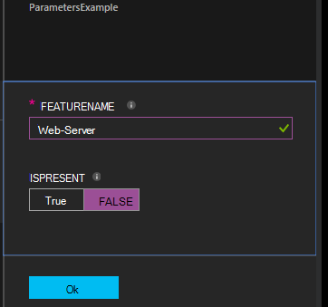

<properties 
   pageTitle="Koostamise konfiguratsioone rakenduses Azure automatiseerimine DSC | Microsoft Azure'i" 
   description="Ülevaade soovitud oleku konfiguratsioon (DSC) konfiguratsioone koostada kaks võimalust: Azure'i portaalis ja Windows PowerShelli abil. " 
   services="automation" 
   documentationCenter="na" 
   authors="coreyp-at-msft" 
   manager="stevenka" 
   editor="tysonn"/>

<tags
   ms.service="automation"
   ms.devlang="na"
   ms.topic="article"
   ms.tgt_pltfrm="powershell"
   ms.workload="na" 
   ms.date="01/25/2016"
   ms.author="coreyp"/>
   
#Koostamise konfiguratsioone Azure automatiseerimine DSC rakenduses#

Te saate koostada soovitud oleku konfiguratsioon (DSC) konfiguratsioone Azure automatiseerimine kahel viisil: Azure'i portaalis ja Windows PowerShelli abil. Järgmine tabel aitab teil otsustada, millist meetodit iga tunnuste kasutamine: 

###Azure'i eelvaade portaal###
- Lihtsaim viis interaktiivne kasutajaliides
- Lihtne parameetrite väärtused, et
- Hõlpsalt jälgida töö olek
- Accessi autenditud Azure sisselogimine

###Windows PowerShelli###
- Käsureal Windows PowerShelli cmdlet-käskude abil helistamine
- Saab lisada mitu juhiseid automaatne lahendus
- Sisestage lihtsaid ja keerukate parameetrite väärtused
- Töö oleku jälgimine
- Kliendi nõutav PowerShelli cmdlet-käsud
- Liigu ConfigurationData
- Kompileerida kuvatakse mandaadi kasutamine

Kui olete otsustanud koostamise meetodi, võite järgida vastav järgmisi variante alustamiseks koostamisel.

##DSC konfiguratsiooni Azure'i portaalis koostamisel##

1.  Klõpsake konto automatiseerimise **konfiguratsioone**.
2.  Klõpsake selle tera avamiseks konfiguratsiooni.
3.  Klõpsake **kompileerida**.
4.  Kui konfiguratsiooni parameetreid pole, palutakse teil kinnitada, kas soovite kompileerida. Kui konfiguratsiooni parameetrite, avatakse **Kompileerida konfiguratsiooni** tera nii, et saate sisestada parameetrite väärtused. Jaotisest <a href="#basic-parameters">**Põhilised parameetrid**</a> allpool lähemalt parameetrite abil.
5.  **Kompileerimine töö** tera avatakse nii, et saate jälgida koostamine töö oleku ja see põhjustada paigutada Azure automatiseerimine DSC tõmmata serveris sõlm konfiguratsioone (RM konfiguratsiooni dokumendid).

##Koostamise DSC konfigureerimine Windows PowerShelli abil##

Saate kasutada [`Start-AzureRmAutomationDscCompilationJob`](https://msdn.microsoft.com/library/mt244118.aspx) koostamise Windows PowerShelliga alustamiseks. Järgmine proovi kood käivitatakse DSC konfiguratsiooni nimetatakse **SampleConfig**koostamine.

    Start-AzureRmAutomationDscCompilationJob -ResourceGroupName "MyResourceGroup" -AutomationAccountName "MyAutomationAccount" -ConfigurationName "SampleConfig" 
 
`Start-AzureRmAutomationDscCompilationJob`Tagastab koostamine töö objekti, mille abil saate jälgida olekut. Seejärel saate seda koostamine töö objekti [`Get-AzureRmAutomationDscCompilationJob`](https://msdn.microsoft.com/library/mt244120.aspx) määratlemiseks koostamine töö, oleku ja [`Get-AzureRmAutomationDscCompilationJobOutput`](https://msdn.microsoft.com/library/mt244103.aspx) vaadata oma voole (väljund). Järgmine proovi kood käivitab koostamine **SampleConfig** konfiguratsiooni, ootab, kuni see on lõpule viidud ja kuvab selle voogu.
    
    $CompilationJob = Start-AzureRmAutomationDscCompilationJob -ResourceGroupName "MyResourceGroup" -AutomationAccountName "MyAutomationAccount" -ConfigurationName "SampleConfig"
    
    while($CompilationJob.EndTime –eq $null -and $CompilationJob.Exception –eq $null)           
    {
        $CompilationJob = $CompilationJob | Get-AzureRmAutomationDscCompilationJob
        Start-Sleep -Seconds 3
    }
    
    $CompilationJob | Get-AzureRmAutomationDscCompilationJobOutput –Stream Any 

##Põhilised parameetrid##

Parameetri deklareerimise DSC konfiguratsiooni, sh parameeter tüübid ja atribuudid, töötab sama Azure'i automaatika tegevusraamatud. Leiate [Azure'i automaatika lisamine käitusjuhendi alates](automation-starting-a-runbook.md) käitusjuhendi parameetrite kohta.

Järgmises näites kasutatakse kahe parameetrite nimega **FeatureName** ja **IsPresent**, määrata atribuute **ParametersExample.sample** sõlm konfiguratsiooni loodud koostamise ajal.

    Configuration ParametersExample
    {
        param(
            [Parameter(Mandatory=$true)]
    
            [string] $FeatureName,
    
            [Parameter(Mandatory=$true)]
            [boolean] $IsPresent
        )
    
        $EnsureString = "Present"
        if($IsPresent -eq $false)
        {
            $EnsureString = "Absent"
        }
    
        Node "sample"
        {
            WindowsFeature ($FeatureName + "Feature")
            {
                Ensure = $EnsureString
                Name = $FeatureName
            }
        }
    }

Saate koostada DSC konfiguratsioone kasutavate põhilised parameetrid Azure automatiseerimine DSC portaalis või Azure PowerShelli abil:

###Portaal###

Portaalis saate sisestada parameetrite väärtused pärast nupu **kompileerida**.

###PowerShelli###

PowerShelli nõuab parameetrite [Hashtable talletatakse](http://technet.microsoft.com/library/hh847780.aspx) , kus võti vastab parameetri nimi ja väärtus võrdub parameetri väärtuse.

    $Parameters = @{
            "FeatureName" = "Web-Server"
            "IsPresent" = $False
    }
    
    
    Start-AzureRmAutomationDscCompilationJob -ResourceGroupName "MyResourceGroup" -AutomationAccountName "MyAutomationAccount" -ConfigurationName "ParametersExample" -Parameters $Parameters 
    

Läbides PSCredentials nimega parameetrite kohta leiate teavet teemast <a href="#credential-assets">**Mandaati varad**</a> .

##ConfigurationData##

**ConfigurationData** võimaldab eraldi strukturaalset konfiguratsiooni, mis tahes keskkonnas teatud konfiguratsiooni PowerShelli DSC kasutamise ajal. Vaadake lisateavet **ConfigurationData** ["Mida" eraldab "Kui" PowerShelli DSC sisse](http://blogs.msdn.com/b/powershell/archive/2014/01/09/continuous-deployment-using-dsc-with-minimal-change.aspx) .

>[AZURE.NOTE] Saate **ConfigurationData** Azure automatiseerimine DSC Azure PowerShelli kaudu, kuid mitte Azure portaali koostamisel.

Järgmine näide DSC konfiguratsioon kasutab **ConfigurationData** **$ConfigurationData** ning **$AllNodes** märksõnade kaudu. Peate [ **xWebAdministration** mooduli](https://www.powershellgallery.com/packages/xWebAdministration/) selle näite puhul.

     Configuration ConfigurationDataSample
     {
        Import-DscResource -ModuleName xWebAdministration -Name MSFT_xWebsite
    
        Write-Verbose $ConfigurationData.NonNodeData.SomeMessage 
    
        Node $AllNodes.Where{$_.Role -eq "WebServer"}.NodeName
        {
            xWebsite Site
            {
                Name = $Node.SiteName
                PhysicalPath = $Node.SiteContents
                Ensure   = "Present"
            }
        }
    }

DSC konfiguratsiooni kohal PowerShelli abil saate kompileerida. Selle all PowerShelli liidab kaks sõlm konfiguratsioone Azure'i automaatika DSC tõmmata Server: **ConfigurationDataSample.MyVM1** ja **ConfigurationDataSample.MyVM3**:

    $ConfigData = @{
        AllNodes = @(
            @{
                NodeName = "MyVM1"
                Role = "WebServer"
            },
            @{
                NodeName = "MyVM2"
                Role = "SQLServer"
            },
            @{
                NodeName = "MyVM3"
                Role = "WebServer"
    
            }
    
        )
    
        NonNodeData = @{
            SomeMessage = "I love Azure Automation DSC!"
    
        }
    
    } 
    
    Start-AzureRmAutomationDscCompilationJob -ResourceGroupName "MyResourceGroup" -AutomationAccountName "MyAutomationAccount" -ConfigurationName "ConfigurationDataSample" -ConfigurationData $ConfigData

##Varad##

Varade viited on sama Azure automatiseerimine DSC konfiguratsioone ja tegevusraamatud. Vaadake lisateavet järgmist:

- [Serdid](automation-certificates.md)
- [Ühendused](automation-connections.md)
- [Identimisteave](automation-credentials.md)
- [Muutujad](automation-variables.md)

###Mandaadi varad###
Ajal DSC konfiguratsioone Azure'i automaatika viitamiseks mandaati varad abil **Get-AzureRmAutomationCredential**, mandaati varad ka võib edastada kaudu parameetrid, kui soovitud. Kui konfiguratsiooni kulub parameetri **PSCredential** tüüp, siis peate selle parameetri väärtuse, mitte PSCredential objekti stringi nime Azure automatiseerimine mandaati vara edasi. Varjatult Azure automatiseerimine mandaati varade nimega tuua ja konfiguratsiooni edasi.

Hoides identimisteabe turvalist sõlm konfiguratsiooni (RM konfigureerimine dokumentide) nõuab sõlm konfiguratsioonifailis RM identimisteabe krüptimise. Azure automatiseerimine võtab sammu võrra edasi ja krüptib kogu RM faili. Siiski praegu rääkige PowerShelli DSC sobib mandaadi abil saab väljundit lihttekstina ajal sõlm konfiguratsioon RM genereerimine, kuna PowerShelli DSC ei tea, et Azure automatiseerimine on krüptimise kogu RM faili pärast selle genereerimine koostamine töö kaudu.

Näete PowerShelli DSC, et see sobib mandaati, et olla väljundit loodud sõlm konfiguratsiooni abil <a href="#configurationdata">**ConfigurationData**</a>MOFs lihttekstina. Peaksite läbima `PSDscAllowPlainTextPassword = $true` kaudu **ConfigurationData** iga sõlm ploki nimi, mis kuvatakse DSC konfiguratsiooni ja kasutatakse mandaati.

Järgmises näites on kujutatud DSC konfiguratsiooni, mis automatiseerimise mandaati vara kasutab.

    Configuration CredentialSample
    {
       $Cred = Get-AzureRmAutomationCredential -Name "SomeCredentialAsset"
    
        Node $AllNodes.NodeName
        { 
            File ExampleFile
            { 
                SourcePath = "\\Server\share\path\file.ext" 
                DestinationPath = "C:\destinationPath" 
                Credential = $Cred 
            }
        }
    }

DSC konfiguratsiooni kohal PowerShelli abil saate kompileerida. Selle all PowerShelli liidab kaks sõlm konfiguratsioone Azure'i automaatika DSC tõmmata Server: **CredentialSample.MyVM1** ja **CredentialSample.MyVM2**.

    $ConfigData = @{
        AllNodes = @(
            @{
                NodeName = "*"
                PSDscAllowPlainTextPassword = $True
            },
            @{
                NodeName = "MyVM1"
            },
            @{
                NodeName = "MyVM2"
            }
        )
    }
    
    Start-AzureRmAutomationDscCompilationJob -ResourceGroupName "MyResourceGroup" -AutomationAccountName "MyAutomationAccount" -ConfigurationName "CredentialSample" -ConfigurationData $ConfigData
