<properties
   pageTitle="Alustamine: Azure'i automaatika DSC"
   description="Selgitus ja näited kõige põhitoimingud rakenduses Azure automatiseerimine soovitud oleku konfiguratsioon (DSC)"
   services="automation" 
   documentationCenter="na" 
   authors="eslesar" 
   manager="dongill" 
   editor="tysonn"/>

<tags
   ms.service="automation"
   ms.devlang="na"
   ms.topic="article"
   ms.tgt_pltfrm="powershell"
   ms.workload="na" 
   ms.date="06/06/2016"
   ms.author="magoedte;eslesar"/>
   

# <a name="getting-started-with-azure-automation-dsc"></a>Azure'i automaatika DSC töötamise alustamine

See teema selgitab, kuidas teha levinumaid toiminguid ja Azure automatiseerimine soovitud oleku konfiguratsioon (DSC), nt luua, importida, ja koostamise konfiguratsioone masinad aitavad hallata, ja aruannete. Ülevaate sellest, mis on Azure automatiseerimine DSC, vt [Azure automatiseerimine DSC ülevaade](automation-dsc-overview.md). DSC dokumendid, vaadake [Windows PowerShelli soovitud oleku konfiguratsioon ülevaade](https://msdn.microsoft.com/PowerShell/dsc/overview).

Selles teemas antakse samm-sammult juhendi abil Azure automatiseerimine DSC. Kui soovite valimi keskkond, mis on juba häälestatud ilma selles teemas kirjeldatud juhised, saate kasutada [järgmisi ARM Mall](https://github.com/azureautomation/automation-packs/tree/master/102-sample-automation-setup). Selle malli häälestab lõplikus Azure automatiseerimine DSC keskkonnas, sh Azure VM, mida haldab Azure automatiseerimine DSC.
 
## <a name="prerequisites"></a>Eeltingimused

Selles teemas näidetes lõpuleviimiseks on nõutav.

- Konto Azure automatiseerimine. Juhised konto Azure automatiseerimine käivitada nimega loomine, vt [Azure'i käivitada nagu konto](automation-sec-configure-azure-runas-account.md).
- Mõne Azure ressursihaldur VM (mitte klassikaline) töötab Windows Server 2008 R2 või uuem versioon. VM loomise juhised leiate teemast [esimese Windows virtual arvuti Azure portaali loomine](../virtual-machines/virtual-machines-windows-hero-tutorial.md)

## <a name="creating-a-dsc-configuration"></a>DSC konfiguratsiooni loomine

Loome lihtsa [DSC konfiguratsiooni](https://msdn.microsoft.com/powershell/dsc/configurations) , mis tagab olemasolu või puudub, **Web-Server** Windows funktsioon (IIS), olenevalt sellest, kuidas määrata sõlmed.

1. Käivitage Windows PowerShell ISE (või mis tahes tekstiredaktor).

2. Tippige järgmine tekst:

    ```powershell
    configuration TestConfig
    {
        Node WebServer
        {
            WindowsFeature IIS
            {
                Ensure               = 'Present'
                Name                 = 'Web-Server'
                IncludeAllSubFeature = $true

            }
        }

        Node NotWebServer
        {
            WindowsFeature IIS
            {
                Ensure               = 'Absent'
                Name                 = 'Web-Server'

            }
        }
        }
    ```
3. Salvestage fail nimega `TestConfig.ps1`.

Selle konfiguratsiooni kõned ühe ressursi iga sõlm blokeerimise [Windows ressurss](https://msdn.microsoft.com/powershell/dsc/windowsfeatureresource), mis tagab olemasolu või puudumine funktsiooni **Web-Server** .

## <a name="importing-a-configuration-into-azure-automation"></a>Konfiguratsiooni importimine Azure automatiseerimine

Seejärel Impordime konfiguratsiooni automatiseerimise kontole.

1. [Azure'i portaali](https://portal.azure.com)sisse logida.

2. Klõpsake menüü jaoturi **kõik ressursid** ja seejärel oma automatiseerimise konto nimi.

3. Enne **automatiseerimise kontot** , klõpsake **DSC konfiguratsioone**.

4. **DSC konfiguratsioone** enne, klõpsake nuppu **Lisa konfiguratsiooni**.

5. Enne **Importimise konfiguratsiooni** , liikuge sirvides soovitud `TestConfig.ps1` faili oma arvutist.
    
    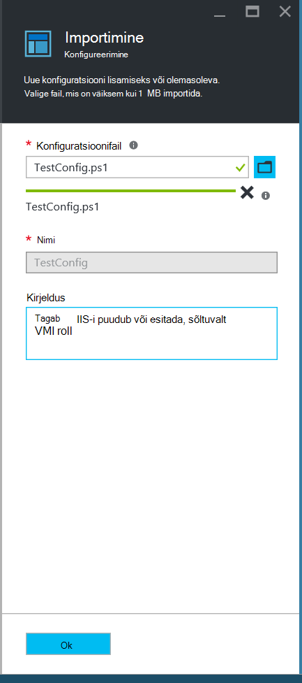
    

6. Klõpsake nuppu **OK**.

## <a name="viewing-a-configuration-in-azure-automation"></a>Azure'i automaatika konfiguratsiooni vaatamine

Kui olete importinud konfiguratsiooni, saate seda vaadata Azure'i portaalis.

1. [Azure'i portaali](https://portal.azure.com)sisse logida.

2. Klõpsake menüü jaoturi **kõik ressursid** ja seejärel oma automatiseerimise konto nimi.

3. Enne **automatiseerimise kontot** , klõpsake **DSC konfiguratsioone**

4. Enne **DSC konfiguratsioone** , klõpsake **TestConfig** (see on teie imporditud vastavalt eelmise jaotise konfiguratsiooni nimi).

5. Enne **TestConfig konfiguratsiooni** , klõpsake **Kuva konfiguratsiooni allikas**.

    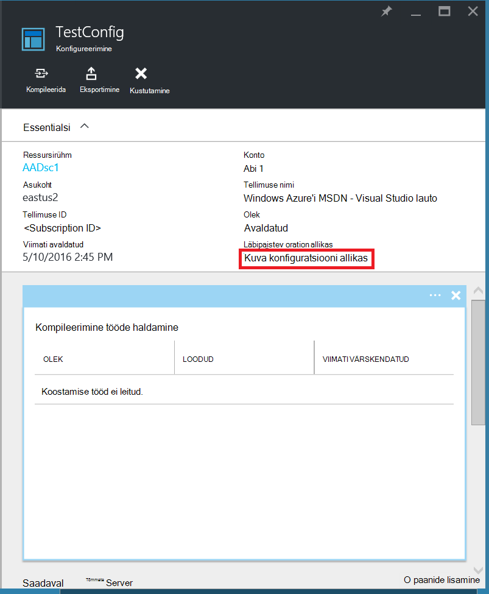
    
    **Andmeallika konfiguratsiooni TestConfig** blade parajasti konfiguratsiooni PowerShelli kood.
    
## <a name="compiling-a-configuration-in-azure-automation"></a>Azure'i automaatika konfiguratsiooni Kompileerimine

Enne sõlm saate rakendada soovitud riik, DSC konfiguratsiooni määratlemine riigi peab olema kompileeritud ühe või mitme sõlm konfiguratsioone (RM dokument), ja serveris automatiseerimise DSC tõmmata. Koostamise konfiguratsioone Azure automatiseerimine DSC sisse üksikasjalikuma kirjelduse leiate [koostamise konfiguratsioone Azure automatiseerimine DSC sisse](automation-dsc-compile.md). Konfiguratsioone koostamise kohta leiate lisateavet teemast [DSC konfiguratsioone](https://msdn.microsoft.com/PowerShell/DSC/configurations).

1. [Azure'i portaali](https://portal.azure.com)sisse logida.

2. Klõpsake menüü jaoturi **kõik ressursid** ja seejärel oma automatiseerimise konto nimi.

3. Enne **automatiseerimise kontot** , klõpsake **DSC konfiguratsioone**

4. Enne **DSC konfiguratsioone** , klõpsake **TestConfig** (varem imporditud konfiguratsiooni nimi).

5. Enne **TestConfig konfiguratsiooni** , klõpsake **kompileerida**ja seejärel nuppu **Jah**. Käivitub koostamine töö.
    
    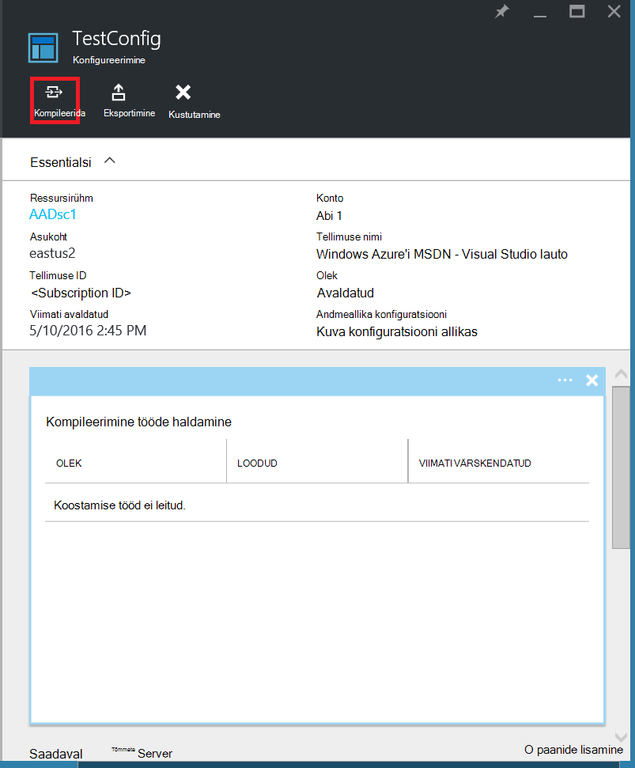
    
> [AZURE.NOTE] Kui teil kompileerida konfiguratsiooni Azure'i automaatika, selle juurutamine automaatselt loodud sõlm konfiguratsiooni MOFs pull server.

## <a name="viewing-a-compilation-job"></a>Töö koostamine vaatamine

Kui alustate koostamise, saate seda vaadata **koostamine töökohtade** paani **konfiguratsiooni** tera. Paani **koostamine tööde haldamine** kuvatakse praegu töötavate lõpetatud ja töö nurjus. Kompileerimine töö blade avamisel see näitab, et töö tõrgete ja hoiatuste ilmnes teavet, sisendparameetrite kasutatakse konfigureerimine ja koostamise logid.

1. [Azure'i portaali](https://portal.azure.com)sisse logida.

2. Klõpsake menüü jaoturi **kõik ressursid** ja seejärel oma automatiseerimise konto nimi.

3. Enne **automatiseerimise kontot** , klõpsake **DSC konfiguratsioone**.

4. Enne **DSC konfiguratsioone** , klõpsake **TestConfig** (varem imporditud konfiguratsiooni nimi).

5. Mis tahes töid loendis klõpsake **TestConfig konfiguratsiooni** tera **koostamine töökohtade** paani. **Kompileerimine töö** tera avaneb, siltidega koostamine töö käivitamise kuupäev.

    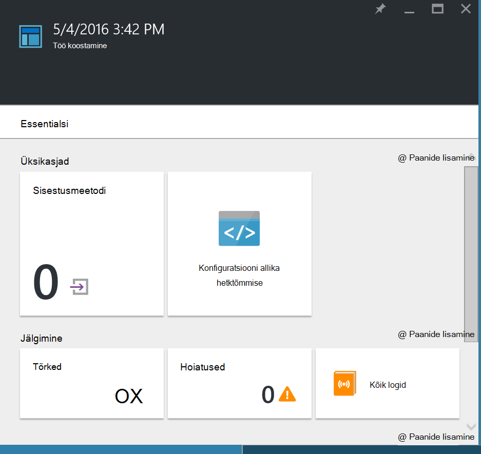
  
6. Mis tahes paani **Koostamine töö** tera töö üksikasjade kuvamiseks klõpsake nuppu.

## <a name="viewing-node-configurations"></a>Sõlm konfiguratsioone vaatamine

Eduka lõpetamise koostamine töö loob ühe või mitme sõlm konfiguratsioone. Sõlm konfiguratsioon on juurutatud pull serverisse ja valmis tõmmata ja rakendatud üks või mitu sõlmed RM dokumendi. Saate vaadata sõlm konfiguratsioone **DSC sõlm konfiguratsioone** tera konto automatiseerimine. Sõlm konfiguratsioon on *ConfigurationName*vormi nimi. *NodeName*.

1. [Azure'i portaali](https://portal.azure.com)sisse logida.

2. Klõpsake menüü jaoturi **kõik ressursid** ja seejärel oma automatiseerimise konto nimi.

3. Enne **automatiseerimise kontot** , klõpsake **DSC sõlm konfiguratsioone**.

    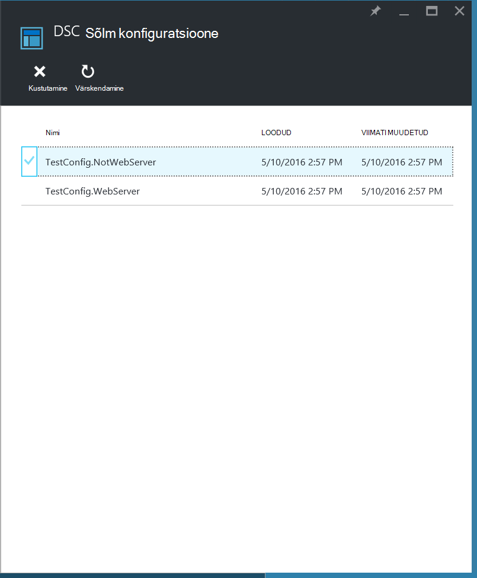
    
## <a name="onboarding-an-azure-vm-for-management-with-azure-automation-dsc"></a>Azure VM haldamiseks koos Azure automatiseerimine DSC kasutuselevõtt

Azure'i automaatika DSC abil saate hallata Azure VMs (klassikaline ja ressursihaldur), kohapealse VMs, Linux masinad, AWS VMs ja kohapealse füüsilise masinad. Selles teemas käsitleme pardal ainult Azure ressursihaldur VMs kohta. Lisateabe saamiseks kasutuselevõtt muud tüüpi masinad, vaadake teemat [Azure automatiseerimine DSC haldamine masinad aitavad](automation-dsc-onboarding.md).

### <a name="to-onboard-an-azure-resource-manager-vm-for-management-by-azure-automation-dsc"></a>Endal on Azure ressursihaldur VM jaoks Azure automatiseerimine DSC haldamine

1. [Azure'i portaali](https://portal.azure.com)sisse logida.

2. Klõpsake menüü jaoturi **kõik ressursid** ja seejärel oma automatiseerimise konto nimi.

3. Enne **automatiseerimise kontot** , klõpsake **DSC sõlmed**.

4. **DSC sõlmed** tera, nuppu **Lisa Azure VM**.

    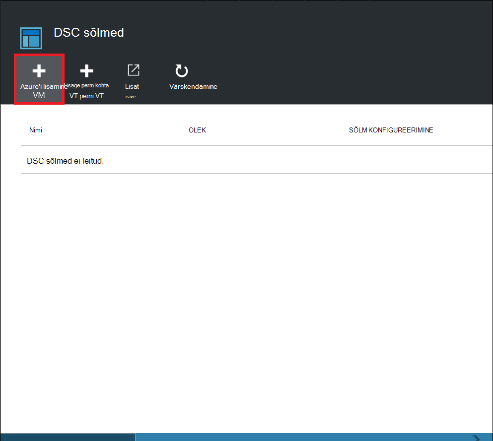

5. Klõpsake **Lisamine Azure VMs** tera, **Valige virtuaalmasinates pardal abil**.

6. **Valige VMs** tera, valige soovite pardal VM ja klõpsake nuppu **OK**.

    >[AZURE.IMPORTANT] See peab olema Azure ressursihaldur VM töötab Windows Server 2008 R2 või uuem versioon.
    
7. Klõpsake **Lisamine Azure VMs** labale **konfigureerimine andmetega**.

8. Sisestage **registreerimise** labale sõlm konfiguratsiooni, mida soovite rakendada VM **Sõlm konfiguratsiooni nimi** väljale nimi. See peab täpselt vastama sõlm konfiguratsioon automatiseerimise konto nimi. Mis nimi sel hetkel pole kohustuslik. Saate muuta pärast kasutuselevõtt sõlme konfiguratsioonis määratud sõlm.
**Taaskäivitage sõlm vajaduse korral**märkige ruut ja seejärel klõpsake nuppu **OK**.
    
    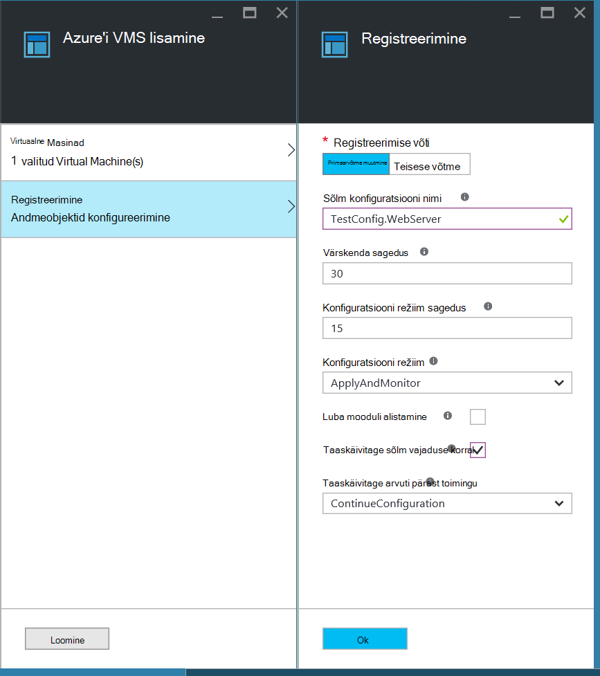
    
    Sõlm konfiguratsioonis määratud rakendatakse VM **Konfiguratsiooni sageduse**määratud intervalliga ja VM sõlm konfiguratsioonis määratud **Värskendamise sagedust**intervalliga otsib värskendusi. Need väärtused kasutamise kohta leiate lisateavet teemast [konfigureerimise kohalik Configuration Manager](https://msdn.microsoft.com/PowerShell/DSC/metaConfig).
    
9. **Lisage Azure VMs** tera, klõpsake nuppu **Loo**.

Azure'i hakkavad protsessi kasutuselevõtt VM. Kui see on lõpule jõudnud, VM ilmub **DSC sõlmed** tera automatiseerimise konto.

## <a name="viewing-the-list-of-dsc-nodes"></a>DSC sõlmed loendi vaatamine

Saate vaadata loendit kõik masinad, mis on onboarded haldus **DSC sõlmed** tera automatiseerimise konto jaoks.

1. [Azure'i portaali](https://portal.azure.com)sisse logida.

2. Klõpsake menüü jaoturi **kõik ressursid** ja seejärel oma automatiseerimise konto nimi.

3. Enne **automatiseerimise kontot** , klõpsake **DSC sõlmed**.

## <a name="viewing-reports-for-dsc-nodes"></a>DSC sõlmed aruannete kuvamine

Iga kord, kui Azure automatiseerimine DSC sooritab järjepidevuse kontroll hallatavate sõlme sõlme saadab olekuaruande tagasi pull serverisse. Enne selle sõlme saate vaadata neid aruandeid.

1. [Azure'i portaali](https://portal.azure.com)sisse logida.

2. Klõpsake menüü jaoturi **kõik ressursid** ja seejärel oma automatiseerimise konto nimi.

3. Enne **automatiseerimise kontot** , klõpsake **DSC sõlmed**.

4. Klõpsake paani **aruandeid** , mis tahes aruannete loend.

    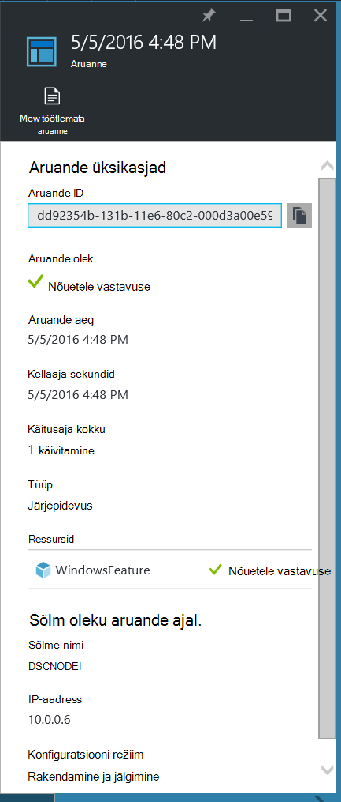

Enne üksikute aruande, näete vastava vormindusühtsuse kontroll olek järgmist teavet:

- Aruande olek – kas sõlme on "Vastavuses", "Failed" konfiguratsiooni või sõlme vastab "ei" (kui sõlme on **applyandmonitor** režiimis ja seade ei ole soovitud olek).
- Algusaja seadmine vormindusühtsuse kontroll.
- Kokku käitusaja vormindusühtsuse kontroll.
- Vormindusühtsuse kontrolli tüüp.
- Kõikide tõrgete, sh tõrkekoodi ja tõrketeadet ei kuvata. 
- DSC ressursse kasutada konfiguratsiooni ja iga ressursi (kas sõlme on selle ressursi jaoks soovitud olek) olekut – saate klõpsata iga ressursi saada täpsemat teavet selle ressursi jaoks.
- Nimi, IP-aadress ja sõlme režiimis konfigureerimine.

Võite klõpsata ka **vaate töötlemata aruande** kuvamiseks sõlme saadab server tegelik andmeid. Andmete kasutamise kohta leiate lisateavet teemast [DSC aruandeserveri kaudu](https://msdn.microsoft.com/powershell/dsc/reportserver).

See võib võtta aega, kui sõlm on onboarded enne, kui esimene aruanne on saadaval. Peate ootama kuni 30 minutit esimene aruanne pärast rongis sõlm.

## <a name="reassigning-a-node-to-a-different-node-configuration"></a>Ümbermääramist erinevate sõlm konfiguratsiooni sõlm

Saate määrata sõlm kasutada eri sõlm konfiguratsioon, kui teile algselt määratud.

1. [Azure'i portaali](https://portal.azure.com)sisse logida.

2. Klõpsake menüü jaoturi **kõik ressursid** ja seejärel oma automatiseerimise konto nimi.

3. Enne **automatiseerimise kontot** , klõpsake **DSC sõlmed**.

4. **DSC sõlmed** enne, klõpsake selle nime sõlme, mille soovite määrata.

5. Enne selle sõlme, klõpsake nuppu **Määra sõlm**.

    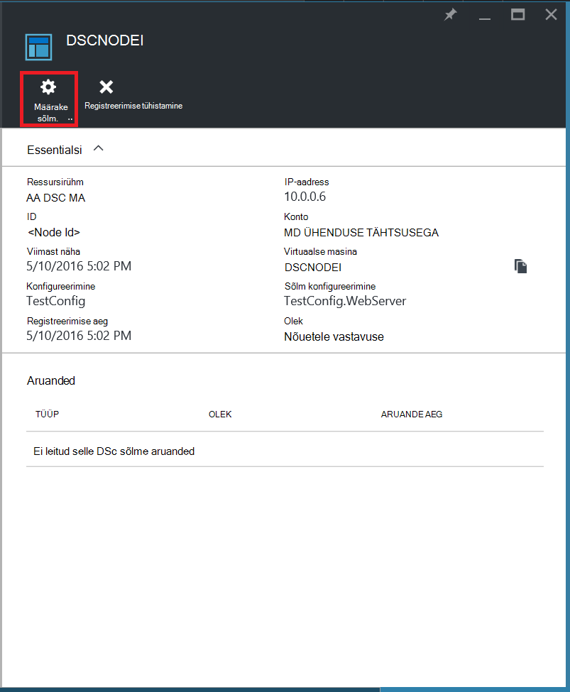

6. Enne **Määramine sõlm konfiguratsioon** , valige sõlm konfiguratsioon, millele soovite määrata sõlme ja seejärel klõpsake nuppu **OK**.

    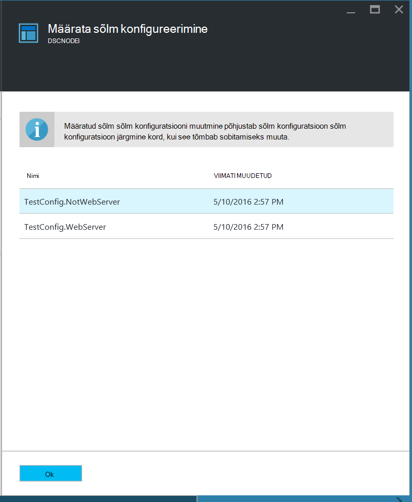
    
## <a name="unregistering-a-node"></a>Sõlm registreerimise tühistamine

Kui te ei soovi enam sõlm Azure automatiseerimine DSC juhtida, saate selle registreerimise tühistamine.

1. [Azure'i portaali](https://portal.azure.com)sisse logida.

2. Klõpsake menüü jaoturi **kõik ressursid** ja seejärel oma automatiseerimise konto nimi.

3. Enne **automatiseerimise kontot** , klõpsake **DSC sõlmed**.

4. **DSC sõlmed** enne, klõpsake selle nime sõlme, mida soovite tühistada.

5. Enne selle sõlme, klõpsake **registreerimise tühistamise**.

    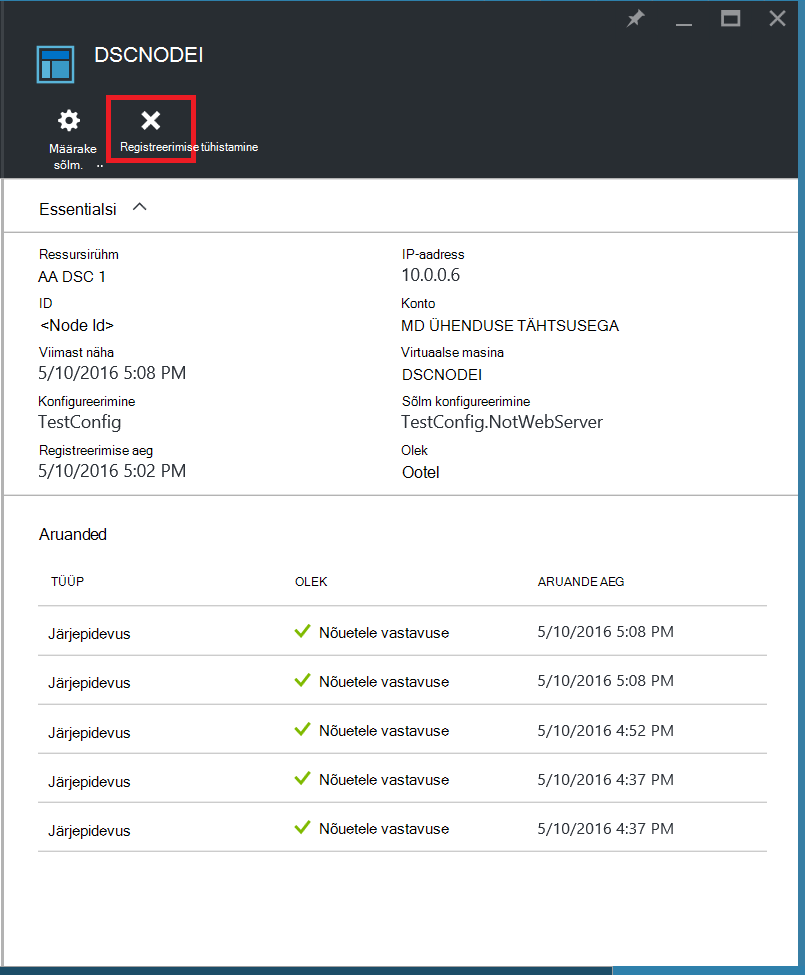

## <a name="related-articles"></a>Seotud artiklid
* [Azure'i automaatika DSC ülevaade](automation-dsc-overview.md)
* [Azure automatiseerimine DSC haldamine masinad aitavad](automation-dsc-onboarding.md)
* [Windows PowerShelli soovitud maakond konfiguratsiooni ülevaade](https://msdn.microsoft.com/powershell/dsc/overview)
* [Azure'i automaatika DSC cmdlet-käsud](https://msdn.microsoft.com/library/mt244122.aspx)
* [Azure'i automaatika DSC hinnad](https://azure.microsoft.com/pricing/details/automation/)

