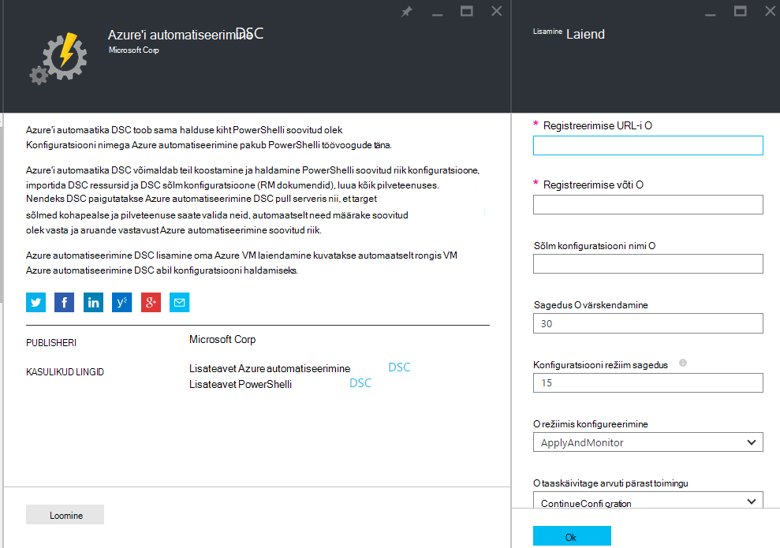

<properties 
   pageTitle="Kasutuselevõtt füüsilise- ja virtuaalse masinad Azure automatiseerimine DSC haldamine | Microsoft Azure'i" 
   description="Kuidas seadistada haldus – Azure automatiseerimine DSC seadmed" 
   services="automation" 
   documentationCenter="dev-center-name" 
   authors="coreyp-at-msft" 
   manager="stevenka" 
   editor="tysonn"/>

<tags
   ms.service="automation"
   ms.devlang="NA"
   ms.topic="article"
   ms.tgt_pltfrm="powershell"
   ms.workload="TBD" 
   ms.date="04/22/2016"
   ms.author="coreyp"/>

# Azure automatiseerimine DSC haldamine masinad aitavad

## Miks hallata Azure automatiseerimine DSC masinad?

[PowerShelli soovitud oleku konfiguratsioon](https://technet.microsoft.com/library/dn249912.aspx), nt Azure automatiseerimine soovitud oleku konfiguratsioon on lihtne, kuid võimas, konfiguratsiooni halduse teenuse DSC sõlmed (füüsilise ja virtuaalmasinates) mis tahes pilve või kohapealse andmekeskuses. See võimaldab skaleeritavus masinad tuhandete kiiresti ja kerge vaevaga kaudu keskses turvalises asukohas. Saate hõlpsasti pardal masinad, määramine neile deklaratiivseid konfiguratsioone ja aruannete kuvamine, kus on kuvatud iga masina vastavuse määratud soovitud olek. Azure'i automaatika DSC halduse kiht on DSC Azure automatiseerimine halduse kiht on PowerShelli skripti. Teisisõnu, Azure automatiseerimine aitab hallata PowerShelli skriptide samal viisil, samuti aitab teil hallata DSC konfiguratsioone. Azure'i automaatika DSC kasutamise eeliste kohta leiate lisateavet teemast [Azure automatiseerimine DSC ülevaade](automation-dsc-overview.md). 

Azure'i automaatika DSC saab kasutada mitmesuguseid masinad haldamine:

*    Azure'i virtuaalmasinates (klassikaline)
*    Azure'i virtuaalmasinates
*    Amazon Web Services (AWS) virtuaalmasinates
*    Füüsilise/virtuaalse Windowsi masinad asutusesiseselt, või pilveteenuses, v.a Azure/AWS
*    Füüsilise/virtuaalse Linux masinad asutusesiseselt, Azure või pilveteenuses, ei ole Azure

Lisaks, kui olete valmis arvuti konfiguratsioon haldama pilvest, Azure automatiseerimine DSC saate kasutada ka ainult aruande lõpp-punkti. See võimaldab teil määrata (push) soovitud konfiguratsiooni kaudu kohapealse DSC ja sõlm vastavust soovitud olek Azure'i automaatika rikkaliku aruandlusteenuste üksikasjade kuvamine.

Järgmistes jaotistes liigendada, kuidas saate rongis igat tüüpi masina Azure automatiseerimine DSC.

## Azure'i virtuaalmasinates (klassikaline)

Azure'i automaatika DSC, kus saate hõlpsasti pardal Azure'i virtuaalmasinates (klassikaline) konfiguratsiooni juhtimine kas Azure portaali või PowerShelli abil. Kaitstud, ja ilma vajaduseta remote VM sisse administraatorina, Azure'i VM soovitud riik konfiguratsiooni laiend registrite VM Azure automatiseerimine DSC. Kuna Azure'i VM soovitud riik konfiguratsiooni laiend käivitatakse asünkroonselt, tehke selle edenemist jälgida või tõrkeotsing on toodud [**tõrkeotsingu Azure virtuaalse masina kasutuselevõtt**](#troubleshooting-azure-virtual-machine-onboarding) allpool olevat jaotist.

### Azure'i portaal

[Azure'i portaal](http://portal.azure.com/), klõpsake nuppu **Sirvi** -> **virtuaalmasinates (klassikaline)**. Valige Windows VM, mida soovite pardal. Virtuaalse masina armatuurlaua tera, klõpsake nuppu **Kõik sätted** -> **laiendid** -> **lisamine** -> **Azure automatiseerimine DSC** -> **loomine**. Sisestage [PowerShelli DSC kohalik Configuration Manager väärtuste](https://msdn.microsoft.com/powershell/dsc/metaconfig4) määramiseks VM kaasuse kasutamine, automatiseerimise konto registreerimise võti ja registreerimise URL-i ja soovi korral sõlm konfigureerimine vajalik.

Registreerimise leidmiseks URL-i ja võti automaatika kontoga rongis masina, vt jaotist [**Secure registreerimise**](#secure-registration) .

### PowerShelli

    # log in to both Azure Service Management and Azure Resource Manager
    Add-AzureAccount
    Add-AzureRmAccount
    
    # fill in correct values for your VM/Automation account here
    $VMName = ""
    $ServiceName = ""
    $AutomationAccountName = ""
    $AutomationAccountResourceGroup = ""

    # fill in the name of a Node Configuration in Azure Automation DSC, for this VM to conform to
    $NodeConfigName = ""

    # get Azure Automation DSC registration info
    $Account = Get-AzureRmAutomationAccount -ResourceGroupName $AutomationAccountResourceGroup -Name $AutomationAccountName
    $RegistrationInfo = $Account | Get-AzureRmAutomationRegistrationInfo

    # use the DSC extension to onboard the VM for management with Azure Automation DSC
    $VM = Get-AzureVM -Name $VMName -ServiceName $ServiceName
    
    $PublicConfiguration = ConvertTo-Json -Depth 8 @{
      SasToken = ""
      ModulesUrl = "https://eus2oaasibizamarketprod1.blob.core.windows.net/automationdscpreview/RegistrationMetaConfigV2.zip"
      ConfigurationFunction = "RegistrationMetaConfigV2.ps1\RegistrationMetaConfigV2"

    # update these PowerShell DSC Local Configuration Manager defaults if they do not match your use case.
    # See https://technet.microsoft.com/library/dn249922.aspx?f=255&MSPPError=-2147217396 for more details
     Properties = @{
        RegistrationKey = @{
          UserName = 'notused'
          Password = 'PrivateSettingsRef:RegistrationKey'
        }
        RegistrationUrl = $RegistrationInfo.Endpoint
        NodeConfigurationName = $NodeConfigName
        ConfigurationMode = "ApplyAndMonitor"
        ConfigurationModeFrequencyMins = 15
        RefreshFrequencyMins = 30
        RebootNodeIfNeeded = $False
        ActionAfterReboot = "ContinueConfiguration"
        AllowModuleOverwrite = $False
      }
    }

    $PrivateConfiguration = ConvertTo-Json -Depth 8 @{
      Items = @{
         RegistrationKey = $RegistrationInfo.PrimaryKey
      }
    }
    
    $VM = Set-AzureVMExtension `
     -VM $vm `
     -Publisher Microsoft.Powershell `
     -ExtensionName DSC `
     -Version 2.19 `
     -PublicConfiguration $PublicConfiguration `
     -PrivateConfiguration $PrivateConfiguration `
     -ForceUpdate

    $VM | Update-AzureVM

## Azure'i virtuaalmasinates

Azure automatiseerimine DSC abil saate hõlpsalt pardal Azure'i virtuaalmasinates konfiguratsiooni juhtimine, kas Azure portaali, Azure'i ressursihaldur mallid või PowerShelli abil. Kaitstud, ja ilma vajaduseta remote VM sisse administraatorina, Azure'i VM soovitud riik konfiguratsiooni laiend registrite VM Azure automatiseerimine DSC. Kuna Azure'i VM soovitud riik konfiguratsiooni laiend käivitatakse asünkroonselt, tehke selle edenemist jälgida või tõrkeotsing on toodud [**tõrkeotsingu Azure virtuaalse masina kasutuselevõtt**](#troubleshooting-azure-virtual-machine-onboarding) allpool olevat jaotist.

### Azure'i portaal

[Azure'i portaalis](https://portal.azure.com/), liikuge Azure automatiseerimine konto, kuhu soovite pardal virtuaalmasinates. Klõpsake armatuurlaual automatiseerimise konto **DSC sõlmed** -> **Lisada Azure VM**.

Valige jaotises **Valige virtuaalmasinates, et pardal**, ühe või mitme Azure'i virtuaalmasinates pardal abil.

Sisestage jaotises **konfigureerimine andmeobjektid** [PowerShelli DSC kohalik Configuration Manager väärtuste](https://msdn.microsoft.com/powershell/dsc/metaconfig4) määramiseks VM kaasuse kasutada, ja soovi korral sõlm konfigureerimine vajalik.

 
### Azure'i ressursihaldur Mallid

Azure'i virtuaalmasinates loovad ja onboarded abil Azure automatiseerimine DSC kaudu Azure'i ressursihaldur mallid. Vaadake [konfigureerimine DSC laiendi ja Azure automatiseerimine DSC kaudu VM](https://azure.microsoft.com/documentation/templates/dsc-extension-azure-automation-pullserver/) malli näide selle onboards mõne olemasoleva VM Azure automatiseerimine DSC. Registreerimise võti ja registreerimise URL-i tehtud leidmiseks sisendina selle malli, vt [**Secure registreerimise**](#secure-registration) allpool.

### PowerShelli

[Register-AzureRmAutomationDscNode](https://msdn.microsoft.com/library/mt603833.aspx) cmdlet-käsk saab kasutada pardal virtuaalmasinates Azure'i portaalis PowerShelli kaudu.

## Amazon Web Services (AWS) virtuaalmasinates

Saate hõlpsasti pardal Amazon veebiteenuste virtuaalmasinates Azure automatiseerimine DSC AWS DSC tööriistakomplekti kasutamine konfiguratsiooni haldamine. Saate lisateavet tööriistakomplekt [siin](https://blogs.msdn.microsoft.com/powershell/2016/04/20/aws-dsc-toolkit/).

## Füüsilise/virtuaalse Windowsi masinad asutusesiseselt, või pilveteenuses, v.a Azure/AWS

Kohapealse Windows ja Windowsi-Azure'i pilved (nt Amazon veebiteenused) võib olla ka onboarded Azure automatiseerimine DSC, et kui nad pääsevad väljaminev Interneti kaudu mõned lihtsad juhised:

1. Veenduge, et [WMF 5](http://aka.ms/wmf5latest) uusim versioon on installitud arvutites, mida soovite pardal Azure automatiseerimine DSC.
2. Toimige jaotises [**genereerimine DSC metaconfigurations**](#generating-dsc-metaconfigurations) allpool luua kausta, mis sisaldab vajalikku DSC metaconfigurations.
3. Kaugühenduse teel rakendada PowerShelli DSC metaconfiguration masinad, mida soovite pardal. **Seadme selle käsu pidamine peab olema [WMF 5](http://aka.ms/wmf5latest) installitud uusim versioon**:

    `Set-DscLocalConfigurationManager -Path C:\Users\joe\Desktop\DscMetaConfigs -ComputerName MyServer1, MyServer2`

4. Kui te ei saa PowerShelli DSC metaconfigurations kaugühenduse teel, kopeerige metaconfigurations kaust etappi 2 peale iga seadme kaudu pardal. Seejärel helistage **Set-DscLocalConfigurationManager** kohalikult igas arvutis, et pardal.
5. Azure'i portaalis või cmdlet-käskude abil, kontrollige, et masinad pardal nüüd kuvatakse DSC sõlmed registreeritud konto Azure automatiseerimine.

## Füüsilise/virtuaalse Linux masinad asutusesiseselt, Azure või pilveteenuses, ei ole Azure

Kohapealse Linux, Linux masinad Azure, ja Linux-Azure'i pilved võib olla ka onboarded Azure automatiseerimine DSC, et kui nad pääsevad väljaminev Interneti kaudu mõned lihtsad juhised:

1. Veenduge, et [DSC Linux agent](http://www.microsoft.com/download/details.aspx?id=49150) uusim versioon on installitud arvutites, mida soovite pardal Azure automatiseerimine DSC.

2. [PowerShelli DSC kohalik Configuration Manager vaikesätted](https://msdn.microsoft.com/powershell/dsc/metaconfig4) vastavad teie puhul kasutada, kui soovite, et endal masinad näiteks et nad **nii** tõmmata ja Azure automatiseerimine DSC aruande:

    *    Igas Linux arvutis, et pardal Azure automatiseerimine DSC, kasutada Register.py pardal PowerShelli DSC kohalik Configuration Manager vaikeväärtuste abil.

        `/opt/microsoft/dsc/Scripts/Register.py <Automation account registration key> <Automation account registration URL>`

    *    Registreerimise võti ja registreerimise URL-i automatiseerimise konto jaoks leiate jaotisest [**turvaline registreerimise**](#secure-registration) allpool.

    Kui PowerShelli DSC kohalik Configuration Manager vaikesätted, **kas** **ei** Kasuta kaasuse või soovite pardal masinad nii, et nad ainult aruande Azure automatiseerimine DSC match, kuid teha pole pull konfiguratsiooni või PowerShelli moodulid seda, järgige juhiseid 3 – 6. Muul juhul jätkake otse 6.

3.  Järgige alltoodud luua kausta, mis sisaldab vajalikku DSC metaconfigurations [**genereerimine DSC metaconfigurations**](#generating-dsc-metaconfigurations) jaotises.
4.  Kaugühenduse teel rakendamine PowerShelli DSC metaconfiguration masinad, mida soovite pardal:
        
        $SecurePass = ConvertTo-SecureString -String "<root password>" -AsPlainText -Force
        $Cred = New-Object System.Management.Automation.PSCredential "root", $SecurePass
        $Opt = New-CimSessionOption -UseSsl -SkipCACheck -SkipCNCheck -SkipRevocationCheck

        # need a CimSession for each Linux machine to onboard
        
        $Session = New-CimSession -Credential $Cred -ComputerName <your Linux machine> -Port 5986 -Authentication basic -SessionOption $Opt
        
        Set-DscLocalConfigurationManager -CimSession $Session –Path C:\Users\joe\Desktop\DscMetaConfigs
    
See käsk käivitatakse masinat peab olema [WMF 5](http://aka.ms/wmf5latest) paigaldatud uusim versioon.

5.  Kui te ei saa PowerShelli DSC metaconfigurations eemalt iga Linux masina kopeerimiseks rongis, metaconfiguration, mis vastab selle arvuti kausta peale arvuti Linux juhises 5. Klõpsake kõne `SetDscLocalConfigurationManager.py` kohalikult iga Linux arvutisse soovite endal Azure automatiseerimine DSC:

    `/opt/microsoft/dsc/Scripts/SetDscLocalConfigurationManager.py –configurationmof <path to metaconfiguration file>`

6.  Azure'i portaalis või cmdlet-käskude abil, kontrollige, et masinad pardal nüüd kuvatakse DSC sõlmed registreeritud konto Azure automatiseerimine.

##DSC metaconfigurations genereerimine
Üldiselt pardal Azure automatiseerimine DSC, mis tahes masina DSC metaconfiguration saab loodud, mille rakendamisel ütleb DSC agent arvutisse tõmmata ja/või aruande Azure automatiseerimine DSC. DSC metaconfigurations Azure automatiseerimine DSC jaoks saab luua PowerShelli DSC konfiguratsiooni või Azure automatiseerimine PowerShelli cmdlet-käskude abil.

**Märkus:** DSC metaconfigurations sisaldavad saladusi vaja pardal on mõni automatiseerimise masina konto haldamiseks. Veenduge, et korralikult kaitsta mis tahes DSC metaconfigurations loomist või kustutamiseks pärast kasutamist.

###DSC konfiguratsiooni abil
1.  Avage masina teie kohaliku keskkonnas PowerShell ISE administraatorina. Seade peab olema [WMF 5](http://aka.ms/wmf5latest) installitud uusim versioon.

2.  Kopeerige järgmise kohalik skripti. See sisaldab PowerShelli DSC konfiguratsiooni loomise metaconfigurations ja käsku võrgukoosolekuga metaconfiguration loomine.
    
        # The DSC configuration that will generate metaconfigurations
        [DscLocalConfigurationManager()]
        Configuration DscMetaConfigs 
        { 
            param 
            ( 
                [Parameter(Mandatory=$True)] 
                [String]$RegistrationUrl,
         
                [Parameter(Mandatory=$True)] 
                [String]$RegistrationKey,

                [Parameter(Mandatory=$True)] 
                [String[]]$ComputerName,

                [Int]$RefreshFrequencyMins = 30, 
            
                [Int]$ConfigurationModeFrequencyMins = 15, 
            
                [String]$ConfigurationMode = "ApplyAndMonitor", 
            
                [String]$NodeConfigurationName,

                [Boolean]$RebootNodeIfNeeded= $False,

                [String]$ActionAfterReboot = "ContinueConfiguration",

                [Boolean]$AllowModuleOverwrite = $False,

                [Boolean]$ReportOnly
            )

    
            if(!$NodeConfigurationName -or $NodeConfigurationName -eq "") 
            { 
                $ConfigurationNames = $null 
            } 
            else 
            { 
                $ConfigurationNames = @($NodeConfigurationName) 
            }

            if($ReportOnly)
            {
               $RefreshMode = "PUSH"
            }
            else
            {
               $RefreshMode = "PULL"
            }

            Node $ComputerName
            {

                Settings 
                { 
                    RefreshFrequencyMins = $RefreshFrequencyMins 
                    RefreshMode = $RefreshMode 
                    ConfigurationMode = $ConfigurationMode 
                    AllowModuleOverwrite = $AllowModuleOverwrite 
                    RebootNodeIfNeeded = $RebootNodeIfNeeded 
                    ActionAfterReboot = $ActionAfterReboot 
                    ConfigurationModeFrequencyMins = $ConfigurationModeFrequencyMins 
                }

                if(!$ReportOnly)
                {
                   ConfigurationRepositoryWeb AzureAutomationDSC 
                    { 
                        ServerUrl = $RegistrationUrl 
                        RegistrationKey = $RegistrationKey 
                        ConfigurationNames = $ConfigurationNames 
                    }

                    ResourceRepositoryWeb AzureAutomationDSC 
                    { 
                       ServerUrl = $RegistrationUrl 
                       RegistrationKey = $RegistrationKey 
                    }
                }

                ReportServerWeb AzureAutomationDSC 
                { 
                    ServerUrl = $RegistrationUrl 
                    RegistrationKey = $RegistrationKey 
                }
            } 
        }
        
        # Create the metaconfigurations
        # TODO: edit the below as needed for your use case
        $Params = @{
             RegistrationUrl = '<fill me in>';
             RegistrationKey = '<fill me in>';
             ComputerName = @('<some VM to onboard>', '<some other VM to onboard>');
             NodeConfigurationName = 'SimpleConfig.webserver';
             RefreshFrequencyMins = 30;
             ConfigurationModeFrequencyMins = 15;
             RebootNodeIfNeeded = $False;
             AllowModuleOverwrite = $False;
             ConfigurationMode = 'ApplyAndMonitor';
             ActionAfterReboot = 'ContinueConfiguration';
             ReportOnly = $False;  # Set to $True to have machines only report to AA DSC but not pull from it
        }
        
        # Use PowerShell splatting to pass parameters to the DSC configuration being invoked
        # For more info about splatting, run: Get-Help -Name about_Splatting
        DscMetaConfigs @Params

3.  Täitke registreerimise võti ja URL-i kontole automaatika, samuti masinad pardal nimed. Kõik muud parameetrid on valikuline. Registreerimise võti ja registreerimise URL-i automatiseerimise konto jaoks leiate jaotisest [**turvaline registreerimise**](#secure-registration) allpool.

4.  Kui soovite aruande DSC oleku teabe Azure automatiseerimine DSC, kuid mitte tõmmata konfiguratsiooni või PowerShelli moodulid masinad, **ReportOnly** parameetri väärtuseks true.

5.  Käivitage skript. Nüüd peaks teil olema kausta nimega **DscMetaConfigs** töötamise kataloogis, sisaldavad PowerShelli DSC metaconfigurations masinad, et pardal.

###Azure'i automatiseerimine cmdlettide abil
PowerShelli DSC kohalik Configuration Manager vaikesätted vastavad teie puhul kasutada, kui soovite pardal masinad nii, et nii tõmmata ning aruande Azure automatiseerimine DSC, sisestage Azure automatiseerimine cmdlettide lihtsustatud meetodi DSC metaconfigurations, mis on vaja luua.

1.  Avage PowerShelli konsooli või PowerShell ISE administraatorina masina teie kohaliku keskkonnas.

2.  Ühenduse loomine Azure ressursihaldur **Lisa-AzureRmAccount** abil

3.  Laadige PowerShelli DSC metaconfigurations masinad, mida soovite pardal automatiseerimise konto, mille soovite pardal sõlmed:

        # Define the parameters for Get-AzureRmAutomationDscOnboardingMetaconfig using PowerShell Splatting
        $Params = @{
            ResourceGroupName = 'ContosoResources'; # The name of the ARM Resource Group that contains your Azure Automation Account
            AutomationAccountName = 'ContosoAutomation'; # The name of the Azure Automation Account where you want a node on-boarded to
            ComputerName = @('web01', 'web02', 'sql01'); # The names of the computers that the meta configuration will be generated for
            OutputFolder = "$env:UserProfile\Desktop\";
        }
        
        # Use PowerShell splatting to pass parameters to the Azure Automation cmdlet being invoked
        # For more info about splatting, run: Get-Help -Name about_Splatting
        Get-AzureRmAutomationDscOnboardingMetaconfig @Params

Nüüd saate kausta nimega ***DscMetaConfigs***, sisaldavad PowerShelli DSC metaconfigurations masinad pardal jaoks.

##Turvaline registreerimine

Masinad saate turvaliselt rongis Azure automatiseerimine konto WMF 5 DSC registreerimise protokolli, mis võimaldab DSC sõlm autentida PowerShelli DSC V2 tõmmata või aruandlusteenuste serveris (sh Azure automatiseerimine DSC) kaudu. Sõlme registrite **Registreerimise URL-i**autentimist kasutades **registreerimise võti**serverisse. Registreerimise käigus, DSC sõlm ja DSC Pull/aruandlusteenuste serveri rääkida selle sõlme kasutada autentimise server pärast registreerimise jaoks kordumatu sert. Seda toimingut ei saa onboarded sõlmed teadasaamiseks mõnda teise, näiteks kui sõlm on kahjustatud ja pahatahtlikult käituvad. Pärast registreerimist registreerimise võti ei kasutata uuesti autentimiseks ja sõlme kustutatakse.

Saate DSC registreerimise protokoll Azure eelvaade portaalis keelest **Haldamine klahvid** vajalik teave. See blade avamiseks klõpsake **Essentialsi** paneeli automatiseerimise konto võtme ikooni.

*    Registreerimise URL on URL-i välja haldamine klahvid tera.
*    Registreerimise võti on Accessi primaarvõtme või sekundaarne kiirklahv tera haldamine võtmed. Saab kasutada seda all.

Turvalisuse lisamiseks saate esmaseid ja teiseseid kiirklahvide automatiseerimise konto uuesti igal ajal (tera **Haldamine klahvid** ) vältimiseks tulevikus sõlm registreerimise eelmise klahvide abil.

##Tõrkeotsingu Azure virtuaalse masina kasutuselevõtt

Azure'i automaatika DSC abil saate hõlpsalt pardal Azure Windows VMs konfiguratsiooni juhtimine. Kaitstud, kasutatakse Azure VM soovitud riik konfiguratsiooni laiend Azure automatiseerimine DSC VM registreerida. Kuna Azure'i VM soovitud riik konfiguratsiooni laiend käivitatakse asünkroonselt, selle edenemise jälgimine ja tõrkeotsingu täitmise võib olla tähtis. 

>[AZURE.NOTE] Mis tahes meetodit kasutuselevõtt Azure'i Windows VM Azure automatiseerimine DSC, mis kasutab Azure VM soovitud riik konfiguratsiooni laiend võib võtta aega kuni tund sõlme kuvamiseks kuni registreeritud Azure automatiseerimine. Selle põhjuseks installimine Windows Management Framework 5.0 VM Azure VM DSC pikendamisega, mis pardal VM Azure automatiseerimine DSC abil.

Azure'i VM soovitud riik konfiguratsiooni laiendi oleku vaatamine või tõrkeotsing on Azure portaali liikuge on onboarded VM ja seejärel klõpsake -> **Kõik sätted** -> **laiendid** -> **DSC**. Lisateabe saamiseks võite klõpsata **üksikasjaliku oleku vaatamine**.

## Serdi aegumine ja reregistration

Pärast registreerumist masina nimega DSC sõlme Azure automatiseerimine DSC, on mitmel põhjusel, miks peate sõlme edaspidi uuesti registreerida.

* Pärast registreerumist iga sõlme automaatselt negotsieerib kordumatu serdi autentimine, mis lõpeb üks aasta pärast. Praegu PowerShelli DSC registreerimise protokoll ei saa automaatselt pikendada serdid kui need on lähenemas aegumist, et teil on vaja uuesti registreerida sõlmed aasta pärast. Enne uuesti, veenduge, et iga sõlme operatsioonisüsteemi Windows Management Framework 5.0 RTM. Kui soovitud sõlm autentimissert aegub ning sõlme on pole ümberregistreerimisel, sõlme ei saa suhelda Azure automatiseerimine ja märgitakse "Stiimulile." Reregistration sooritatakse 90 päeva või väiksem serdi aegumise aeg, või mis tahes hetkel pärast serdi aegumise aega, on tulemuseks on loodud ja kasutada uut serti.

* Mis tahes [PowerShelli DSC kohalik Configuration Manager väärtused](https://msdn.microsoft.com/powershell/dsc/metaconfig4) määratud sõlme, nt sätte ConfigurationMode algse registreerimise käigus muuta. Praegu saate neid DSC agent väärtusi muuta ainult reregistration kaudu. Ühe erandiks on sõlm konfiguratsioonis määratud sõlme – seda saab muuta Azure automatiseerimine DSC otse.

Reregistration saab teha samal viisil registreerisite sõlme esialgu dokumendis kirjeldatud kasutuselevõtt meetodite abil. Teil pole vaja unregister sõlm: Azure'i automaatika DSC enne selle uuesti.

## Seotud artiklid
* [Azure'i automaatika DSC ülevaade](automation-dsc-overview.md)
* [Azure'i automaatika DSC cmdlet-käsud](https://msdn.microsoft.com/library/mt244122.aspx)
* [Azure'i automaatika DSC hinnad](https://azure.microsoft.com/pricing/details/automation/)

