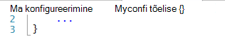
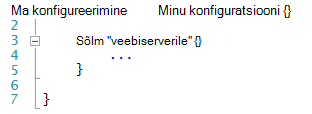
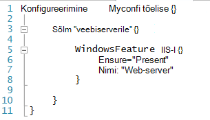
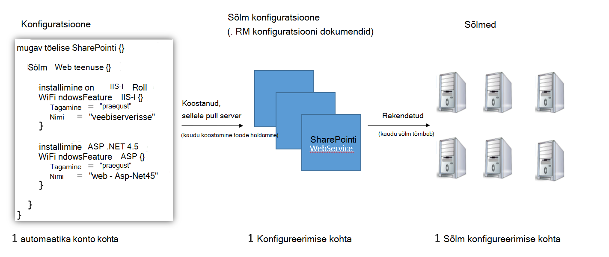
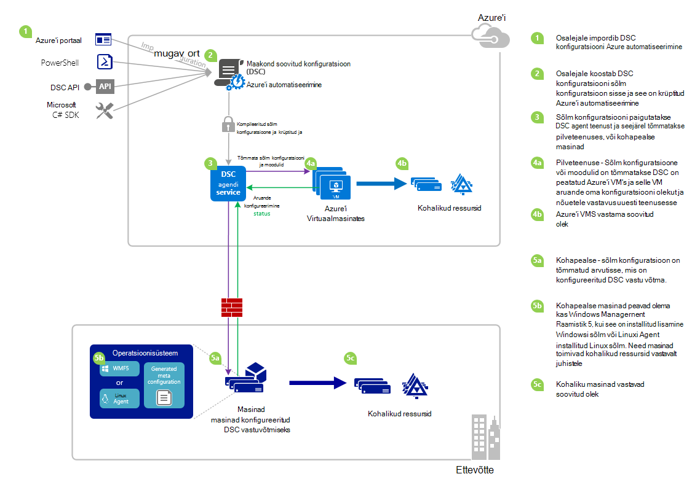

<properties 
   pageTitle="Azure'i automaatika DSC ülevaade | Microsoft Azure'i" 
   description="Mõne ülevaade, Azure automatiseerimine soovitud oleku konfiguratsioon (DSC), selle termineid ja teadaolevad probleemid" 
   services="automation" 
   documentationCenter="dev-center-name" 
   authors="coreyp-at-msft" 
   manager="stevenka" 
   editor="tysonn"
   keywords="PowerShelli dsc, soovitud olek konfiguratsiooni, PowerShelli dsc azure"/>

<tags
   ms.service="automation"
   ms.devlang="NA"
   ms.topic="article"
   ms.tgt_pltfrm="powershell"
   ms.workload="TBD" 
   ms.date="05/10/2016"
   ms.author="magoedte;coreyp"/>

# Azure'i automaatika DSC ülevaade #

##Mis on Azure automatiseerimine DSC?##
Juurutamine ja soovitud oleku oma serverid ja rakenduse ressursid võib olla tüütu ja vigu. Koos Azure automatiseerimine soovitud oleku konfiguratsioon (DSC), saate pidevalt juurutada, tingimata jälgimine ja automaatselt värskendada oma IT ressursside tasandil pilvest soovitud olek. Ehitatud PowerShelli DSC, automatiseerimise DSC joondada arvuti konfiguratsiooni teatud olek füüsilise ja virtuaalmasinates (VM), kasutades Windowsi või Linuxi, ja kohapealse ja pilveteenuse. Saate lubada pidev IT teenuste kohaletoimetamise ühtsete juhtelemendiga ja hallata kiire muutmine kogu teie heterogeensete hübriidjuurutuse keskkonna IT lihtsalt.

Azure'i automaatika DSC koostab kasutusele PowerShelli DSC veelgi lihtsam konfiguratsiooni halduse rakenduseks põhialuste peal. Azure'i automaatika DSC toob sama halduse kiht [PowerShelli soovitud oleku konfiguratsioon](https://msdn.microsoft.com/powershell/dsc/overview) Azure automatiseerimine pakub PowerShelli skriptimise täna.

Azure'i automaatika DSC võimaldab teil [koostamine ja haldamine PowerShelli soovitud riik konfiguratsioone](https://technet.microsoft.com/library/dn249918.aspx), importida [DSC ressursid](https://technet.microsoft.com/library/dn282125.aspx), ja DSC sõlm konfiguratsioone (RM dokumendid), luua kõik pilveteenuses. Nendeks DSC pannakse [DSC tõmmata server](https://technet.microsoft.com/library/dn249913.aspx) Azure'i automaatika, et target sõlmed kohapealse ja pilveteenuse (nt füüsilise ja virtuaalmasinates) saate valida neid, automaatselt vastavad need määrake soovitud olek ja aruande vastavust soovitud riik Azure automatiseerimine.

Kas eelistate vaadates lugemist? Heitke pilk selle video: mai 2015, kui Azure automatiseerimine DSC oli esmalt teada all. **Märkus:** Kuigi mõisted ja elutsükli kirjeldatud selles videos on õige, Azure automatiseerimine DSC on jõudnud palju kuna see video on salvestatud. On nüüd üldiselt kättesaadav, on palju olulisel Kasutajaliidese Azure portaali ja toetab palju lisavõimalusi.

> [AZURE.VIDEO microsoft-ignite-2015-heterogeneous-configuration-management-using-microsoft-azure-automation]

## Azure'i automaatika DSC tingimustel ##
### Konfigureerimine ###
PowerShelli DSC kasutusele uue mõiste nimega konfiguratsioone. Konfiguratsioone abil saate määratleda, kaudu PowerShelli süntaksit, keskkonna soovitud olek. DSC abil saate konfigureerida keskkonna, esmalt määratleda konfiguratsiooni märksõna kasutamine Windows PowerShelli skripti plokk ja järgige seejärel selle identifikaatoriga, siis koos looksulgudega ({}) piiritlemiseks blokeering.

Konfiguratsiooni ploki saate määratleda sõlm konfiguratsioon plokid, et määrata soovitud konfiguratsiooni hulk sõlmed (arvutid) teie keskkonnas, mis peaks olema konfigureeritud täpselt sama. Sel viisil sõlm konfiguratsioon tähistab "roll" endale ühe või mitme sõlmed. Sõlm konfiguratsioon plokk algab sõlm märksõna. Järgige selle märksõna nimega rolli, mis võib olla muutuv või avaldis. Pärast rolli nime, kasutage looksulgudega piiritlemiseks sõlm konfiguratsioon plokk.

 
Ploki sõlm konfiguratsiooni saate määratleda ressursi plokid konfigureerida teatud DSC ressursid. Ressursi, identifikaator määramiseks ploki ja valige siis traksid blokeering piiritlemiseks {}, millele järgneb nimi algab ressursi plokk.

Täpsemat teavet konfiguratsiooni märksõna leiate teemast: [Mõistmine konfiguratsiooni märksõna soovitud riik konfiguratsiooni](http://blogs.msdn.com/b/powershell/archive/2013/11/05/understanding-configuration-keyword-in-desired-state-configuration.aspx "Mõistmine konfiguratsiooni märksõna soovitud riik konfiguratsiooni")

Töötab (koostamisel) DSC konfiguratsiooni toodaks ühe või mitme DSC sõlm konfiguratsioone (RM dokumendid), mis on mis DSC sõlmed rakendamine täida soovitud riik.

Azure automatiseerimine DSC saate importida, autor ja kompileerida DSC konfiguratsioone Azure'i automaatika, kuidas saab importida tegevusraamatud, sarnaselt autoriks ja Azure automatiseerimine alustamine.

>[AZURE.IMPORTANT] Konfiguratsiooni peaks sisaldama ainult üks konfiguratsiooni Blokeeri, konfiguratsiooni, Azure automatiseerimine DSC sama nimi. 

###Sõlm konfigureerimine###

Kui koostatakse DSC konfiguratsiooni, toodeti ühe või mitme sõlm konfiguratsioone sõltuvalt sõlm plokid konfiguratsiooni. Sõlm konfiguratsioon on sama nimega "RM" või "konfiguratsiooni dokument" (kui olete tuttav tingimused PS DSC) ja tähistab "roll", näiteks serveri või töötaja soovitud ühe või mitme sõlmed peaks endale või märkige ruut vastavuse suhtes. Nimede sõlm konfiguratsiooni rakenduses Azure automatiseerimine DSC vormis "Konfiguratsiooni Name.NodeConfigurationBlockName".

PS Sõlm konfiguratsioone nad peaksid rakendama DSC tõuketeatised või pull meetodite kaudu teada saanud DSC sõlmed. Azure'i automaatika DSC tugineb DSC tõmbamise meetod, kus sõlmed taotluse sõlm konfiguratsioone: Azure'i automaatika DSC rakendada tõmmata server. Kuna sõlmed teha taotluse Azure automatiseerimine DSC, võib olla sõlmed taha tulemüürid, on kõik sissetulevad pordid suletud jne. Nad on vaja ainult väljaminev juurdepääs Internetile (otse või luua puhverserveri kaudu).

###Sõlm###

DSC sõlm on mis tahes arvutis, kus on selle konfiguratsiooni DSC hallata. Windowsi või Linuxi Azure VM, kohapealse VM / füüsilise hosti või seadme teise avaliku pilveteenuses. Sõlmed Jõusta sõlm konfiguratsioone muutuvad ja säilitada täitmise soovitud need määratlemine ja samuti saate aruande aruandlusteenuste serveri konfiguratsiooni olekut ja nõuetele vastavus ja soovitud olek.

Azure'i automaatika DSC teeb lihtsaks haldamiseks, Azure automatiseerimine DSC sõlmed kasutuselevõtt ja võimaldab sõlm konfiguratsiooni määratud iga sõlm serveripoolne nii, et järgmine kord, kui sõlm kontrollib server see endale erinevad rollid ja kuidas see on konfigureeritud ja complaince oleku muutmine juhised peaksid aru vastu sobitamiseks muuta.

###Ressurss###
DSC ressursid on koosteüksuste, mille abil saate määratleda Windows PowerShelli soovitud oleku konfiguratsioon (DSC) konfigureerimine. DSC kaasas komplekt sisseehitatud ressursside, nagu need failid ja kaustad, serveri funktsioonid ja rollid, registrisätete, keskkonna muutujate ja teenuste ja protsesside jaoks. Sisseehitatud DSC ressursside ja kuidas neid kasutada täieliku loendi leiate teemast [Sisseehitatud Windows PowerShelli soovitud oleku konfiguratsioon ressursid](https://technet.microsoft.com/library/dn249921.aspx).

DSC ressursid saab importida ka PowerShelli moodulid laiendada sisseehitatud DSC ressursside määramine osana. Mitte-vaikimisi ressursid eemaldatakse DSC sõlmed DSC pull server, kui sõlm on mõeldud Jõusta sõlm konfiguratsioon sisaldab viiteid nende ressursside. Saate teada, kuidas luua kohandatud ressursid, vt [Koostada kohandatud Windows PowerShelli soovitud oleku konfiguratsioon ressursid](https://technet.microsoft.com/library/dn249927.aspx).

Azure'i automaatika DSC teenusega kõiki samu sisseehitatud DSC ressurssidega ei PS DSC. Täiendavad ressursid saate lisada Azure automatiseerimine DSC importimise PowerShelli moodulid sisaldava ressursside Azure automatiseerimine.

###Töö koostamine###
Azure'i automaatika DSC koostamine tööd on eksemplari konfigureerimine ühe või mitme sõlm konfiguratsioone koostamine. Need sarnanevad Azure automatiseerimine käitusjuhendi töö, välja arvatud, et nad tegelikult täita mis tahes tööülesande peale luua sõlm konfiguratsioone. Mis tahes sõlm konfiguratsioone koostamine töö loodud paigutatakse automaatselt Azure automatiseerimine DSC pull serveris ja varasemate versioonide sõlm konfiguratsioone, üle kirjutada, kui need on olemas selle konfiguratsiooni. Sõlm konfiguratsiooni toodetud koostamine töö nime vormis "ConfigurationName.NodeConfigurationBlockName". Näiteks koostamise soovitud konfiguratsioon all oleksid ühe sõlm nimega "MyConfiguration.webserver" konfiguratsioon

>[AZURE.NOTE] Nii nagu tegevusraamatud, saab avaldada konfiguratsioone. See on seotud keerukate DSC üksuste Azure automatiseerimine DSC pull serverisse. Kompileerimine töö põhjustada DSC üksuste serveris Azure automatiseerimine DSC pull paigutada. "Avaldamise" Azure automatiseerimine kohta leiate lisateavet teemast [avaldamine on Käitusjuhendi](https://msdn.microsoft.com/library/dn903765.aspx).

##Azure'i automaatika DSC elutsükkel##
Konto tühja automatiseerimise minema õigesti konfigureeritud sõlmed hallatavate kogumi hõlmab kogumi protsesside määratlemiseks konfiguratsioone, neid konfiguratsioone sõlm konfiguratsioone ja kasutuselevõtt sõlmed Azure automatiseerimine DSC ja neid konfiguratsioone sõlm sisse lülitada. Järgmine diagramm näitab Azure automatiseerimine DSC elutsükli.

Järgmisel pildil on näidatud üksikasjalikud samm-sammult DSC elutsükkel. See sisaldab konfiguratsioon on imporditud ja sõlmed Azure'i automaatika, DSC ja eri osade vahel on kohapealse seadme jaoks nõutavad rakendatud erineval viisil. 

     

##Komistuskive saavutamisel / teadaolevad probleemid:##

- Täiendamisel WMF 5 RTM, kui seade on juba registreeritud Azure automatiseerimine DSC sõlme, unregister see: Azure'i automaatika DSC ja uuesti registreerima WMF 5 RTM versiooniuuenduse järel.

- Azure'i automaatika DSC ei toeta praegu osaline või kombineeritud DSC konfiguratsioone. Siiski DSC kombineeritud ressursid saab importida ja kasutada Azure automatiseerimine DSC konfiguratsioone nagu kohaliku PowerShellis konfiguratsiooni taaskasutuse lubamine.

- WMF 5 uusim versioon peab olema installitud PowerShelli DSC agenti Windows Azure'i automaatika suhelda. PowerShelli DSC agent Linuxi uusim versioon peab olema installitud Linux saama suhelda Azure automatiseerimine.

- Traditsiooniline PowerShelli DSC pull serveri eeldab, et mooduli lukud paigutada vormingus serveris pull **ModuleName_Version.zip "**. Azure'i automaatika eeldab, et PowerShelli moodulid imporditava nimedega **ModuleName.zip**kujul. Vt [ajaveebipostitust](https://azure.microsoft.com/blog/2014/12/15/authoring-integration-modules-for-azure-automation/) lisateabe saamiseks vaja mooduli importimine Azure automatiseerimine integreerimine mooduli vorming. 

- PowerShelli moodulid imporditud Azure automatiseerimine ei tohi sisaldada .doc ja .docx faile. Mõned PowerShelli moodulid sisaldavad DSC ressursid sisaldavad need failid abi eesmärgil. Need failid tuleks eemaldada moodulid enne importimine Azure automatiseerimine.

- Kui sõlm registreerimist Azure automatiseerimine kontoga või sõlme muudetakse konfiguratsiooni erinevate sõlm serveripoolne vastendada, saab see olek "Vastavuses", isegi juhul, kui olek on sõlm pole tegelikult nõuetele vastavust on nüüd vastendatud sõlm konfiguratsiooni. Pärast sõlme sooritab oma esimese pull ja saadab esimeses aruandes pärast registreerimist või sõlm konfiguratsiooni vastenduse muuta, saab usaldada sõlm olek.

- Kui kasutuselevõtt on Azure Windows VM haldamiseks, Azure automatiseerimine DSC kasutades ühte meie otsese kasutuselevõtt meetodid, võib kuluda kuni tund VM kuvamiseks nimega DSC sõlme Azure automatiseerimine. Selle põhjuseks installimine Windows Management Framework 5.0 VM Azure VM DSC pikendamisega, mis pardal VM Azure automatiseerimine DSC abil.

- Pärast registreerumist iga sõlme automaatselt negotsieerib kordumatu serdi autentimine, mis lõpeb üks aasta pärast. Sel ajal, ei saa PowerShelli DSC registreerimise protokoll pikendada automaatselt serdid kui need on lähenemas aegumist, et teil on vaja uuesti registreerida sõlmed aasta pärast. Enne uuesti, veenduge, et iga sõlme operatsioonisüsteemi Windows Management Framework 5.0 RTM. Kui soovitud sõlm autentimissert aegub ning sõlme on pole ümberregistreerimisel, sõlme ei saa suhelda Azure automatiseerimine ja märgitakse "Stiimulile." Reregistration toimub samamoodi sõlme algselt registreeritud. Reregistration sooritatakse 90 päeva või väiksem serdi aegumise aeg, või mis tahes hetkel pärast serdi aegumise aega, on tulemuseks on loodud ja kasutada uut serti.

- Täiendamisel WMF 5 RTM, kui seade on juba registreeritud Azure automatiseerimine DSC sõlme, unregister see: Azure'i automaatika DSC ja uuesti registreerima WMF 5 RTM versiooniuuenduse järel. Enne uuesti, $env:windir\system32\configuration\DSCEngineCache.mof faili kustutada.

- DSC PowerShelli cmdlet-käsud ei pruugi töötada, kui WMF 5 RTM on installitud peal WMF 5 tootmise eelvaade. Selle probleemi lahendamiseks käivitage järgmine käsk administraatoriõigustes PowerShelli seanss, mis (Käivita administraatorina):`mofcomp $env:windir\system32\wbem\DscCoreConfProv.mof`
 

##Seotud artiklid##

- [Azure automatiseerimine DSC haldamine masinad aitavad] (.. /Automation/Automation-DSC-onboarding.MD)
- [Koostamise konfiguratsioone Azure automatiseerimine DSC] (.. /Automation/Automation-DSC-compile.MD)
- [Azure automatiseerimine DSC cmdlet-käsud] (https://msdn.microsoft.com/library/mt244122.aspx)
- [Azure automatiseerimine DSC hinnad] (https://azure.microsoft.com/pricing/details/automation/)
- [Pidev juurutamise IaaS vms abil Azure automatiseerimine DSC ja Chocolatey] (automatiseerimine-dsc-cd-chocolatey.md)
