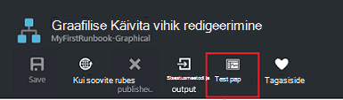

<properties
    pageTitle="Minu esimene graafiline käitusjuhendi Azure'i automaatika | Microsoft Azure'i"
    description="Õppeteema, mis juhendab teid loomise, testimine ja lihtsa graafilise käitusjuhendi avaldamine."
    services="automation"
    documentationCenter=""
    authors="mgoedtel"
    manager="jwhit"
    editor=""
    keywords="käitusjuhendi, käitusjuhendi malli, käitusjuhendi automatiseerimine Azure'i käitusjuhendi"/>
<tags
    ms.service="automation"
    ms.workload="tbd"
    ms.tgt_pltfrm="na"
    ms.devlang="na"
    ms.topic="get-started-article"
    ms.date="07/06/2016"
    ms.author="magoedte;bwren"/>

# <a name="my-first-graphical-runbook"></a>Minu esimene graafiline käitusjuhendi

> [AZURE.SELECTOR] - [Graafilised](automation-first-runbook-graphical.md) - [PowerShelli](automation-first-runbook-textual-PowerShell.md) - [PowerShelli töövoo](automation-first-runbook-textual.md)

Selles õpetuses juhendab teid Azure automatiseerimine [graafilise käitusjuhendi](automation-runbook-types.md#graphical-runbooks) loomine.  Alustuseks kirjeldame lihtsa käitusjuhendi, mida me testimiseks ja avaldada selgitab, kuidas käitusjuhendi töö oleku jälgimine.  Seejärel me saate muuta käitusjuhendi tegelikult haldamiseks Azure ressursse, alustades sel juhul on Azure virtuaalse masina.  Seejärel teeme käitusjuhendi tugevam, lisades käitusjuhendi parameetrite ja tingimusvormingu lingid.

## <a name="prerequisites"></a>Eeltingimused

Selle õpetuse tegemiseks on vaja järgmist.

-   Azure'i tellimus.  Kui teil pole veel üks, saate [aktiveerida oma MSDN-i abonendi kasu](https://azure.microsoft.com/pricing/member-offers/msdn-benefits-details/) või <a href="/pricing/free-account/" target="_blank"> [registreeruda tasuta konto](https://azure.microsoft.com/free/).
-   [Azure'i käivitada nagu konto](automation-sec-configure-azure-runas-account.md) käitusjuhendi hoida ja autentida Azure ressursse.  Sellel kontol peab olema õigus käivitamine ja peatamine virtuaalse masina.
-   Azure virtuaalse masina.  Me peatada ja käivitage see arvuti nii, et see peaks olema tootmise.


## <a name="step-1---create-new-runbook"></a>Samm 1 – saate luua uue käitusjuhendi

Me alustame lihtsa käitusjuhendi, mille väljundid teksti *Tere, maailm*loomisega.

1.  Avage Azure'i portaalis konto automatiseerimine.  
    Automatiseerimise konto lehe kaudu saate kiiresti vaadata ressursside selle konto.  Peaks juba mõne varad.  Need on uue automatiseerimise konto kaasatakse mooduleid.  Samuti peate mandaadi varade jaotises [eeltingimused](#prerequisites).
2.  Klõpsake paani **tegevusraamatud** tegevusraamatud loendi avamiseks.<br> 
3.  Luua uue käitusjuhendi, klõpsates nuppu **Lisa soovitud käitusjuhendi** ja seejärel **Loo uus käitusjuhendi**.
4.  Andke käitusjuhendi *MyFirstRunbook graafiline*nimi.
5.  Selles näites me ei kavatse luua on [graafiline käitusjuhendi](automation-graphical-authoring-intro.md) nii valige **graafilised** **Käitusjuhendi**tüüp.<br> <br>
6.  Klõpsake nuppu **Loo** käitusjuhendi loomiseks ja avage graafiline redaktor.

## <a name="step-2---add-activities-to-the-runbook"></a>Samm 2 – käitusjuhendi tegevuste lisamine

Teegi juhtelemendi vasakus servas redaktori võimaldab valida tegevuste lisamiseks oma käitusjuhendi.  Me ei kavatse **Kirjutamine-väljund** cmdlet-käsu väljund käitusjuhendi teksti lisada.

1.  Teegi kontroll, klõpsake otsingu tekstivälja ja tippige **Kirjutamine-väljund**.  Otsingu tulemused kuvatakse allpool. <br> 
2.  Liikuge kerides jaotiseni loendi lõppu.  Te saate kas Paremklõpsake **Kirjutamine-väljund** valige **lisamine lõuend** või klõpsake ellips cmdlet kõrval ja valige **lõuend lisamine**.
3.  Klõpsake **Kirjutamine-väljund** tegevuse lõuend.  Avaneb konfiguratsiooni juhtelemendi tera, mis võimaldab teil konfigureerida tegevuse.
4.  **Sildi** cmdlet-käsu nimi on vaikimisi, kuid me saate muuta selle midagi sõbralik. *Kirjutage Tere, maailm väljund*muuta.
5.  Klõpsake nuppu **Parameetrid** anda selle cmdlet parameetrite väärtused.  
    Mõned cmdlet-käsud on parameetri mitmele kriteeriumikogumile ja peate valima mis te kasutate. Sel juhul **Kirjutamine-väljund** on ainult üks parameeter häälestatud, seetõttu ei pea te valida. <br> 
6.  Valige **InputObject** parameeter.  See on parameetri, kus oleme määrata, saata väljundi voo tekst.
7.  Valige rippmenüüst **andmeallika** **PowerShelli avaldis**.  **Andmeallika** ripploend pakub erinevatest allikatest, parameetri väärtuse asustamiseks kasutatav.  
    Väljund saate kasutada selliseid allikast, näiteks mõne muu tegevuse, automatiseerimise vara või PowerShelli avaldis.  Sel juhul soovime lihtsalt väljund tekst *Tere, maailm*. Me kasutada PowerShelli avaldist ja määrake string.
8.  Väljale **avaldis** tippige *"Tere, maailm"* ja klõpsake nuppu **OK** kaks korda naasmiseks lõuend.<br> 
9.  Salvestage käitusjuhendi, klõpsates nuppu **Salvesta**.<br> 

## <a name="step-3---test-the-runbook"></a>Samm 3 - testi käitusjuhendi

Enne me avaldada käitusjuhendi kättesaadavaks valmistamisel, soovime testida veendumaks, et see töötab õigesti.  Kui soovitud käitusjuhendi testimiseks käivitage selle **mustand** versiooni ja vaadata selle väljundi interaktiivseks.

1.  Klõpsake nuppu **testi paani** avamiseks tera Test.<br> 
2.  Klõpsake nuppu **Käivita** käivitage test.  See peaks olema lubatud ainus saadaolev variant.
3.  [Käitusjuhendi töö](automation-runbook-execution.md) loomist ja selle olek kuvatakse paanil.  
    Töö oleku hakkavad nimega *Ootel* , mis näitab, et ootab käitusjuhendi töötaja pilves kättesaadavaks.  See siis liigub *algus* kui töötaja väidab töö ning seejärel *töötab* käivitamisel käitusjuhendi tegelikult töötab.  
4.  Kui käitusjuhendi töö on lõpule jõudnud, kuvatakse selle väljundi. Meie puhul, peaksite nägema *Tere, maailm*.<br> 
5.  Sulgege testi tera naasmiseks lõuend.

## <a name="step-4---publish-and-start-the-runbook"></a>Samm 4 - avaldamine ja alustage käitusjuhendi

Oleme äsja loodud käitusjuhendi on endiselt mustand režiimis. Läheb vaja selle avaldada, enne kui saate võtame valmistamisel.  Kui avaldate on käitusjuhendi, kirjutada olemasoleva avaldatud versioon mustand versiooniga.  Meie puhul me pole veel avaldatud versioon Kuna me äsja loodud käitusjuhendi.

1.  Klõpsake nuppu **Avalda** avaldada käitusjuhendi ja seejärel **Jah** küsimise.<br> 
2.  Kui kerite **tegevusraamatud** tera käitusjuhendi kuvamiseks vasakule, kuvatakse see on **avaldatud** **Loome olek** .
3.  Liikuge tagasi vaadata tera **MyFirstRunbook**paremale.  
    Suvandi ülaserva saaksime alustada käitusjuhendi, plaanida selle teatud ajal tulevikus käivitamine või luua mõne [webhook](automation-webhooks.md) , et seda saab käivitada HTTP-kõne kaudu.
4.  Soovime lihtsalt alustada käitusjuhendi nii klõpsake nuppu **Start** ja seejärel **Jah** küsimise.<br> 
5.  Töö blade avatakse me äsja loodud käitusjuhendi töö.  Sulgege see tera, kuid sel juhul me jätta avatud nii jälgime projekti edenemist.
6.  Töö olek on kuvatud **Projekti** kokkuvõte ja vastendatakse me kuvati käitusjuhendi testimisel olekud.<br> 
7.  Kui käitusjuhendi olek kuvatakse *lõppenud*, klõpsake **väljundi**. **Väljundi** tera on avatud ja me näeme meie *Tere, maailm* paanil.<br>   
8.  Sulgege väljundi tera.
9.  Klõpsake nuppu **Kõik logid** voogu tera käitusjuhendi töö avamiseks.  Me peaks näha ainult *Tere, maailm* väljundi voo, kuid seda saab kuvada muude voogu käitusjuhendi töö, nt Verbose ja tõrge, kui käitusjuhendi kirjutab neile.<br> 
10. Sulgege kõik logid tera ja töö tera naasmiseks MyFirstRunbook tera.
11. Klõpsake **töö** selle käitusjuhendi töö höövlitera avamiseks.  See on loetletud kõik selle käitusjuhendi loodud töökohtade. Ainult näeme ühe töö, kuna me ainult käivitasite töö üks kord.<br> 
12. Võite klõpsata tööga sama töö paani, et saaksime vaadata käitusjuhendi käivitamisel avamiseks.  See võimaldab teil minna ajas tagasi ja mis tahes töö, mis on loodud kindla käitusjuhendi üksikasjade kuvamiseks.

## <a name="step-5---create-variable-assets"></a>Juhis 5 – saate luua muutuv varad

Oleme testitud ja avaldatud meie käitusjuhendi, kuid siiani see ei tee midagi kasulik. Soovime seda hallata Azure ressursse.  Enne käitusjuhendi autentida konfigureerimiseks loome muutuja hoidke Tellimuse ID ja selle pärast me häälestamise tegevuse autentida 6 järgmises juhises.  Viide kontekstis tellimus võimaldab teil vahel mitu tellimust on lihtne töö.  Enne jätkamist kopeerida eemaldada navigeerimispaani suvandi tellimused oma tellimuse ID-d.  

1. Automaatika kontod tera, klõpsake paani **varad** ja **varade** tera on avatud.
2. Varade tera, klõpsake paani **muutujate** .
3. Enne muutujat, klõpsake nuppu **Lisa muutujat**.<br>
4. Uue muutuv tera, väljale **nimi** Sisestage **AzureSubscriptionId** ja sisestage väljale **väärtus** Tellimuse ID  Säilita *stringi* **krüptimiseks** **Tüüp** ja vaikeväärtus.  
5. Klõpsake nuppu **Loo** muutuja loomiseks.  


## <a name="step-6---add-authentication-to-manage-azure-resources"></a>Samm 6 – lisada autentimise haldamiseks Azure ressursid

Nüüd kus oleme muutuja hoida meie Tellimuse ID, saame seadistada meie käitusjuhendi Käivita kasutajana identimisteavet, mida nimetatakse [eeltingimused](#prerequisites)autentimiseks.  Seda, lisades Azure'i Käivita kasutajana ühenduse **aktiva** ja **Lisa-AzureRMAccount** cmdlet lõuend.  

1.  Avage graafiline redaktor, klõpsates nuppu **Redigeeri** MyFirstRunbook enne.<br> 
2.  Me enam ei vaja **Kirjutamine Tere, maailm väljund** , seega paremklõpsake seda ja valige **Kustuta**.
3.  Teegi juhtelemendi, laiendage **ühendusi** , ja lisada **AzureRunAsConnection** lõuend, klõpsates nuppu **Lisa lõuend**.
4.  Lõuendil, valige **AzureRunAsConnection** ja konfiguratsiooni kontroll paanil tippige **Saada käivitada nimega ühenduse** **sildi** tekstiväljale.  See on ühendus 
5.  Teegi juhtelementi, tippige otsingu tekstiväljale **Lisa-AzureRmAccount** .
6.  **Lisa-AzureRmAccount** lisada lõuend.<br> 
7.  Viige kursor **Saada käivitada nimega ühenduse** kuni kujundi allservas kuvatakse ringi. Klõpsake soovitud ringi ja lohistage noolt **Lisa-AzureRmAccount**.  Äsja loodud noolt on *link*.  Käitusjuhendi algab **Saada käivitada nimega ühendus** ja seejärel käivitage **Lisa-AzureRmAccount**.<br> 
8.  Lõuendil, valige **Lisa-AzureRmAccount** ja konfiguratsiooni juhtida paani tüüp **Azure'i sisselogimiseks** tekstiväljale **silt** .
9.  Klõpsake **parameetrite** ja tegevuse parameetri konfiguratsiooni blade kuvatakse. 
10.  **Lisa-AzureRmAccount** on parameetri mitmele kriteeriumikogumile, seega tuleb valida enne pakume parameetrite väärtused.  Klõpsake käsku **Sea parameeter** ja seejärel valige **ServicePrincipalCertificate** parameetri määramine. 
11.  Kui valite parameetri määramine, kuvatakse tegevuse parameetri konfiguratsiooni tera parameetrid.  Klõpsake **APPLICATIONID**.<br> 
12.  Labale parameetri väärtuse **tegevuse väljundi** **andmeallika** valimine ja valige **Saada käivitada nimega ühendus** loendist, tippige **väljale tee** tekstivälja **ApplicationId**, ja seejärel klõpsake nuppu **OK**.  Meil on täpsustades tee välja atribuudi nimi, kuna tegevuse väljundid objekti mitme atribuudid.
13.  Klõpsake **CERTIFICATETHUMBPRINT**ja parameetri väärtuse tera, valige **tegevuse väljundi** **andmeallikas**.  Valige **Saada käivitada nimega ühendus** loendist, tippige **väljale tee** tekstivälja **CertificateThumbprint**, ja seejärel klõpsake nuppu **OK**. 
14.  **SERVICEPRINCIPAL**, klõpsake parameetri väärtuse tera, valige **ConstantValue** **andmeallika**, **True**suvandit ja seejärel klõpsake nuppu **OK**.
15.  Klõpsake **TENANTID**ja parameetri väärtuse tera, valige **tegevuse väljundi** **andmeallikas**.  Valige **Saada käivitada nimega ühendus** loendist, tippige **väljale tee** tekstivälja **TenantId**, ja seejärel klõpsake kaks korda nuppu **OK** .  
16.  Teegi juhtelemendi, tippige otsingu tekstiväljale **Set-AzureRmContext** .
17.  Lisage **Set-AzureRmContext** lõuend.
18.  Lõuendil, valige **Set-AzureRmContext** ja konfiguratsiooni juhtida paani tüüp **Määrata tellimuse Id** väljale **silt** .
19.  Klõpsake nuppu **Parameetrid** ja tegevuse parameetri konfiguratsiooni blade kuvatakse. 
20. **Set-AzureRmContext** on parameetri mitmele kriteeriumikogumile, seega tuleb valida enne pakume parameetrite väärtused.  Klõpsake käsku **Sea parameeter** ja seejärel valige **SubscriptionId** parameetri määramine.  
21.  Kui valite parameetri määramine, kuvatakse tegevuse parameetri konfiguratsiooni tera parameetrid.  Klõpsake nuppu **SubscriptionID**
22.  Parameetri väärtuse tera, valige **andmeallika** **Muutuja varade** **AzureSubscriptionId** loendist ja klõpsake kaks korda nuppu **OK** .   
23.  Viige kursor **Login Azure** kuni kujundi allservas kuvatakse ringi. Klõpsake soovitud ringi ja lohistage noolt **Tellimuse Id määramine**.


Teie käitusjuhendi peaks välja nägema järgmine sel hetkel. <br>

## <a name="step-7---add-activity-to-start-a-virtual-machine"></a>Juhis 7 – tegevuse käivitada lisamine

Nüüd lisame **Algus-AzureRmVM** tegevust, et käivitada.  Saate valida mis tahes virtuaalse masina teie Azure'i tellimus ja nüüd me hardcoding, mis üheks cmdlet-käsu nimi olla.

1. Teegi juhtelemendi, tippige otsingu tekstiväljale **Algus-AzureRm** .
2. Lõuend **Algus-AzureRmVM** lisamine ja seejärel klõpsake ja lohistage see **Määrata tellimuse Id**all.
3. Viige kursor **Määrata tellimuse Id** kuni ringi kuvatakse allservas kujundit.  Klõpsake soovitud ringi ja lohistage noolt **Algus-AzureRmVM**. 
4.  Valige **Algus-AzureRmVM**.  Klõpsake **parameetrite** ja seejärel **Parameeter** vaadata komplekti **Algus-AzureRmVM**.  Valige **ResourceGroupNameParameterSetName** parameetri määramine. Teate, et **ResourceGroupName** ning **nimi** on hüüumärki edasi neid.  See näitab, et need on vajalikud parameetrid.  Samuti võtke arvesse, et mõlemad eeldavad stringi väärtuse.
5.  Valige **nimi**.  Valige **andmeallikas** ja ümbritsetud jutumärkidega, mida me alustame selle käitusjuhendi virtuaalse masina nimi **PowerShelli avaldis** .  Klõpsake nuppu **OK**.<br>
6.  Valige **ResourceGroupName**. **PowerShelli avaldist** kasutada **andmeallika** ja ümbritsetud jutumärkidega ressursi rühma nime.  Klõpsake nuppu **OK**.<br> 
8.  Klõpsake nuppu testi paan nii, et saame testida käitusjuhendi.
9.  Klõpsake nuppu **Käivita** käivitage test.  Kui see on lõpule jõudnud, märkige ruut virtuaalse masina käivitamise.

Teie käitusjuhendi peaks välja nägema järgmine sel hetkel. <br>

## <a name="step-8---add-additional-input-parameters-to-the-runbook"></a>Samm 8 – käitusjuhendi täiendavad sisendparameetrite lisamine

Meie käitusjuhendi praegu käivitab virtuaalse masina **Algus-AzureRmVM** cmdlet me määratud ressursirühm, kuid meie käitusjuhendi oleks rohkem kasulik, kui me määrata nii käitusjuhendi käivitamisel.  Nüüd me käitusjuhendi, et pakkuda funktsionaalsust, et lisada sisendparameetrid.

1. Avage graafiline redaktor, klõpsates nuppu **Redigeeri** **MyFirstRunbook** paani.
2. Klõpsake **sisestus- ja väljundi** ja seejärel **sisestusmeetodi lisamine** Käitusjuhendi Sisendparameetrile paani avamiseks.<br> 
3. Määrake *VMName* **nimi**.  Säilita *stringi* **tüüpi**, kuid muuta **kohustuslik** *Jah*.  Klõpsake nuppu **OK**.
4. Luua teine kohustuslik sisendparameetrile nimega *ResourceGroupName* ja seejärel klõpsake nuppu **OK** , et sulgeda **sisestus- ja väljundi** paani.<br> 
5. Valige **Algus-AzureRmVM** tegevuste ja klõpsake nuppu **Parameetrid**.
6. **Andmeallika** **nimi** **Käitusjuhendi sisendit** muuta, ja seejärel valige **VMName**.<br>
7. **Andmeallika** muutma **ResourceGroupName** **Käitusjuhendi sisendit** ja seejärel valige **ResourceGroupName**.<br> 
8. Salvestage käitusjuhendi ja testi paani avamine.  Pange tähele, et saate nüüd sisestada väärtuste kaks Sisestuskeel muutujate testi kasutatud.
9. Sulgege paan Test.
10. Klõpsake nuppu **Avalda** avaldada käitusjuhendi uue versiooni.
11. Peatage virtuaalse masina, mis eelmises etapis hakkasite.
12. Klõpsake käsku **Käivita** käitusjuhendi alustamiseks.  Tippige **VMName** ja **ResourceGroupName** virtuaalse masina, mida te ei kavatse alustada.<br> 
13. Kui käitusjuhendi on lõpule jõudnud, kontrollige, et virtuaalse masina käivitati.

## <a name="step-9---create-a-conditional-link"></a>Samm 9 – tingimusvormingu lingi loomine

Me käitusjuhendi nii, et ainult proovib see virtuaalse masina käivitamine, kui see pole juba alustatud nüüd muuta.  Me teeme selle cmdlet-käsu **Get-AzureRmVM** lisamisega käitusjuhendi, mis saavad eksemplari taseme oleku virtuaalse masina. Seejärel lisame PowerShelli töövoo koodimoodul nimega **Saada olek** koodilõigu PowerShelli koodi kas virtuaalse masina olek on töötab või on peatatud.  Tingimusvormingu lingi **Hankimine olek** moodulist käivitub ainult **Algus-AzureRmVM** kui töötava praegune olek on peatatud.  Lõpuks me väljund sõnumi teavitavad teid, kui VM otsinguteenus on käivitatud või ei kasuta cmdlet PowerShelli kirjutamine-väljund.

1. Avage **MyFirstRunbook** pildiredaktor.
2. **Määrake tellimuse Id** "ja" **Start-AzureRmVM** vahelise lingi eemaldada, klõpsates seda ja seejärel vajutage kustutusklahvi ( *Kustuta* ).
3. Teegi juhtelemendi, tippige otsingu tekstiväljale **Get-AzureRm** .
4. **Get-AzureRmVM** lisada lõuend.
5. Valige **Get-AzureRmVM** ning seejärel **Parameeter seatud** vaadata komplekti **Get-AzureRmVM**.  Valige **GetVirtualMachineInResourceGroupNameParamSet** parameetri määramine.  Teate, et **ResourceGroupName** ning **nimi** on hüüumärki edasi neid.  See näitab, et need on vajalikud parameetrid.  Samuti võtke arvesse, et mõlemad eeldavad stringi väärtuse.
6. Jaotises **andmeallika** **nimi**, valige **Käitusjuhendi Sisestuskeel** ja seejärel valige **VMName**.  Klõpsake nuppu **OK**.
7. Klõpsake jaotises **andmeallikas** **ResourceGroupName**, valige **Käitusjuhendi sisend** ja seejärel valige **ResourceGroupName**.  Klõpsake nuppu **OK**.
8. Klõpsake jaotises **andmeallikas** **olek**, valige **järele konstandi väärtus** ja seejärel klõpsake **True**.  Klõpsake nuppu **OK**.  
9. **Määrake tellimuse Id** **Get-AzureRmVM**lingi loomine.
10. Teegi juhtelemendi, laiendage **Käitusjuhendi juhtelemendi** ja **koodi** lisamine lõuend.  
11. **Get-AzureRmVM** **kood**lingi loomine.  
12. Klõpsake **koodi** paanil konfiguratsiooni muuta sildi **Saada olek**.
13. Valige **kood** parameetri ja **Redaktor** tera kuvatakse.  
14. Kleepige kood redaktoris järgmist koodilõik kood:

     ```
     $StatusesJson = $ActivityOutput['Get-AzureRmVM'].StatusesText 
     $Statuses = ConvertFrom-Json $StatusesJson 
     $StatusOut ="" 
     foreach ($Status in $Statuses){ 
     if($Status.Code -eq "Powerstate/running"){$StatusOut = "running"} 
     elseif ($Status.Code -eq "Powerstate/deallocated") {$StatusOut = "stopped"} 
     } 
     $StatusOut 
     ```

15. **Saada olek** **Algus-AzureRmVM**lingi loomine.<br>   
16. Valige link ja paanil konfiguratsiooni muuta **Rakenda tingimus** **Jah**.   Pange tähele, et link muutub kriipsjoontega joone, mis näitab, et target tegevuse ainult käivitatakse kui tingimus annab tulemuseks vea true.  
17. Tippige **tingimusavaldis** *$ActivityOutput [' hankimine Status'] - eq "Tasuda"*.  **Algus-AzureRmVM** nüüd käivitub ainult, kui virtuaalse masina on peatatud.
18. Teegi juhtelemendi, laiendage **cmdlet-käsud** ja seejärel **Microsoft.PowerShell.Utility**.
19. Lisage **Kirjutamine-väljund** lõuend kaks korda.<br> 
20. **Kirjutamine-väljund** esimesele juhtelemendile, klõpsake **parameetrite** ja *Teavitamise VM alustamine* **sildi** väärtust muuta.
21. **InputObject**, muuta **andmeallika** **PowerShelli avaldis** ja Tippige avaldis *"$VMName edukalt alustatud."*.
22. Teine **Kirjutamine-väljund** kontrolli, klõpsake **parameetrite** ja **sildi** väärtust muuta *Teavitamise VM käivitamine nurjus*
23. **InputObject**, muuta **andmeallika** **PowerShelli avaldis** ja Tippige avaldis *"$VMName ei saa käivitada."*.
24. Lingi loomisel **Algus-AzureRmVM** **Teavitamise VM alustamine** ja **Teavitamise VM käivitamine nurjus**.
25. Valige link **teavitamise VM** alustada, ja muuta **Rakenda tingimuse** väärtuseks **True**.
26. Tippige **tingimusavaldis** *$ActivityOutput ["Start AzureRmVM"]. IsSuccessStatusCode - eq $true*.  Selle kirjutamine-väljund juhtelemendi nüüd käivitub ainult, kui virtuaalse masina on edukalt alustamine.
27. Valige link **Teavitamise VM käivitamine nurjus** ja muuta **Rakenda tingimuse** väärtuseks **True**.
28. Tippige **tingimusavaldis** *$ActivityOutput ["Start AzureRmVM"]. IsSuccessStatusCode - ne $true*.  Selle kirjutamine-väljund juhtelemendi nüüd käivitub ainult, kui virtuaalse masina on edukalt alustamine.
29. Salvestage käitusjuhendi ja testi paani avamine.
30. Peatatud virtuaalse masina käitusjuhendi alustada, ja see peab algama.

## <a name="next-steps"></a>Järgmised sammud

-   Graafilise loomise kohta leiate lisateavet teemast [graafilised loome Azure'i automaatika](automation-graphical-authoring-intro.md)
-   Alustamine PowerShelli tegevusraamatud, lugege teemat [minu esimese PowerShelli käitusjuhendi](automation-first-runbook-textual-powershell.md)
-   Alustamine PowerShelli töövoo tegevusraamatud, lugege teemat [minu esimese PowerShelli töövoo käitusjuhendi](automation-first-runbook-textual.md)
