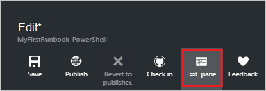

<properties
    pageTitle="Minu esimese PowerShelli käitusjuhendi Azure'i automaatika | Microsoft Azure'i"
    description="Õppeteema, mis juhendab teid loomise, testimine ja lihtsat PowerShelli käitusjuhendi avaldamine."
    services="automation"
    documentationCenter=""
    authors="mgoedtel"
    manager="jwhit"
    editor=""
    keywords="Azure'i PowerShelli, PowerShelli skripti õpetuse, PowerShelli automatiseerimine"/>
<tags
    ms.service="automation"
    ms.workload="tbd"
    ms.tgt_pltfrm="na"
    ms.devlang="na"
    ms.topic="get-started-article"
    ms.date="07/19/2016"
    ms.author="magoedte;sngun"/>

# <a name="my-first-powershell-runbook"></a>Minu esimese PowerShelli käitusjuhendi

> [AZURE.SELECTOR] - [Graafilised](automation-first-runbook-graphical.md) - [PowerShelli](automation-first-runbook-textual-PowerShell.md) - [PowerShelli töövoo](automation-first-runbook-textual.md)  

Selles õpetuses juhendab teid loomine [PowerShelli käitusjuhendi](automation-runbook-types.md#powershell-runbooks) Azure automatiseerimine. Alustuseks kirjeldame lihtsa käitusjuhendi, mida me testimiseks ja avaldada selgitab, kuidas käitusjuhendi töö oleku jälgimine. Seejärel me saate muuta käitusjuhendi tegelikult haldamiseks Azure ressursse, alustades sel juhul on Azure virtuaalse masina. Seejärel teeme käitusjuhendi tugevam, lisades käitusjuhendi parameetrid.

## <a name="prerequisites"></a>Eeltingimused

Selle õpetuse tegemiseks on vaja järgmist.

-   Azure'i tellimus. Kui teil pole veel üks, saate [aktiveerida oma MSDN-i abonendi kasu](https://azure.microsoft.com/pricing/member-offers/msdn-benefits-details/) või <a href="/pricing/free-account/" target="_blank"> [registreeruda tasuta konto](https://azure.microsoft.com/free/).
-   [Automaatika konto](automation-security-overview.md) käitusjuhendi hoida ja autentida Azure ressursse.  Sellel kontol peab olema õigus käivitamine ja peatamine virtuaalse masina.
-   Azure virtuaalse masina. Me peatada ja käivitage see arvuti nii, et see peaks olema tootmise.

## <a name="step-1---create-new-runbook"></a>Samm 1 – saate luua uue käitusjuhendi

Me alustame lihtsa käitusjuhendi, mille väljundid teksti *Tere, maailm*loomisega.

1.  Avage Azure'i portaalis konto automatiseerimine.  
    Automatiseerimise konto lehe kaudu saate kiiresti vaadata ressursside selle konto. Peaks juba mõne varad. Need on uue automatiseerimise konto kaasatakse mooduleid. Samuti peate mandaadi varade jaotises [eeltingimused](#prerequisites).
2.  Klõpsake paani **tegevusraamatud** tegevusraamatud loendi avamiseks.  
      
3.  Luua uue käitusjuhendi, klõpsates nuppu **Lisa soovitud käitusjuhendi** ja seejärel **Loo uus käitusjuhendi**.
4.  Andke käitusjuhendi *MyFirstRunbook-PowerShelli*nimi.
5.  Selles näites me ei kavatse luua on [PowerShelli käitusjuhendi](automation-runbook-types.md#powershell-runbooks) nii valige **PowerShelli** **Käitusjuhendi**tüüp.  
      
6.  Klõpsake nuppu **Loo** käitusjuhendi loomiseks ja avage teksti redaktor.

## <a name="step-2---add-code-to-the-runbook"></a>Samm 2 – käitusjuhendi koodi lisamine

Saate otse käitusjuhendi kas tippige kood või saate valida cmdlet-käsud, tegevusraamatud ja varade juhtimine teek ja need lisatakse kõik seotud parameetriga käitusjuhendi. See selgituse me tippige otse käitusjuhendi.

1.  Meie käitusjuhendi on tühi, tippige *kirjutamine-väljund "Tere tulemast maailma."*.  
      
2.  Salvestage käitusjuhendi, klõpsates nuppu **Salvesta**.  
      

## <a name="step-3---test-the-runbook"></a>Samm 3 - testi käitusjuhendi

Enne me avaldamine käitusjuhendi kättesaadavaks valmistamisel, soovime testida veendumaks, et see töötab õigesti. Kui soovitud käitusjuhendi testimiseks käivitage selle **mustand** versiooni ja vaadata selle väljundi interaktiivseks.

1.  Klõpsake käsku **testi paani** testi paani avamiseks.  
      
2.  Klõpsake nuppu **Käivita** käivitage test. See peaks olema lubatud ainus saadaolev variant.
3.  [Käitusjuhendi töö](automation-runbook-execution.md) loomist ja selle olek kuvatakse.  
    Töö oleku hakkavad nimega *Ootel* , mis näitab, et ootab käitusjuhendi töötaja pilveteenuses tulla saadaval. See siis liigub *alustades* kui töötaja väidab töö ning seejärel *töötab* käivitamisel käitusjuhendi tegelikult töötab.  
4.  Kui käitusjuhendi töö on lõpule jõudnud, kuvatakse selle väljundi. Meie puhul peaks näeme *Tere, maailm*  
      
5.  Sulgege paan testi naasmiseks lõuend.

## <a name="step-4---publish-and-start-the-runbook"></a>Samm 4 - avaldamine ja alustage käitusjuhendi

Oleme äsja loodud käitusjuhendi on endiselt mustand režiimis. Läheb vaja selle avaldada, enne kui saate võtame valmistamisel. Kui avaldate on käitusjuhendi, kirjutada olemasoleva avaldatud versioon mustand versiooniga. Meie puhul me pole veel avaldatud versioon Kuna me äsja loodud käitusjuhendi.

1.  Klõpsake nuppu **Avalda** avaldada käitusjuhendi ja seejärel **Jah** küsimise.  
      
2.  Kui kerite kuvamiseks käitusjuhendi paanil **tegevusraamatud** nüüd vasakule, kuvatakse see on **avaldatud** **Loome olek** .
3.  Liikuge tagasi vaatamise paani **MyFirstRunbook-PowerShelli**jaoks.  
    Suvandeid ülaserva saaksime alustada käitusjuhendi, vaadata käitusjuhendi, plaanida selle käivitada teatud ajal tulevikus või luua mõne [webhook](automation-webhooks.md) , et seda saab käivitada kõne HTTP kaudu.
4.  Soovime lihtsalt alustada käitusjuhendi nii kuvamiseks klõpsake nuppu **Start** , ja klõpsake nuppu **Ok** , kui alustada Käitusjuhendi tera avaneb.  
      
5.  Töö paani avatakse me äsja loodud käitusjuhendi töö. Sulgege paan, kuid sel juhul me jätta avatud nii jälgime projekti edenemist.
6.  Töö olek kuvatakse **Töö** Kokkuvõte ning vastab me kuvati käitusjuhendi testimisel olekud.  
      
7.  Kui käitusjuhendi olek kuvatakse *lõppenud*, klõpsake **väljundi**. Paani väljund on avatud ja me näeme meie *Tere, maailm*.  
    
8.  Sulgege paan väljundi.
9.  Klõpsake nuppu **Kõik logid** käitusjuhendi töö voogu paani avamiseks. Me peaks näha ainult *Tere, maailm* väljundi voo, kuid seda saab kuvada muude voogu käitusjuhendi töö, nt Verbose ja tõrge, kui käitusjuhendi kirjutab neile.  
      
10. Sulgege voogu paani ja naasmiseks MyFirstRunbook-PowerShelli paani paani töö.
11. Klõpsake **töö** avamiseks tööde paanil selle käitusjuhendi jaoks. See on loetletud kõik selle käitusjuhendi loodud töökohtade. Ainult näeme ühe töö, kuna me ainult käivitasite töö üks kord.  
      
12. Võite klõpsata tööga sama töö paani, et saaksime vaadata käitusjuhendi käivitamisel avamiseks. See võimaldab teil minna ajas tagasi ja mis tahes töö, mis on loodud kindla käitusjuhendi üksikasjade kuvamiseks.

## <a name="step-5---add-authentication-to-manage-azure-resources"></a>Juhis 5 - lisada autentimise haldamiseks Azure ressursid

Oleme testitud ja avaldatud meie käitusjuhendi, kuid siiani see ei tee midagi kasulik. Soovime seda hallata Azure ressursse. See ei saa seda teha, kuigi kui meil ei ole seda autentida abil identimisteavet, mida nimetatakse [eeltingimused](#prerequisites). Me teha, et **Lisa-AzureRmAccount** cmdlet-käsk.

1.  Teksti Editori, klõpsates nuppu **Redigeeri** MyFirstRunbook-PowerShelli paani avamine  
      
2.  Me pole enam vaja **Kirjutamine-väljund** rea, et minna ja kustutage see.
3.  Tippige või kopeerige ja kleepige järgmine kood, mis tegeleb autentimise kontol automatiseerimise käivitada nimega:

    ```
     $Conn = Get-AutomationConnection -Name AzureRunAsConnection 
     Add-AzureRMAccount -ServicePrincipal -Tenant $Conn.TenantID `
     -ApplicationId $Conn.ApplicationID -CertificateThumbprint $Conn.CertificateThumbprint
    ``` 
<br>
4.  Klõpsake **paani testida** nii, et saame testida käitusjuhendi.
5.  Klõpsake nuppu **Käivita** käivitage test. Kui see on lõpule jõudnud, peaksite nägema väljundi sarnane kontole järgmised, kus on näha Accessist põhiteabe. See kinnitab, et mandaat on kehtiv. <br> 

## <a name="step-6---add-code-to-start-a-virtual-machine"></a>Samm 6 - koodi käivitada lisamine

Nüüd, kui meie käitusjuhendi autentimine on meie Azure'i tellimus, saate me hallata ressursid. Lisame käsu käivitada. Saate valida mis tahes virtuaalse masina teie Azure'i tellimus ja nüüd me hardcoding, mis üheks cmdlet-käsu nimi olla.

1.  Pärast *Lisa-AzureRmAccount*, tippige *algus-AzureRmVM-nime 'VMName' - ResourceGroupName 'NameofResourceGroup'* nimi ja ressursirühm alustamiseks virtuaalse masina nimi.  
    
    ```
     $Conn = Get-AutomationConnection -Name AzureRunAsConnection 
     Add-AzureRMAccount -ServicePrincipal -Tenant $Conn.TenantID `
     -ApplicationID $Conn.ApplicationID -CertificateThumbprint $Conn.CertificateThumbprint 
     Start-AzureRmVM -Name 'VMName' -ResourceGroupName 'ResourceGroupName'
     ```
<br>
2.  Käitusjuhendi salvestada ja seejärel nuppu **testida paani** , et saaksime seda testida.
3.  Klõpsake nuppu **Käivita** käivitage test. Kui see on lõpule jõudnud, märkige ruut virtuaalse masina käivitamise.

## <a name="step-7---add-an-input-parameter-to-the-runbook"></a>Juhis 7 – käitusjuhendi mõne sisendparameetrile lisamine

Meie käitusjuhendi praegu algab virtuaalne masina meie kõva aastal käitusjuhendi, kuid oleks kasulik, kui me määrata virtuaalse masina käitusjuhendi käivitamisel. Nüüd me käitusjuhendi, et pakkuda funktsionaalsust, et lisada sisendparameetrid.

1.  Parameetrite lisamisel *VMName* ja *ResourceGroupName* käitusjuhendi ja kasutada neid muutujate **Algus-AzureRmVM** cmdlet-käsk, nagu järgmises näites.  
    
    ```
    Param(
       [string]$VMName,
       [string]$ResourceGroupName
    )
     $Conn = Get-AutomationConnection -Name AzureRunAsConnection 
     Add-AzureRMAccount -ServicePrincipal -Tenant $Conn.TenantID `
     -ApplicationID $Conn.ApplicationID -CertificateThumbprint $Conn.CertificateThumbprint 
     Start-AzureRmVM -Name $VMName -ResourceGroupName $ResourceGroupName
     ```
<br> 
2.  Salvestage käitusjuhendi ja testi paani avamine. Pange tähele, et saate nüüd sisestada väärtuste kaks Sisestuskeel muutujate testi kasutatud.
3.  Sulgege paan Test.
4.  Klõpsake nuppu **Avalda** avaldada käitusjuhendi uue versiooni.
5.  Peatage virtuaalse masina, mis eelmises etapis hakkasite.
6.  Klõpsake käsku **Käivita** käitusjuhendi alustamiseks. Tippige **VMName** ja **ResourceGroupName** virtuaalse masina, mida te ei kavatse alustada.  
      
7.  Kui käitusjuhendi on lõpule jõudnud, kontrollige, et virtuaalse masina käivitati.

## <a name="differences-from-powershell-workflow"></a>PowerShelli töövoo erinevused

PowerShelli tegevusraamatud on sama elutsükli, võimaluste ja PowerShelli töövoo tegevusraamatud juhtimist, kuid on mõned erinevused- ja piirangud:

1.  PowerShelli tegevusraamatud käivitada kiiresti võrreldes PowerShelli töövoo tegevusraamatud, kui neil pole koostamise toimingut.
2.  PowerShelli töövoo tegevusraamatud toetavad postkastid, kasutades postkastid, PowerShelli töövoo tegevusraamatud jätkamiseks käitusjuhendi mis tahes punktist tuleks PowerShelli tegevusraamatud jätkamiseks ainult algusest.
3.  PowerShelli töövoo tegevusraamatud toetavad järjestikuste ja paralleelsete täitmise tuleks PowerShelli tegevusraamatud saab ainult Youset käsud.
4.  PowerShelli töövoo käitusjuhendi, registreeruda tegevuse, käsk või skripti plokk võib olla oma runspace tuleks PowerShelli käitusjuhendi, kõik script töötab ühe runspace. On ka mõned [erinevused süntaksi](https://technet.microsoft.com/magazine/dn151046.aspx) kohalikke PowerShelli käitusjuhendi ja PowerShelli töövoo käitusjuhendi vahel.

## <a name="next-steps"></a>Järgmised sammud

-   Alustamine graafiline tegevusraamatud, lugege teemat [minu esimene graafiline käitusjuhendi](automation-first-runbook-graphical.md)
-   Alustamine PowerShelli töövoo tegevusraamatud, lugege teemat [minu esimese PowerShelli töövoo käitusjuhendi](automation-first-runbook-textual.md)
-   Lisateavet käitusjuhendi tüübid, nende eelised ja piirangud leiate [Azure'i automaatika käitusjuhendi tüübid](automation-runbook-types.md)
-   PowerShelli skripti kohta lisateabe saamiseks toeta funktsiooni leiate teemast [kohalikke PowerShelli skripti tugi Azure automatiseerimine](https://azure.microsoft.com/blog/announcing-powershell-script-support-azure-automation-2/)
