<properties 
    pageTitle="Graafilise loome Azure'i automaatika | Microsoft Azure'i"
    description="Graafilise loome võimaldab teil luua tegevusraamatud Azure'i automaatika ilma koodi töötamine. Selles artiklis antakse graafiline loome tutvustus ja kõigi graafilise käitusjuhendi loomise alustamiseks vajalikke üksikasju."
    services="automation"   
    documentationCenter=""
    authors="mgoedtel"
    manager="jwhit"
    editor="tysonn" />
<tags 
    ms.service="automation"
    ms.devlang="na"
    ms.topic="article"
    ms.tgt_pltfrm="na"
    ms.workload="infrastructure-services"
    ms.date="06/03/2016"
    ms.author="magoedte;bwren" />

# Graafilise Azure'i automaatika koostamine

## Sissejuhatus

Graafilise funktsiooniga võimaldab teil luua tegevusraamatud Azure'i automaatika ilma keerulisi aluseks Windows PowerShelli või PowerShelli töövoo koodi. Lisate tegevuste lõuend teegist cmdlet-käskude ja tegevusraamatud, need omavahel linkida ja kujundada töövoo konfigureerimine.  Kui olete kunagi töötanud System Center Orchestrator või teenuse automatiseerimine (SMA), siis see peaks välja nägema teile tuttavad.   

Selles artiklis antakse graafiline loome tutvustus ja soovite alustada loomisel graafilise käitusjuhendi mõisted.

## Graafilise tegevusraamatud

Azure'i automaatika kõik tegevusraamatud on Windows PowerShelli töövood.  Graafilised- ja graafilise PowerShelli töövoo tegevusraamatud genereerimiseks PowerShelli koodi automatiseerimise töötajad, kuid te ei saa seda vaadata või muuta otse.  Graafilised käitusjuhendi saab teisendada graafiline PowerShelli töövoo käitusjuhendi ja vastupidi, kuid neid ei saa teisendada teksti käitusjuhendi. Mõne olemasoleva teksti käitusjuhendi ei saa importida pildiredaktor.  

## Pildiredaktor ülevaade

Azure'i portaalis pildiredaktor avamiseks võite loomisel või redigeerimisel graafiline käitusjuhendi.

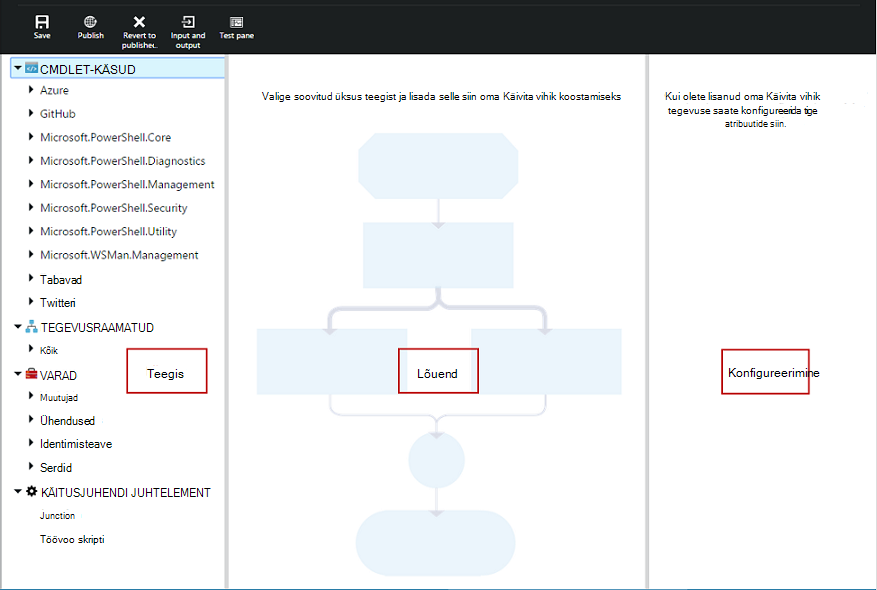

Järgmistes jaotistes kirjeldatakse pildiredaktor juhtelemente.

### Lõuend
Lõuend on, kus teie käitusjuhendi kujundada.  Tegevuste sõlmed teegi juhtelemendi lisamine käitusjuhendi ja kasutajaga määratleda käitusjuhendi loogika lingid.

Lõuend allosas juhtelementide abil saate suurendamine ja vähendamine.

### Teegi juhtelement

Teek on kui valite [tegevuste](#activities) lisamiseks oma käitusjuhendi.  Saate lisada need kuhu neid ühendada muude tegevuste lõuend.  See sisaldab nelja jaotised, mis on kirjeldatud järgmises tabelis.

| Jaotis | Kirjeldus |
|:---|:---|
| Cmdlet-käsud | Sisaldab cmdlet-käske, mida saab kasutada oma käitusjuhendi.  Mooduli järgi korrastatud cmdlet-käsud.  Kõigi kontol automatiseerimise installitud moodulid on saadaval.  |
| Tegevusraamatud |  Automatiseerimise teie konto sisaldab selle tegevusraamatud. Nende tegevusraamatud saate lisada kasutada lapse tegevusraamatud lõuend. Kuvatakse ainult tegevusraamatud redigeerib käitusjuhendi core sama tüüpi; Graafilised tegevusraamatud ainult PowerShelli-põhise tegevusraamatud kuvatakse, samal ajal graafiline PowerShelli töövoo tegevusraamatud kuvatakse ainult PowerShelli töövoo-põhise tegevusraamatud.
| Varad | Sisaldab [automatiseerimise varad](http://msdn.microsoft.com/library/dn939988.aspx) automatiseerimise kontoga, mida saate kasutada oma käitusjuhendi.  Kui lisate mõne käitusjuhendi vara, see lisab töövoo tegevuse, mis toob valitud vara.  Muutuv varade, puhul saate valida kas muutuja või määrata muutuja toimingu lisamine.
| Käitusjuhendi juhtelement | Sisaldab käitusjuhendi juhtelemendi tegevused, mida saab kasutada oma praeguse käitusjuhendi. *Junction* võtab mitme sisendina ja ootab, kuni kõik on valmis enne jätkamist töövoo. *Koodi* tegevuse töötab üks või mitu rida sõltuvalt graafilise käitusjuhendi PowerShelli või PowerShelli töövoo koodi.  Selle toiminguga saate kohandatud koodi või funktsioonid, mis on raske saavutada teiste tegevuste jaoks.|

### Konfiguratsiooni kontroll

Konfigureerimine on kus esitate üksikasjad objektiga lõuend. Saadaolevad selle juhtelemendi atribuudid sõltuvad valitud objekti tüüp.  Kui valite suvandi konfiguratsiooni kontroll, avaneb täiendavad labad täiendavat teavet pakkumiseks.

### Testige juhtelement

Esmakordsel käivitamisel pildiredaktor testi juhtelementi ei kuvata. See on avatud, millal te interaktiivseks [graafilise käitusjuhendi testida](#graphical-runbook-procedures).  

## Graafilised käitusjuhendi toimingute 

### Eksportimine ja importimine graafiline käitusjuhendi

Saate eksportida vaid graafilise käitusjuhendi avaldatud versiooni.  Kui käitusjuhendi pole veel avaldatud, seejärel nuppu **ekspordi avaldatud** keelatakse.  Kui klõpsate nuppu **ekspordi avaldatud** , laaditakse käitusjuhendi kohalikus arvutis.  Faili nimi oleks sama laiendiga *graphrunbook* käitusjuhendi nimi.

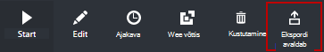

Graafilised või graafiline PowerShelli töövoo käitusjuhendi faili saate importida, valides suvandi **importimine** on käitusjuhendi lisamisel.   Kui valite imporditav fail, saate säilitada sama **nime** või sisestage uus.  Pärast seda hinnatakse valitud faili ja kui proovite valige mõnda muud tüüpi, mis ei sobi, sõnumi esitatakse, märkides on võimalikud konfliktid ja teisendamisel, võib olla süntaksi vigu, kuvatakse Käitusjuhendi tüüp väljal Tüüp käitusjuhendi.  

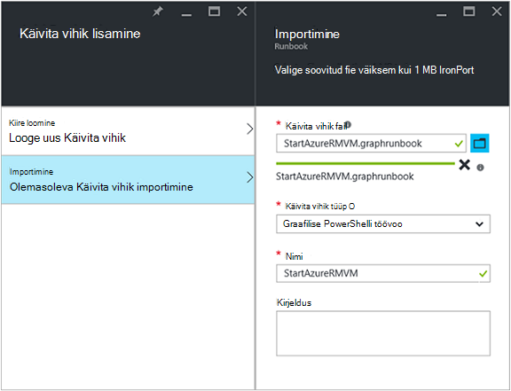

### Graafilised käitusjuhendi testimine

Saate testida mustand versioon on käitusjuhendi Azure'i portaalis avaldatud versiooni käitusjuhendi jättes muutmata või uue käitusjuhendi testida enne, kui see on avaldatud. See võimaldab teil tuvastada, kas käitusjuhendi töötab õigesti enne asendades avaldatud versiooni. Kui soovitud käitusjuhendi testimiseks mustand käitusjuhendi käivitatakse ja kõik toimingud, mida see teeb on lõpule viidud. Töö ajalugu on loodud, kuid väljund kuvatakse paanil Test väljund. 

Käitusjuhendi redigeerimiseks avada testi juhtelemendi jaoks soovitud käitusjuhendi avamiseks ja seejärel klõpsake nuppu **testi paani** .

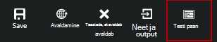

Sisendparameetrid küsib testi juhtelement ja saate alustada käitusjuhendi, klõpsates nuppu **Start** .

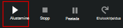

### Graafilised käitusjuhendi avaldamine

Iga käitusjuhendi Azure'i automaatika on mustand ja avaldatud versioon. Avaldatud versioon on saadaval käivitada ja saab redigeerida ainult mustand versiooni. Avaldatud versioon on mustand versiooni muudatused ei mõjuta. Kui mustand versioon on valmis, et see oleks kättesaadav, siis avaldate selle, mis kirjutab avaldatud versioon mustand versiooniga.

Graafilised käitusjuhendi saate avaldada, avades käitusjuhendi redigeerimise ja seejärel klõpsake nuppu **Avalda** .

Kui soovitud käitusjuhendi pole veel avaldatud, on see olek on **Uus**.  Kui see on avaldatud, on see olek on **avaldatud**.  Kui redigeerite käitusjuhendi, kui see on avaldatud ja mustand ja avaldatud versioonid on erinevad, on käitusjuhendi olekut **redigeerimisel**.

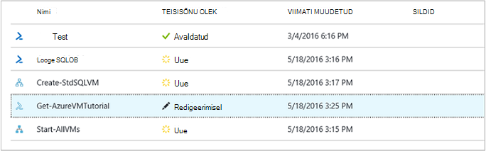 

Samuti on teil võimalus on käitusjuhendi avaldatud versiooni taastamiseks.  See põhjustab ära kõik muutused alates käitusjuhendi viimast avaldamist ja asendab mustand versiooni käitusjuhendi avaldatud versioon.

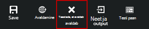

## Tegevuste

Tegevused on mõne käitusjuhendi koosteüksused.  Tegevus võib olla PowerShelli cmdlet-käsu, lapse käitusjuhendi või töövoo tegevuse.  Saate lisada toimingu käitusjuhendi klõps Raamatukogu juhtelemendi ja valides **Lisa lõuend**.  Seejärel saate klõpsake ja lohistage selle paigutada lõuendil, mida soovite suvalisse tegevuse.  Asukoha selle tegevuse lõuendile efekti toimimise käitusjuhendi mis tahes viisil.  Saate paigutuse oma käitusjuhendi aga leiate kõige sobivam visualiseerida oma tegevust. 

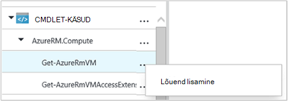

Valige tegevuse konfigureerida selle atribuudid ja parameetrite konfigureerimine tera lõuendile.  Saate muuta **sildi** tegevuse midagi, mida on teile kirjeldav.  Algne cmdlet endiselt käitatakse, muudate lihtsalt oma kuvatav nimi, mida kasutatakse pildiredaktor.  Sildi peab olema kordumatu käitusjuhendi raames. 

### Parameetri väärtuse.

Parameetri kogum määratleb kohustuslike ning valikuliste parameetrite aktsepteerib kindla cmdlet-käsu väärtused.  Kõigi cmdlet-käsud on vähemalt ühe parameetri seadmine ja mõned on mitu.  Kui cmdlet-käsu parameetri mitmele kriteeriumikogumile, siis peate valima millise enne parameetrid saate konfigureerida kasutama hakkab.  Saate konfigureerida parameetrid sõltub parameetri kogum, mille valimisel.  Saate muuta kasutatavaid tegevust, valides **Parameetri seadmine** ja valige veel mõni parameeter määramine.  Sel juhul mis tahes parameetrite väärtused, mille konfigureerisite lähevad kaotsi.

Järgmises näites on Get-AzureRmVM cmdlet kolme parameetri komplekti.  Parameetrite väärtused ei saa konfigureerida, kuni te valite ühte parameeter.  ListVirtualMachineInResourceGroupParamSet parameetri määramine on tagastamise kõik virtuaalmasinates ressursi rühma ja ühe valikuline parameeter.  Funktsiooni GetVirtualMachineInResourceGroupParamSet on määratlemiseks virtuaalse masina soovite tagastada ja on kaks kohustuslik ja üks valikuline parameeter.

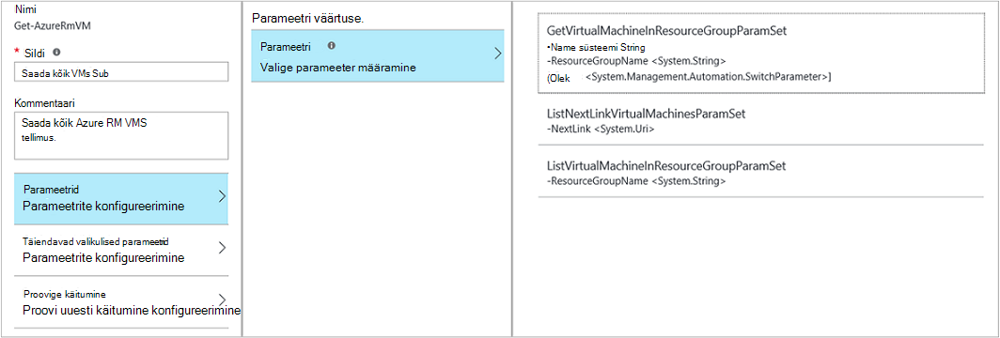

#### Parameetrite väärtused

Kui määrate parameetri väärtus, valige andmeallika määrata, kuidas määratud väärtus.  Kindla parameetri jaoks saadaolevaid andmeallikate sõltub selle parameetri sobivad väärtused.  Näiteks ei ole tühi kättesaadav võimalus parameeter, mis ei Luba tühiväärtusi.

| Andmeallikas | Kirjeldus |
|:---|:---|
|Konstantne väärtus|Tippige parameetri väärtus.  See on saadaval ainult puhul järgmist tüüpi andmetega: Int32 Int64, stringi, kahendväärtus, kuupäev ja kellaaeg, vahetamine. |
|Tegevuse väljund|Toimingu väljund mis eelneb praeguse tegevuse töövoo.  Kõik lubatud tegevused on loetletud.  Valige lihtsalt tegevuse selle väljundi kasutamiseks parameetri väärtuse.  Kui tegevuse väljundid mitme atribuudid objekti, seejärel saate tippida nime atribuudi pärast tegevuse.|
|Käitusjuhendi sisendit |Valige tegevuse parameetri sisendina käitusjuhendi sisendparameetrile.|  
|Muutuv vara|Valige automatiseerimise muutuv sisendina.|  
|Mandaadi vara|Valige soovitud automatiseerimise mandaati sisendina.|  
|Serdi vara|Valige soovitud serdi automatiseerimine sisendina.|  
|Ühenduse vara|Valida automatiseerimise ühenduse sisendina.| 
|PowerShelli avaldis|Määrake lihtsa [PowerShelli avaldis](#powershell-expressions).  Avaldist hinnatakse enne tegevuse ja tulem kasutatakse parameetri väärtuse.  Saate viidata väljundi või käitusjuhendi sisendparameetrile muutujat.|
|Pole konfigureeritud|Kustutab kõik eelnevalt konfigureeritud väärtus.|

#### Täiendavad valikulised parameetrid

Kõigi cmdlet-käsud on võimalus anda täiendavad parameetrid.  Need on PowerShelli levinud parameetrid või muud kohandatud parameetrid.  Tekstivälja, kuhu saate sisestada parameetrite abil PowerShelli süntaks on esitatud.  Näiteks **Verbose** levinud parameetrit kasutada soovite määrata **"-Verbose: $True"**.

### Proovige tegevus

**Proovige käitumine** võimaldab toimingu käivitada mitu korda, kuni teatud tingimus on täidetud, sarnaselt esitatavaks.  Saate selle funktsiooni tegevused, mida peaks töötama mitu korda, on palju vigu ja võib-olla vaja rohkem kui üks katse õnnestumise jaoks või väljundi andmed tegevuse kehtivad andmed.    

Kui lubate proovi uuesti tegevuse, saate seada viivituse ja tingimus.  On aeg (mõõdetuna sekundit või minutit) käitusjuhendi oodake enne tegevuse uuesti käivitamist.  Kui määratud viivitust, siis tegevuse käivitage uuesti kohe pärast seda, kui see on lõpule jõudnud. 

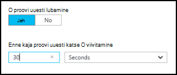

Proovi uuesti tingimus on PowerShelli avaldis, mida iga kord, kui käivitatakse tegevuse pärast.  Kui avaldis annab tulemuseks vea True, siis tegevuse käivitatakse uuesti.  Kui avaldis annab tulemuseks vea False siis tegevuse käivitage uuesti ja liigub järgmisele tegevusele käitusjuhendi. 

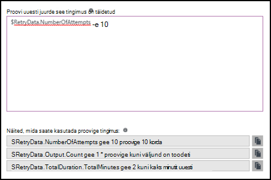

Proovi uuesti tingimus saate kasutada nimetatakse $RetryData abil teavet tegevuse korduskatsed muutujana.  Järgmises tabelis on muutuja atribuudid.

| Atribuut | Kirjeldus |
|:--|:--|
| NumberOfAttempts | Mitu korda, tegevuse käivitatud.              |
| Väljund           | Viimase tegevuse Käivita väljund.                    |
| TotalDuration    | Ajastatud möödunud tegevuse käivitati esimest korda. |
| StartedAt        | Aja tegevuse käivitatakse esimest korda UTC-vormingus.           |

Järgmised näited tegevuse proovige tingimused.

    # Run the activity exactly 10 times.
    $RetryData.NumberOfAttempts -ge 10 

    # Run the activity repeatedly until it produces any output.
    $RetryData.Output.Count -ge 1 

    # Run the activity repeatedly until 2 minutes has elapsed. 
    $RetryData.TotalDuration.TotalMinutes -ge 2

Kui olete tegevuse uuesti tingimus, sisaldab tegevuse kaks visuaalsete meelde.  Üks on esitatud tegevuse ja teine on, kui vaatate tegevuse konfiguratsiooni.

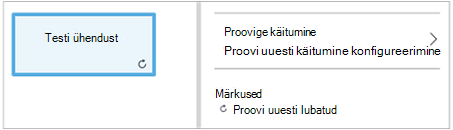

### Töövoo skripti juhtelement

Koodi juhtelement on teisiti tegevust, mida aktsepteerib PowerShelli või töövoo PowerShelli skripti sõltuvalt graafilise käitusjuhendi on loodud selleks, et pakkuda funktsionaalsust, mis muidu ei pruugi olla saadaval.  Seda ei saa vastu võtta parameetrid, kuid seda saab kasutada muutujat tegevuse väljundi ja käitusjuhendi sisendparameetrid.  Mis tahes väljundi tegevuse lisatakse selle databus juhul, kui see on väljaminevat link pole sel juhul lisatakse need väljundi käitusjuhendi raames.

Näiteks järgmine kood teostab kuupäeva arvutused käitusjuhendi Sisestuskeel muutuja nimega $NumberOfDays abil.  Seejärel saadab arvutatud kuupäev aja väljundina kasutada järgmiste tegevuste käitusjuhendi.

    $DateTimeNow = (Get-Date).ToUniversalTime()
    $DateTimeStart = ($DateTimeNow).AddDays(-$NumberOfDays)}
    $DateTimeStart

## Linkide ja töövoo

Graafilised käitusjuhendi **link** ühendab kaks tegevust.  See kuvatakse nool allikas tegevusest osutab sihtkoha tegevuse lõuend.  Tegevuste käivitamiseks käivitamine pärast andmeallika tegevus lõpetab sihtkoha tegevusega noole suunda.  

### Lingi loomine

Looge seos kahe tegevusi, valides andmeallika tegevuse ja klõpsates ringi kujundi allosas.  Lohistage noolt sihtkoha tegevuste ja väljaanne.

Valige link konfigureerimiseks konfiguratsiooni tera selle atribuute.  See hõlmab lingi tüüp, mida on kirjeldatud järgmises tabelis.

| Lingi tüüp | Kirjeldus |
|:---|:---|
| Müügivõimaluste | Tegevuse sihtkoht on üks kord iga objekti väljundi jaoks andmeallika tegevuse käivitada.  Sihtkoha tegevuse ei tööta, kui andmeallika tegevuse tulemuseks pole väljund.  Andmeallika tegevuse väljund on saadaval objektina.  |
| Järjestus | Sihtkoha tegevuse töötab ainult üks kord.  Ta saab objektide massiivi tegevuse allikas.  Andmeallika tegevuse väljund on saadaval objektide massiivina. |

### Tegevuste käivitamine

Graafilised käitusjuhendi alustada mis tahes tegevused, mida ei saa saada sissetuleva link.  Sageli on ainult üks tegevust, mis oleks käivitamine tegevuste jaoks käitusjuhendi.  Kui mitme puudub saada sissetuleva link, siis käitusjuhendi hakkab käitades neid samal ajal.  See siis järgi linke muude tegevuste käivitamiseks, nagu iga on lõpule jõudnud.

### Tingimused

Kui teie määratud tingimus lingi sihtkohta tegevuse on käitada ainult siis, kui tingimus annab tulemuseks vea true.  Tavaliselt kasutate $ActivityOutput muutujat mõne tingimus väljundi andmeallika tegevuse toomiseks.  

Müügivõimaluste link, saate määrata ühe objekti tingimus ja tingimus hinnatakse iga objekti väljundi andmeallika tegevuse alusel.  Sihtkoha tegevuse käivitage iga objekti, mis vastab tingimus.  Näiteks koos allika tegevusala Get-AzureRmVm järgmist süntaksit saab tingimusvormingu müügivõimaluste link tuua ainult virtuaalmasinates ressursi jaotises nimega *rühmitamisel rühm 1*.  

    $ActivityOutput['Get Azure VMs'].Name -match "Group1"

Lingi jada tingimus ainult hinnatakse üks kord kuna ühe massiivi tagastatakse, mis sisaldab kõigi objektide väljundi andmeallika tegevuse.  Seetõttu ei saa kasutada filtreerimine nagu müügivõimaluste link jada link, kuid lihtsalt kindlaks, kas järgmisel tegevuse käitatakse. Võtke näiteks järgmised kogumi tegevuste meie käivitamine VM käitusjuhendi.  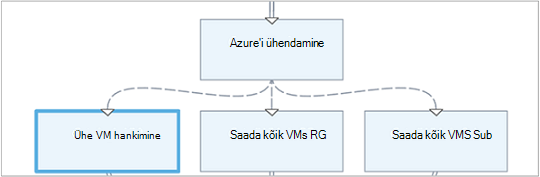 
On kolme eri jada linke, mis kinnitatava väärtused esitati kaks käitusjuhendi sisendparameetrite tähistav VM ja ressursirühma nimi määramiseks vastavat toiming - st ühe VM käivitamine, käivitage kõik VMs resouce jaotises või kõigi VMs tellimuse.  Jada lingi toomine ühe VM vahel ühenduse Azure'i siin loogika tingimus.

    <# 
    Both VMName and ResourceGroupName runbook input parameters have values 
    #>
    (
    (($VMName -ne $null) -and ($VMName.Length -gt 0))
    ) -and (
    (($ResourceGroupName -ne $null) -and ($ResourceGroupName.Length -gt 0))
    )

Tingimusvormingu lingi kasutamisel filtreeritakse tingimus selle kontoris muu tegevuse allikas tegevuse olemasolevad andmed.  Kui tegevus on mitu lingid allikas, siis iga haru tegevuste olevate andmete sõltub tingimus selle haru ühenduse link.

Näiteks alustab **Algus-AzureRmVm** tegevuse allpool käitusjuhendi kõik virtuaalmasinates.  See on kaks tingimusvormingu lingid.  Esimene tingimusvormingu link kasutab avaldise *$ActivityOutput ["Start AzureRmVM"]. IsSuccessStatusCode - eq $true* filtreerimiseks kui algus-AzureRmVm tegevuse lõpule viidud.  Teine kasutab avaldise *$ActivityOutput ["Start AzureRmVM"]. IsSuccessStatusCode - ne $true* filtreerimiseks kui algus-AzureRmVm tegevuse virtuaalse masina käivitamine nurjus.  

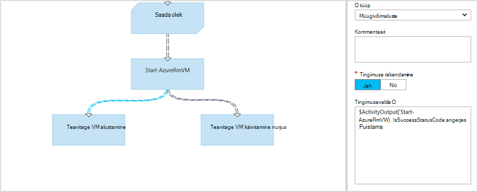

Mis tahes tegevust, mis tuleneb esimene link ja tegevuste väljund Get-AzureVM ainult saada Get-AzureVM töötavad ajal käivitamise virtuaalmasinates kasutab.  Mõni teine link järgneva tegevuse ainult saada soovitud virtuaalmasinates, mis on peatatud Get-AzureVM töötavad ajal.  Mis tahes tegevuse kolmanda linki saada kõik virtuaalmasinates sõltumata nende töökorras olekus.

### Nende

Ristmikul on teisiti tegevust, mida oodata, kuni kõik sissetulevad harude on lõpule viidud.  See võimaldab teil mitme tegevuste paralleelselt, ja veenduge, et kõik on valmis enne.

Ajal ristmikul võib olla piiramatu arvu sissetulevad lingid, mitte rohkem kui üks neid linke saab müügivõimaluste.  Sissetuleva jada linkide arv on piiratud pole.  Teil on õigus ristmikul loomine mitme müügivõimaluste sissetulevad lingid ja salvestage käitusjuhendi, kuid see ei õnnestu käivitamisel.

Järgmises näites on osa käitusjuhendi, korraga alla plaastrid peaks rakenduma need masinad kogumi virtuaalmasinates käivitava.  Ristmikul abil saate tagada, et mõlemad protsessid on lõpule viidud enne käitusjuhendi jätkub.

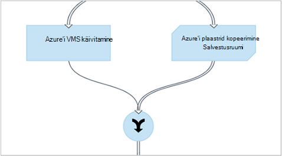

### Tsüklid

Tsükkel on, kui sihtkoht tegevuse lingid tagasi selle andmeallika tegevuse või muu tegevuse, mis lõpuks lingid tagasi oma allikas.  Tsüklit praegu pole lubatud graafiline koostamine.  Kui teie käitusjuhendi on tsükli, see salvestab õigesti, kuid saate tõrketeate, kui see töötab.

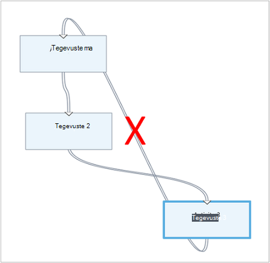

### Tegevuste andmete ühiskasutus

Kõik andmed, mis on väljasta tegevusega väljamineva lingiga kirjutatakse *databus* käitusjuhendi jaoks.  Mis tahes tegevusest käitusjuhendi saate kasutada andmete soovitud databus asustada parameetrite väärtused või skripti koodi kaasata.  Eelmise tegevuse töövoo väljundi pääsevad tegevus.     

Kuidas andmed on kirjutatud funktsiooni databus sõltub lingi tegevuse tüüp.  **Müügivõimaluste**andmed on väljundi hulgidiagrammid objektid.  Andmed on väljundi **järjestuse** link, massiivina.  Kui on ainult üks väärtus, tuleb väljundi ühe elemendi massiivi.

Pääsete andmete databus, kasutades ühte järgmistest kaks võimalust.  Esmalt on **Tegevuse väljundi** andmeallika kasutamine teise tegevuse parameetri asustamiseks.  Kui väljund on objekti, saate määrata ühe atribuudi.

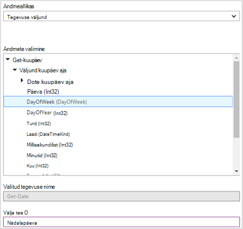

Saate kuulata ka väljundi andmeallika **PowerShelli avaldis** või **Töövoo skripti** tegevusest on ActivityOutput muutujaga.  Kui väljund on objekti, saate määrata ühe atribuudi.  ActivityOutput muutujate kasutada järgmist süntaksit.

    $ActivityOutput['Activity Label']
    $ActivityOutput['Activity Label'].PropertyName 

### Postkastid

Saate [postkastid](automation-powershell-workflow.md#checkpoints) graafiline PowerShelli töövoo käitusjuhendi, valides *kontrollpunkt käitusjuhendi* tegevus.  See põhjustab postkasti seadistamiseks pärast tegevuse käivitamist.

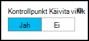

Postkastid on lubatud ainult graafiline PowerShelli töövoo tegevusraamatud, ei ole saadaval graafiline tegevusraamatud.  Kui käitusjuhendi kasutab Azure cmdlettide, peate järgima ühegi checkpointed liidesega on lisa-AzureRMAccount juhuks, kui käitusjuhendi on peatatud ja taaskäivitamist see kontrollpunkt erinevate töötaja kaudu. 

## Azure'i ressursid autentimine

Azure'i automaatika tegevusraamatud, mis Azure ressursside haldamine nõuab autentimist Azure.  Uue [konto käivitada nimega](automation-sec-configure-azure-runas-account.md) funktsiooni (nimetatakse ka põhisumma teenus) on vaikemeetod juurdepääs Azure'i ressursihaldur ressurssidele automaatika tegevusraamatud tellimus.  Seda funktsiooni saate lisada graafiline käitusjuhendi, lisades **AzureRunAsConnection** ühenduse varade, mis kasutab PowerShelli [Get-AutomationConnection](https://technet.microsoft.com/library/dn919922%28v=sc.16%29.aspx) cmdlet-käsk ja [Lisa-AzureRmAccount](https://msdn.microsoft.com/library/mt619267.aspx) cmdlet lõuend. See on kujutatud järgmises näites. 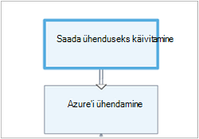 
Saada käivitada nimega ühenduse tegevuse (st Get-AutomationConnection) on konfigureeritud nimega AzureRunAsConnection andmeallika järele konstandi väärtus. 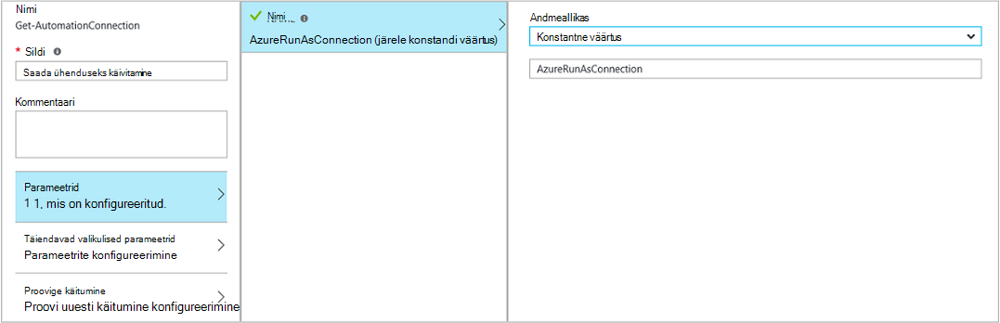 
Järgmisel tegevuse, lisa AzureRmAccount, lisab käitusjuhendi autenditud käivitada nimega konto kasutamiseks. 
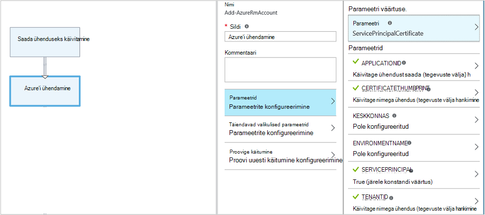 
Parameetrite **APPLICATIONID**, **CERTIFICATETHUMBPRINT**ja **TENANTID** peate määrama tee välja atribuudi nimi, kuna tegevuse väljundid objekti mitme atribuudid.  Muul juhul kui täidate käitusjuhendi, see ei õnnestu, autentimise proovimine.  See on vajalik vähemalt autentida oma käitusjuhendi kontoga käivitada.

Säilitada tagurpidi tellijad, kes on loodud automatiseerimise konto haldamine Azure'i teenus Management (ASM) või Azure ressursihaldur ressursid [Azure AD kasutajakonto](automation-sec-configure-aduser-account.md) abil ühilduvust, autentida meetod on lisa-AzureAccount cmdlet koos [mandaati varade](http://msdn.microsoft.com/library/dn940015.aspx) Azure'i konto juurdepääsu rakendust Active Directory tähistava.

Seda funktsiooni saate lisada graafiline käitusjuhendi, lisades mandaati varade toimingu lisa-AzureAccount, millele järgneb lõuend.  Lisada AzureAccount kasutatakse mandaati tegevuse selle sisestamiseks.  See on kujutatud järgmises näites.

Teil on kinnitamiseks alguses ja pärast iga kontrollpunkt käitusjuhendi raames.  See tähendab, et lisada lisamine lisa-AzureAccount tegevuse pärast mis tahes kontrollpunkt-töövoo tegevuse. Teil pole vaja lisaks mandaati tegevus alates saate kasutada sama 

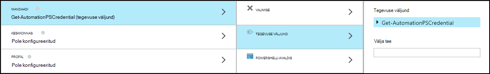

## Käitusjuhendi sisend ja väljund

### Käitusjuhendi sisendit

Mõne käitusjuhendi võib olla vaja sisestatud kasutaja, kes hakkavad käitusjuhendi Azure portaali kaudu või mõne muu käitusjuhendi kui praegune nimi kasutatakse tütarüksusena.
Näiteks, kui teil on käitusjuhendi, mis loob virtuaalse masina, peate pakuvad teavet, näiteks nimi virtuaalse masina ja muud atribuudid iga kord, kui hakkate käitusjuhendi.  

Sisestusmeetodi lisamine käitusjuhendi jaoks aktsepteerimist määratlemine ühte või rohkem sisendparameetrid.  Esitate järgmiste parameetrite väärtused iga kord, kui käivitatakse käitusjuhendi.  Azure'i portaalis on käitusjuhendi käivitamisel palutakse teil esitada iga soovitud käitusjuhendi sisendparameetrite väärtused.

Pääsete, klõpsates nuppu **sisestus- ja väljundi** käitusjuhendi tööriistaribal on käitusjuhendi sisendparameetrite.  

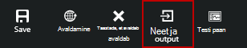 

Avatakse **sisestus- ja väljundi** juhtelement, kus saate redigeerida mõne olemasoleva sisendparameetrile või looge uus, klõpsates **sisestusmeetodi lisamine**. 

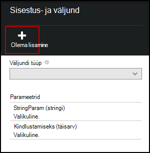

Iga sisendparameetrile on määratletud järgmise tabeli atribuudid.

|Atribuut|Kirjeldus|
|:---|:---|
| Nimi | Parameetri kordumatu nimi.  See võib sisaldada ainult alfa numbreid ja ei tohi sisaldada tühikut. |
| Kirjeldus | Valikuline kirjeldus sisendparameetrile.  |
| Tüüp | Andmetüüp oodata parameetri väärtuse.  Azure'i portaalis annab asjakohase kui sisendi küsimine iga parameetri andmetüüp. |
| Kohustusliku | Saate määrata, kas parameetri jaoks tuleb väärtuse.  Käitusjuhendi ei saa käivitada, kui te ei paku väärtus iga kohustuslik näitaja, mis on määratletud vaikeväärtus. |
| Vaikeväärtus | Saate määrata, millist väärtust kasutatakse parameetri jaoks, kui ei ole.  See võib olla Null või kindla väärtuse. |

### Käitusjuhendi väljund

Andmete loodud seda ei saa mõne väljamineva link lisatakse [väljundi käitusjuhendi raames](http://msdn.microsoft.com/library/azure/dn879148.aspx).  Väljund on salvestatud käitusjuhendi töö ja on saadaval ema käitusjuhendi käitusjuhendi tütarelemendina kasutamisel.  

## PowerShelli avaldised

Üks eeliseid graafiline loome on teile pakkuda võimalus koostamine on käitusjuhendi PowerShelli minimaalsete teadmisi.  Praegu, peate teadma PowerShelli natuke, kuigi ilma vaevata luua teatud [parameetrite väärtused](#activities) ja [link](#links-and-workflow)tingimused.  Sellest jaotisest leiate tutvustuse PowerShelli avaldiste kasutajatele, kellel ei pruugi olla kursis.  PowerShelli üksikasjad on saadaval [skriptimine Windows PowerShelli abil](http://technet.microsoft.com/library/bb978526.aspx). 

### PowerShelli avaldis andmeallikas

[Tegevuste parameetri](#activities) mõned PowerShelli koodi tulemustega asustamiseks saate kasutada andmeallikana PowerShelli avaldis.  See võib olla üks rida koodi, mis sooritavad mõne lihtsa funktsiooni või mitu rida, mis sooritavad teatud keerukate loogika.  Mis tahes väljundi käsust, mis pole määratud muutujat on parameetri väärtus. 

Näiteks järgmine käsk oleks väljund praegust kuupäeva. 

    Get-Date

Järgmised käsud tänasest kuupäevast stringi koostamine ja selle määramine muutujana.  Muutuja sisu saadetakse väljundisse 

    $string = "The current date is " + (Get-Date)
    $string

Järgmised käsud hinnata praeguse kuupäeva ja tagastab string, mis näitab, kas tänase päeva on nädalavahetuse või weekday. 

    $date = Get-Date
    if (($date.DayOfWeek = "Saturday") -or ($date.DayOfWeek = "Sunday")) { "Weekend" }
    else { "Weekday" }
    
 
### Tegevuse väljund

Eelmise tegevuse väljund käitusjuhendi kasutamiseks kasutada järgmist süntaksit $ActivityOutput muutuja.

    $ActivityOutput['Activity Label'].PropertyName

Näiteks võib teil tegevuse atribuut, mis nõuab virtuaalse masina nimi sellisel juhul võite kasutada järgmist avaldist.

    $ActivityOutput['Get-AzureVm'].Name

Kui atribuudi nõutav virtuaalse masina objekti asemel ainult atribuut, tuleks tagastada kogu objekti, kasutades järgmist süntaksit.

    $ActivityOutput['Get-AzureVm']

Toimingu väljund saate kasutada ka keerukamaid avaldises näiteks järgmisi, mis ühendab virtuaalse masina nimi tekst.

    "The computer name is " + $ActivityOutput['Get-AzureVm'].Name

### Tingimused

Väärtuste võrdlemine või kindlaks teha, kui väärtus on määratud mustrile [võrdlustehete](https://technet.microsoft.com/library/hh847759.aspx) abil.  Võrdlus tagastab väärtuse $true või $false.

Näiteks järgmine tingimus määrab, kas virtuaalse masina nimega *Get-AzureVM* tegevustest on praegu *peatatud*. 

    $ActivityOutput["Get-AzureVM"].PowerState –eq "Stopped"

Järgmine tingimus kontrollib, kas virtual samasse arvutisse on mis tahes peale *on peatatud*olekus.

    $ActivityOutput["Get-AzureVM"].PowerState –ne "Stopped"

Mitme tingimuse, nagu on [loogika tehtemärkide](https://technet.microsoft.com/library/hh847789.aspx) abil saate liituda **- ja** või **- või**.  Näiteks järgmine tingimus kontrollib, kas virtual samasse arvutisse eelmises näites on *peatatud* või *peatamine*olekus.

    ($ActivityOutput["Get-AzureVM"].PowerState –eq "Stopped") -or ($ActivityOutput["Get-AzureVM"].PowerState –eq "Stopping") 

### Hashtables

[Hashtables](http://technet.microsoft.com/library/hh847780.aspx) on nime ja väärtuse paarideks, mis on abiks tagastamine tulemuseks väärtuste kogumi.  Teatud tegevuste atribuutide võib oodata mõne lihtsa väärtuse asemel Hashtable talletatakse.  Samuti võite näha Hashtable talletatakse sõnastiku edaspidi nimega. 

Saate luua mõne Hashtable talletatakse järgmist süntaksit.  On Hashtable talletatakse võib olla mis tahes kirjete arv, kuid iga on määratletud nimi ja väärtus.

    @{ <name> = <value>; [<name> = <value> ] ...}

Näiteks järgmine avaldis loob mõne Hashtable talletatakse tegevuse parameeter, mis on Interneti-otsingu väärtustega Hashtable talletatakse oodatud andmeallika kasutamiseks.

    $query = "Azure Automation"
    $count = 10
    $h = @{'q'=$query; 'lr'='lang_ja';  'count'=$Count}
    $h

Järgmises näites kasutatakse nimetatakse *Twitteri ühendust saada* tegevuse väljund on Hashtable talletatakse asustamiseks.

    @{'ApiKey'=$ActivityOutput['Get Twitter Connection'].ConsumerAPIKey;
      'ApiSecret'=$ActivityOutput['Get Twitter Connection'].ConsumerAPISecret;
      'AccessToken'=$ActivityOutput['Get Twitter Connection'].AccessToken;
      'AccessTokenSecret'=$ActivityOutput['Get Twitter Connection'].AccessTokenSecret}

## Järgmised sammud

- Alustamine PowerShelli töövoo tegevusraamatud, lugege teemat [minu esimese PowerShelli töövoo käitusjuhendi](automation-first-runbook-textual.md) 
- Alustamine graafiline tegevusraamatud, lugege teemat [minu esimene graafiline käitusjuhendi](automation-first-runbook-graphical.md)
- Lisateavet käitusjuhendi tüübid, nende eelised ja piirangud leiate [Azure'i automaatika käitusjuhendi tüübid](automation-runbook-types.md)
- Kuidas autentida automatiseerimise käivitada nimega konto abil vt [Konfigureerimine Azure'i käivitada nagu konto](automation-sec-configure-azure-runas-account.md)
 
