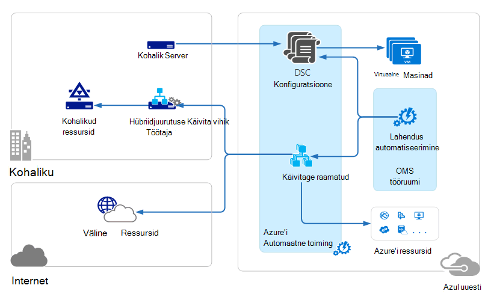
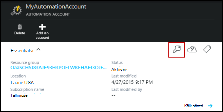
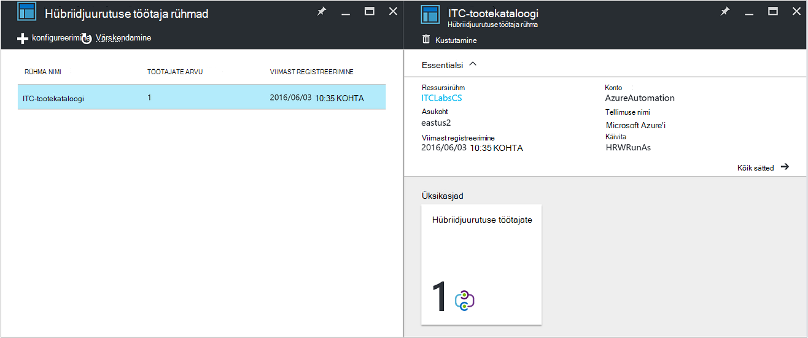
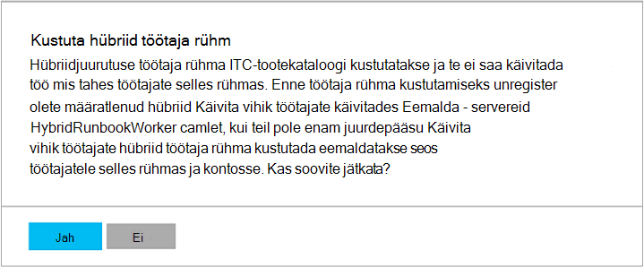

<properties
   pageTitle="Azure'i automaatika hü Käitusjuhendi töötajad | Microsoft Azure'i"
   description="Sellest artiklist leiate teavet mooduli installimiseks ja kasutamiseks hübriid Käitusjuhendi töötaja, mis on Azure automaatika, mis võimaldab käivitada tegevusraamatud masinad keskuses kohalikud andmed."
   services="automation"
   documentationCenter=""
   authors="mgoedtel"
   manager="jwhit"
   editor="tysonn" />
<tags
   ms.service="automation"
   ms.devlang="na"
   ms.topic="article"
   ms.tgt_pltfrm="na"
   ms.workload="infrastructure-services"
   ms.date="10/14/2016"
   ms.author="bwren" />

# Azure'i automaatika hübriid Käitusjuhendi töötajate

Azure'i automaatika tegevusraamatud ei pääse ressursid kohalikud andmed keskuses, kuna need Azure'i pilves.  Funktsiooni hübriid Käitusjuhendi töötaja Azure'i automaatika võimaldab käivitada tegevusraamatud arvutites, mis asub teie andmekeskuse juhtimiseks kohalikud ressursid. Funktsiooni tegevusraamatud talletatakse ja hallatava Azure automatiseerimine ja seejärel üks või mitu kohapealse masinad toimetatud.  

See funktsioon on näidatud järgmisel pildil.   

Saate määrata ühe või mitme arvutiga andmete keskuses tegutseda hübriid Käitusjuhendi töötaja ja käivitage tegevusraamatud Azure automatiseerimine.  Iga töötaja jaoks on vaja Microsoft Management Agent koos Microsoft Operations Management Suite- ja Azure automatiseerimine käitusjuhendi keskkonna ühenduse.  Operations Management Suite kasutatakse ainult installida ja hallata haldamise agent ja jälgida töötaja funktsioone.  Azure'i automaatika tegevusraamatud ja kasutada neid juhiseid läbi.

Sissetuleva tulemüüri nõuded toetamiseks hü Käitusjuhendi töötajad puuduvad. Kohalikus arvutis agent alustab Azure automatiseerimine pilveteenuses suhtlemiseks. Mõne käitusjuhendi käivitamisel loob Azure automatiseerimine agent toodud juhised. Agent siis tõmbab alla käitusjuhendi ja parameetrid enne selle käivitamist.  See toob ka [varad](http://msdn.microsoft.com/library/dn939988.aspx) kasutavad käitusjuhendi: Azure'i automatiseerimine.

>[AZURE.NOTE] Hübriidjuurutuse Käitusjuhendi töötajate [DSC konfiguratsioone](automation-dsc-overview.md)ei toeta.

## Hübriidjuurutuse Käitusjuhendi töötaja rühmad

Iga hübriid Käitusjuhendi töötaja on liige hübriid Käitusjuhendi töötaja rühma, mis teie määratud agent installimisel.  Rühma saate lisada ühe agent, kuid saate installida mitme agentide kõrge kättesaadavus rühm.

Hübriidjuurutuse Käitusjuhendi töötaja on käitusjuhendi käivitamisel teie määratud rühma, kus see töötab.  Rühma liikmete tehakse kindlaks, millised töötaja teenuse taotluse.  Te ei saa määrata mõne kindla töötaja.

## Hü Käitusjuhendi töötaja nõuded

Peate määrama vähemalt üks kohapealse arvuti käivitamiseks hü käitusjuhendi tööde haldamine.  See arvuti peab olema järgmised:

- Windows Server 2012 või uuem versioon
- Windows PowerShelli 4.0 või uuem versioon
- Vähemalt kaks ja -vormid 4 GB RAM

Võtke arvesse järgmisi soovitusi hübriid töötajate. 

- Määrata mitu hübriid töötajate iga rühma jaoks kõrge kättesaadavus.  
- Hübriidjuurutuse töötajate saate koos teenuse halduse automatiseerimine või System Center Orchestrator käitusjuhendi serveritega.
- Kaaluge arvuti füüsilise või asuva lähedal piirkonna konto automatiseerimise Kuna tööd andmete saadetakse Azure automatiseerimine kui tööd on lõpule jõudnud.

>[AZURE.NOTE] Hü Käitusjuhendi töötaja versioon 7.2.11136.0 toetavad praegu puhverserveri ainult koos PowerShelli skripti kaudu suhtlemiseks.  Töövoo PowerShelli skriptide tugi on saadaval tulevikus.  

### Puhverserveri ja tulemüüri sätete konfigureerimine

Kohapealne hübriid Käitusjuhendi töötaja ühenduse ja registreerida teenusega Microsoft toimingute komplekti (OMS), see peab olema juurdepääs pordinumber ja URL-ide allpool kirjeldatud.  See on lisaks [pordid ja URL-id, mis on vaja Microsoft Agenti jälgimine](../log-analytics/log-analytics-proxy-firewall.md#configure-proxy-and-firewall-settings-with-the-microsoft-monitoring-agent) OMS ühenduse. Kui kasutate puhverserverit agent ja OMS teenuste vahel, peate tagamaks, et asjakohased ressursid on kättesaadavad. Kui kasutate tulemüüri juurdepääsu piiramiseks Interneti-ühendus, peate lubada juurdepääsu oma tulemüüri konfigureerida. 

Loendi pordi- ja URL-ide hü Käitusjuhendi töötaja suhelda automatiseerimise jaoks vajalike allolevat teavet.

- Port: Ainult TCP 443 jaoks on vaja väljaminev Interneti-ühendus
- Globaalne URL: *.azure-automation.net

Kui teil on konkreetse piirkonna jaoks määratletud automatiseerimise konto ja te soovite piirata seda piirkondliku andmekeskuse suhtlemine, järgmises tabelis antakse DNS-i kirje iga piirkonna jaoks.

|**Piirkond**|**DNS-i kirje**|
|--------------|--------------|
|Lõuna-, Kesk-USA|scus-jobruntimedata-tootekataloogi-su1.azure-automation.net|
|Ida-USA 2|eus2-jobruntimedata-tootekataloogi-su1.azure-automation.net|
|Lääne Euroopa|Me-jobruntimedata-tootekataloogi-su1.azure-automation.net|
|Põhja-Euroopa|ne-jobruntimedata-tootekataloogi-su1.azure-automation.net|
|Kanada Central|koopia – jobruntimedata-tootekataloogi-su1.azure-automation.net|
|Kagu-Aasia|Sea jobruntimedata-tootekataloogi-su1.azure-automation.net|
|Keskse India|CID-jobruntimedata-tootekataloogi-su1.azure-automation.net|
|Jaapan Ida|jpe jobruntimedata-tootekataloogi-su1.azure-automation.net|
|Austraalia Kagu-|ase-jobruntimedata-tootekataloogi-su1.azure-automation.net|

## Installimise hübriid Käitusjuhendi töötaja

Alltoodud juhiseid kirjeldatakse, kuidas installida ja konfigureerida hübriid Käitusjuhendi töötaja.  Toimingute kaks esimest korda automatiseerimise keskkonna ja korrake juhiseid iga töötaja arvutis.

### 1. Operations Management Suite tööruumi loomine

Kui teil on juba mõne Operations Management Suite tööruumi, seejärel luua juhiste abil [häälestada oma tööruumi](https://technet.microsoft.com/library/mt484119.aspx). Kui te veel pole, saate mõne olemasoleva tööruumi.

### 2 automatiseerimise lahenduse lisamine Operations Management Suite tööruumi

Lahenduste lisada Operations Management Suite funktsioone.  Automaatika lahendus lisab funktsiooni Azure'i automaatika, sh hübriid Käitusjuhendi töötaja tugi.  Kui lisate oma tööruumi lahenduse, see automaatselt push töötaja komponentide agent arvuti, mida installimist järgmise juhise juurde.

Järgige veebisaidil [abil lahendusegalerii lahenduse lisamiseks](../log-analytics/log-analytics-add-solutions.md) **automatiseerimise** lahenduse lisamiseks oma Operations Management Suite tööruumi.

### 3. installida Microsoft Agenti jälgimine

Microsoft Agenti jälgimine ühendab Operations Management Suite arvutites.  Kui installite agent kohapealse arvutis ja ühendage see oma tööruumi, automaatselt alla vajalikud hübriid Käitusjuhendi töötaja komponendid.

Järgige veebisaidil [ühenduse loomine Windows arvutite Log Analytics](../log-analytics/log-analytics-windows-agents.md) agent kohapealse arvutisse installida.  Korrake seda toimingut mitmes arvutis lisada mitu töötajate keskkonna jaoks.

Kui agent on loonud Operations Management Suite, see kirjas paani Operations Management Suite **sätted** vahekaardil **Ühendatud allikad** .  Saate kontrollida õigesti agent allalaaditud automatiseerimise lahenduse, kui see on kaust nimega **AzureAutomationFiles** C:\Program Files\Microsoft jälgimise Agent\Agent.  Kinnitamiseks hübriidi Käitusjuhendi töötaja versiooni, saate liikuda C:\Program Files\Microsoft jälgimine Agent\Agent\AzureAutomation\ ja märkus selle \\ *versioon* alamkaust.   

### 4. installimine käitusjuhendi keskkonna ja ühenduse Azure automatiseerimine

Agent lisamisel Operations Management Suite sunnib alla **HybridRegistration** PowerShelli moodul, mis sisaldab **Lisa-HybridRunbookWorker** cmdlet automatiseerimine lahendus.  Selle cmdlet-käsu abil arvuti käitusjuhendi keskkonna installida ja registreerida Azure automatiseerimine.

Avage administraatoriõigustes PowerShelli seanss ja käivitage järgmised käsud importimiseks mooduli.

    cd "C:\Program Files\Microsoft Monitoring Agent\Agent\AzureAutomation\<version>\HybridRegistration"
    Import-Module HybridRegistration.psd1

Käivitage **Lisa-HybridRunbookWorker** cmdlet-käsk kasutades järgmist süntaksit:

    Add-HybridRunbookWorker –Name <String> -EndPoint <Url> -Token <String>

Azure'i portaalis keelest **Haldamine klahvid** cmdlet-käsu jaoks vajaliku teabe hankimine  See blade avamiseks elemendid paneeli automatiseerimise konto võtme ikooni.

- **Nimi** on hübriid Käitusjuhendi töötaja rühma nime. Kui selle rühma automatiseerimise konto juba olemas, siis praeguse arvuti lisatakse see.  Kui see pole juba olemas, siis see lisatakse.
- **Lõpp-punkti** on **Klahvid haldamine** tera väljale **URL-i** .
- **Turbeloa** on **Accessi primaarvõtme** tera **Klahvide haldamine** .  

Kasutage funktsiooni **-Paljusõnaline** Asendage **Lisa-HybridRunbookWorker** installimise kohta üksikasjalikku teavet saada.

### 5. installimine PowerShelli moodulid

Tegevusraamatud saate kasutada mis tahes tegevuste ja määratletud moodulid installitud keskkonnas Azure automatiseerimine cmdlettide.  Need moodulid automaatselt juurutatud kohapealse arvutisse küll, seega peate installima neid käsitsi.  Erandiks on Azure moodul, mis installitakse vaikimisi, pakkudes juurdepääsu cmdlettide kõigi Azure'i teenuste ja tegevuste Azure automatiseerimine.

Kuna funktsiooni hübriid Käitusjuhendi töötaja peamine eesmärk on kohalike ressursside haldamine, peate tõenäoliselt installida moodulid, mis toetavad järgmisi ressursse.  Teavet Windows PowerShelli moodulid installimise võib viidata [Moodulid installimisel](http://msdn.microsoft.com/library/dd878350.aspx) .

## Hü Käitusjuhendi töötaja eemaldamine

Saate ühe või mitme hübriid Käitusjuhendi töötajate eemaldada rühma või eemaldada jaotises vastavalt oma vajadustele.  Kohapealse arvutist hü Käitusjuhendi töötaja eemaldamiseks avage administraatoriõigustes PowerShelli seanss ja käivitage järgmine käsk – **Eemalda-HybridRunbookWorker** cmdlet-käsk.  Kasutage soovitud **-Paljusõnaline** minna eemaldamise protsessi üksikasjaliku Logi jaoks. 

See ei Eemalda arvutist, funktsioonid ja konfiguratsiooni hübriid Käitusjuhendi töötaja rolli Microsoft Agenti jälgimine.  

Rühma eemaldamiseks peate esmalt iga arvuti, mis on eespool näidatud käsu rühma liige hübriid Käitusjuhendi töötaja eemaldamine ja seejärel tehke jaotise eemaldamiseks tehke järgmist.  

1. Avage automatiseerimise konto Azure'i portaalis.
2. Valige paan **Hübriid töötajate rühmade** ja tera **Hübriid töötaja rühmad** , valige rühm, mille soovite kustutada.  Pärast teatud rühma valimist kuvatakse tera **hübriid töötaja jaotises** atribuudid.     
3. Valitud rühma enne atribuudid, klõpsake nuppu **Kustuta**.  Sõnumi palub teil kinnitada, et see toiming ja valige **Jah** , kui olete kindel, et soovite jätkata.    Selleks võib kuluda mitu sekundit täita ja jaotises **teatised** edenemisega saate jälgida menüüst.  

## Hübriidjuurutuse Käitusjuhendi töötaja tegevusraamatud käivitamine

[Azure'i automaatika lisamine Käitusjuhendi alates](automation-starting-a-runbook.md) kirjeldatakse neid erinevaid viise alustamiseks on käitusjuhendi.  Hübriidjuurutuse Käitusjuhendi töötaja lisab **RunOn** valik, kus saate määrata hübriid Käitusjuhendi töötaja rühma nime.  Kui rühm on määratud, on käitusjuhendi tuua ja töötajate rühmalt käivitamine.  Kui see suvand pole määratud, siis seda ei käivitata Azure automatiseerimine nagu tavaliselt.

Azure'i portaalis on käitusjuhendi käivitamisel ilmub **käitamist** suvandiga kus saate valida **Azure'i** või **Hü töötaja**.  Kui valite **Hübriid töötaja**, saate rühma lisamine rippmenüüst valida.

Kasutage parameetrit **RunOn** järgmise käsu abil võib alustada käitusjuhendi, mis on nimega Test-Käitusjuhendi hübriid Käitusjuhendi töötaja rühma nimega MyHybridGroup Windows PowerShelli kaudu.

    Start-AzureRmAutomationRunbook –AutomationAccountName "MyAutomationAccount" –Name "Test-Runbook" -RunOn "MyHybridGroup"

>[AZURE.NOTE] Parameetri **RunOn** lisati 0.9.1 versiooni Microsoft Azure'i PowerShelli cmdleti **Start-AzureAutomationRunbook** .  Peaksite [alla laadida uusim versioon](https://azure.microsoft.com/downloads/) , kui teil on varem installitud üks.  Ainult peate selle versiooni installimine töökoha, kus te algavad käitusjuhendi Windows PowerShelli kaudu.  Teil pole vaja töötaja arvutisse installida, v.a juhul, kui kavatsete alustada tegevusraamatud sellest arvutist.  Praegu ei saa käivitada soovitud käitusjuhendi hübriid Käitusjuhendi töötaja kaudu teise käitusjuhendi, kuna see nõuab Azure PowerShelli automatiseerimine kontol olema installitud uusim versioon.  Azure'i automaatika värskendatakse automaatselt ja automaatselt lükata töötajatele kiiresti uusim versioon.

## Käitusjuhendi õigused

Tegevusraamatud töötavate hübriid Käitusjuhendi töötaja ei saa kasutada sama [meetod, mis on tavaliselt kasutatakse tegevusraamatud autentimine Azure ressursse](automation-configuring.md#configuring-authentication-to-azure-resources) kuna ta saab juurdepääsu väljaspool Azure ressursse.  Käitusjuhendi, kas saate sisestada oma kohalikud ressursid autentimise või saate määrata RunAs konto ette kõik tegevusraamatud kasutaja kontekstis.

### Käitusjuhendi autentimine

Vaikimisi tegevusraamatud kestab kohalik süsteem konto kontekstis arvutisse kohapealse nii, et ta peab võimaldama oma autentimise ressursse, millele pääseb juurde.  

Saate kasutada cmdlet-käskude abil saate määrata nii, et saate autentida muudele ressurssidele mandaadi abil oma käitusjuhendi [mandaat](http://msdn.microsoft.com/library/dn940015.aspx) ja [serdi](http://msdn.microsoft.com/library/dn940013.aspx) varasid.  Järgmises näites on kujutatud osa käitusjuhendi, mida arvuti taaskäivitamist.  See toob identimisteabe mandaati varade ja muutuv varade arvuti nimi ja cmdletiga taaskäivitada arvuti kasutab need väärtused.

    $Cred = Get-AzureRmAutomationCredential -ResourceGroupName "ResourceGroup01" -Name "MyCredential"
    $Computer = Get-AzureRmAutomationVariable -ResourceGroupName "ResourceGroup01" -Name  "ComputerName"

    Restart-Computer -ComputerName $Computer -Credential $Cred

Samuti saate kasutada [InlineScript](automation-powershell-workflow.md#inline-script) , mis võimaldab teil töötada mõnes muus arvutis kood plokid [PSCredential levinud parameetri](http://technet.microsoft.com/library/jj129719.aspx)määratud mandaadid.

### RunAs konto

Selle asemel tegevusraamatud esitada oma kohalikud ressursid autentimine, saate määrata **RunAs** konto hübriid töötaja rühma.  Teie määratud [mandaati varade](automation-credentials.md) , kellel on juurdepääs kohalikud ressursid ja kõik tegevusraamatud käivitatakse jaotises neid mandaate, kui jaotises hübriid Käitusjuhendi töötaja töötab.  

Kasutajanimi identimisteabega peab olema ühes järgmises vormingus:

- kasutaja domeeni 
- username@domain
- username (jaoks kohalikku arvutisse kohapealse kontod)

Järgmiste toimingute abil saate määrata RunAs konto hü töötaja rühma:

1. Saate luua vastava [mandaadi varade](automation-credentials.md) kohaliku ressurssidele.
2. Avage automatiseerimise konto Azure'i portaalis.
2. Valige paan **Hü töötaja rühmad** ning seejärel valige soovitud rühm.
3. Valige **Kõik sätted** ja seejärel **hübriidi töötaja rühma sätted**.
4. Muutmine **kui** **vaikimisi** **kohandatud**.
5. Valige mandaat, ja klõpsake nuppu **Salvesta**.

## Hübriidjuurutuse Käitusjuhendi töötaja tegevusraamatud loomine

Ei ole vahet tegevusraamatud Azure automatiseerimine ja need, mis töötavad hübriid Käitusjuhendi töötaja töötavad struktuuri. Tegevusraamatud, mida kasutate iga tõenäoliselt erinevad märkimisväärselt küll Kuna tegevusraamatud hübriid Käitusjuhendi töötaja tavaliselt haldamine oma andmekeskuse kohaliku ressursside, ajal Azure'i automaatika tegevusraamatud tavaliselt haldamine ressursid Azure pilveteenuses. 

Saate redigeerida ka käitusjuhendi hü Käitusjuhendi töötaja Azure automatiseerimine, kuid teil olla probleeme, kui proovite testida käitusjuhendi redaktoris.  Juurdepääs kohalikud ressursid ei saa installida Azure automatiseerimine keskkond sel juhul mooduleid PowerShelli test nurjub.  Kui installite vajalikud moodulid, käitusjuhendi käivitage, kuid seda ei saa juurdepääs kogu katse kohaliku ressursid.

## Tõrkeotsingu tegevusraamatud hübriid Käitusjuhendi töötaja

[Käitusjuhendi väljundi ja sõnumid](automation-runbook-output-and-messages.md) saadetakse Azure automatiseerimine hübriid töötajate nagu käitusjuhendi töö käivitamine pilveteenuses.  Saate lubada Verbose ja edenemise voogu sama, nagu teeksite jaoks muud tegevusraamatud.  

Logide on talletatud kohalik iga töötaja hü C:\ProgramData\Microsoft\System Center\Orchestrator\7.2\SMA\Sandboxes.

Kui teie tegevusraamatud pole completeing edukalt töö kokkuvõtte näitab olek on **Suspended**, palun vaadake üle tõrkeotsingu artikkel [hü Käitusjuhendi töötaja: käitusjuhendi töö lõpeb olekut Suspended](automation-troubleshooting-hrw-runbook-terminates-suspended.md).   

## Seoses teenuse halduse automatiseerimine

[Teenuse automatiseerimine (SMA)](https://technet.microsoft.com/library/dn469260.aspx) võimaldab käivitada sama tegevusraamatud, toetatud Azure automatiseerimine keskuses kohalikud andmed. Üldiselt juurutatud SMA koos Windows Azure'i paketi, Windows Azure'i pakett sisaldab graafilist liidest SMA haldamiseks. Azure'i automaatika, erinevalt SMA nõuab kohaliku installi, mis sisaldab web serverites majutada API, andmebaasi tegevusraamatud ja SMA konfigureerimine ja Käitusjuhendi töötajate käitusjuhendi tööde käitamiseks. Azure'i automaatika pakub neid teenuseid pilves ja ainult nõuab teilt säilitamiseks hübriid Käitusjuhendi töötajate teie kohaliku keskkonnas.

Kui olete SMA olemasoleva kasutaja, saate liikuda Azure'i automaatika kasutada koos hübriid Käitusjuhendi töötaja muudatusi, eeldades, et nad oma autentida ressurssidele nimega kirjeldatud [loomise tegevusraamatud hübriid Käitusjuhendi töötaja](#creating-runbooks-for-hybrid-runbook-worker)oma tegevusraamatud.  Tegevusraamatud sma käivitage töötaja serveris, mis võib selle funktsiooni tegevusraamatud autentimise teenusekonto kontekstis.

Järgmiste kriteeriumide abil saate kindlaks määrata, kas Azure automatiseerimine hübriid Käitusjuhendi töötaja või teenuse halduse automatiseerimine enam teie vajadustele.

- SMA nõutav kohaliku install selle aluseks oleva komponendid, mis on ühendatud Windows Azure'i paketi kui graafiline haldamise liidest on vaja. Ressursside kohaliku vaja suurema hoolduskulusid kui Azure'i automaatika, mida tuleb ainult kohaliku käitusjuhendi töötajate installitud agenti. Agentide haldab Operations Management Suite, veelgi väheneb hoolduskulusid.
- Azure'i automaatika talletab selle tegevusraamatud pilves ja pakub neid kohapealse hübriid Käitusjuhendi töötajate. Kui teie turbepoliitika ei luba seda käitumist, peaksite kasutama SMA.
- SMA on kaasas süsteemi keskel; ning seetõttu tuleb System Center 2012 R2 litsentsi. Astmeline tellimuse mudeli aluseks on Azure automatiseerimine.
- Azure'i automaatika on täiustatud funktsioone, näiteks graafiline tegevusraamatud, mis ei ole saadaval SMA.

## Järgmised sammud

- Erinevad meetodid, mida saate kasutada käivitamiseks on käitusjuhendi kohta leiate lisateavet teemast [Azure automaatika lisamine Käitusjuhendi alates](automation-starting-a-runbook.md)
- Mõistmaks erinevate toimingute PowerShelli ja PowerShelli töövoo tegevusraamatud Azure'i automaatika teksti redaktoris töötamiseks, lugege teemat [redigeerimine soovitud Käitusjuhendi Azure'i automaatika](automation-edit-textual-runbook.md)

 
