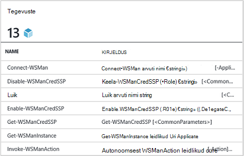
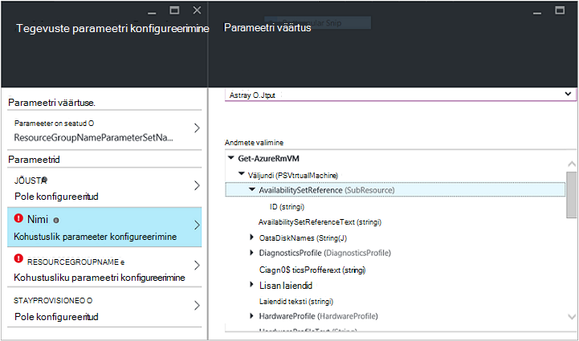
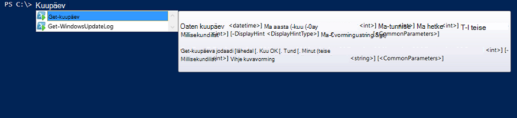

<properties
   pageTitle="Luua mõne integreerimine Azure automatiseerimine moodul | Microsoft Azure'i"
   description="Õpetus mis juhendab teid loomise, testimine ja näide kasutuse moodulid integreerimine Azure automatiseerimine."
   services="automation"
   documentationCenter=""
   authors="mgoedtel"
   manager="jwhit"
   editor="" />

<tags
   ms.service="automation"
   ms.workload="tbd"
   ms.tgt_pltfrm="na"
   ms.devlang="na"
   ms.topic="get-started-article"
   ms.date="09/12/2016"
   ms.author="magoedte" />

# <a name="azure-automation-integration-modules"></a>Azure'i automaatika integreerimine moodulid

PowerShelli on olulise tehnoloogia Azure automatiseerimine. Kuna Azure automatiseerimine on ehitatud PowerShelli, PowerShelli moodulid on laiendatavuse Azure'i automaatika võti. Selles artiklis me juhendab teid PowerShelli moodulid, "Integreerimine moodulid" ja oma PowerShelli moodulid loomise head tavad veenduge, et nad töötavad integreerimine moodulid sees Azure automatiseerimine Azure automatiseerimine kasutamise üksikasjad. 

## <a name="what-is-a-powershell-module"></a>Mis on PowerShelli moodul?

PowerShelli moodul on nagu **Get-kuupäeva** - või **Kopeeri üksuse**, mida saab kasutada PowerShelli konsooli skriptide töövood, tegevusraamatud ja PowerShelli DSC ressursid nagu Windows või fail, mida saab kasutada PowerShelli DSC konfiguratsioone PowerShelli cmdlet-käskude rühm. Funktsioone PowerShelli cmdlet-käskude ja DSC ressursside kaudu kokku ja iga cmdlet-käsu/DSC ressursi toetavad PowerShelli moodul, mitu mis PowerShelli abil endale saata. Näiteks cmdleti **Get-kuupäev** on osa Microsoft.PowerShell.Utility PowerShelli moodul, ning cmdlet-käsk **Kopeeri-üksus** on osa Microsoft.PowerShell.Management PowerShelli mooduli ja paketi DSC ressurss on osa PSDesiredStateConfiguration PowerShelli mooduli. Nii need moodulid saata PowerShelli abil. Kuid mitme PowerShelli moodulid ei saata PowerShelli osana ja selle asemel levitatakse nagu System Center 2012 Configuration Manager või suur PowerShelli ühenduse kohad nagu PowerShelli Galerii esimese või muude tootjate toodete.  Moodulid on kasulik, kuna tegemise keerukaid ülesandeid lihtsam kapseldatud funktsiooni kaudu.  Saate lisateavet [PowerShelli moodulid MSDN-is](https://msdn.microsoft.com/library/dd878324%28v=vs.85%29.aspx). 

## <a name="what-is-an-azure-automation-integration-module"></a>Mis on Azure automatiseerimine integreerimine moodul?

Mõne integreerimine mooduli ei erine PowerShelli mooduli. Selle lihtsalt PowerShelli moodul, mis sisaldab soovi korral ühe faili - metaandmete faili täpsustades Azure automatiseerimine ühendusetüübi, kasutatakse tegevusraamatud mooduli cmdlet-käskude abil. Valikuline faili või mitte, nende PowerShelli moodulid saab importida Azure automatiseerimine kättesaadavaks nende cmdlet-käskude kasutamiseks tegevusraamatud ja nende DSC ressursid DSC konfiguratsioone kasutamiseks saadaval. Varjatult Azure automatiseerimine salvestab need moodulid ja käitusjuhendi töö ja DSC compiliation töö täitmise ajal laadib need Azure automatiseerimine Liivakastid, kus tegevusraamatud on täidetud ja DSC konfiguratsioone on koostatud.  DSC ressursse moodulid paigutatakse automaatselt ka serveris automatiseerimise DSC pull nii, et ta saab tõmmata masinad katsel DSC konfiguratsioone rakendada.  Saadame arvu Azure PowerShelli moodulid välja kasti Azure automatiseerimine saate kasutada nii, et saate alustada automatiseerimine Azure halduse kohe, kuid saate hõlpsasti importida PowerShelli moodulid mis tahes süsteemi, teenuse või tööriista, mille soovite integreerida. 

>[AZURE.NOTE] Teatud moodulid saadetakse nimega "globaalne moodulid" teenuses automatiseerimine. Globaalne moodulid on saadaval välja kasti kui loote konto automatiseerimine ja värskendame neid vahel, mis automaatselt sunnib neid kontole automatiseerimine. Kui te ei soovi neid automaatselt värskendada, saate alati importida sama mooduli ise ja mis on ülimuslik selle moodul, mis saadame teenus globaalne mooduli versioon. 

Impordite mõne integreerimine mooduli paketi vorming on tihendatud faili mooduli ja ZIP laiendamine sama nimi. See sisaldab Windows PowerShelli mooduli ja mis tahes täiendavaid faile, sealhulgas manifestifaili (.psd1), kui mooduli on üks.

Kui mooduli peaks sisaldama on Azure automatiseerimine ühendusetüübi, peab sisaldama ka nimega fail *<ModuleName>*-Automation.json, mis määrab ühenduse tüüpi atribuudid. See on json faili mooduli kaustas Tihendatud ZIP-faili asukoht ja sisaldab väljad "side" mida on vaja ühenduse süsteemi või teenuse mooduli tähistab. See lõpuks luua ühenduse tüüp Azure automatiseerimine. Selle faili saate määrata väljade nimed, kasutades tipib, kas väljad tuleb krüptitud ja / või valikuline mooduli ühenduse tüübi jaoks. Malli json-failivormingus on järgmine:

```
{ 
   "ConnectionFields": [
   {
      "IsEncrypted":  false,
      "IsOptional":  false,
      "Name":  "ComputerName",
      "TypeName":  "System.String"
   },
   {
      "IsEncrypted":  false,
      "IsOptional":  true,
      "Name":  "Username",
      "TypeName":  "System.String"
   },
   {
      "IsEncrypted":  true,
      "IsOptional":  false,
      "Name":  "Password",
   "TypeName":  "System.String"
   }],
   "ConnectionTypeName":  "DataProtectionManager",
   "IntegrationModuleName":  "DataProtectionManager"
}
```

Kui teil on juurutatud teenuse halduse automatiseerimine ja loodud integreerimine moodulid pakettide jaoks oma automaatika tegevusraamatud, see peaks välja nägema väga tuttav. 


## <a name="authoring-best-practices"></a>Loome head tavad

Ainult integreerimine moodulid on põhiosas PowerShelli moodulid, mis ei tähenda meil tavade loome nende ümber. On veel mitmeid asju, soovitame kaaluda ajal loome PowerShelli moodul, teha seda kõige kasulikumad Azure'i automaatika. Mõned neist on Azure automatiseerimine teatud ja mõned neist on kasulik teha vaid teie moodulid töötavad hästi PowerShelli töövoo, olenemata sellest, kas kasutate automatiseerimine. 

1. Kokkuvõtte, kirjeldus, kaasa ja spikker URI igas moodulis cmdlet-käsu. PowerShelli, saate määrata teatud abi teavet cmdlet-käskude kohta **Abi saamiseks** cmdlet-käsu kasutamine abi saamiseks kasutaja jaoks. Siin on näiteks saate määratleda ülevaade ja spikker URI PowerShelli mooduli .psm1 faili kirjutatud.<br>  

    ```
    <#
        .SYNOPSIS
         Gets all outgoing phone numbers for this Twilio account 
    #>
    function Get-TwilioPhoneNumbers {
    [CmdletBinding(DefaultParameterSetName='SpecifyConnectionFields', `
    HelpUri='http://www.twilio.com/docs/api/rest/outgoing-caller-ids')]
    param(
       [Parameter(ParameterSetName='SpecifyConnectionFields', Mandatory=$true)]
       [ValidateNotNullOrEmpty()]
       [string]
       $AccountSid,

       [Parameter(ParameterSetName='SpecifyConnectionFields', Mandatory=$true)]
       [ValidateNotNullOrEmpty()]
       [string]
       $AuthToken,

       [Parameter(ParameterSetName='UseConnectionObject', Mandatory=$true)]
       [ValidateNotNullOrEmpty()]
       [Hashtable]
       $Connection
    )

    $cred = CreateTwilioCredential -Connection $Connection -AccountSid $AccountSid -AuthToken $AuthToken

    $uri = "$TWILIO_BASE_URL/Accounts/" + $cred.UserName + "/IncomingPhoneNumbers"
    
    $response = Invoke-RestMethod -Method Get -Uri $uri -Credential $cred

    $response.TwilioResponse.IncomingPhoneNumbers.IncomingPhoneNumber
    }
    ```
<br> 
Mis see teave ainult ei kuvata seda abi **Abi saamiseks** cmdlet PowerShelli konsooli abil, kuvatakse nähtavaks tegemine ka seda abi funktsioonile Azure'i automaatika, nt lisamisel tegevuse käigus käitusjuhendi loome. "Üksikasjaliku spikri vaatamiseks" klõpsates avatakse abi URI Azure automatiseerimine juurdepääsuks kasutate veebibrauseri menüüle.<br>
2. Kui mooduli töötab vastu kaugsüsteem, on. See peaks sisaldama integreerimise mooduli metaandmete fail, mis määratleb selle kaugsüsteem tähendab ühenduse tüüp ühenduse vajalik teave. b. Iga cmdlet mooduli peaks oskama võtta ühendust objekti (nt selle ühendusetüübi) parameetrina.  
    Cmdlet-käskude mooduli muutuvad kui lubate, läbides objekti ühenduse tüüp väljadega parameetrina cmdlet Azure automatiseerimine kasutamine lihtsamaks. See viis kasutajate pole vastendama parameetrite ühenduse vara selle cmdlet vastavate parameetrite iga kord, kui nad kõne cmdlet-käsu. Ülaltoodud näites käitusjuhendi põhjal, kasutab Twilio ühenduse varade nimetatakse CorpTwilio Twilio juurdepääsu ja tagastada kõik telefoninumbrid kontole.  Pange tähele, kuidas see on ja parameetrid cmdlet ühenduse väljade vastendamise?<br>

    ```
    workflow Get-CorpTwilioPhones
    {
      $CorpTwilio = Get-AutomationConnection -Name 'CorpTwilio'
    
      Get-TwilioPhoneNumbers 
        -AccountSid $CorpTwilio.AccountSid  
        -AuthToken $CorptTwilio.AuthToken
    }
    ```
<br>
Paremaid võimalus see lähenemine möödub otse ühendust objekti cmdlet-

    ```
    workflow Get-CorpTwilioPhones
    {
      $CorpTwilio = Get-AutomationConnection -Name 'CorpTwilio'

      Get-TwilioPhoneNumbers -Connection $CorpTwilio
    }
    ```
<br>
Saate lubada, lubades tal aktsepteerida ühenduse objekti otse parameetrina, mitte ainult ühenduse väljad parameetrite käitumine oma cmdlettide järgmiselt. Tavaliselt peaksite iga, määrake parameetri nii, et kasutaja ei kasuta Azure automatiseerimine saate helistada ilma ehitamine on Hashtable talletatakse tegutseda ühenduse objekti oma cmdlet-käsud. Parameetri seadmine **SpecifyConnectionFields** allpool kasutatakse edasi ühenduse väljaatribuutide ükshaaval. **UseConnectionObject** abil saate edastada ühenduse kohe. Nagu näete, võimaldab saada-TwilioSMS cmdlet [Twilio PowerShelli mooduli](https://gallery.technet.microsoft.com/scriptcenter/Twilio-PowerShell-Module-8a8bfef8) , läbides mõlemal viisil: 

    ```
    function Send-TwilioSMS {
      [CmdletBinding(DefaultParameterSetName='SpecifyConnectionFields', `
      HelpUri='http://www.twilio.com/docs/api/rest/sending-sms')]
      param(
         [Parameter(ParameterSetName='SpecifyConnectionFields', Mandatory=$true)]
         [ValidateNotNullOrEmpty()]
         [string]
         $AccountSid,

         [Parameter(ParameterSetName='SpecifyConnectionFields', Mandatory=$true)]
         [ValidateNotNullOrEmpty()]
         [string]
         $AuthToken,

         [Parameter(ParameterSetName='UseConnectionObject', Mandatory=$true)]
         [ValidateNotNullOrEmpty()]
         [Hashtable]
         $Connection

       )
    }
    ```
<br>
3. Määratleda mooduli väljund tüüpi kõigi cmdlet-käsud. Cmdlet-käsu jaoks soovitud väljundi tüüpi määratlemine võimaldab kujundusaja IntelliSense'i aitab teil otsustada cmdlet-käsu kasutamise ajal loome väljundi atribuudid. See on eriti kasulik automatiseerimise käitusjuhendi graafiline loome, kus kujundus aja teadmisi on lihtne kasutaja kogemus oma mooduli võti.<br> <br> See on sarnane on cmdlet väljund PowerShell ISE "tüüp edasi" funktsionaalsust ilma seda käivitamiseks.<br> <br>
4. Cmdlet-käskude mooduli ei peaks keeruka objekti tüübid parameetrite. PowerShelli töövoo erineb PowerShelli, et see talletab keerukate tüüpi deserialized vorm. Lihtsad tüüpi jäävad nimega primitiivid, kuid keeruline teisendatakse deserialized versioonid, mis on põhiosas Atribuudikotid. Näiteks kui kasutasite cmdleti **Get-protsess** on käitusjuhendi (või PowerShelli töövoo, et asi), see annaks objekti tüüp [Deserialized.System.Diagnostic.Process], mitte oodatud [System.Diagnostic.Process] tüüp. Seda tüüpi on ühesugused-deserialized tüüp, kuid eelnevate meetoditega ei atribuudid. Ja kui proovite edastama selle väärtuse parameetrina cmdlet-käsu, kus cmdlet eeldab, et selle parameetri väärtuse [System.Diagnostic.Process], kuvatakse järgmine tõrketeade: *ei saa töödelda argumendi teisendus parameetrit "protsess". Tõrge: "tüüp"Deserialized.System.Diagnostics.Process"tüüp"System.Diagnostics.Process","System.Diagnostics.Process (CcmExec)"väärtust ei saa teisendada.*   Selle põhjuseks on tippige vastuolu oodatud tüüp [System.Diagnostic.Process] ja [Deserialized.System.Diagnostic.Process] antud tüüp. Selle probleemi lahendamiseks on teie mooduli cmdlet-käsud võta keerukate tüüpi parameetrite tagamiseks. Siin on vale viis seda teha.

    ```
    function Get-ProcessDescription {
      param (
            [System.Diagnostic.Process] $process
      )
      $process.Description
    }
    ``` 
<br>
Ja siin on õige, võttes primitiivne, mida saab kasutada ettevõttesiseselt cmdlet keerukate objekti ostke ja kasutage seda. Kuna cmdlettide käivitada PowerShelli kontekstis, mitte PowerShelli töövoo cmdlet $process sees muutub õiget tüüpi [System.Diagnostic.Process].  

    ```
    function Get-ProcessDescription {
      param (
            [String] $processName
      )
      $process = Get-Process -Name $processName

      $process.Description
    }
    ```
<br>
Ühenduse varasid tegevusraamatud on hashtables, mis on keerukas tüüp, ja veel need hashtables tundub, et on võimalik, et läks cmdlet-käsud oma – andmeühenduse parameeter täiesti, pole cast erandiga. Tehniliselt PowerShelli Mõned sõnumitüübid, on võimalik siirata õigesti oma sarjadesse jaotatud vormilt oma deserialized vormi ja seega saab läks cmdlettide parameetrite vastu võtmist mitte - deserialized tüüp. Hashtable talletatakse on üks järgmistest. On võimalik, et mooduli Autor määratletud tüüpi nii, et need õigesti andmeatribuutide samuti rakendada, kuid on mõned kompromissidega teha. Tüüp peab on vaikimisi konstruktori, on kõik selle atribuute, mis on avalik ja on mõne PSTypeConverter. Siiski juba määratud puhul, mis mooduli autor ei ole oma, ei ole nii "" nende lahendamiseks, seega soovitus keerukate tüüpi parameetrite kõik koos vältimiseks. Näpunäide Käitusjuhendi loome: kui mingil põhjusel teie cmdlettide vaja võtta keerukas tüüp parameetri või kasutate kellegi teise moodul, mis nõuab parameetrit keerukas tüüp, PowerShelli töövoo tegevusraamatud ja PowerShel töövoogude kohaliku PowerShellis lahendus on mähkimiseks cmdlet, mis loob keerukas tüüp ja cmdlet, mis tarbib keerukate sama InlineScript tegevuse tüüp. Kuna InlineScript aktiveeritakse selle sisu PowerShelli asemel PowerShelli töövoo, oleksid genereerimine keerukas tüüp cmdlet selle õiget tüüpi, mitte deserialized keerukas tüüp.
5. Tehke kõik cmdlettide mooduli kodakondsuseta. PowerShelli töövoog käivitatakse iga cmdlet erinevate seansi nimega töövoog. See tähendab, et cmdlet-käsud, seansi olek loodud / muudetud cmdletid sama mooduli sõltuvad PowerShelli töövoo tegevusraamatud ei tööta.  Siin on näide sellest, mida ei tohi teha.

    ```
    $globalNum = 0
    function Set-GlobalNum {
       param(
           [int] $num
       )
      
       $globalNum = $num
    }
    function Get-GlobalNumTimesTwo {
       $output = $globalNum * 2
     
       $output
    }
    ```
<br>
6. Mooduli peaksid täielikult sisalduma Xcopy võimalik paketis. Kuna Azure automatiseerimine moodulid jaotatud automatiseerimise Liivakastid kui tegevusraamatud vaja käivitada, peavad selle hosti need töötavad sõltumatult tegema. Mida see tähendab, et teil peaks oskama Zip mooduli paki, teisaldage see mõni muu host PowerShelli sama või uuem versioon, ja on see funktsioon nagu tavaliselt importimisel selle hosti PowerShelli keskkonnas. Selleks, mis juhtub, tuleks mooduli ei sõltu faile väljaspool mooduli kausta (kausta, millele saab üles ZIP importimine Azure automatiseerimine) või mis tahes kordumatu registrisätete hosti, nagu need on määratud toote installi. Kui tava ei järgita, ei saa mooduli kasutatav Azure'i automaatika.  

## <a name="next-steps"></a>Järgmised sammud

- Alustamine PowerShelli töövoo tegevusraamatud, lugege teemat [minu esimese PowerShelli töövoo käitusjuhendi](automation-first-runbook-textual.md)
- PowerShelli moodulid loomise kohta leiate lisateavet teemast [Windows PowerShelli moodul kirjutamine](https://msdn.microsoft.com/library/dd878310%28v=vs.85%29.aspx)