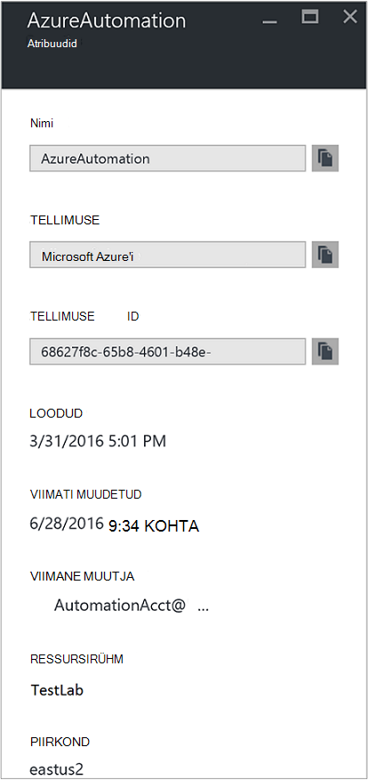

<properties
    pageTitle="Edasi töö oleku ja töö voogu automatiseerimise Log Analytics (OMS) | Microsoft Azure'i"
    description="Selles artiklis näitab, kuidas saata töö oleku ja käitusjuhendi töö voogu Microsoft toimingud halduse komplekti Log Analytics esitamisel täiendavat teavet ja haldus."
    services="automation"
    documentationCenter=""
    authors="MGoedtel"
    manager="jwhit"
    editor="tysonn" />
<tags
    ms.service="automation"
    ms.devlang="na"
    ms.topic="article"
    ms.tgt_pltfrm="na"
    ms.workload="infrastructure-services"
    ms.date="09/22/2016"
    ms.author="magoedte" />

# Edasi töö oleku ja töö voole automatiseerimise Log Analytics (OMS)

Automaatika saate saata käitusjuhendi töö oleku ja töö voogu oma Microsofti toimingute komplekti (OMS) Log Analytics tööruumi.  Ajal saate vaadata selle teabe Azure'i portaalis või PowerShelliga üksikute detailse oleku vaatamine või automatiseerimise arvesse kõik tööd, midagi täpsemalt toetama oma tegevuse nõuetele peab teil luua kohandatud PowerShelli skriptide.  Nüüd logige Anaytics saate teha järgmist.

- Ülevaate saamiseks oma töö automatiseerimine 
- Päästik e-posti või teatise põhjal käitusjuhendi töö oleku (nt nurjus või peatada) 
- Kirjutage oma töö voogu üle täpsemaid päringuid 
- Seostada töö automatiseerimine kontode vahel 
- Oma töö ajalugu visualiseerimine aja jooksul     

## Eeltingimused ja juurutamise kaalutlused

Alustada Log Analytics oma automatiseerimise logid saata, peab teil olema järgmist:

1. Tellimuse OMS. Lisateabe saamiseks lugege teemat [Alustamine Log Analytics](../log-analytics/log-analytics-get-started.md).  

    >[AZURE.NOTE]OMS tööruumi ja automatiseerimise konto peavad olema sama Azure tellimuse selleks, et selle konfiguratsiooni õigesti töötada. 
  
2. [Azure Storage konto](../storage/storage-create-storage-account.md).  
   
    >[AZURE.NOTE]Salvestusruumi konto *peab* olema sama piirkonna kontona automatiseerimine. 
 
3. Azure'i PowerShelli versiooniga 1.0.8 või uuemat versiooni töö ülevaated cmdlet-käske. Lisateabe saamiseks selles versioonis ja kuidas seda installida, vaadake, [Kuidas installida ja konfigureerida Azure PowerShelli](../powershell-install-configure.md).
4. Azure'i diagnostika- ja Log Analytics PowerShelli.  Lisateavet selles versioonis ja kuidas seda installida, lugege teemat [Azure diagnostika- ja Log Analytics](https://www.powershellgallery.com/packages/AzureDiagnosticsAndLogAnalytics/0.1).  
5. [PowerShelli Galerii](https://www.powershellgallery.com/packages/Enable-AzureDiagnostics/1.0/DisplayScript)PowerShelli skripti **Luba-AzureDiagnostics.ps1** alla laadida. See skript tuleb konfigureerida järgmist:
 - Salvestusruumi konto käitusjuhendi töö oleku ja voo andmete automatiseerimise konto teie määratud mahutamiseks.
 - Luba see talletatakse konto Azure'i bloobimälu salvestusruumi JSON-vormingus automatiseerimise kontolt andmete kogumine.
 - Konfigureerida andmete kogumise bloobimälu salvestusruumi kontolt OMS Log Analytics abil.
 - Luba automatiseerimise Log Analytics lahenduse OMS tööruumis.   

**Luba-AzureDiagnostics.ps1** skripti nõuab järgmiste parameetrite käitamise ajal tehke järgmist.

- *AutomationAccountName* - automatiseerimist oma konto nimi
- *LogAnalyticsWorkspaceName* - OMS tööruumi nimi

Väärtuste leidmiseks *AutomationAccountName*Azure'i portaalis valige konto automatiseerimise keelest **automatiseerimise konto** ja valige **Kõik sätted**.  Keelest **Kõik sätted** jaotises **Konto sätted** valige **Atribuudid**.  Labale **Atribuudid** saate võtke arvesse järgmisi väärtuseid.  .

## Log Analytics häälestamise integreerimine

1. Teie arvutis, käivitage **Windows PowerShelli** **avakuva** kaudu.  
2. Käsurea PowerShell kest, liikuge kausta, mis sisaldab skripti, saate alla laadida ja seda muuta parameetrite väärtused *- AutomationAccountName* ja *- LogAnalyticsWorkspaceName*.

    >[AZURE.NOTE] Teil palutakse pärast täidate skripti Azure autentida.  Te **peate** Logi sisse kontoga, millel on tellimuse administraatorid rolli liige ja koostöö administraator tellimuse.   
    
        .\Enable-AzureDiagnostics -AutomationAccountName <NameofAutomationAccount> `
        -LogAnalyticsWorkspaceName <NameofOMSWorkspace> `

3. Pärast selle skripti käivitamine peaksite nägema kirjete Logi Analytics 30 minuti pärast uue Diagnostikaandmete kirjutatakse salvestusruumi.  Kui kirjeid pole saadaval, kui seekord viidata tõrkeotsingu jaotises [JSON](../log-analytics/log-analytics-azure-storage-json.md#troubleshooting-configuration-for-azure-diagnostics-written-to-blob-in-json)failid järgmises vormingus bloobimälu.

### Veenduge, et konfigureerimine

Kinnitamiseks skripti konfigureeritud automatiseerimise konto ja OMS wokspace edukalt, saate teha järgmist PowerShelli.  Enne selle kohta, et leida oma OMS tööruumi nimi ja ressursside rühma nime Azure'i portaalis väärtused liikumine Log Analytics (OMS) ja labale Log Analytics (OMS) Märkus väärtuse **nimi** ja **Ressursirühma**.   kasutame neist kahest väärtusest, kui me kontrollige konfiguratsiooni oma OMS tööruumis PowerShelli cmdlet-käsk [Get-AzureRmOperationalInsightsStorageInsight](https://msdn.microsoft.com/library/mt603567.aspx)abil.

1.  Azure'i portaalis, liikuge salvestusruumi kontod ja Otsi järgmine salvestusruumi konto, mis kasutab nimetamistava - *AutomationAccountNameomsstorage*.  Pärast soovitud käitusjuhendi töö lõpulejõudmist varsti hiljem peaksite nägema kaks bloobimälu ümbriste loodud - **ülevaateid – logid-joblogs** ja **ülevaateid – logid-jobstreams**.  

2.  Käivitage PowerShelli kaudu PowerShelli järgmine kood, muutuvad väärtused parameetrite **ResourceGroupName** ning **WorkspaceName** , mis kopeeritud või märkida varasemas versioonis.  

    Logi sisse – AzureRmAccount Get-AzureRmSubscription - SubscriptionName "SubscriptionName" | Set-AzureRmContext Get-AzureRmOperationalInsightsStorageInsight - ResourceGroupName "OMSResourceGroupName" "-tööruumi"OMSWorkspaceName" 

    Tagastab määratud OMS tööruumi salvestusruumi ülevaate.  Soovime kinnitamiseks salvestusruumi ülevaate me määratud varem automatiseerimise konto on olemas ja objekti **olek** kuvatakse väärtus **OK**.  .

## Kasutusanalüüsi kirjed

Automaatika loob OMS hoidla kahte tüüpi kirjeid.

### Töö logid

Atribuut | Kirjeldus|
----------|----------|
Aeg | Kuupäev ja kellaaeg, millal käitusjuhendi töö käivitada.|
ResourceIdkasutamisel | Saate määrata Azure'i ressursi tüüp.  Automaatika, väärtus on seotud käitusjuhendi automatiseerimine konto.|
operationName | Saate määrata Azure sooritatud toimingu tüüp.  Automaatika, saab töö väärtus.|
resultType | Käitusjuhendi töö olek.  Võimalikud väärtused on: – Alustamine -On peatatud -Peatatud -Nurjus. -Õnnestus|
resultDescription | Kirjeldatakse käitusjuhendi töö tulemi olekus.  Võimalikud väärtused on: – Töö käivitamist -Töö nurjus -Töö lõpetatud|
CorrelationId | GUID, mis on käitusjuhendi töö korrelatsiooni ID-d.|
Kategooria | Liigitus andmete tüüpi.  Automaatika, väärtus JobLogs.|
RunbookName | Käitusjuhendi nimi.|
JobId | GUID, mis on käitusjuhendi töö ID-d.|
Helistaja |  Kes algatatud toiming.  Võimalikud väärtused on e-posti aadress või süsteemi ajastatud tööd.|

### Töö voogu
Atribuut | Kirjeldus|
----------|----------|
Aeg | Kuupäev ja kellaaeg, millal käitusjuhendi töö käivitada.|
ResourceIdkasutamisel | Saate määrata Azure'i ressursi tüüp.  Automaatika, väärtus on seotud käitusjuhendi automatiseerimine konto.|
operationName | Saate määrata Azure sooritatud toimingu tüüp.  Automaatika, saab töö väärtus.|
resultType | Käitusjuhendi töö olek.  Võimalikud väärtused on: -InProgress|
resultDescription | Sisaldab väljundi voo käitusjuhendi kaudu.|
CorrelationId | GUID, mis on käitusjuhendi töö korrelatsiooni ID-d.|
Kategooria | Liigitus andmete tüüpi.  Automaatika, väärtus JobStreams.|
RunbookName | Käitusjuhendi nimi.|
JobId | GUID, mis on käitusjuhendi töö ID-d.|
Helistaja | Kes algatatud toiming.  Võimalikud väärtused on e-posti aadress või süsteemi ajastatud tööd.| 
StreamType | Töö voo tüüp. Võimalikud väärtused on: – Edenemine -Väljund -Hoiatus -Tõrge -Silumine -Paljusõnaline|

## Log Analytics logib vaatamine automatiseerimine 

Nüüd, kui olete oma automatiseerimise töö logid saata Log Analytics alustanud, vaatame, mida saate teha neid logisid OMS sees.   

### Meilisõnumit saata, kui käitusjuhendi töö nurjub või peatab 

Meie ülemisel kliendi küsib, on võimalus saata e-posti või teksti, kui midagi läheb valesti käitusjuhendi töö.   

Reegli loomiseks alustate log otsida käitusjuhendi töö kirjeid, mida tuleks autonoomsest teatise loomine.  Nupp **teatise** seejärel on saadaval nii, et saate luua ja konfigureerida reegli.

1.  Klõpsake lehe OMS ülevaade **Log otsing**.
2.  Otsingupäringu Logi oma teatise loomine, tippides päring välja järgmine: `Category=JobLogs (ResultType=Failed || ResultType=Suspended)`.  Saate ka rühma selle RunbookName abil: `Category=JobLogs (ResultType=Failed || ResultType=Suspended) | measure Count() by RunbookName_s`.   
  
    Kui olete loonud logid rohkem kui üks automatiseerimise konto või tellimuse oma tööruumi, saate võib huvi rühmitamise teatiste tellimus või automatiseerimise konto.  Automaatika konto nime saab saadud ressursi välja JobLogs otsing.  

3.  Klõpsake **teatiste** lehe ülaosas **Reegli lisamine** Kuva avamiseks.  Täpsemat teavet teatise konfigureerimiseks suvandite kohta leiate teemast [Log Analytics teatised](../log-analytics/log-analytics-alerts.md#creating-an-alert-rule).

### Otsige üles kõik tööd, mis on tõrgetega lõpule viidud 

Lisaks teavitamine põhinevad off tõrkeid, tõenäoliselt soovite teada, kui käitusjuhendi töö on tulnud-lõpetatakse tõrge (PowerShelli annab tulemiks veaväärtuse voogu, kuid -lõpetatakse tõrked ei põhjusta oma töö peatada või nurjuda).    

1. OMS portaalis, klõpsake nuppu **Log Otsi**.
2. Tippige väljale päringu `Category=JobStreams StreamType_s=Error | measure count() by JobId_g` ja seejärel klõpsake nuppu **Otsi**.

### Kuva töö voole töö  

Kui teil on silumine tööd, võite ka vaadata töö voogu.  Päringu allpool kuvatud kogu ühe GUID 2ebd22ea-e05e-4eb9 – 9d 76-d73cbd4356e0 töökohta, selle välja.   

`Category=JobStreams JobId_g="2ebd22ea-e05e-4eb9-9d76-d73cbd4356e0" | sort TimeGenerated | select ResultDescription` 

### Ajalooliste töö oleku kuvamine 

Lõpuks soovite visualiseerida ajaloo töö aja jooksul.  Selle päringu abil saate otsida oma tööde oleku aja jooksul. 

`Category=JobLogs NOT(ResultType="started") | measure Count() by ResultType interval 1day`  
   

## Kokkuvõte

Saates automatiseerimise töö oleku ja voo andmete Log Analytics, saate oma automatiseerimise tööde häälestades teatiste märku, kui seal on probleeme ja kohandatud armatuurlaudade abil täpsemaid päringuid käitusjuhendi tulemused visualiseerida oleku, käitusjuhendi detailse oleku vaatamine ja muude seotud võtmenäitajate või mõõdikute parema ülevaate.  See aitab funktsionaalseid nähtavamaks ja aadress juhtumite kiiremini.  

## Järgmised sammud

- Lisateavet selle kohta, kuidas koostada erinevate otsingupäringuid ja uurimiseks automatiseerimise töö logid Log Analytics vaadata [Log otsinguid Log Analytics](../log-analytics/log-analytics-log-searches.md)
- Mõistmaks, kuidas luua ja tuua väljundi ja tõrketeated tegevusraamatud, vt [Käitusjuhendi väljundi ja teated](automation-runbook-output-and-messages.md) 
- Lisateavet käitusjuhendi täitmise, kuidas jälgida käitusjuhendi töö ja tehnilised üksikasjad leiate teemast [Jälita käitusjuhendi töö](automation-runbook-execution.md)
- OMS Log Analytics ja andmeallikate saidikogumi kohta leiate lisateavet teemast [Azure kogumise talletusmahu andmete Log Analytics ülevaade](../log-analytics/log-analytics-azure-storage.md)