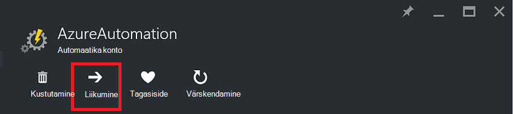
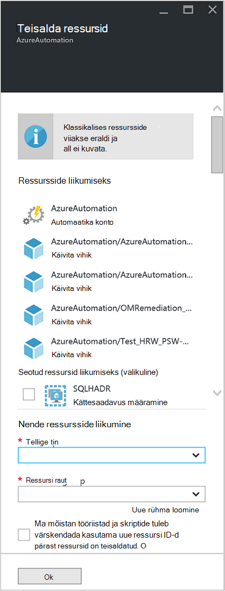

<properties
   pageTitle="Migreerimine automatiseerimise konto ja ressursid | Microsoft Azure'i"
   description="Selles artiklis kirjeldatakse Azure automatiseerimine ja seotud ressursid konto automatiseerimine ühe tellimuse teise teisaldada."
   services="automation"
   documentationCenter=""
   authors="MGoedtel"
   manager="jwhit"
   editor="tysonn" />
<tags
   ms.service="automation"
   ms.devlang="na"
   ms.topic="article"
   ms.tgt_pltfrm="na"
   ms.workload="infrastructure-services"
   ms.date="07/07/2016"
   ms.author="magoedte" />

# <a name="migrate-automation-account-and-resources"></a>Migreerimine automatiseerimise konto ja ressursid

Automaatika kontod ja selle seotud ressursid (st varad, tegevusraamatud, moodulid jne), mille olete loonud Azure portaali ja soovite migreerida ühest ressursirühm teisele või ühest tellimuselt teisele, võite saavutada selle hõlpsalt Azure'i portaalis [teisaldamine ressursid](../resource-group-move-resources.md) funktsiooni abil. Siiski enne selle toimingu, tuleks esmalt läbi vaatama [kontroll ressursside enne](../resource-group-move-resources.md#Checklist-before-moving-resources) järgmist ja lisaks loendi all konkreetse automatiseerimine.   

1.  Sihtkoha tellimuse/ressursirühma peab olema sama piirkonna allikana.  Tähendus, ei saa teisaldada automatiseerimise kontod piirkondade lõikes.
2.  Liikudes ressursid (nt tegevusraamatud, töö jne), nii andmeallika rühma ja sihtrühma on lukus toimingu kestel. Kirjutamine ja kustutada toimingud on blokeeritud rühmad kuni teisaldamist on lõpule viidud.  
3.  Mis tahes tegevusraamatud või muutujaid, mis viitavad ressursi või tellimuse ID: olemasolevale tellimusele tuleb värskendada pärast migreerimise lõpuleviimist.   


>[AZURE.NOTE] See funktsioon ei toeta jooksva klassikaline automatiseerimise ressursid.

## <a name="to-move-the-automation-account-using-the-portal"></a>Automaatika konto portaalis liikumiseks

1. Automatiseerimise kontolt nuppu **Teisalda** tera ülaosas.<br> <br> 
2. Enne **teisaldamine ressursid** Pange tähele, et selle esitatav nii automatiseerimise konto ja teie ressursside rühm(ad) seotud ressursid.  Valige soovitud **tellimus** ja **ressursirühm** ripploendite, või valige suvand **uue ressursirühma loomine** ja sisestage uus ressursi rühma nimi vastavale väljale.  
3. Vaadake üle ja märkige ruut, et teil kinnitada *mõista tööriistad ja skriptide tuleb värskendada kasutama uue ressursi ID-d pärast ressursid on teisaldatud* ja seejärel klõpsake nuppu **OK**.<br> <br>   

See toiming võtab mitu minutit.  **Teatised**, esitatakse teile iga toimingut, mis toimub – valideerimise, migreerimise, oleku ja seejärel lõpuks, kui see on valmis.     

## <a name="to-move-the-automation-account-using-powershell"></a>PowerShelli kasutamine automatiseerimise konto teisaldamiseks

Olemasoleva automatiseerimine ressursid teisaldamiseks teise ressursirühm või tellimuse kasutada **Get-AzureRmResource** cmdlet teatud automatiseerimise konto ja seejärel **Teisaldamine-AzureRmResource** cmdlet-käsu tegema liikuda.

Esimese näites kujutatakse automatiseerimise konto teisaldamiseks uue ressursirühma.

   ```
    $resource = Get-AzureRmResource -ResourceName "TestAutomationAccount" -ResourceGroupName "ResourceGroup01"
    Move-AzureRmResource -ResourceId $resource.ResourceId -DestinationResourceGroupName "NewResourceGroup"
   ``` 

Kui täidate eeltoodud näites kood, küsitakse teilt, kas soovite selle toimingu kinnitamiseks.  Kui nuppu **Jah** ja skripti jätkamiseks luba, saavad kõik teatised kui ta sooritab migreerimise.  

Uus tellimus liikumiseks kaasata *DestinationSubscriptionId* parameetri väärtus.

   ```
    $resource = Get-AzureRmResource -ResourceName "TestAutomationAccount" -ResourceGroupName "ResourceGroup01"
    Move-AzureRmResource -ResourceId $resource.ResourceId -DestinationResourceGroupName "NewResourceGroup" -DestinationSubscriptionId "SubscriptionId"
   ``` 

Nagu eelmises näites, kus teil palutakse kinnitada, et liikuda.  

## <a name="next-steps"></a>Järgmised sammud

- Ressursid uue ressursirühma või tellimuse teisaldamise kohta lisateabe saamiseks lugege teemat [teisaldamine ressursid uue ressursirühma või tellimusele](../resource-group-move-resources.md)
- Rollipõhine juurdepääsu reguleerimine Azure automatiseerimine kohta lisateabe saamiseks vaadake [Rollipõhine juurdepääsu reguleerimine Azure'i automaatika](../automation/automation-role-based-access-control.md).
- PowerShelli cmdlet-käskude tellimuse haldamise kohta leiate teemast [Azure PowerShelli kasutamine koos ressursihaldur](../powershell-azure-resource-manager.md)
- Portaali funktsioonide tellimuse haldamise kohta leiate teemast [Azure portaalis haldamiseks ressursse](../azure-portal/resource-group-portal.md). 
