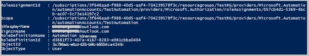

<properties 
   pageTitle="Rollipõhine juurdepääsu reguleerimine Azure'i automaatika | Microsoft Azure'i"
   description="Rollipõhine juurdepääsu reguleerimine (RBAC) võimaldab juurdepääsu juhtimine Azure ressursid. Selles artiklis kirjeldatakse, kuidas häälestada RBAC Azure'i automaatika."
   services="automation"
   documentationCenter=""
   authors="mgoedtel"
   manager="jwhit"
   editor="tysonn"
   keywords="automaatika rbac, rollipõhise juurdepääsu reguleerimine, azure rbac" />
<tags 
   ms.service="automation"
   ms.devlang="na"
   ms.topic="get-started-article"
   ms.tgt_pltfrm="na"
   ms.workload="infrastructure-services"
   ms.date="09/12/2016"
   ms.author="magoedte;sngun"/>

# Azure'i automaatika Rollipõhine juurdepääsu juhtimine

## Rollipõhine juurdepääsu reguleerimine

Rollipõhine juurdepääsu reguleerimine (RBAC) võimaldab juurdepääsu juhtimine Azure ressursid. [RBAC](../active-directory/role-based-access-control-configure.md)abil saate eraldada ülesandeid oma meeskonna ja anda juurdepääsu üksnes summa kasutajate, rühmade ja rakendused, mida tuleb teha oma tööd. Rollipõhine pääsu saate anda kasutajatele kasutades Azure portaali, Azure käsurea tööriistad või Azure'i Management API-d.

## RBAC kontodel automatiseerimine

Azure'i automaatika, antakse juurdepääs RBAC sobiv roll kasutajad, rühmad ja rakendused automatiseerimise konto ulatuse määramise teel. Järgnevalt on konto automatiseerimine ei toeta sisseehitatud rollid.  

|**Roll** | **Kirjeldus** |
|:--- |:---|
| Omanik | Omaniku roll võimaldab juurdepääsu kõik ressursid ja toimingute automatiseerimine konto, sh, et teiste kasutajate, rühmade ja rakenduste haldamiseks automatiseerimise konto sees. |
| Kaasautor | Kaasautori roll võimaldab teil kõik peale muutmine teise kasutaja juurdepääsuõiguste automatiseerimise konto haldamine. |
| Lugeja | Lugeja roll võimaldab vaadata kõik ressursid automatiseerimise konto, kuid mitte muuta.|
| Automaatika tehtemärk | Automaatika tehtemärk roll võimaldab teil teha näiteks start töötoimingute, lõpetada, peatada, jätkamiseks ja tööde. Sellel rollil on kasulik, kui soovite kaitsta oma automatiseerimise konto ressursse, nt mandaat varad ja tegevusraamatud vaadata või muuta, kuid sellegipoolest lubada teie asutuse töötajad nende tegevusraamatud käivitada. |
| Kasutaja juurdepääs administraator | Kasutaja juurdepääs administraatorirolli võimaldab Azure automatiseerimine kontode kasutajate juurdepääsu haldamine. |

>[AZURE.NOTE] Te ei saa anda juurdepääsu õigused teatud käitusjuhendi või tegevusraamatud, ainult ressursse ja toimingute automatiseerimine kontol.  

Selles artiklis on tutvustame teile häälestamise RBAC Azure'i automaatika. Kuid esmalt Vaatame lähemalt vaadata üksikuid õiguste kaasautor, lugeja, automatiseerimise tehtemärk ja kasutajale Accessi administraator, et saaksime mõistmiseks hea enne kõik automatiseerimise kontole õigused.  Muul juhul võib põhjustada ootamatuid või soovimatu tagajärjed.     

## Kaasautor rolli õigused

Järgnevas tabelis on toodud teatud toiminguid, mida saab teha kaasautori roll automatiseerimine.

| **Ressursi tüüp** | **Lugemine** | **Kirjutamine** | **Kustutamine** | **Muude toimingute** |
|:--- |:---|:--- |:---|:--- |
| Azure'i automaatika konto |  |  |  | | 
| Automaatika serdi vara |  |  |  | |
| Automaatika ühenduse vara |  |  |  | | 
| Automaatika ühenduse tüüp vara |  |  |  | | 
| Automaatika mandaati vara |  |  |  | |
| Automaatika ajakava vara |  |  |  | |
| Muutuv varade automatiseerimine |  |  |  | |
| Automaatika soovitud maakond konfigureerimine | | | |  |
| Hübriidjuurutuse Käitusjuhendi töötaja ressursi tüüp |  | |  | | 
| Azure'i automaatika töö |  |  | |  | 
| Automaatika töö voo |  | | | | 
| Automaatika töögraafik |  |  |  | |
| Automatiseerimise mooduli |  |  |  | |
| Azure'i automaatika Käitusjuhendi |  |  |  |  |
| Automaatika Käitusjuhendi mustand |  | | |  |
| Automaatika Käitusjuhendi mustand testi töö |  |  | |  | 
| Automaatika Webhook |  |  |  |  |

## Lugeja rolli õigused

Järgnevas tabelis on toodud teatud toiminguid, mida saab teha lugeja rolli automatiseerimine.

| **Ressursi tüüp** | **Lugemine** | **Kirjutamine** | **Kustutamine** | **Muude toimingute** |
|:--- |:---|:--- |:---|:--- |
| Klassikaline tellimuse administraator |  | | | 
| Juhtimise lukustamine |  | | | 
| Õiguste |  | | |
| Pakkuja toimingud |  | | | 
| Rolli määramine |  | | | 
| Roll määratlus |  | | | 

## Automaatika tehtemärk rolli õigused

Järgnevas tabelis on toodud teatud toiminguid, mida saab teha automatiseerimise tehtemärk rolli automatiseerimine.

| **Ressursi tüüp** | **Lugemine** | **Kirjutamine** | **Kustutamine** | **Muude toimingute** |
|:--- |:---|:--- |:---|:--- |
| Azure'i automaatika konto |  | | | 
| Automaatika serdi vara | | | |
| Automaatika ühenduse vara | | | |
| Automaatika ühenduse tüüp vara | | | |
| Automaatika mandaati vara | | | |
| Automaatika ajakava vara |  |  | | |
| Muutuv varade automatiseerimine | | | |
| Automaatika soovitud maakond konfigureerimine | | | | |
| Hübriidjuurutuse Käitusjuhendi töötaja ressursi tüüp | | | | | 
| Azure'i automaatika töö |  |  | |  | 
| Automaatika töö voo |  | | |  
| Automaatika töögraafik |  |  | | |
| Automatiseerimise mooduli | | | |
| Azure'i automaatika Käitusjuhendi |  | | | |
| Automaatika Käitusjuhendi mustand | | | |
| Automaatika Käitusjuhendi mustand testi töö | | | |  
| Automaatika Webhook | | | |

Täpsemat teavet [automatiseerimise tehtemärk toimingud](../active-directory/role-based-access-built-in-roles.md#automation-operator) loetletakse automatiseerimise tehtemärk roll automatiseerimise konto ja oma ressursse ei toeta toimingud.

## Kasutaja juurdepääs administraatori rolli õigused

Järgnevas tabelis on toodud teatud toiminguid, mida saab teha, mida kasutaja juurdepääs administraatori rolli automatiseerimine.

| **Ressursi tüüp** | **Lugemine** | **Kirjutamine** | **Kustutamine** | **Muude toimingute** |
|:--- |:---|:--- |:---|:--- |
| Azure'i automaatika konto |  | | | |
| Automaatika serdi vara |  | | | |
| Automaatika ühenduse vara |  | | | |
| Automaatika ühenduse tüüp vara |  | | | |
| Automaatika mandaati vara |  | | | |
| Automaatika ajakava vara |  | | | |
| Muutuv varade automatiseerimine |  | | | |
| Automaatika soovitud maakond konfigureerimine | | | | |
| Hübriidjuurutuse Käitusjuhendi töötaja ressursi tüüp |  | | | | 
| Azure'i automaatika töö |  | | | | 
| Automaatika töö voo |  | | | | 
| Automaatika töögraafik |  | | | |
| Automatiseerimise mooduli |  | | | |
| Azure'i automaatika Käitusjuhendi |  | | | |
| Automaatika Käitusjuhendi mustand |  | | | |
| Automaatika Käitusjuhendi mustand testi töö |  | | | | 
| Automaatika Webhook |  | | |

## Azure'i portaalis automatiseerimise konto RBAC konfigureerimine

1.  [Azure portaali](https://portal.azure.com/) sisse logida ja avage konto automatiseerimise keelest automatiseerimise kontod.  

2.  Klõpsake **juurdepääsu** reguleerimine veebisaidil paremas ülanurgas. Avatakse **kasutajate** blade, kus saate lisada uusi kasutajaid, rühmad ja rakenduste automatiseerimise konto haldamiseks ja vaatamiseks olemasoleva rollid, mida saab konfigureerida automatiseerimise konto.  

      

>[AZURE.NOTE] **Tellimuse administraatorid** on juba olemas, kui kasutaja vaikimisi. Tellimuse administraatorid active directory rühm sisaldab teenuse administraatorid ja co-administrator(s) Azure tellimuse. Teenuse administraator on oma ressursse ja Azure tellimuse omanik ja kuvatakse on omanik roll päritud automatiseerimise kontode jaoks liiga. See tähendab, et juurdepääs on **Inherited** **teenuse administraatorid ja co-administraatorid** tellimust ja see on **määratud** kõigi kasutajate jaoks. Klõpsake **tellimuse administraatorid** vaadata nende õiguste kohta rohkem üksikasju.  

### Lisa uus kasutaja ja määrata rolli

1.  Keelest kasutajad avamiseks klõpsake nuppu **Lisa** **lisamine Accessi blade** kus saab kasutaja, rühma või rakenduste lisamine ja rolli määramine.  

      

2.  Valige loendist saadaolevad rollide roll. Valisime **lugeja** roll, kuid soovi korral saate mis tahes saadaval sisseehitatud rollid, mis automatiseerimise konto toetab või võib määratletud kohandatud roll.  

      

3.  **Kasutajate lisamine** tera **kasutajate lisamine** avamiseks klõpsake nuppu. Kui olete lisanud kõik kasutajad, rühmad või rakendused, siis need kasutajad on loetletud ja saate neid lisada juurdepääsu oma tellimuse haldamiseks. Kui ei ole loetletud kõik kasutajate või kui te olete huvitatud kasutaja lisamise pole loendis, klõpsake **Kutsu** avamiseks **kutsuda külalisena** tera, kus saate kutsuda kasutaja, kellel on lubatud Microsofti konto meiliaadressi nagu Outlook.com, OneDrive või Xbox Live ID-d. Kui olete sisestanud kasutaja e-posti aadressi, klõpsake nuppu **Valige** kasutajat lisada, ja seejärel klõpsake nuppu **OK**. 

      
 
    Nüüd peaks nähtaval olema lisatud **kasutajate** tera abil **lugemise** roll kasutaja.  

      

    Saate määrata ka rolli kasutaja **rollid** keelest. 

1. Klõpsake avamiseks **rollid blade**keelest kasutajate **rollid** . See blade kaudu saate vaadata nimi roll, kasutajad ja rühmad rolli määratud arv.

      
   
    >[AZURE.NOTE] Rollipõhine juurdepääsu reguleerimine saab seada ainult automatiseerimine konto tasemel, mitte mis tahes ressursi automatiseerimise konto all.

    Saate määrata rohkem kui üks roll kasutaja, rühma või rakendus. Näiteks kui lisame **Automatiseerimise tehtemärk** roll koos **lugeja rolli** kasutajale, siis need saate vaadata automatiseerimise ressursside ning käivitada käitusjuhendi tööde haldamine. Saate laiendada ripploendi kasutajale määratud rolle loendi kuvamine.  

      
 
### Kasutaja eemaldamine

Saate eemaldada kasutajalt, kes on haldamise automatiseerimine konto või kes ei tööta enam organisatsiooni juurdepääsuõigus. Järgnevalt on juhiseid Kasutaja eemaldamine. 

1.  Valige keelest **kasutajate** rolli määramine, mille soovite eemaldada.

2.  Klõpsake nuppu **Eemalda** ülesande üksikasjad tera.

3.  Klõpsake nuppu **Jah** eemaldamise kinnitamiseks. 

      

## Rolli määratud kasutajale

Kui kasutaja määratud automatiseerimine oma kontole sisse rollid, nad näevad kohe omaniku konto **Vaikimisi kataloogide**loendis. Selleks, et vaadata automatiseerimise konto, mida nad on lisatud, tuleb need omaniku vaikekataloogi vaikekataloogi aktiveerida.  

  

### Automaatika tehtemärk rolli kasutuskogemus

Kui kasutaja, kes on määratud automatiseerimise tehtemärk rolli vaadete automatiseerimise konto nad on määratud, nad saavad ainult vaadata loendit tegevusraamatud, käitusjuhendi töökohtade ja ajakava loodud automatiseerimise konto, kuid ei saa vaadata nende määratlused. Ta saab käivitamiseks, peatamiseks, peatada, elulookirjeldus või käitusjuhendi töö plaanimine. Kasutajal on juurdepääs automatiseerimise muud ressursid, nt konfiguratsioone hübriid töötajate rühmade või DSC sõlmed.  

  

Kui kasutaja klõpsab käitusjuhendi, allika vaatamiseks või redigeerimiseks käitusjuhendi käske ei esitata automatiseerimise tehtemärk roll ei luba juurdepääs neile.  

  

Kasutajal on juurdepääs vaatamiseks ja ajakava loomiseks, kuid neil pole juurdepääsu ükskõik millise muu vara.  

  

Selle kasutaja ka pole juurdepääsu webhooks, mis on seostatud mõne käitusjuhendi vaatamine

  

## Azure'i PowerShelli kaudu automatiseerimise konto RBAC konfigureerimine

Rollipõhine pääsu konfigureerida automatiseerimise kontole järgmised [Azure PowerShelli cmdlet-käskude](../active-directory/role-based-access-control-manage-access-powershell.md)abil.

• [Get-AzureRmRoleDefinition](https://msdn.microsoft.com/library/mt603792.aspx) loetleb kõik RBAC rollid, mis on saadaval Azure Active Directory. Atribuudi **nimi** koos selle käsu abil saate loendis kõik toimingud, mida saab teha mõne kindla rolliga.  
    **Näide:**  
      

• [Get-AzureRmRoleAssignment](https://msdn.microsoft.com/library/mt619413.aspx) loetletud Azure AD RBAC rollimääranguid määratud ulatuses. Ilma parameetrid, käsk tagastab väärtuse alusel tellimuse rollimääranguid. Kasutage parameetrit **ExpandPrincipalGroups** loendi Accessi määramisi, määratud kasutajale kui kasutaja on liige rühmad.  
    **Näide:** Järgmise käsu abil saate loendi kõigi kasutajate ja nende rolle konto automatiseerimine.

    Get-AzureRMRoleAssignment -scope “/subscriptions/<SubscriptionID>/resourcegroups/<Resource Group Name>/Providers/Microsoft.Automation/automationAccounts/<Automation Account Name>” 

• [New-AzureRmRoleAssignment](https://msdn.microsoft.com/library/mt603580.aspx) määrata juurdepääsu kasutajate, rühmade ja rakenduste abil kindla ulatus.  
    **Näide:** Järgmise käsu abil saate kasutaja automatiseerimise konto ulatuse "Automatiseerimine tehtemärki" rolli määramine.

    New-AzureRmRoleAssignment -SignInName <sign-in Id of a user you wish to grant access> -RoleDefinitionName "Automation operator" -Scope “/subscriptions/<SubscriptionID>/resourcegroups/<Resource Group Name>/Providers/Microsoft.Automation/automationAccounts/<Automation Account Name>”  

• Abil [Eemalda-AzureRmRoleAssignment](https://msdn.microsoft.com/library/mt603781.aspx) kindla ulatus määratud kasutaja, rühma või rakenduse access eemaldada.  
    **Näide:** Järgmise käsu abil "Automatiseerimine tehtemärki" rolli automatiseerimise konto ulatuse Kasutaja eemaldamine.

    Remove-AzureRmRoleAssignment -SignInName <sign-in Id of a user you wish to remove> -RoleDefinitionName "Automation Operator" -Scope “/subscriptions/<SubscriptionID>/resourcegroups/<Resource Group Name>/Providers/Microsoft.Automation/automationAccounts/<Automation Account Name>”

Eespool toodud, Asendage **sisselogimise Id**, **tellimuse Id**, **ressursside rühma nimi** ja **automatiseerimise konto nimi** oma konto üksikasjad. Tehke valik **Jah** kui teil palutakse kinnitada enne jätkamist eemaldada Kasutaja rolli määramine.   

## Järgmised sammud
-  Erineval viisil konfigureerida RBAC Azure'i automaatika kohta lisateabe saamiseks vaadake [RBAC Azure PowerShelli abil hallata](../active-directory/role-based-access-control-manage-access-powershell.md).
- Alustamiseks on käitusjuhendi erinevate viiside kohta leiate teemast [alates on käitusjuhendi](automation-starting-a-runbook.md)
- Lisateavet erinevate käitusjuhendi tüüpi viidata [Azure automatiseerimine käitusjuhendi tüübid](automation-runbook-types.md)

