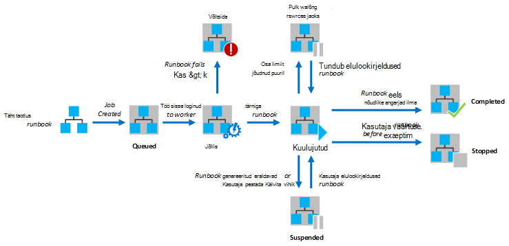
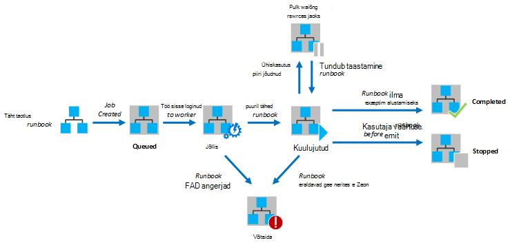

<properties
   pageTitle="Käitusjuhendi täitmist Azure automatiseerimine"
   description="Kirjeldab, kuidas on käitusjuhendi Azure'i automaatika töödeldakse üksikasjad."
   services="automation"
   documentationCenter=""
   authors="mgoedtel"
   manager="stevenka"
   editor="tysonn" />
<tags
   ms.service="automation"
   ms.devlang="na"
   ms.topic="article"
   ms.tgt_pltfrm="na"
   ms.workload="infrastructure-services"
   ms.date="03/21/2016"
   ms.author="bwren" />

# Käitusjuhendi täitmist Azure automatiseerimine

Azure'i automaatika lisamine käitusjuhendi käivitamisel luuakse tööd. Töö on ühe täitmise eksemplari on käitusjuhendi. Azure'i automaatika töötaja on määratud käivitama iga töö. Töötajate on ühiselt mitu Azure kontot, on üksteisest eraldatud tööd sealt automatiseerimine. Teil pole juhtida, milline töötaja on teenuse taotluse oma töö.  Ühe käitusjuhendi võib olla mitu töid korraga. Loendi tegevusraamatud kuvatava Azure'i portaalis selle nimekirja jaoks iga käitusjuhendi käivitamise viimaselt olekut. Iga käitusjuhendi tööd loendit saate vaadata iga oleku jälgimiseks. Olekute erinevate töö kirjelduse leiate teemast [Töö olekud](#job-statuses).

Järgmisel joonisel on esitatud [graafiline tegevusraamatud](automation-runbook-types.md#graphical-runbooks) ja [PowerShelli töövoo tegevusraamatud](automation-runbook-types.md#powershell-workflow-runbooks)elutsükli käitusjuhendi töö.

Järgmine diagramm näitab elutsükli käitusjuhendi töö [PowerShelli tegevusraamatud](automation-runbook-types.md#powershell-runbooks).

Oma tööd on juurdepääs teie Azure ressursse, muutes Azure tellimuse ühenduse. Need ainult on juurdepääs ressursid andmete keskuses kui need ressursid on puuetega inimestele juurdepääsetavate avalike pilveteenuses.

## Töö olekud

Järgmises tabelis on kirjeldatud eri olekud on võimalik tööd.

| Olek| Kirjeldus|
|:---|:---|
|Lõpetatud|Töö lõpule viidud.|
|Nurjus.| [Graafilised ja PowerShelli töövoo tegevusraamatud](automation-runbook-types.md), jaoks käitusjuhendi Kompileerimine nurjus.  [PowerShelli skripti tegevusraamatud](automation-runbook-types.md), käitusjuhendi ei saa käivitada või töö ilmnes erand. |
|Ei, ressursside ootamine|Töö nurjus, kuna see jõudnud [osa](#fairshare) kolm korda ja iga kord, kui sama kontrollpunkt või käitusjuhendi algusest alustamine.|
|Ootele|Töö ootab ressursside tulla saadaval nii, et seda saab käivitada töötaja automatiseerimine.|
|Käivitamine|Töö on määratud töötaja ja süsteemi on protsessi alates selle.|
|Jätkamine|Süsteemi on tööd jätkata, kui see on peatatud.|
|Töötab|Töö töötab.|
|Töötab, ressursside ootamine|Töö on eemaldatud, kuna see jõudnud [osa](#fairshare) . See jätkub varsti selle Viimane kontrollpunkt.|
|Peatatud|Kasutaja on töö lõpetanud enne lõpuleviimist.|
|Peatamine|Süsteemi on töö peatamine.|
|Peatatud|Töö oli peatatud kasutaja, süsteemi või käsku käitusjuhendi. Töö, mis on peatatud uuesti luua ja jätkub selle Viimane kontrollpunkt või käitusjuhendi algusest, kui tal pole postkastid. Käitusjuhendi ainult peatatakse korral erandi süsteem. Vaikimisi on seatud ErrorActionPreference **Jätka** tähendab, et töö hoida töötavate tõrge. Kui muutuja eelistused on seatud **lõpetamiseks** klõpsake töö peatab tõrke kohta.  Kehtib ainult [graafilised ning PowerShelli töövoo tegevusraamatud](automation-runbook-types.md) .|
|Ähvardusega sulgeda|Süsteemi proovib kasutaja nõudmisel töö peatada. Käitusjuhendi jõudma oma järgmise kontrollpunkt, enne kui saate selle peatada. Kui see on juba möödas selle Viimane kontrollpunkt, siis see ei lõpule enne saab selle peatada.  Kehtib ainult [graafilised ja PowerShelli töövoo tegevusraamatud](automation-runbook-types.md) .|

## Azure haldusportaali abil töö oleku vaatamine

### Armatuurlaua automatiseerimine

Automaatika armatuurlaua kuvatakse kõik tegevusraamatud kindla automatiseerimise konto kokkuvõte. See hõlmab ka kasutus ülevaade konto. Kokkuvõte graafik esitab kõik tegevusraamatud sisestatud iga oleku üle kindla arvu või kogu tööd arvu. Saate valida ajavahemiku, klõpsake paremas ülanurgas graafik. Diagrammi telg aeg muutub vastavalt teie valitud ajavahemiku tüüpi. Saate valida, kas rida kindla oleku kuvamiseks klõpsates ekraani ülaosas.

Järgmiste juhiste abil saate automatiseerimise armatuurlaua kuvamine.

1. Azure'i haldusportaal, valige **automatiseerimine** ja klõpsake seejärel automatiseerimise konto nimi.
1. Valige vahekaart **armatuurlaud** .

### Käitusjuhendi armatuurlaud

Armatuurlaua Käitusjuhendi kuvatakse Kokkuvõte ühe käitusjuhendi jaoks. Kokkuvõte graafik esitab kogu tööd sisestatud iga oleku üle kindla arvu või käitusjuhendi arvu. Saate valida ajavahemiku, klõpsake paremas ülanurgas graafik. Diagrammi telg aeg muutub vastavalt teie valitud ajavahemiku tüüpi. Saate valida, kas rida kindla oleku kuvamiseks klõpsates ekraani ülaosas.

Järgmiste juhiste abil saate Käitusjuhendi armatuurlaua kuvamine.

1. Azure'i haldusportaal, valige **automatiseerimine** ja klõpsake seejärel automatiseerimise konto nimi.
1. Klõpsake soovitud käitusjuhendi nime.
1. Valige vahekaart **armatuurlaud** .

### Töö Kokkuvõte

Kõigi tööd, mis on loodud teatud käitusjuhendi ja nende viimase oleku loendit saate vaadata. Selles loendis töö oleku järgi ja viimase muutmise töö kuupäevade vahemikku, saate filtreerida. Klõpsake töö, mida soovite vaadata oma üksikasjaliku teabe ja selle väljundi nime. Üksikasjalik vaade töö sisaldab käitusjuhendi parameetrite, mis selle töö väärtused.

Järgmiste juhiste abil saate vaadata mõne käitusjuhendi töökohta.

1. Azure'i haldusportaal, valige **automatiseerimine** ja klõpsake seejärel automatiseerimise konto nimi.
1. Klõpsake soovitud käitusjuhendi nime.
1. **Klõpsake vahekaarti** valimine
1. Klõpsake töö, mida soovite vaadata oma üksikasjad ja väljundi **Töö loodud** veerg.

## Toomine detailse oleku vaatamine Windows PowerShelli abil

[Get-AzureAutomationJob](http://msdn.microsoft.com/library/azure/dn690263.aspx) abil saate tuua loodud on käitusjuhendi ja eelkõige töö üksikasju töökohtade. Kui alustate Windows PowerShelli abil [Algus-AzureAutomationRunbook](http://msdn.microsoft.com/library/azure/dn690259.aspx)on käitusjuhendi, siis tulemuseks saadud töö. [Get-AzureAutomationJob](http://msdn.microsoft.com/library/azure/dn690263.aspx)väljundi abil on töö väljund.

Valimi järgmised käsud toob valimi käitusjuhendi viimase töö ja kuvab staatus, väärtused, mis pakuvad käitusjuhendi parameetrid ja töö väljund.

    $job = (Get-AzureAutomationJob –AutomationAccountName "MyAutomationAccount" –Name "Test-Runbook" | sort LastModifiedDate –desc)[0]
    $job.Status
    $job.JobParameters
    Get-AzureAutomationJobOutput –AutomationAccountName "MyAutomationAccount" -Id $job.Id –Stream Output

## Osa

Selleks, et jagada ressursse kõik tegevusraamatud pilves, Azure automatiseerimine ajutiselt mahalaadimine mis tahes töö pärast seda, kui see on töötama 3 tundi.    [Graafilised](automation-runbook-types.md#graphical-runbooks) ja [PowerShelli töövoo](automation-runbook-types.md#powershell-workflow-runbooks) tegevusraamatud jätkatakse kaudu oma viimase [kontrollpunkt](http://technet.microsoft.com/library/dn469257.aspx#bk_Checkpoints). Sel ajal, kuvatakse töö olekut töötab, ressursside ootamine. Kui käitusjuhendi on pole postkastid või töö ei jõudnud esimese kontrollpunkt enne laadimata, siis see uuesti algusest.  [PowerShelli](automation-runbook-types.md#powershell-runbooks) tegevusraamatud alati uuesti algusest, sest need ei toeta postkastid.

>[AZURE.NOTE] Osa limiit puudub teostavad hü Käitusjuhendi töötajate käitusjuhendi tööd.

Kui käitusjuhendi taaskäivitamist sama kontrollpunkt või käitusjuhendi kolm korda järjest algusest, lõpetatakse, mille olek on nurjunud, ressursside ootamine. See on kaitsta tegevusraamatud töötab lõputult ilma lõpuleviimine, nagu nad ei saa teha järgmise kontrollpunkt ilma laadimata uuesti. Sel juhul saate koos selle järgmine erand.

*Töö ei saa jätkata, töötab, kuna see on sama kontrollpunkt: seni eemaldada. Veenduge, et teie Käitusjuhendi pole pikki toiminguid teha ilma püsib seisu.*

Mõne käitusjuhendi loomisel veenduge, et aeg mis tahes tegevuste käivitamiseks vahel kaks postkastid ei ületa 3 tundi. Võib-olla peate postkastid lisamiseks oma käitusjuhendi tagamaks, et see piirang 3 tunni saavutamiseks või lahku pikk töötab toiminguid. Näiteks võib teie käitusjuhendi on reindex sooritada SQL suure andmebaasi. Kui ühe toimingut ei viida piires osa, siis töö maha ja uuesti algusest. Sel juhul tuleks lahku reindex toiming mitme juhiseid, nt reindexing ühe tabeli korraga, sisse ja sisestage postkasti iga toimingu järel nii, et töö võib jätkamiseks pärast viimase toimingu lõpuleviimiseks.

## Järgmised sammud

- [Alates on käitusjuhendi Azure automatiseerimine](automation-starting-a-runbook.md)
