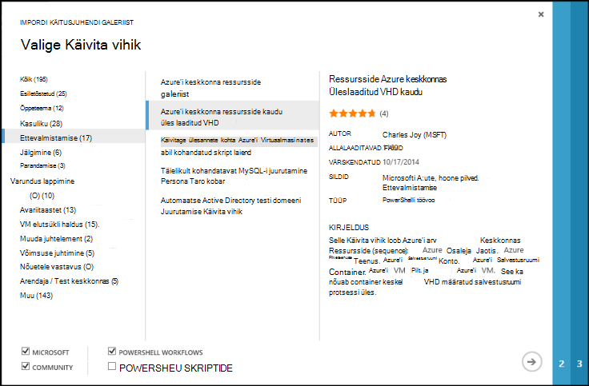

<properties
    pageTitle="Azure'i automaatika Käitusjuhendi ja mooduli galeriid | Microsoft Azure'i"
    description="Tegevusraamatud ja moodulid Microsoft ja ühenduse on saadaval, saate installida ja kasutada oma Azure automatiseerimine keskkonnas.  Selles artiklis kirjeldatakse, kuidas pääsete nende ressursside ja aidata oma tegevusraamatud galeriisse."
    services="automation"
    documentationCenter=""
    authors="mgoedtel"
    manager="jwhit"
    editor="tysonn" />
<tags
    ms.service="automation"
    ms.devlang="na"
    ms.topic="article"
    ms.tgt_pltfrm="na"
    ms.workload="infrastructure-services"
    ms.date="09/18/2016"
    ms.author="magoedte;bwren" />

# Azure'i automaatika Käitusjuhendi ja mooduli galeriid

Selle asemel, et luua oma tegevusraamatud ja moodulid Azure'i automaatika, pääsete stsenaariumi, mis on juba ehitatud Microsoft ja ühenduse luua mitmesuguste.  Võite kasutada järgmisi olukordi muutmata või saate neid kasutada lähtepunktina ja neid redigeerida oma Täpsemad nõuded.

Saate avada tegevusraamatud [Käitusjuhendi Galerii](#runbooks-in-runbook-gallery) ja moodulid [PowerShelli Galerii](#modules-in-powerShell-gallery)kaudu.  Samuti saate ühenduse kaasa, jagades stsenaariumi, mis teil tekib.

## Tegevusraamatud Käitusjuhendi galeriis

[Käitusjuhendi Galerii](http://gallery.technet.microsoft.com/scriptcenter/site/search?f[0].Type=RootCategory&f[0].Value=WindowsAzure&f[1].Type=SubCategory&f[1].Value=WindowsAzure_automation&f[1].Text=Automation) pakub mitmesuguseid tegevusraamatud Microsofti ja ühenduse, mida saate importida Azure automatiseerimine. Saate kas allalaadimine on käitusjuhendi galeriist, mis on majutatud [TechNeti skripti keskele](http://gallery.technet.microsoft.com/), või otse importida tegevusraamatud galeriist Azure klassikaline portaali või Azure portaali kaudu.

Mida saab importida ainult Käitusjuhendi galeriist Azure klassikaline portaali või Azure portaali abil. Te ei saa seda funktsiooni Windows PowerShelli kaudu.

>[AZURE.NOTE] Peaks kinnitamist sisu mis tahes tegevusraamatud, et saada Käitusjuhendi galeriist ja installimiseks ja käitamiseks neid tootmiskeskkonnas äärmiselt ettevaatlik. |

### Importimiseks on käitusjuhendi Azure klassikaline portaalis Käitusjuhendi galeriist

1. Azure'i portaalis, klõpsake nuppu **Uus**, **rakenduse teenuseid**, **automaatika**, **Käitusjuhendi**, **Galeriist**.
2. Valige kategooria, et vaadata seotud tegevusraamatud ja valige käitusjuhendi, üksikasjade kuvamiseks. Kui soovite käitusjuhendi valimiseks klõpsake nuppu paremnool.

    

3. Vaadake üle käitusjuhendi sisu ja mis tahes nõuete kirjeldus Märkus. Kui olete lõpetanud, klõpsake nuppu paremnool.
4. Sisestage käitusjuhendi üksikasjad ja seejärel klõpsake nuppu märge. Käitusjuhendi nimi on juba olema täidetud.
5. Käitusjuhendi kuvatakse menüü **tegevusraamatud** automatiseerimise konto.

### Importida on käitusjuhendi Käitusjuhendi Galerii Azure'i portaalis

1. Avage Azure'i portaalis konto automatiseerimine.
2. Klõpsake paani **tegevusraamatud** tegevusraamatud loendi avamiseks.
3. Klõpsake nuppu **Sirvi Galerii** .

    

4. Leidke soovite ja seda üksikasjade kuvamiseks valige Galerii üksus.

    

4. Klõpsake **Kuva allikas project** [TechNeti skript keskmist](http://gallery.technet.microsoft.com/)üksuse kuvamiseks.
5. Importida üksuse, klõpsake seda, et näiksite ja seejärel klõpsake nuppu **impordi** .

    

6. Soovi korral muuta käitusjuhendi nime ja seejärel klõpsake nuppu **OK** , et importida käitusjuhendi.
5. Käitusjuhendi kuvatakse menüü **tegevusraamatud** automatiseerimise konto.

### Galerii käitusjuhendi on käitusjuhendi lisamine

Microsoft soovitab lisada tegevusraamatud Käitusjuhendi Galerii, mis võib olla kasulik teistele klientidele.  Saate lisada mõne käitusjuhendi [üleslaadimise seda skripti keskmist](http://gallery.technet.microsoft.com/site/upload) võttes arvesse järgmisi üksikasju.

- Määrake *Windows Azure'i* **kategooria** ja **alamkategooria** jaoks käitusjuhendi *automatiseerimine* viisardi kuvada.  

- Üles tuleb ühe .ps1 või .graphrunbook faili.  Kui käitusjuhendi nõuab mis tahes moodulid, lapse tegevusraamatud või varad, siis tuleks loetletakse need kirjeldus esitamise ja märkuste käitusjuhendi raames.  Kui teil on mitu tegevusraamatud nõudva stsenaarium, siis laadige iga eraldi ja loendit, seotud tegevusraamatud iga nende kirjeldused. Veenduge, et kasutada sama sildid, et neid kuvataks sama kategooria. Kasutaja on teada muude tegevusraamatud vajalike kirjelduse lugemiseks stsenaariumi töötada.

- Lisada sildi "GraphicalPS" avaldamisel **graafilise käitusjuhendi** (mitte graafiline töövoo). 

- PowerShelli või PowerShelli töövoo koodilõigu lisada kirjeldus, kasutades **koodi jaotises Lisa** ikooni.

- Nii, et peate esitama üksikasjalikku teavet, mis aitab tuvastada käitusjuhendi funktsionaalsust kasutaja, kuvatakse Käitusjuhendi Galerii tulemuste kokkuvõte üles laadida.

- Üles peaks ühe kolme järgmist silte määrata.  Käitusjuhendi on loetletud jaotises kategooriad, mis vastavad oma siltide viisardi juhiseid.  Mis tahes silte pole selles loendis, ignoreeritakse viisard. Kui te ei määra kattuvad sildid, käitusjuhendi jaotises muu kategooria.

 - Varundus
 - Võimsuse haldamine
 - Juhtelemendi muutmine
 - Nõuetele vastavus
 - Arendaja / Test keskkonnas
 - Katastroofiabi
 - Jälgimine
 - Lappimine
 - Ettevalmistamise
 - Parandamise
 - VM elutsükli haldus

- Automaatika värskendab Galerii nii, et te ei näe oma osakaalu kohe üks kord tunnis.

## Moodulid PowerShelli galeriis

PowerShelli moodulid sisaldavad cmdlet-käsud, mida saate kasutada oma tegevusraamatud ja olemasoleva moodulid, mille saate installida Azure automatiseerimine on saadaval [PowerShelli Galerii](http://www.powershellgallery.com).  Saate käivitada selle galerii Azure'i portaalis ja installige need otse Azure automatiseerimine või saate alla laadida ja installida need käsitsi.  Te ei saa installida moodulid otse Azure klassikaline portaali, kuid võite alla laadida installige need muu moodul tavapärasel viisil.

### Importida mooduli automatiseerimise mooduli Galerii Azure'i portaalis

1. Avage Azure'i portaalis konto automatiseerimine.
2. Klõpsake paani **varad** varade nimekirja avamiseks.
3. Klõpsake paani **moodulid** moodulid loendi avamiseks.
4. Klõpsake nuppu **Sirvi Galerii** ja Sirvi Galerii tera on käivitatud.

      
5. Pärast on käivitanud Sirvi Galerii tera, saate otsida järgmised väljad:

   - Mooduli nimi
   - Sildid
   - Autor
   - Cmdlet-käsu/DSC ressursinimi

6. Leidke moodul, mis teile huvi ja valige see üksikasjade kuvamiseks.  
Kui te üldiseks teatud mooduli, saate vaadata lisateavet kohta moodulit lingi PowerShelli Galerii, sh vajalikud sõltuvused ja kõik cmdlet-käskude ja/või DSC ressursse, mis sisaldab mooduli.

      

7. Otse Azure automatiseerimine mooduli installimiseks klõpsake nuppu **impordi** .

    

8. Kui klõpsate nuppu impordi, kuvatakse mooduli nimi, mille olete importida. Kui kõik sõltuvused on installitud, on aktiivne nuppu **OK** . Kui teil on puudu sõltuvused, peate importida need enne selle mooduli importimist.
9. Käivitub impordi mooduli ja mooduli tera nuppu **OK** . Kui Azure automatiseerimine impordib mooduli kontole, see ekstraktib metaandmete mooduli ja cmdlet-käskude kohta.

    

    Kuna iga tegevuse peab ekstraktimist, võib selleks kuluda paar minutit.
10. Saate teatise ja teatise mooduli juurutatakse lõppu.
11. Pärast mooduli on imporditud, kuvatakse saadaolevad tegevuste ja saate kasutada oma ressursse tegevusraamatud ja soovitud riik konfigureerimine.

## Käitusjuhendi või mooduli

Päringuid saata [Kasutaja kõneposti](https://feedback.azure.com/forums/246290-azure-automation/).  Kui vajate aidata kirjalikult on käitusjuhendi või on PowerShelli küsimus, Postitage küsimus meie [Foorum](http://social.msdn.microsoft.com/Forums/windowsazure/en-US/home?forum=azureautomation&filter=alltypes&sort=lastpostdesc).

## Järgmised sammud

- Alustamine tegevusraamatud, lugege teemat [loomine või importimine on käitusjuhendi Azure'i automaatika](automation-creating-importing-runbook.md)
- PowerShelli ja PowerShelli töövoo erinevused tegevusraamatud abil, vt [õ PowerShelli töövoo](automation-powershell-workflow.md)
