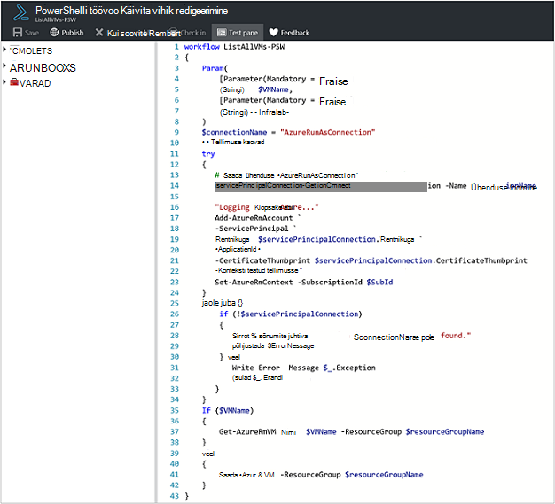
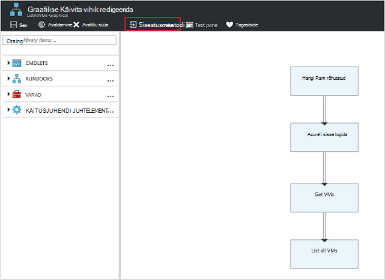
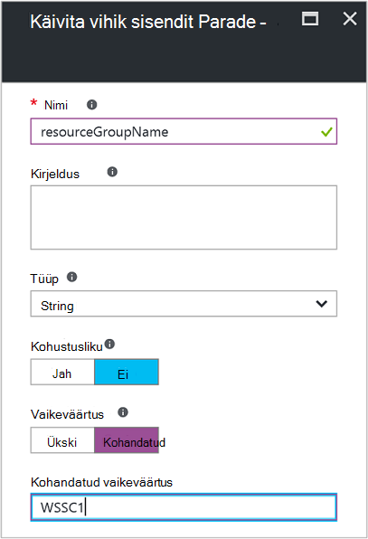
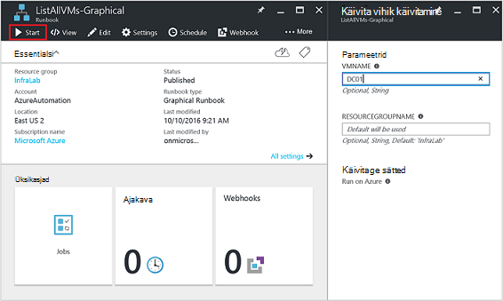
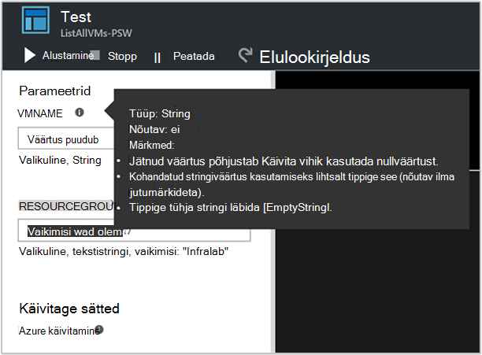
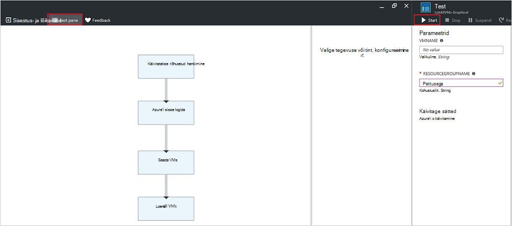
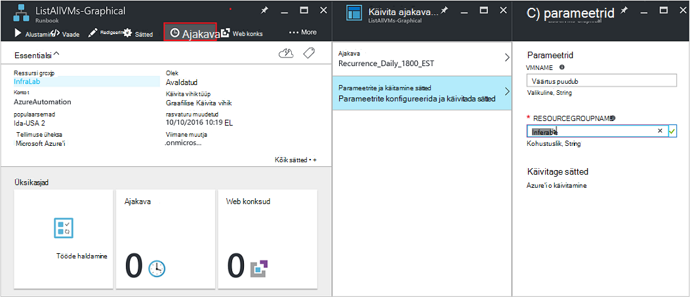
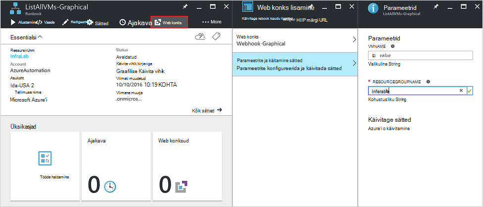
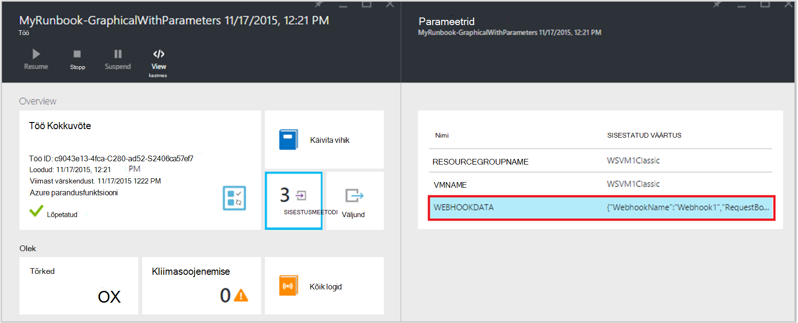

<properties
   pageTitle="Käitusjuhendi sisendparameetrid | Microsoft Azure'i"
   description="Käitusjuhendi sisendparameetrite veebipõhises runbooks, mis võimaldab teil käivitamisel on käitusjuhendi andmete edastamiseks. Selles artiklis kirjeldatakse erinevaid stsenaariumeid lähemalt, kus kasutatakse sisendparameetrite tegevusraamatud."
   services="automation"
   documentationCenter=""
   authors="MGoedtel"
   manager="jwhit"
   editor="tysonn" />
<tags
   ms.service="automation"
   ms.devlang="na"
   ms.topic="article"
   ms.tgt_pltfrm="na"
   ms.workload="infrastructure-services"
   ms.date="10/11/2016"
   ms.author="sngun"/>

# <a name="runbook-input-parameters"></a>Käitusjuhendi parameetrid

Käitusjuhendi sisendparameetrite veebipõhises runbooks, mis võimaldab teil andmete edastamiseks selle käivitamisel. Parameetrid luba käitusjuhendi toimingud on suunatud teatud stsenaariumide ja keskkonnas. Selles artiklis on tutvustame teile erinevaid stsenaariumeid lähemalt sisendparameetrite kasutavas tegevusraamatud.

## <a name="configure-input-parameters"></a>Sisendparameetrite konfigureerimine

PowerShelli, PowerShelli töövoo ja graafiline tegevusraamatud saab konfigureerida sisendparameetrid. Mõne käitusjuhendi võib olla mitu parameetrid erinevate andmetüüpidega või parameetreid pole üldse. Sisendparameetrite võib olla või kohustuslik ja valikuliste parameetrite vaikeväärtuse saate määrata. Saate määrata väärtused on käitusjuhendi sisendparameetrite käivitamisel saadaval meetodite kaudu. Nende meetodite kaasata lisamine käitusjuhendi alates portaali või veebiteenusest. Võite ka alustada üks lapse käitusjuhendi, mida nimetatakse Tekstisisese teise käitusjuhendi.

## <a name="configure-input-parameters-in-powershell-and-powershell-workflow-runbooks"></a>PowerShelli ja PowerShelli töövoo tegevusraamatud sisendparameetrite konfigureerimine

PowerShelli ja [PowerShelli töövoo tegevusraamatud](automation-first-runbook-textual.md) Azure'i automaatika tugi sisendparameetrid, mis on määratletud kaudu järgmisi atribuute.  

| **Atribuut** | **Kirjeldus** |
|:--- |:---|
| Tüüp | Nõutav. Parameetri väärtus oodata andmetüüp. Mis tahes .NET tüüp on lubatud. |
| Nimi | Nõutav. Parameetri nimi. See peab, käitusjuhendi raames olema kordumatu ja võib sisaldada ainult tähti, numbreid, või allkriipsumärkideks. See peab algama tähega. |
| Kohustusliku | Valikuline. Saate määrata, kas parameetri jaoks tuleb väärtuse. Kui seate selle **$true**, siis väärtust tuleb käitusjuhendi käivitamisel. Kui seate selle **$false**, siis väärtust pole kohustuslik. |
| Vaikeväärtus | Valikuline.  Saate määrata väärtus, mida kasutatakse parameetri jaoks, kui väärtus on möödas rakenduses käitusjuhendi käivitamisel. Vaikimisi saate määrata iga parameetri jaoks ja automaatselt muuta parameetri valikuline sõltumata kohustuslik säte. |

Windows PowerShelli toetab sisendparameetrite veel atribuute, kui loetletud siin valideerimist, nt pseudonüümid, ja parameeter määrab. Azure'i automaatika toetab praegu ainult eelnimetatud sisendparameetrid.

Parameetri määratlus rakenduses PowerShelli töövoo tegevusraamatud on üldine järgmisel kujul, kus komadega eraldatud mitme parameetrid.

   ```
     Param
     (
         [Parameter (Mandatory= $true/$false)]
         [Type] Name1 = <Default value>,

         [Parameter (Mandatory= $true/$false)]
         [Type] Name2 = <Default value>
     )
   ```

>[AZURE.NOTE] Parameetrite, olete määratlemisel, kui te ei määra **kohustusliku** atribuudi, siis vaikimisi parameetri käsitletakse valikuline. Lisaks, kui seate parameetri vaikeväärtuse PowerShelli töövoo tegevusraamatud, seda käsitletakse PowerShelli abil valikuline parameeter, olenemata **kohustuslik** atribuudi väärtus.

Näiteks Oletame konfigureerimine PowerShelli töövoo käitusjuhendi, mille väljundid virtuaalmasinates, kas VM ühe või kõigi VMs ressursirühma üksikasjade sisendparameetrite. Selles käitusjuhendi on kaks parameetrid, nagu on näidatud järgmine pilt: nimi ja virtuaalse masina nimi ressursirühma.



See parameeter määratlus, parameetrite **$VMName** - ja **$resourceGroupName** on lihtne parameetrite tüüp string. PowerShelli ja PowerShelli töövoo tegevusraamatud toeta siiski kõik lihtsa tüüpide ja keerukate, nt **objekti** või **PSCredential** sisendparameetrid.

Kui teie käitusjuhendi on soovitud objekti tüüp sisendparameetrile, siis kasutage lisamine PowerShelli Hashtable talletatakse (nime väärtus) läbida väärtuse paarideks. Oletagem näiteks, kui teil on järgmine parameeter on käitusjuhendi:

     [Parameter (Mandatory = $true)]
     [object] $FullName

Seejärel saate saab edastada parameetri järgmine väärtus:

    @{"FirstName"="Joe";"MiddleName"="Bob";"LastName"="Smith"}


## <a name="configure-input-parameters-in-graphical-runbooks"></a>Graafilise tegevusraamatud sisendparameetrite konfigureerimine

[Graafilise käitusjuhendi konfigureerimine](automation-first-runbook-graphical.md) sisendparameetrid, loomine graafiline käitusjuhendi, mis väljundid virtuaalmasinates, kas VM ühe või kõigi VMs ressursirühma üksikasjad. Konfigureerimine on käitusjuhendi koosneb kaks põhilist tegevust, nagu allpool kirjeldatud.

Azure'i autentimiseks [**Autentida tegevusraamatud Azure'i käivitada nimega kontoga**](automation-sec-configure-azure-runas-account.md) .

[**Get-AzureRmVm**](https://msdn.microsoft.com/library/mt603718.aspx) atribuutide lisamine virtuaalmasinates saada.

[**Kirjutage-Väljund**](https://technet.microsoft.com/library/hh849921.aspx) toiminguga väljund virtuaalmasinates nimed. **Get-AzureRmVm** tegevuse aktsepteerib kaks parameetrid, **virtuaalse masina nimi** ja **ressursside rühma nime**. Kuna järgmiste parameetrite võib iga kord, kui hakkate käitusjuhendi vajavad erinevaid väärtusi, saate lisada oma käitusjuhendi sisendparameetrid. Siin on sisendparameetrid lisamiseks järgmist.

1. Valige graafiline käitusjuhendi **tegevusraamatud** keelest ja seejärel klõpsake käsku [**Redigeeri**](automation-graphical-authoring-intro.md) seda.

2. Käitusjuhendi redaktori, klõpsake nuppu **sisestus- ja väljundi** **sisestus- ja väljundi** tera avamiseks.

    

3. **Sisestus- ja väljundi** tera kuvatakse sisendparameetrid, mis on määratletud käitusjuhendi loend. Selle tera, saate lisada uue sisendparameetrile või muuta mõne olemasoleva sisendparameetrile konfiguratsiooni. Uus parameeter on käitusjuhendi lisamiseks klõpsake nuppu **sisestusmeetodi lisamine** avamiseks **Käitusjuhendi sisendparameetrile** tera. Seal saate konfigureerida järgmisi.

  	| **Atribuut** | **Kirjeldus** |
  	|:--- |:---|
  	| Nimi | Nõutav.  Parameetri nimi. See peab, käitusjuhendi raames olema kordumatu ja võib sisaldada ainult tähti, numbreid, või allkriipsumärkideks. See peab algama tähega. |
  	| Kirjeldus | Valikuline. Kirjeldus sisendparameetrile otstarbe kohta. |
  	| Tüüp | Valikuline. Kavandatud parameetri väärtuse andmetüüpi. Toetatud parameetri tüübid on **String**, **Int32**, **Int64**, **kümnendkohti**, **kahendväärtus**, **kuupäev ja kellaaeg**ja **objekti**. Kui andmetüübiks on märkimata, vaikimisi **String**. |
  	| Kohustusliku | Valikuline. Saate määrata, kas parameetri jaoks tuleb väärtuse. Kui valite **Jah**, siis väärtust tuleb käitusjuhendi käivitamisel. Kui valite **ei**, siis väärtust ei ole vaja käitusjuhendi käivitatakse, kui on seada vaikeväärtuse. |
  	| Vaikeväärtus | Valikuline. Saate määrata väärtus, mida kasutatakse parameetri jaoks, kui väärtus on möödas rakenduses käitusjuhendi käivitamisel. Vaikimisi saab määrata parameeter, mis pole kohustuslik. Valige **kohandatud**vaikeväärtuse seadmine. Seda väärtust kasutatakse juhul, kui mõni muu väärtus on esitatud käitusjuhendi käivitamisel. Valige **pole** , kui te ei soovi esitada mis tahes vaikeväärtus. |  

    

4. Luua kaks parameetrid järgmised atribuudid, mis kasutab **Get-AzureRmVm** tegevuse.

    - **Parameeter1:**
      - Nimi – VMName
      - Tippige - String
      - Kohustuslik - No

    - **Parameeter2:**
      - Nimi – resourceGroupName
      - Tippige - String
      - Kohustuslik - No
      - Vaikeväärtus – kohandatud
      - Kohandatud vaikeväärtus - \<ressursirühm, mis sisaldab soovitud virtuaalmasinates nimi >

5. Kui lisate parameetrid, klõpsake nuppu **OK**.  Saate nüüd vaadata neid on **sisestatud ja väljundi blade**. Klõpsake uuesti nuppu **OK** ja seejärel klõpsake nuppu **Salvesta** ja **Avalda** oma käitusjuhendi.

## <a name="assign-values-to-input-parameters-in-runbooks"></a>Väärtuste sisestamiseks tegevusraamatud parameetrite määramine

Saab edastada väärtuste sisestamiseks parameetrite tegevusraamatud järgmistel juhtudel.

### <a name="start-a-runbook-and-assign-parameters"></a>Alustage mõne käitusjuhendi ning määrata parameetrid

Mõne käitusjuhendi saab käivitada mitmel viisil: on webhook, koos PowerShelli cmdlet-käskudega, REST API-ga või SDK Azure portaali kaudu. Allpool käsitleme erinevad meetodid alguses on käitusjuhendi ja parameetrite määramine.

#### <a name="start-a-published-runbook-by-using-the-azure-portal-and-assign-parameters"></a>Käivitage avaldatud käitusjuhendi Azure portaali ja parameetrite määramine

Kui [käitusjuhendi alustada](automation-starting-a-runbook.md#starting-a-runbook-with-the-azure-portal), **Alustage Käitusjuhendi** tera avatakse ja saate konfigureerida äsja loodud parameetrite väärtused.



All väljale sildi näete atribuute, mis on esitatud parameetri. Atribuutide hulka või kohustuslik, tüüp ja vaikeväärtus. Abi õhupalli parameetri nime kõrval, näete kõigi põhiteave, peate tegema parameetri sisendväärtuste otsuseid. See teave sisaldab kas parameetri või kohustuslik. See hõlmab ka tüüp vaikeväärtus (vajaduse korral) ning muud kasulik lisasid.



>[AZURE.NOTE] Stringi tüüpi parameetreid toetavad **tühja** stringi väärtuse.  Sisestada **[EmptyString]** väljale sisendparameetrile läheb parameetri tühja stringi. Lisaks stringi tüüpi parameetreid ei toeta **edasi tühiväärtusi** . Kui Suvaline väärtus ei päringustringi parameetri edasi, seejärel PowerShelli kuvatakse tõlgendada null.

#### <a name="start-a-published-runbook-by-using-powershell-cmdlets-and-assign-parameters"></a>Avaldatud käitusjuhendi käivitage PowerShelli cmdlet-käskude ja määrata parameetrid

  - **Azure ressursihaldur cmdlet-käsud:** Automatiseerimise käitusjuhendi, loodud ressursi rühma [Algus-AzureRmAutomationRunbook](https://msdn.microsoft.com/library/mt603661.aspx)abil saate alustada.

    **Näide:**

   ```
    $params = @{“VMName”=”WSVMClassic”;”resourceGroupeName”=”WSVMClassicSG”}
 
    Start-AzureRmAutomationRunbook -AutomationAccountName “TestAutomation” -Name “Get-AzureVMGraphical” –ResourceGroupName $resourceGroupName -Parameters $params
   ```

  - **Azure Teenusehaldus cmdlet-käsud:** Automatiseerimise käitusjuhendi, loodud vaikimisi ressursi rühma [Algus-AzureAutomationRunbook](https://msdn.microsoft.com/library/dn690259.aspx)abil saate alustada.

    **Näide:**

   ```
    $params = @{“VMName”=”WSVMClassic”; ”ServiceName”=”WSVMClassicSG”}

    Start-AzureAutomationRunbook -AutomationAccountName “TestAutomation” -Name “Get-AzureVMGraphical” -Parameters $params
   ```

>[AZURE.NOTE] PowerShelli cmdlet-käskude, vaikimisi parameeter, kasutades mõnda käitusjuhendi käivitamisel luuakse **MicrosoftApplicationManagementStartedBy** väärtusega **PowerShelli**. Saate vaadata selle parameetri tera **töö üksikasjad** .  

#### <a name="start-a-runbook-by-using-an-sdk-and-assign-parameters"></a>Käivitage on käitusjuhendi abil ka SDK ja parameetrite määramine

  - **Azure ressursihaldur meetod:** Programmeerimiskeele SDK abil saate alustada ka käitusjuhendi. Allpool on C# koodilõik alustamiseks on käitusjuhendi kontol automatiseerimine. Saate vaadata meie [GitHub hoidla](https://github.com/Azure/azure-sdk-for-net/blob/master/src/ResourceManagement/Automation/Automation.Tests/TestSupport/AutomationTestBase.cs)kõik kood.  

   ```
     public Job StartRunbook(string runbookName, IDictionary<string, string> parameters = null)
        {
          var response = AutomationClient.Jobs.Create(resourceGroupName, automationAccount, new JobCreateParameters
           {
              Properties = new JobCreateProperties
               {
                  Runbook = new RunbookAssociationProperty
                   {
                     Name = runbookName
                   },
                     Parameters = parameters
               }
           });
        return response.Job;
        }
   ```

  - **Azure Teenusehaldus meetod:** Programmeerimiskeele SDK abil saate alustada ka käitusjuhendi. Allpool on C# koodilõik alustamiseks on käitusjuhendi kontol automatiseerimine. Saate vaadata meie [GitHub hoidla](https://github.com/Azure/azure-sdk-for-net/blob/master/src/ServiceManagement/Automation/Automation.Tests/TestSupport/AutomationTestBase.cs)kõik kood.

   ```      
    public Job StartRunbook(string runbookName, IDictionary<string, string> parameters = null)
      {
        var response = AutomationClient.Jobs.Create(automationAccount, new JobCreateParameters
      {
        Properties = new JobCreateProperties
           {
             Runbook = new RunbookAssociationProperty
           {
             Name = runbookName
                },
                  Parameters = parameters
                }
         });
        return response.Job;
      }
   ```

  See meetod alustamiseks käitusjuhendi parameetrid, **VMName** - ja **resourceGroupName**ning nende väärtuste talletamiseks sõnastiku loomine. Alustage käitusjuhendi. Allpool on C# koodilõigu helistamine meetod, mis on määratletud kohal.

   ```
    IDictionary<string, string> RunbookParameters = new Dictionary<string, string>();

    // Add parameters to the dictionary.
    RunbookParameters.Add("VMName", "WSVMClassic");
    RunbookParameters.Add("resourceGroupName", "WSSC1");

    //Call the StartRunbook method with parameters
    StartRunbook(“Get-AzureVMGraphical”, RunbookParameters);
   ```

#### <a name="start-a-runbook-by-using-the-rest-api-and-assign-parameters"></a>Käivitage soovitud käitusjuhendi REST API ja parameetrite määramine

Käitusjuhendi töö saab luua ja **sellele** meetodi abil järgmised taotlusega URI Azure automatiseerimine REST API-ga alustamine.

    https://management.core.windows.net/<subscription-id>/cloudServices/<cloud-service-name>/resources/automation/~/automationAccounts/<automation-account-name>/jobs/<job-id>?api-version=2014-12-08`

Asendage URI taotluse järgmiste parameetrite abil:

  - **tellimuse id:** Oma Azure tellimuse ID-ga.  
  - **pilve teenuse nime:** Pilveteenuses, millele saadetakse kutse nimi.  
  - **automatiseerimise kontonimi:** Teie määratud pilveteenuses majutatud automatiseerimise konto nimi.  
  - **töö-id:** GUID töö. GUID PowerShellis saab luua, kasutades **[GUID]::NewGuid(). ToString** käsk.

Parameetrite edastamine käitusjuhendi töö kasutada koosolekukutse sisusse. See on esitatud JSON-vormingus kaks järgmised atribuudid:

  - **Käitusjuhendi nimi:** Nõutav. Töö alustamiseks käitusjuhendi nimi.  
  - **Käitusjuhendi parameetrid:** Valikuline. Kus nimed peavad olema stringi tüüpi ja väärtus võib olla mis tahes sobiv väärtus JSON vormindamine sõnastiku parameetri loendis (nime väärtus).

Kui soovite alustada **Get-AzureVMTextual** käitusjuhendi, mis on loodud mõnes varasemas versioonis **VMName** ja **resourceGroupName** parameetrid, kasutage järgmist JSON vormingut taotluse keha.

   ```
    {
      "properties":{
        "runbook":{
        "name":"Get-AzureVMTextual"},
      "parameters":{
         "VMName":"WSVMClassic",
         "resourceGroupName":”WSCS1”}
        }
    }
   ```

HTTP olekukoodi 201 tagastatakse kui töö on loodud. Vastus päised ja keha vastus lisateabe saamiseks lugege artiklit kohta, kuidas [luua käitusjuhendi töö abil REST API.](https://msdn.microsoft.com/library/azure/mt163849.aspx)

### <a name="test-a-runbook-and-assign-parameters"></a>Testige on käitusjuhendi ja parameetrite määramine

Kui teil [testida mustand versiooni oma käitusjuhendi](automation-testing-runbook.md) testi suvandi abil, **testimine** tera avatakse ja saate konfigureerida äsja loodud parameetrite väärtused.



### <a name="link-a-schedule-to-a-runbook-and-assign-parameters"></a>Lingi lisamine käitusjuhendi ajakava ja parameetrite määramine

Saate [lingi ajakava](automation-schedules.md) oma käitusjuhendi nii, et käitusjuhendi hakkab teatud ajal. Saate määrata sisendparameetrid, kui loote ajakava ja käitusjuhendi kasutage järgmisi väärtuseid, ajakava käivitamisel. Ajakava ei saa salvestada, kuni kõik kohustuslikud parameetrite väärtused on olemas.



### <a name="create-a-webhook-for-a-runbook-and-assign-parameters"></a>Webhook, on käitusjuhendi jaoks luua ja määrata parameetrid

Saate oma käitusjuhendi on [webhook](automation-webhooks.md) loomine ja konfigureerimine käitusjuhendi sisendparameetrid. Ei saa salvestada selle webhook seni, kuni kõik kohustuslikud parameetrite väärtused on olemas.



Kui täidate on käitusjuhendi webhook, **[Webhookdata](automation-webhooks.md#details-of-a-webhook)** saadetakse koos määratletud parameetrid eelmääratletud sisendparameetrile abil. Võite klõpsata **WebhookData** parameetri üksikasjalikumat teavet laiendamiseks.




## <a name="next-steps"></a>Järgmised sammud

- Käitusjuhendi sisestus- ja väljundi kohta leiate lisateavet teemast [Azure automatiseerimine: käitusjuhendi sisendi, väljundi ja pesastatud tegevusraamatud](https://azure.microsoft.com/blog/azure-automation-runbook-input-output-and-nested-runbooks/).
- Alustamiseks on käitusjuhendi võimalust kohta leiate üksikasjalikumat teavet teemast [alates on käitusjuhendi](automation-starting-a-runbook.md).
- [Teksti redigeerimine tegevusraamatud](automation-edit-textual-runbook.md)viidata teksti käitusjuhendi redigeerimiseks.
- Graafilised käitusjuhendi redigeerimiseks viidata [graafilised loome Azure'i automaatika](automation-graphical-authoring-intro.md).
