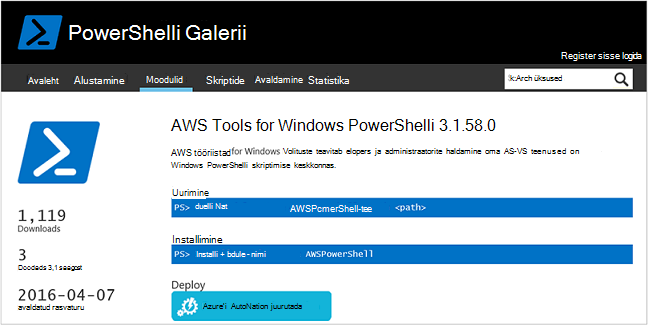
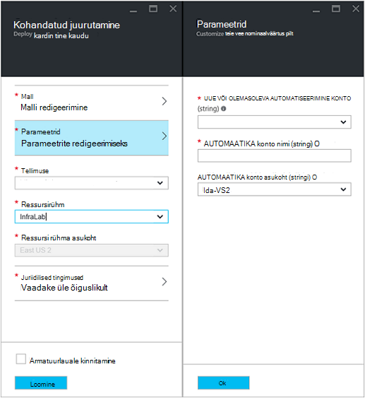
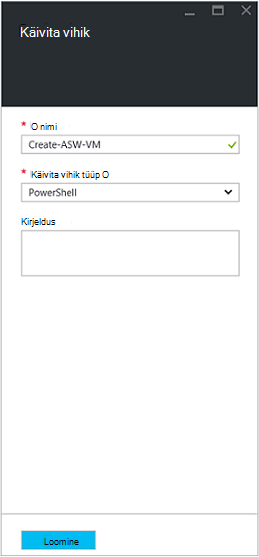
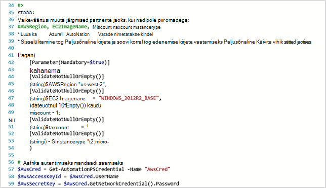
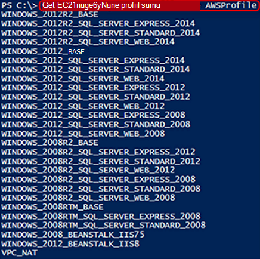
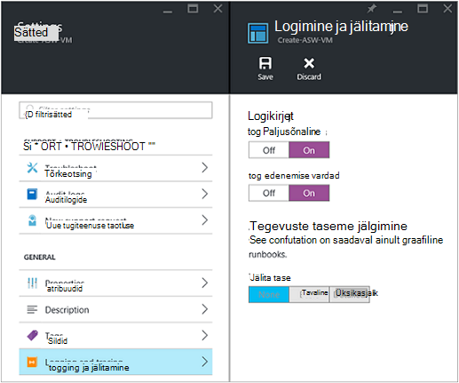
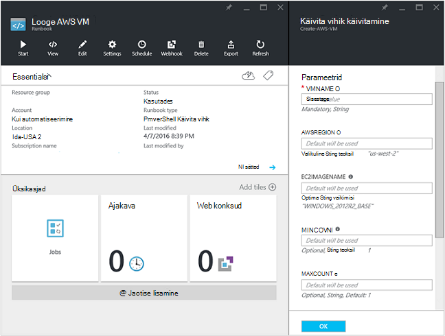
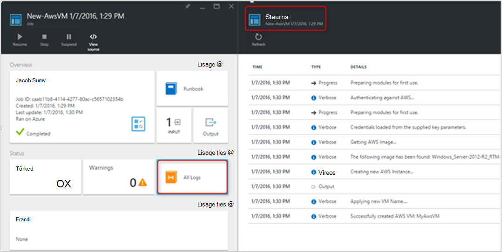
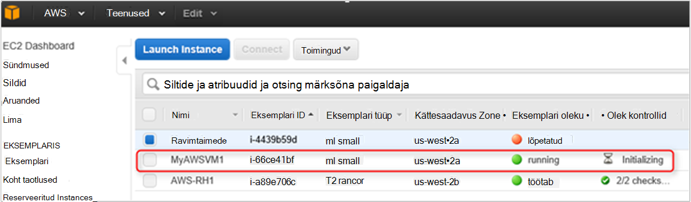

<properties
   pageTitle="Juurutamise VM Amazon veebiteenuste automatiseerimine | Microsoft Azure'i"
   description="Selles artiklis näitab, kuidas kasutada Azure automatiseerimine automatiseerida Amazon Web teenuse VM loomine"
   services="automation"
   documentationCenter=""
   authors="mgoedtel"
   manager="jwhit"
   editor="" />
<tags
   ms.service="automation"
   ms.devlang="na"
   ms.topic="article"
   ms.tgt_pltfrm="na"
   ms.workload="na"
   ms.date="08/17/2016"
   ms.author="tiandert; bwren" />

# <a name="azure-automation-scenario---provision-an-aws-virtual-machine"></a>Azure'i automaatika stsenaarium - säte on AWS virtuaalse masina 

Selles artiklis näitame, kuidas saate kasutada Azure automatiseerimine ette virtuaalse masina tellimuse Amazon Web Service (AWS) ja pange selle VM teatud nimi – mis AWS viitab nimega "sildistamine" VM.

## <a name="prerequisites"></a>Eeltingimused

Käesoleva artikli eesmärgil peate olema Azure automatiseerimine konto ja tellimuse AWS. Azure'i automaatika konto häälestamise ja konfigureerimise selle mandaadiga AWS tellimuse kohta lisateabe saamiseks vaadake üle [Amazon veebiteenuste autentimise konfigureerimine](../automation/automation-sec-configure-aws-account.md).  Selle konto peaks loodud või värskendatud enne jätkamist mandaadiga AWS tellimus, kui me ei viide selle konto alltoodud juhiseid.


## <a name="deploy-amazon-web-services-powershell-module"></a>Amazon Web Services PowerShelli mooduli juurutamine

Meie VM ettevalmistamise käitusjuhendi kogusummaks AWS PowerShelli moodul oma tööd teha. Järgmiste toimingute automatiseerimine kontoga, mis on konfigureeritud mandaat AWS tellimuse mooduli lisamiseks.  

1. Avage veebibrauser ja liikuge [PowerShelli Galerii](http://www.powershellgallery.com/packages/AWSPowerShell/) ja klõpsake **Deploy Azure automatiseerimine nupule**.<br> 

2. Teil on võetud Azure sisselogimislehe ja pärast autentimist, teid suunatakse Azure portaali ja esitada järgmine tera.<br> 

3. Valige ripploendist **Ressursirühm** ja parameetrite enne ressursirühma, järgmise teabe:
   * **Uus või olemasolev automatiseerimise konto (stringi)** ripploendis valige **olemasolev**.  
   * **Automaatika konto nimi (stringi)** väljale Tippige täpne nimi sisaldab tellimuse AWS identimisteabe automatiseerimise konto.  Näiteks kui olete loonud sihtotstarbeline konto nimega **AWSAutomation**, siis see on teie tipitava väljale.
   * Valige sobiv piirkond ripploendist **Automatiseerimise konto asukoht** .

4. Kui olete lõpetanud, sisestage nõutav teave, klõpsake nuppu **Loo**.

    >[AZURE.NOTE]Ajal importida PowerShelli mooduli Azure'i automaatika, see on ka ekstraktimiseks cmdlet-käskude ja neid toiminguid ei kuvata, kuni on mooduli importimise ja ekstraktimiseks cmdlet-käskude täielikult lõpule jõudnud. See võib kuluda mõni minut.  
<br>
5. Avage Azure'i portaalis viidatud sammus 3 automatiseerimise konto.
6. Klõpsake paani **varasid** ning enne **varasid** , valige paani **moodulid** .
7. Enne **moodulid** kuvatakse loendis moodulit **AWSPowerShell** .

## <a name="create-aws-deploy-vm-runbook"></a>Looge AWS juurutamine VM käitusjuhendi

Kui kasutusele võetud AWS PowerShelli moodul, me saate nüüd Autor käitusjuhendi, ettevalmistamise virtuaalse masina AWS PowerShelli skripti abil automatiseerida. Alltoodud juhiseid näitab, kuidas kasutada kohalikke PowerShelli skripti Azure automatiseerimine.  

>[AZURE.NOTE] Suvandite ja teave selle skripti, külastage [PowerShelli Galerii](https://www.powershellgallery.com/packages/New-AwsVM/DisplayScript).


1. PowerShelli skripti New-AwsVM laadida PowerShelli Galerii avamine PowerShelli seanss ja tippige järgmine:<br>
   ```
   Save-Script -Name New-AwsVM -Path \<path\>
   ```
<br>
2. Azure portaali, avage oma konto automatiseerimine ja klõpsake paani **tegevusraamatud** .  
3. Valige keelest **tegevusraamatud** **lisamine on käitusjuhendi**.
4. Enne **lisamine soovitud käitusjuhendi** , valige **Kiire loomine** (Loo uus käitusjuhendi).
5. Enne **Käitusjuhendi** atribuudid, tippige nimi väljale nimi oma käitusjuhendi ja **Käitusjuhendi tüüp** ripploendist valige **PowerShelli**ja seejärel klõpsake nuppu **Loo**.<br> 
6. Redigeeri PowerShelli Käitusjuhendi tera kuvamisel kopeerimine ja kleepimine PowerShelli skripti käitusjuhendi loome lõuend.<br> <br>

    >[AZURE.NOTE] Võtke arvesse järgmist PowerShelli skripti näide töötamisel.
    >
    > - Käitusjuhendi sisaldab mitmeid vaikimisi parameetrite väärtused. Hinnata kõik vaikeväärtused ja vajadusel värskendage.
    > - Kui teil on salvestatud mandaat AWS mandaati vara, nimega kui **AWScred**, peate värskendada skripti rea 57 vastavalt sellele vastavaks.  
    > - Töötamisel AWS CLI käsud PowerShelli, eriti koos selles näites käitusjuhendi, peate määrama AWS piirkond. Muul juhul ei õnnestu cmdlet-käsud.  Saate vaadata AWS teema [Määrata AWS piirkond](http://docs.aws.amazon.com/powershell/latest/userguide/pstools-installing-specifying-region.html) AWS tööriistad PowerShelli dokumendi täpsemat teavet.  
<br>
7. Pildi nimede loendi toomiseks tellimuse AWS käivitada PowerShell ISE ja AWS PowerShelli mooduli importimine.  Autentimiseks AWS, asendades **Get-AutomationPSCredential** teie ISE keskkonnas, kus **AWScred = Get-mandaati**.  See küsib teilt oma kasutajanimi ja parool ning saate sisestada oma **kiirklahv ID** **Salajane kiirklahv** kasutajanime ja parooli.  Vaadake alltoodud näites:

        #Sample to get the AWS VM available images
        #Please provide the path where you have downloaded the AWS PowerShell module
        Import-Module AWSPowerShell
        $AwsRegion = "us-west-2"
        $AwsCred = Get-Credential
        $AwsAccessKeyId = $AwsCred.UserName
        $AwsSecretKey = $AwsCred.GetNetworkCredential().Password

        # Set up the environment to access AWS
        Set-AwsCredentials -AccessKey $AwsAccessKeyId -SecretKey $AwsSecretKey -StoreAs AWSProfile
        Set-DefaultAWSRegion -Region $AwsRegion

        Get-EC2ImageByName -ProfileName AWSProfile
   Tagastatakse järgmine väljund:<br>
     
8. Kopeerige ja kleepige ühe pildi nimed on automatiseerimine muutuja, nagu on kirjeldatud käitusjuhendi nimega **$InstanceType**. Kuna selles näites oleme abil tasuta AWS mitmetasandilise tellimus, kasutame **t2.micro** selles näites käitusjuhendi.
9. Salvestage käitusjuhendi ja seejärel käsku **Avalda** avaldada käitusjuhendi ja seejärel **Jah** küsimise.


### <a name="testing-the-aws-vm-runbook"></a>AWS VM käitusjuhendi testimine
Enne Alustame testimine käitusjuhendi, läheb vaja kinnitamiseks paari asja. Täpsemalt:

   -  Vara suhtes AWS autentimiseks on loodud nimega **AWScred** või skripti on värskendatud viitamiseks oma mandaadi varade nime.  
   -  AWS PowerShelli moodul on imporditud Azure automatiseerimine
   -  On loodud uue käitusjuhendi ja parameetrite väärtused on kinnitatud ja värskendatud vajaduse korral
   -  **Log Paljusõnaline** ja soovi korral **edenemise kirjed** jaotises säte **logimine ja jälitamine** käitusjuhendi on seatud **kohta**.<br> 

1. Soovime alustamiseks käitusjuhendi, seega kuvamiseks klõpsake nuppu **Start** ja klõpsake nuppu **OK** , käivitage Käitusjuhendi tera avamisel.
2. Käitusjuhendi käivitamine enne, sisestage soovitud **VMname**.  Aktsepteerige vaikeväärtused parameetrid, mis on eelkonfigureeritud skripti varasemas versioonis.  Klõpsake nuppu **OK** , et alustada tööd käitusjuhendi.<br> 
3. Töö paani avatakse me äsja loodud käitusjuhendi töö. Sulgege paan.
4. Me saame vaadata poolelioleva töö ja vaade väljund **voole** , valides paani **Kõik logid** keelest käitusjuhendi töö.<br> 
5. Kinnitage VM kohta on ette valmistatud, logige sisse AWS halduskonsooli kui teil pole praegu olete sisse logitud.<br> 

## <a name="next-steps"></a>Järgmised sammud
-   Alustamine graafiline tegevusraamatud, lugege teemat [minu esimene graafiline käitusjuhendi](automation-first-runbook-graphical.md)
-   Alustamine PowerShelli töövoo tegevusraamatud, lugege teemat [minu esimese PowerShelli töövoo käitusjuhendi](automation-first-runbook-textual.md)
-   Lisateavet käitusjuhendi tüübid, nende eelised ja piirangud leiate [Azure'i automaatika käitusjuhendi tüübid](automation-runbook-types.md)
-   PowerShelli skripti kohta lisateabe saamiseks toeta funktsiooni leiate teemast [kohalikke PowerShelli skripti tugi Azure automatiseerimine](https://azure.microsoft.com/blog/announcing-powershell-script-support-azure-automation-2/)
