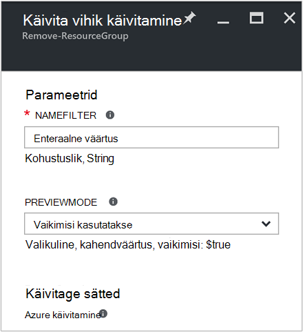
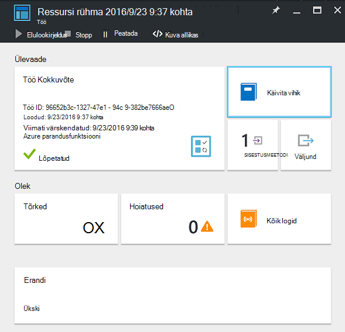
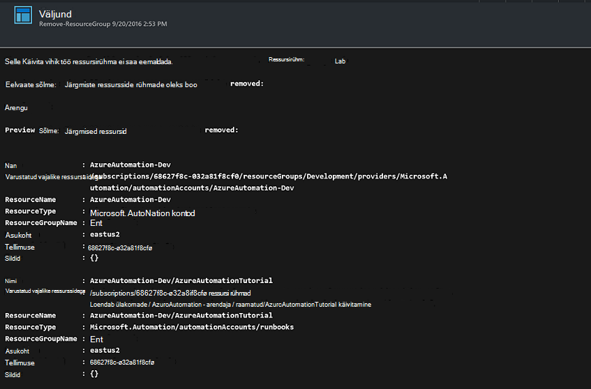

<properties
    pageTitle="Automatiseerida ressursi rühmade eemaldamine | Microsoft Azure'i"
    description="PowerShelli töövoo versioon Azure automatiseerimine stsenaarium, mis sh tegevusraamatud eemaldamiseks kõigi teie tellimus."
    services="automation"
    documentationCenter=""
    authors="MGoedtel"
    manager="jwhit"
    editor=""
    />
<tags
    ms.service="automation"
    ms.workload="tbd"
    ms.tgt_pltfrm="na"
    ms.devlang="na"
    ms.topic="get-started-article"
    ms.date="09/26/2016"
    ms.author="magoedte"/>

# Azure'i automaatika stsenaarium - automatiseerida ressursi rühmade eemaldamine

Paljud kliendid luua rohkem kui üks ressursirühma. Mõned võib kasutada haldamise mängufilmide ja teistele kasutamiseks arendamise, katsetamine ja lavastus keskkonnas. Nende ressursside juurutamise automatiseerimiseks on üks asi, kuid on võimalik eemaldada ühe klõpsuga nupu ressursirühma on teise. Azure'i automaatika abil saate sujuvamaks muutmine haldus ülesande. See on kasulik, kui töötate Azure'i tellimus, mis sisaldab kulude limiit liikme pakkumine nagu MSDN-i või Microsoft Partner Network Põhipilveteenuste programm läbi.

See stsenaarium põhineb PowerShelli käitusjuhendi ja eesmärk on üks või mitu ressursi rühmad, saate määrata oma tellimusest eemaldada. Käitusjuhendi vaikesäte on katsetada enne jätkamist. See tagab, et te eksikombel ei kustutaks ressursirühma enne, kui olete valmis seda toimingut teostada.   

## Saada stsenaarium

Selle stsenaariumi koosneb PowerShelli käitusjuhendi, mille saate alla laadida [PowerShelli Galerii](https://www.powershellgallery.com/packages/Remove-ResourceGroup/1.0/DisplayScript). Saate importida ka see otse [Käitusjuhendi Galerii](automation-runbook-gallery.md) Azure'i portaalis.  

Käitusjuhendi | Kirjeldus|
----------|------------|
Eemalda – ResourceGroup | Ühe või mitme Azure'i ressursi rühmad ja seotud ressursid eemaldatakse tellimus.  
 
See käitusjuhendi on määratletud järgmisi parameetrid:

Parameetri | Kirjeldus|
----------|------------|
NameFilter (nõutav) | Määrab nime filtri piirata ressursside rühmi, millega kavatsete kustutamise kohta. Mitme väärtuse komaga eraldatud loend abil saab edastada. Filtri pole tõstutundlik ja sobib mis tahes ressursirühm, mis sisaldab stringi.|
PreviewMode (valikuline) | Käivitab käitusjuhendi kuvamiseks ressursi rühmad soovite kustutada, kuid ei tee midagi. Vaikimisi on **tõene** aitab vältida juhuslikku kustutamist edasi käitusjuhendi ühe või mitme ressursside rühma.  

## Installige ja konfigureerige see stsenaarium

### Eeltingimused

See käitusjuhendi autendib [Azure'i Run As kontole](automation-sec-configure-azure-runas-account.md).    

### Installimine ja selle tegevusraamatud avaldamine

Pärast allalaadimist käitusjuhendi, saate selle toimingu [importimine käitusjuhendi toimingute](automation-creating-importing-runbook.md#importing-a-runbook-from-a-file-into-Azure-Automation)abil importida. Avaldada käitusjuhendi, kui see on edukalt imporditud automatiseerimise kontole.

## Käitusjuhendi abil

Järgmised toimingud juhendab teid sellest käitusjuhendi ja abi, saate tutvuda, kuidas see toimib. Teil on ainult testimine käitusjuhendi selle näite puhul pole tegelikult kustutamine ressursirühma.  

1. Azure'i portaali, avage oma konto automatiseerimine ja klõpsake käsku **tegevusraamatud**.
2. **Eemalda – ResourceGroup** käitusjuhendi ja klõpsake nuppu **Käivita**.
3. Käitusjuhendi käivitamisel avaneb **Käivitamine Käitusjuhendi** tera ja saate konfigureerida parameetrid. Sisestage oma tellimuse, et saate kasutada testimiseks ja ei põhjusta kahju kui kogemata kustutanud ressursi rühmade nimed.  

    >[AZURE.NOTE] Veenduge, et vältida kustutamine valitud ressursi rühmad on seatud **tõene** **Previewmode** .  **Teate** , et see käitusjuhendi ei eemalda automatiseerimise kontot, kus töötab see käitusjuhendi sisaldavat ressursirühma.  

4. Kui olete konfigureerinud kõigi parameetrite väärtused, klõpsake nuppu **OK**ja käitusjuhendi on pandud järjekorda täitmiseks.  

Azure'i portaalis **Eemalda-ResourceGroup** käitusjuhendi töö üksikasjade vaatamiseks valige käitusjuhendi **tööde haldamine** . Projekti Kokkuvõte kuvatakse sisendparameetrite ja väljundi voo Lisaks üldteavet töö ning toimunud erandid.  .

**Projekti Kokkuvõte** sisaldab sõnumeid väljundi, hoiatused ja tõrge voogu. Valige **väljundi** käitusjuhendi täitmise üksikasjalik tulemusi vaadata.  

## Järgmised sammud

- Vaadake oma käitusjuhendi loomise alustamiseks, [loomine või importimine on käitusjuhendi Azure'i automaatika](automation-creating-importing-runbook.md).
- Alustamine PowerShelli töövoo tegevusraamatud, lugege teemat [minu esimese PowerShelli töövoo käitusjuhendi](automation-first-runbook-textual.md).
