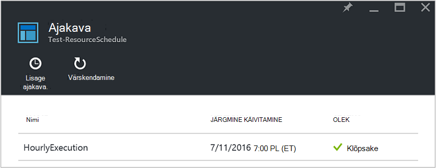
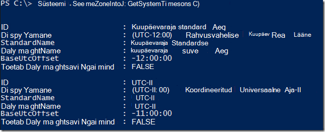
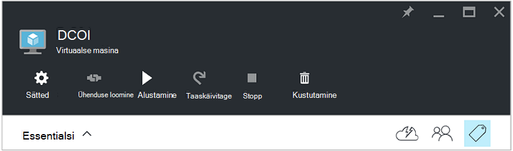
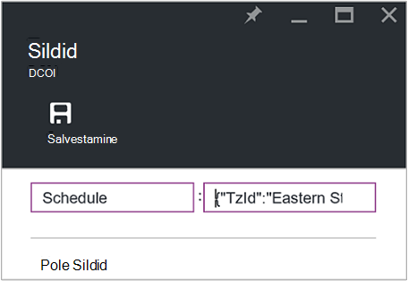
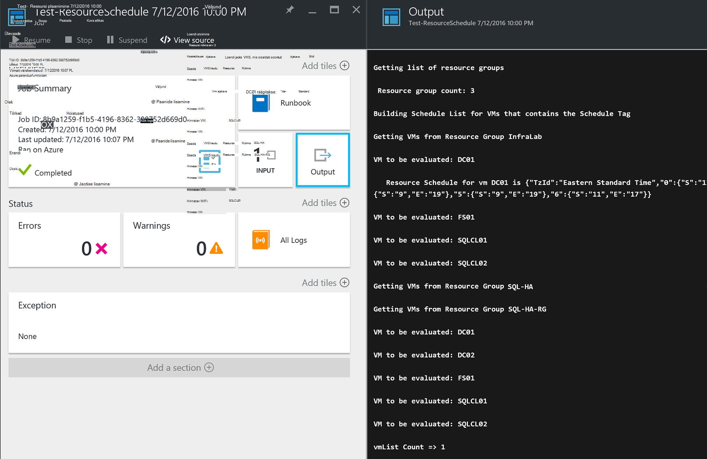

<properties
   pageTitle="JSON-vormingus siltide abil saate luua ajakava Azure VM käivitamine ja sulgemine | Microsoft Azure'i"
   description="Selles artiklis näitab, kuidas kasutada JSON stringide sildid automatiseerimiseks kavandamisel VM käivitamine ja sulgemine."
   services="automation"
   documentationCenter=""
   authors="MGoedtel"
   manager="jwhit"
   editor="tysonn" />
<tags
   ms.service="automation"
   ms.devlang="na"
   ms.topic="article"
   ms.tgt_pltfrm="na"
   ms.workload="infrastructure-services"
   ms.date="07/18/2016"
   ms.author="magoedte;paulomarquesc" />

# Azure'i automaatika stsenaarium: JSON-vormingus siltide abil saate luua ajakava Azure VM käivitamine ja sulgemine

Klientide soovite sageli plaanimine käivitamine ja sulgemist virtuaalmasinates, mis aitab vähendada tellimuse või business ja nõuete tehnilise toega.  

Järgmistel võimaldab teil häälestada automaatse käivitamise ja seiskamise oma vms ajakava ressursi töörühma tasandil või Azure virtuaalse masina taseme sildi abil. See ajakava saab konfigureerida pühapäev kuni laupäev käivitamise aega ja sulgemise ajal.  

Meil on ka out-of-box võimalusi. Järgmised:
-  [Määrab virtuaalse masina skaala](../virtual-machine-scale-sets/virtual-machine-scale-sets-overview.md) autoscale sätetega, mis võimaldavad teil mastaapimiseks sisse või välja.
- [DevTest Labs](../devtest-lab/devtest-lab-overview.md) teenus, mis võimaldab sisseehitatud käivitamise ja seiskamise toimingute ajastamine.

Siiski teatud stsenaariumide toetavad ainult need suvandid ei saa rakendada taristu-kui-a-service (IaaS) VMs.   

Ressursirühma ajakava sildi rakendamisel rakendatakse see ka kõik virtuaalmasinates selle ressursirühma sees. Kui ka otse rakendatakse ajakava VM, viimase ajakava alistab järgmises järjestuses:

1.  Rakendatud ressursirühma ajakava
2.  Ressursirühm ja virtuaalse masina ressursirühma ajakava
3.  Rakendatud virtuaalse masina ajakava

Selle stsenaariumi põhiosas võtab JSON-stringi määratud vormingu abil ja lisab selle väärtusena sildi nimetatakse ajakava. Seejärel soovitud käitusjuhendi on loetletud kõik ressursi rühmad ja virtuaalmasinates ja see tuvastab loendites jaoks iga VM stsenaariumid, mis on loetletud põhjal. Järgmiseks tsüklid kaudu VMs, millele on manustatud ajakavasid ja hindab, mis tuleb. Näiteks seda määrab, milliseid VMs vaja lõpetanud, sulgege või ignoreeritakse.

Nende tegevusraamatud autentida [Azure'i Run As kontole](../automation/automation-sec-configure-azure-runas-account.md).

## Laadige alla tegevusraamatud stsenaariumi

Sel juhul sisaldab nelja PowerShelli töövoo tegevusraamatud, mis [TechNeti Galerii](https://gallery.technet.microsoft.com/Azure-Automation-Runbooks-84f0efc7) või [GitHub](https://github.com/paulomarquesdacosta/azure-automation-scheduled-shutdown-and-startup) hoidla selle projekti jaoks saate alla laadida.

Käitusjuhendi | Kirjeldus
----------|----------
Test-ResourceSchedule | Iga virtuaalse masina ajakava kontrollib ja teeb sõltuvalt Ajasta käivitamine või sulgemine.
Lisage ResourceSchedule | Lisab ajakava sildi VM või ressursside rühma.
Update-ResourceSchedule | Muudab olemasolevat ajakava silti, asendades selle uuega.
Eemalda – ResourceSchedule | Eemaldab ajakava sildi VM või ressursside rühma.

## Installige ja konfigureerige see stsenaarium

### Installimine ja selle tegevusraamatud avaldamine

Pärast allalaadimist selle tegevusraamatud, saate need [loomine](automation-creating-importing-runbook.md#importing-a-runbook-from-a-file-into-Azure-Automation)või importimine on käitusjuhendi Azure'i automaatika toimingute abil importida.  Iga käitusjuhendi avaldada, kui see on edukalt imporditud automatiseerimise kontole.

### Test-ResourceSchedule käitusjuhendi ajakava lisamine

Järgmiste juhiste abil lubada Test-ResourceSchedule käitusjuhendi ajakava. See on käitusjuhendi, mis kinnitab, millised virtuaalmasinates käivitada, sulgeda, või jätta.

1. Azure'i portaalis, avage oma konto automatiseerimine ja klõpsake paani **tegevusraamatud** .
2. Enne **Testi-ResourceSchedule** , klõpsake paani **ajakava** .
3. Enne **ajakava** , klõpsake nuppu **Lisa ajakava**.
4. Enne **ajakava** , valige **Link oma käitusjuhendi graafik**. Valige **Loo uus ajakava**.
5.  Enne **uue ajakava** , tippige nimi selle ajakava, näiteks: *HourlyExecution*.
6. Ajakava **Alustamine**, et mõni tund lisandus algusaja seadmine.
7. Valige **Korduvus**ja seejärel **korduvaks iga intervall**, valige **1 tund**.
8. Veenduge, et **määrata aegumise** on määratud **ei**ja seejärel klõpsake käsku **Loo** uus ajakava salvestamiseks.
9. Enne **Ajakava Käitusjuhendi** suvandid, valige **parameetrite ja käitamine sätted**. Test-ResourceSchedule **parameetrite** tera, sisestage väljale **SubscriptionName** oma tellimuse nime.  See on ainult parameeter, mis on vajalikud käitusjuhendi.  Kui olete lõpetanud, klõpsake nuppu **OK**.  

Käitusjuhendi ajakava peaks välja nägema järgmine, kui see on lõpule viidud.

 

## JSON-stringi vormindamine

See lahendus sellise tõrke ilmnemisel on JSON tekstistringi määratud vormingu abil ja lisab selle väärtusena sildi nimetatakse ajakava. Seejärel soovitud käitusjuhendi on loetletud kõik ressursi rühmad ja virtuaalmasinates ja see tuvastab ajakava iga virtuaalse masina jaoks.

Käitusjuhendi tsüklid üle virtuaalmasinates, millele on manustatud ajakavasid ja kontrollib, milliseid toiminguid tuleb. Järgmine on näide lahendused vormindamise:

    {
       "TzId": "Eastern Standard Time",
        "0": {  
           "S": "11",
           "E": "17"
        },
        "1": {
           "S": "9",
           "E": "19"
        },
        "2": {
           "S": "9",
           "E": "19"
        },
    }

Siin on mõned üksikasjalikku teavet selle struktuuri:

1. Ühe sildi väärtuse Azure 256 märgi piirang on optimeeritud see JSON struktuur vorming.

2. *TzId* tähistab virtuaalse masina ajavöönd. See ID saab klassi TimeZoneInfo .net-i abil PowerShelli seansi--**[System.TimeZoneInfo]: GetSystemTimeZones()**.

    

    - Nädalapäevade on esindatud arvulise väärtuse null kuus. Nullväärtusega võrdub pühapäev.
    - Atribuudiga **S** on esitatud algusaeg ja selle väärtus on 24-tunnises vormingus.
    - End-klahv või sulgumist aeg on esitatud **E** -atribuudiga ja selle väärtus on 24-tunnises vormingus.

    Kui **S** - **E** atribuudid on väärtus on null (0), jääb virtuaalse masina Esita seisu hindamise ajal.   

3. Kui soovite teatud nädalapäev hindamise vahele jätta, ei lisa jaotise selle nädalapäeva. Järgmises näites ainult esmaspäev hinnatakse ja muude nädalapäevade ignoreeritakse.

        {
          "TzId": "Eastern Standard Time",
           "1": {
             "S": "11",
             "E": "17"
           }
        }

## Sildi ressursi rühmade või VMs

VMs sulgemiseks peate sildistamine VMs või ressursside rühmad, kus need asuvad. Virtuaalmasinates, mis pole ajakava sildi, ei väärtustata. Seetõttu nad ei ole alustatud või sulgeda.

On kaks võimalust sildi ressursi rühmadele või VMs lahenduse. Saate seda teha otse portaalis. Või kasutage lisa-ResourceSchedule, värskendus-ResourceSchedule ja Eemalda-ResourceSchedule tegevusraamatud.

### Portaali kaudu sildistamine

Järgmiste juhiste sildistamiseks virtuaalse masina või ressursirühma portaalis.

1. Ühenda JSON-stringi ja veenduge, et pole tühikuid.  JSON-stringi peaks välja nägema umbes järgmine:

        {"TzId":"Eastern Standard Time","0":{"S":"11","E":"17"},"1":{"S":"9","E":"19"},"2": {"S":"9","E":"19"},"3":{"S":"9","E":"19"},"4":{"S":"9","E":"19"},"5":{"S":"9","E":"19"},"6":{"S":"11","E":"17"}}

2. Valige VM või ressursside rühma rakendada selle ajakava ikooni **silt** .

    
3. Sildid on määratletud pärast paari /-väärtuse. Tippige väljale **võti** **ajakava** ja seejärel kleepige JSON string väljale **väärtus** . Klõpsake nuppu **Salvesta**. Teie uus silt peaks nüüd kuvatama teie ressursi siltide loendi kuvamiseks.

### Sildi PowerShelli kaudu

Kõik imporditud tegevusraamatud sisaldavad abi alguses teavet, mis kirjeldab, kuidas käivitada soovitud tegevusraamatud otse PowerShelli skripti. Saate helistada lisa-ScheduleResource ja värskendus-ScheduleResource tegevusraamatud PowerShelli kaudu. Tehke seda saates nõutavad parameetrid, mis võimaldavad teil luua või Värskenda ajakava sildi väljaspool portaali rühmas VM või ressurss.  

Luua, lisamine ja kustutamine siltide PowerShelli, mida on vaja kõigepealt [Azure PowerShelli keskkonna häälestamine](../powershell-install-configure.md)kaudu. Kui olete häälestamise, hankimiseks tehke järgmist.

### Sildi ajakava loomine PowerShelli abil

1. Avage PowerShelli seanss. Seejärel kasutage autentida kontol käivitada nimega ja määrake tellimuse järgmises näites:   

        Conn = Get-AutomationConnection -Name AzureRunAsConnection
        Add-AzureRMAccount -ServicePrincipal -Tenant $Conn.TenantID `
        -ApplicationId $Conn.ApplicationID -CertificateThumbprint $Conn.CertificateThumbprint
        Select-AzureRmSubscription -SubscriptionName "MySubscription"

2. Määratleda ajakava räsi tabeli. Siin on näide sellest, kuidas tuleb koostada.

        $schedule= @{ "TzId"="Eastern Standard Time"; "0"= @{"S"="11";"E"="17"};"1"= @{"S"="9";"E"="19"};"2"= @{"S"="9";"E"="19"};"3"= @{"S"="9";"E"="19"};"4"= @{"S"="9";"E"="19"};"5"= @{"S"="9";"E"="19"};"6"= @{"S"="11";"E"="17"}}

3. Määratlege parameetrid, mis on nõutud käitusjuhendi. Järgmises näites oleme suunatud VM:

        $params = @{"SubscriptionName"="MySubscription";"ResourceGroupName"="ResourceGroup01"; `
        "VmName"="VM01";"Schedule"=$schedule}

    Kui olete sildistamine ressursirühma, eemaldage *VMName* parameetri $params räsi tabeli järgmiselt:

        $params = @{"SubscriptionName"="MySubscription";"ResourceGroupName"="ResourceGroup01"; `
        "Schedule"=$schedule}

4. Lisa-ResourceSchedule käitusjuhendi käivitada järgmiste parameetrite ajakava sildi loomiseks:

        Start-AzureRmAutomationRunbook -Name "Add-ResourceSchedule" -Parameters $params `
        -AutomationAccountName "AutomationAccount" -ResourceGroupName "ResourceGroup01"

5. Ressursirühm või virtuaalse masina sildi värskendamiseks käivitada **Update-ResourceSchedule** käitusjuhendi järgmiste parameetrite abil:

        Start-AzureRmAutomationRunbook -Name "Update-ResourceSchedule" -Parameters $params `
        -AutomationAccountName "AutomationAccount" -ResourceGroupName "ResourceGroup01"

### PowerShelliga ajakava sildi eemaldamine

1. Avage PowerShelli seanss ja käivitage autentimiseks käivitada nagu konto, et valida ja määrata tellimuse järgmist:

        Conn = Get-AutomationConnection -Name AzureRunAsConnection
        Add-AzureRMAccount -ServicePrincipal -Tenant $Conn.TenantID `
        -ApplicationId $Conn.ApplicationID -CertificateThumbprint $Conn.CertificateThumbprint
        Select-AzureRmSubscription -SubscriptionName "MySubscription"

2. Määratlege parameetrid, mis on nõutud käitusjuhendi. Järgmises näites oleme suunatud VM:

        $params = @{"SubscriptionName"="MySubscription";"ResourceGroupName"="ResourceGroup01" `
        ;"VmName"="VM01"}

    Kui olete sildi eemaldamine ressursi rühma, *VMName* parameetri tabelist eemaldada $params räsi järgmiselt:

        $params = @{"SubscriptionName"="MySubscription";"ResourceGroupName"="ResourceGroup01"}

3. Eemalda – ResourceSchedule käitusjuhendi ajakava sildi eemaldamiseks täita:

        Start-AzureRmAutomationRunbook -Name "Remove-ResourceSchedule" -Parameters $params `
        -AutomationAccountName "AutomationAccount" -ResourceGroupName "ResourceGroup01"

4. Ressursirühm või virtuaalse masina sildi värskendamiseks käivitada Eemalda-ResourceSchedule käitusjuhendi järgmiste parameetrite abil:

        Start-AzureRmAutomationRunbook -Name "Remove-ResourceSchedule" -Parameters $params `
        -AutomationAccountName "AutomationAccount" -ResourceGroupName "ResourceGroup01"

>[AZURE.NOTE] Soovitame, et te aktiivselt jälgida nende tegevusraamatud (ja virtuaalse masina Ühendriigid) kinnitamaks, et teie virtuaalmasinates need suletakse allapoole ja vastavalt alustamine.  

Azure'i portaalis Test-ResourceSchedule käitusjuhendi töö üksikasjade vaatamiseks valige **töö** paan käitusjuhendi raames. Töö kokkuvõtte kuvatakse sisendparameetrite ja väljundi voo, lisaks Üldteave töö ja mis tahes erandid, kui need.  

**Projekti Kokkuvõte** sisaldab sõnumeid väljundi, hoiatused ja tõrge voogu. Valige paan **väljundi** käitusjuhendi täitmise üksikasjalik tulemusi vaadata.

  

## Järgmised sammud

-  Alustamine PowerShelli töövoo tegevusraamatud, lugege teemat [minu esimese PowerShelli töövoo käitusjuhendi](automation-first-runbook-textual.md).
-  Käitusjuhendi tüübid ja nende eelised ja piirangute kohta leiate lisateavet teemast [Azure automatiseerimine käitusjuhendi tüübid](automation-runbook-types.md).
-  Lisateavet PowerShelli skripti toetavad funktsioonid leiate teemast [kohalikke PowerShelli skripti tugi Azure automatiseerimine](https://azure.microsoft.com/blog/announcing-powershell-script-support-azure-automation-2/).
-  Käitusjuhendi logimine ja väljundi kohta leiate lisateavet teemast [Käitusjuhendi väljundi ja sõnumite Azure automatiseerimine](automation-runbook-output-and-messages.md).
-  Azure'i käivitada nagu konto ning kuidas selle abil oma tegevusraamatud autentida kohta leiate lisateavet teemast [autentimise tegevusraamatud Azure'i käivitada nimega kontoga](../automation/automation-sec-configure-azure-runas-account.md).
