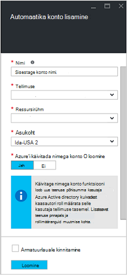
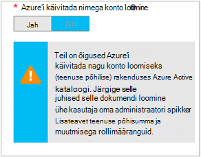

<properties
   pageTitle="Azure'i AD kasutajakonto konfigureerimine | Microsoft Azure'i"
   description="Selles artiklis kirjeldatakse, kuidas konfigureerida Azure AD kasutaja konto mandaadi tegevusraamatud Azure'i automaatika ARM ja ASM autentimiseks."
   services="automation"
   documentationCenter=""
   authors="MGoedtel"
   manager="jwhit"
   editor="tysonn"
   keywords="Azure'i active directory kasutaja azure teenuse haldus azure ad kasutajakonto" />
<tags
   ms.service="automation"
   ms.devlang="na"
   ms.topic="get-started-article"
   ms.tgt_pltfrm="na"
   ms.workload="infrastructure-services"
   ms.date="09/12/2016"
   ms.author="magoedte" />

# Azure'i Teenusehaldus ja ressursihaldur tegevusraamatud autentida

Selles artiklis kirjeldatakse juhiseid peate tegema konfigureerida Azure AD kasutaja konto Azure'i automaatika tegevusraamatud töötab Azure'i teenus Management (ASM) või Azure ressursi Manager (ARM) ressursid suhtes.  Samal ajal, kui see on jätkuvalt toetatud autentimine identiteedi oma rühmas vastavalt tegevusraamatud, on soovitatav meetod uue Azure käivitada nimega kontot kasutades.       

## Azure Active Directory uue kasutaja loomine

1. Logige sisse Azure klassikaline portaali teenuse administraator Azure tellimus, mida soovite hallata.
2. Valige **Active Directory**ja seejärel valige oma ettevõtte kataloogi nimi.
3. Valige vahekaart **Kasutajad** ja seejärel valige jaotises käsk **Lisa kasutaja**.
4. Valige lehel **meile selle kasutaja kohta** , klõpsake jaotises **Tüüp kasutaja** **ettevõttes uue kasutaja**.
5. Sisestage kasutaja nimi.  
6. Valige kaustanimi, mis on seotud tellimuse Azure Active Directory lehel.
7. **Kasutajaprofiili** lehel sisestage esimese ja viimase nimi, kasutajasõbralik nimi ja kasutajale **rollide** loend.  Kas **Lubada Mitmikautentimise**.
8. Pange tähele, et Kasutaja täisnimi ja ajutise parooliga.
9. Valige **Sätted > administraatorid > Lisa**.
10. Tippige täielik kasutajanimi kasutaja loodud.
11. Valige tellimus, mida soovite hallata kasutaja.
12. Logi välja Azure ja seejärel logige uuesti sisse äsja loodud kontoga. Teil palutakse muuta kasutaja parooli.

## Azure'i klassikaline portaalis automatiseerimise konto loomine
Selles jaotises sooritamist Azure portaali, mida kasutatakse teie tegevusraamatud ressursside ASM ja ARM režiimis Azure automatiseerimine uue konto loomiseks järgmist.  

>[AZURE.NOTE] Azure'i klassikaline portaali loodud automatiseerimise kontod saab hallata nii Azure'i klassikaline ja Azure portaali ja kas kogumi cmdlet-käsud. Kui konto on loodud, pole vahet kuidas seanssi luua ja hallata vahendeid konto. Kui kavatsete kasutada Azure klassikaline portaali, siis kasutage selle asemel Azure portaali loomine kontodest automatiseerimine.

1. Logige sisse Azure klassikaline portaali teenuse administraator Azure tellimus, mida soovite hallata.
2. Valige **automatiseerimine**.
3. Valige lehel **automatiseerimise** **Loo konto automatiseerimine**.
4. **Automatiseerimise konto loomine** väljale Tippige automatiseerimise konto nimi ja **regiooni** rippmenüü loendist.  
5. Klõpsake nuppu **OK** , et aktsepteerida sätete ja konto loomine.
6. Pärast selle loomist see kirjas lehel **automatiseerimine** .
7. Klõpsake nuppu konto ja see viib teid Armatuurlaua leht.  
8. Valige lehel automatiseerimise armatuurlaua **varad**.
9. Valige lehel **varade** **Lisamine sätete** lehe allosas asub.
10. Valige lehel **Lisa sätted** **Lisada identimisteavet**.
11. Lehel **Määratlemine mandaati** **Windows PowerShelli mandaati** valige ripploendist **Mandaadi tüüp** ja nimi identimisteabega.
12. Järgmised **Määratlemine mandaati** lehel tippige kasutajanimi AD kasutajakonto loodud varem välja **Kasutajanimi** ja parool väljadele **parool** ja **Parooli kinnitus** . Klõpsake muudatuste salvestamiseks nuppu **OK** .

## Azure'i portaalis automatiseerimise konto loomine

Selles jaotises sooritamist tegevusraamatud haldamise ressursid ARM režiimis kasutatud Azure'i portaalis Azure automatiseerimine uue konto loomiseks järgmist.  

1. Logige sisse Azure portaali teenuse administraator Azure tellimus, mida soovite hallata.
2. Valige **kontod automatiseerimine**.
3. Labale automatiseerimise kontod nuppu **Lisa**. 
2. **Automaatika konto lisamine** tera, sisestage **nimi** väljale automatiseerimise konto nimi.
5. Kui teil on mitu tellimust, määrata ühe uue konto, kui ka uude või olemasolevasse **ressursirühm** ja on Azure andmekeskuse **asukoha**jaoks.
3. Valige väärtus **pole** suvand **Loo Azure'i käivitada kui konto** ja klõpsake nuppu **Loo** .  

    >[AZURE.NOTE] Kui valite ei Loo konto käivitada, valides suvandi **ei**, esitatakse hoiatuse tera **Automatiseerimise konto lisamine** .  Kui konto on loodud ja määratud tellimuse **kaasautori** roll, on vastava autentimise identiteedi oma tellimuste kataloogiteenusest ja seega pole Accessi ressursse teie tellimus.  See aitab vältida mis tahes tegevusraamatud viitamine ei saaks autentimiseks ja ülesannete suhtes ARM ressursid selle kontoga.

    

4. Ajal Azure'i loob automatiseerimise konto, saate jälgida edenemist jaotises **teatised** menüüst.

Kui mandaadi loomine on lõpule viidud, peate seejärel mandaati varade automatiseerimise konto seostada varem loodud AD kasutajakonto loomine.  Pidage meeles, et lõime automatiseerimise konto ja see ei ole seostatud identiteedi autentimine.  [Mandaadi varad Azure automatiseerimine artiklis](../automation/automation-credentials.md#creating-a-new-credential) kirjeldatud toimingute ja sisestage **kasutajanimi** vormingus **domeen\kasutajanimi**väärtus.

## Mandaat on käitusjuhendi kasutamine

Saate tuua mandaat on käitusjuhendi [Get-AutomationPSCredential](http://msdn.microsoft.com/library/dn940015.aspx) tegevuse abil sisse ja seejärel seda kasutada koos [Lisa-AzureAccount](http://msdn.microsoft.com/library/azure/dn722528.aspx) Azure tellimuse loomiseks. Kui mandaat on Azure mitu tellimust, administraator, siis [Valige-AzureSubscription](http://msdn.microsoft.com/library/dn495203.aspx) tuleks kasutada ka õige määramiseks. See on esitatud valimi Windows PowerShelli allpool, mis kuvatakse tavaliselt enamik Azure'i automaatika tegevusraamatud ülaosas.

    $cred = Get-AutomationPSCredential –Name "myuseraccount.onmicrosoft.com"
    Add-AzureAccount –Credential $cred
    Select-AzureSubscription –SubscriptionName "My Subscription"

Klõpsake oma käitusjuhendi peaks korrake pärast kõik [postkastid](http://technet.microsoft.com/library/dn469257.aspx#bk_Checkpoints) nende ridade. Kui käitusjuhendi on peatatud ja seejärel uuesti sisse teise töötaja, siis see on vaja uuesti autentida.

## Järgmised sammud
* Vaadake üle käitusjuhendi eri tüüpi ja juhiseid luua oma tegevusraamatud järgmises artiklis [Azure automatiseerimine käitusjuhendi tüübid](../automation/automation-runbook-types.md)
