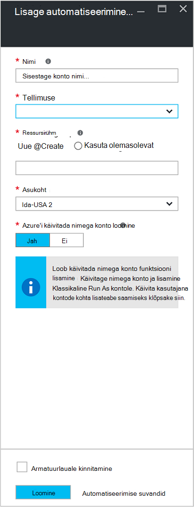

<properties
    pageTitle="Konfigureerida Azure Käivita konto | Microsoft Azure'i"
    description="Õpetus mis juhendab teid loomise, testimine ja näide kasutamise turvalisus põhisumma autentimine Azure automatiseerimine."
    services="automation"
    documentationCenter=""
    authors="mgoedtel"
    manager="jwhit"
    editor=""
    keywords="teenuse turvasubjektinimi, setspn, azure autentimine"/>
<tags
    ms.service="automation"
    ms.workload="tbd"
    ms.tgt_pltfrm="na"
    ms.devlang="na"
    ms.topic="get-started-article"
    ms.date="08/17/2016"
    ms.author="magoedte"/>

# Autentida tegevusraamatud Azure'i käivitada nimega kontoga

See teema näitab teile, kuidas konfigureerida Azure portaalis autentida tegevusraamatud haldamise ressursid Azure'i ressursihaldur või Azure Teenusehaldus käivitada nimega konto funktsiooni abil konto automatiseerimine.

Azure'i portaalis automatiseerimise uue konto loomisel loob automaatselt:

- Käivitage nimega konto, mis loob uue teenuse põhilise Azure Active Directory sert, ja määrab kaasautor Rollipõhine juurdepääsu reguleerimine (RBAC) ressursihaldur ressursid abil tegevusraamatud haldamiseks kasutatavad.   
- Klassikaline käivitada nagu konto üleslaadimisel halduse tunnistus, mis kasutab Azure Teenusehaldus või klassikalises ressursside tegevusraamatud abil hallata.  

Seda saiti teile ja aitab teil kiiresti alustada koostamise ja juurutamine tegevusraamatud toetamiseks automatiseerimise teie vajadustele.      

Käivitamine ja klassikaline käivitada konto abil saate teha järgmist.

- Standardne võimalda autentimiseks Azure'i Azure ressursihaldur või Azure Teenusehaldus ressursid juhtimisel tegevusraamatud Azure'i portaalis.  
- Globaalne tegevusraamatud konfigureeritud Azure teatiste kasutamine automatiseerida.

>[AZURE.NOTE] Automatiseerimise globaalne tegevusraamatud Azure [teatiste integratsiooni funktsiooni](../monitoring-and-diagnostics/insights-receive-alert-notifications.md) jaoks on vaja automatiseerimise konto, mis on konfigureeritud on Käivita kasutajana ja klassikaline käivitada nagu konto. Saate valige automatiseerimise kontoga, millel on juba määratud käivitamine ja klassikaline käivitada kontot või uue konto loomiseks klõpsake nuppu.

Me näitab teile, kuidas luua automatiseerimise konto Azure'i portaalis, värskendage konto automatiseerimise PowerShelli kaudu, ja näitavad, kuidas teie tegevusraamatud autentimiseks.

Enne seda, on mõned asjad, mida peaksite mõista ja kaaluma enne jätkamist.

1. See ei mõjuta juba loodud klassikaline või ressursihaldur juurutamise mudeli olemasoleva automatiseerimine kontod.  
2. See toimib ainult automatiseerimine kontode loodud Azure portaali kaudu.  Klassikaline portaali konto loomise katsel ei korrata käivitada nimega konto konfigureerimine.
3. Kui teil praegu on tegevusraamatud ning varad (st ajakavade, muutujate jne) varem loodud klassikalises ressursside haldamiseks ning soovite need tegevusraamatud autentimiseks uue klassikaline käivitada nagu konto, peate migreerimine automatiseerimise uue konto või värskendada oma olemasoleva kontoga PowerShelli skripti allpool.  
4. Autentida uue nimega käivitada konto ja klassikaline käivitada nimega automatiseerimise konto abil, peate oma olemasoleva tegevusraamatud alltoodud näites koodiga muutmiseks.  **Palun pange tähele,** mis konto käivitamine on autentimise vastu ressursihaldur ressursid põhisumma serdi-põhiste teenuste ja klassikaline käivitada nagu konto abil on autentimiseks vastu Teenusehaldus ressursid sertifikaadiga haldus.     

## Automaatika uue konto loomine Azure'i portaalis

Selles jaotises sooritamist Azure automatiseerimine uue konto loomine Azure portaali kaudu tehke järgmist.  See loob nii nagu käivitamine ja klassikaline käivitada nagu konto.  

>[AZURE.NOTE] Tellimuse administraatorid rolli liige ja koostöö administraator andva juurdepääsu tellimuse kasutajale tellimuse läbimiseks neid juhiseid, *peab* kasutaja olema.  Kasutaja tuleb lisada ka kasutajana, mida soovite vaikimisi tellimuste Active Directory; kontot ei pea olema määratud õigustega roll.

1. Logige sisse kontoga, millel on tellimuse administraatorid rolli liige ja koostöö administraator tellimuse Azure portaali.
2. Valige **kontod automatiseerimine**.
3. Labale automatiseerimise kontod nuppu **Lisa**. 

    >[AZURE.NOTE]Kui kuvatakse järgmine hoiatus **Automatiseerimise konto lisamine** tera, see on, sest teie konto pole tellimuse administraatorid rolli liige ja co-admin tellimus. 

4. **Automaatika konto lisamine** tera, sisestage **nimi** väljale automatiseerimise konto nimi.
5. Kui teil on mitu tellimust, määrata ühe uue konto, kui ka uude või olemasolevasse **ressursirühm** ja on Azure andmekeskuse **asukoha**jaoks.
6. Veenduge, et väärtus **Jah** on valitud suvand **Loo Azure'i käivitada kui konto** ja klõpsake nuppu **Loo** .  

    >[AZURE.NOTE] Kui valite ei Loo konto käivitada, valides suvandi **ei**, esitatakse hoiatuse tera **Automatiseerimise konto lisamine** .  Kui konto on loodud Azure'i portaalis, on vastava autentimise identiteedi oma klassikaline või ressursihaldur tellimuse kataloogiteenusest ja seetõttu ei pääse ressursid teie tellimus.  See aitab vältida mis tahes tegevusraamatud viitamine autentimiseks ja ülesannete esitada ressursse juurutamise mudelite juurde selle kontoga.

    > 
Kui teenuse põhilise ei looda kaasautori roll ei määrata.

7. Ajal Azure'i loob automatiseerimise konto, saate jälgida edenemist jaotises **teatised** menüüst.

### Ressursside sisalduv

Kui automatiseerimise konto on loodud, on teie jaoks automaatselt loodud mitme ressursid.  Järgmises tabelis on kokkuvõte ressursid konto käivitada. 

Ressurss|Kirjeldus
--------|-----------
AzureAutomationTutorial Käitusjuhendi|Mõni näide PowerShelli käitusjuhendi, mis näitab, kuidas abil konto käivitada ja jääb ressursihaldur ressursside.
AzureAutomationTutorialScript Käitusjuhendi|Mõni näide PowerShelli käitusjuhendi, mis näitab, kuidas abil konto käivitada ja jääb ressursihaldur ressursside.
AzureRunAsCertificate|Serdi varade automaatselt loodud automatiseerimise konto loomisel või olemasoleva konto kasutamise PowerShelli skripti all.  See võimaldab teil nii, et saate hallata Azure ressursihaldur ressursid tegevusraamatud Azure autentida.  See tunnistus on üks aasta eluiga.
AzureRunAsConnection|Ühenduse varade automaatselt loodud automatiseerimise konto loomisel või olemasoleva konto kasutamise PowerShelli skripti all.

Järgmises tabelis on kokkuvõte klassikaline käivitada nagu konto ressursid. 

Ressurss|Kirjeldus
--------|-----------
AzureClassicAutomationTutorial Käitusjuhendi|Näide käitusjuhendi, mille saab klassikaline VMs tellimuse klassikaline käivitada nimega kontot kasutades (sert) ja seejärel väljundid VM nime ja olek.
AzureClassicAutomationTutorial skripti Käitusjuhendi|Näide käitusjuhendi, mille saab klassikaline VMs tellimuse klassikaline käivitada nimega kontot kasutades (sert) ja seejärel väljundid VM nime ja olek.
AzureClassicRunAsCertificate|Serdi varade luuakse automaatselt nii, et saate hallata Azure klassikalises ressursside tegevusraamatud Azure'i autentimiseks kasutatava.  See tunnistus on üks aasta eluiga.
AzureClassicRunAsConnection|Ühenduse varade luuakse automaatselt nii, et saate hallata Azure klassikalises ressursside tegevusraamatud Azure'i autentimiseks kasutatava.  

## Käivitage nimega autentimise kontrollimine

Järgmine me täidab testi kinnitada, et teil on võimalik edukalt autentimiseks uue nimega käivitada konto kaudu.     

1. Azure'i portaalis, avage varem loodud automatiseerimise konto.  
2. Klõpsake paani **tegevusraamatud** tegevusraamatud loendi avamiseks.
3. **AzureAutomationTutorialScript** käitusjuhendi valige ja klõpsake nuppu **Käivita** käitusjuhendi käivitamiseks.  Saate kontrollida, kas soovite alustada käitusjuhendi viip.
4. [Käitusjuhendi töö](automation-runbook-execution.md) on loodud, kuvatakse töö tera ja töö olek kuvatakse paani **Töö kokkuvõte** .  
5. Töö oleku hakkavad nimega *Ootel* , mis näitab, et ootab käitusjuhendi töötaja pilves kättesaadavaks. See siis liigub *algus* kui töötaja väidab töö ning seejärel *töötab* käivitamisel käitusjuhendi tegelikult töötab.  
6. Kui käitusjuhendi töö on lõpule jõudnud, peaksite näeme olek on **lõpule viidud**.   
7. Käitusjuhendi üksikasjaliku tulemuste vaatamiseks klõpsake paani **väljundi** .
8. **Väljundi** tera, peaksite nägema edukalt autenditud ja tagastatud loendi kõigi ressursirühma ressursid.
9. Sulgege **väljundi** tera naasmiseks tera **Töö kokkuvõte** .
13. Sulgege **Töö kokkuvõte** ja vastavate **AzureAutomationTutorialScript** käitusjuhendi tera.

## Klassikaline käivitada nimega autentimise kontrollimine

Järgmine me täidab testi kinnitamaks, et teil on võimalik edukalt autentimiseks uue klassikaline käivitada nimega konto kaudu.     

1. Azure'i portaalis, avage varem loodud automatiseerimise konto.  
2. Klõpsake paani **tegevusraamatud** tegevusraamatud loendi avamiseks.
3. Valige **AzureClassicAutomationTutorialScript** käitusjuhendi ja klõpsake nuppu **Käivita** käitusjuhendi käivitamiseks.  Saate kontrollida, kas soovite alustada käitusjuhendi viip.
4. [Käitusjuhendi töö](automation-runbook-execution.md) on loodud, kuvatakse töö tera ja töö olek kuvatakse paani **Töö kokkuvõte** .  
5. Töö oleku hakkavad nimega *Ootel* , mis näitab, et ootab käitusjuhendi töötaja pilves kättesaadavaks. See siis liigub *algus* kui töötaja väidab töö ning seejärel *töötab* käivitamisel käitusjuhendi tegelikult töötab.  
6. Kui käitusjuhendi töö on lõpule jõudnud, peaksite näeme olek on **lõpule viidud**.   
7. Käitusjuhendi üksikasjaliku tulemuste vaatamiseks klõpsake paani **väljundi** .
8. **Väljundi** tera, peaksite nägema edukalt autenditud ja tagastatakse kõik klassikaline VM loendi kasutaja tellimuse.
9. Sulgege **väljundi** tera naasmiseks tera **Töö kokkuvõte** .
13. Sulgege **Töö kokkuvõte** ja vastavate **AzureClassicAutomationTutorialScript** käitusjuhendi tera.

## Värskendage konto automatiseerimise PowerShelli abil

Siin anname teile PowerShelli abil saate värskendada oma kontot automatiseerimise kui suvand:

1. Olete loonud automatiseerimise kontot, kuid loobunud konto käivitamine
2. Teil on juba konto automatiseerimise haldamiseks ressursihaldur ressursid ja te soovite värskendage seda kaasata Run As kontole käitusjuhendi autentimine
2. Teil on juba konto automatiseerimise klassikalises ressursside haldamiseks ja soovite värskendada, et see klassikaline käivitada nimega uue konto loomine ja migreerimine oma tegevusraamatud ja varade selle asemel kasutada   

Enne jätkamist, kontrollige järgmist:

1. Teil on alla laadida ja installida [Windows Management Framework (WMF) 4.0](https://www.microsoft.com/download/details.aspx?id=40855) , kui kasutate opsüsteemi Windows 7.   
    Kui kasutate opsüsteemi Windows Server 2012 R2, Windows Server 2012, Windows 2008 R2, Windows 8.1 ja Windows 7 SP1, [Windows Management Framework 5.0](https://www.microsoft.com/download/details.aspx?id=50395) on saadaval installi.
2. Azure'i PowerShelli 1.0. Lisateabe saamiseks selles versioonis ja kuidas seda installida, vaadake, [Kuidas installida ja konfigureerida Azure PowerShelli](../powershell-install-configure.md).
3. Olete loonud konto automatiseerimine.  See konto on viidatud parameetrite väärtusena – AutomationAccountName ja - ApplicationDisplayName nii skripte allpool.

*SubscriptionID*, *ResourceGroup*ja *AutomationAccountName*tooks väärtused, mis on vajalikud parameetrid skriptide Azure portaali konto automatiseerimise keelest **automatiseerimise konto** ja valige **Kõik sätted**.  Keelest **Kõik sätted** jaotises **Konto sätted** valige **Atribuudid**.  Labale **Atribuudid** saate võtke arvesse järgmisi väärtuseid.    

### Käivitage nimega konto PowerShelli skripti loomine

PowerShelli skripti allpool näidatakse konfigureerida järgmist.

- Azure AD rakendus, mis on autenditud iseallkirjastatud cert abil luua põhisumma teenusekonto selle rakenduse Azure AD ja määratud kaasautori roll (mida võiksid muuta seda, omanik või roll) oma praeguse tellimuse selle konto.  Lisateabe saamiseks vaadake [Rollipõhine juurdepääsu reguleerimine Azure'i automaatika](../automation/automation-role-based-access-control.md) artiklis.
- Serdi automatiseerimine vara määratud automatiseerimise konto nimega **AzureRunAsCertificate**, mis on teenus põhisumma kasutatavat serti.
- Automaatika ühenduse vara määratud automatiseerimise konto nimega **AzureRunAsConnection**, mis on applicationId, tenantId, subscriptionId ja serdi sõrmejälje.    

Alltoodud juhiseid juhendab teid skripti täitva protsess.

1. Järgmise skripti oma arvutisse salvestada.  Selles näites, salvestage see faili nimega **New-AzureServicePrincipal.ps1**.  

        #Requires -RunAsAdministrator
        Param (
        [Parameter(Mandatory=$true)]
        [String] $ResourceGroup,

        [Parameter(Mandatory=$true)]
        [String] $AutomationAccountName,

        [Parameter(Mandatory=$true)]
        [String] $ApplicationDisplayName,

        [Parameter(Mandatory=$true)]
        [String] $SubscriptionId,

        [Parameter(Mandatory=$true)]
        [String] $CertPlainPassword,

        [Parameter(Mandatory=$false)]
        [int] $NoOfMonthsUntilExpired = 12
        )

        Login-AzureRmAccount
        Import-Module AzureRM.Resources
        Select-AzureRmSubscription -SubscriptionId $SubscriptionId

        $CurrentDate = Get-Date
        $EndDate = $CurrentDate.AddMonths($NoOfMonthsUntilExpired)
        $KeyId = (New-Guid).Guid
        $CertPath = Join-Path $env:TEMP ($ApplicationDisplayName + ".pfx")

        $Cert = New-SelfSignedCertificate -DnsName $ApplicationDisplayName -CertStoreLocation cert:\LocalMachine\My -KeyExportPolicy Exportable -Provider "Microsoft Enhanced RSA and AES Cryptographic Provider"

        $CertPassword = ConvertTo-SecureString $CertPlainPassword -AsPlainText -Force
        Export-PfxCertificate -Cert ("Cert:\localmachine\my\" + $Cert.Thumbprint) -FilePath $CertPath -Password $CertPassword -Force | Write-Verbose

        $PFXCert = New-Object -TypeName System.Security.Cryptography.X509Certificates.X509Certificate -ArgumentList @($CertPath, $CertPlainPassword)
        $KeyValue = [System.Convert]::ToBase64String($PFXCert.GetRawCertData())

        $KeyCredential = New-Object  Microsoft.Azure.Commands.Resources.Models.ActiveDirectory.PSADKeyCredential
        $KeyCredential.StartDate = $CurrentDate
        $KeyCredential.EndDate= $EndDate
        $KeyCredential.KeyId = $KeyId
        $KeyCredential.Type = "AsymmetricX509Cert"
        $KeyCredential.Usage = "Verify"
        $KeyCredential.Value = $KeyValue

        # Use Key credentials
        $Application = New-AzureRmADApplication -DisplayName $ApplicationDisplayName -HomePage ("http://" + $ApplicationDisplayName) -IdentifierUris ("http://" + $KeyId) -KeyCredentials $keyCredential

        New-AzureRMADServicePrincipal -ApplicationId $Application.ApplicationId | Write-Verbose
        Get-AzureRmADServicePrincipal | Where {$_.ApplicationId -eq $Application.ApplicationId} | Write-Verbose

        $NewRole = $null
        $Retries = 0;
        While ($NewRole -eq $null -and $Retries -le 6)
        {
           # Sleep here for a few seconds to allow the service principal application to become active (should only take a couple of seconds normally)
           Sleep 5
           New-AzureRMRoleAssignment -RoleDefinitionName Contributor -ServicePrincipalName $Application.ApplicationId | Write-Verbose -ErrorAction SilentlyContinue
           Sleep 10
           $NewRole = Get-AzureRMRoleAssignment -ServicePrincipalName $Application.ApplicationId -ErrorAction SilentlyContinue
           $Retries++;
        }

        # Get the tenant id for this subscription
        $SubscriptionInfo = Get-AzureRmSubscription -SubscriptionId $SubscriptionId
        $TenantID = $SubscriptionInfo | Select TenantId -First 1

        # Create the automation resources
        New-AzureRmAutomationCertificate -ResourceGroupName $ResourceGroup -AutomationAccountName $AutomationAccountName -Path $CertPath -Name AzureRunAsCertificate -Password $CertPassword -Exportable | write-verbose

        # Create a Automation connection asset named AzureRunAsConnection in the Automation account. This connection uses the service principal.
        $ConnectionAssetName = "AzureRunAsConnection"
        Remove-AzureRmAutomationConnection -ResourceGroupName $ResourceGroup -AutomationAccountName $AutomationAccountName -Name $ConnectionAssetName -Force -ErrorAction SilentlyContinue
        $ConnectionFieldValues = @{"ApplicationId" = $Application.ApplicationId; "TenantId" = $TenantID.TenantId; "CertificateThumbprint" = $Cert.Thumbprint; "SubscriptionId" = $SubscriptionId}
        New-AzureRmAutomationConnection -ResourceGroupName $ResourceGroup -AutomationAccountName $AutomationAccountName -Name $ConnectionAssetName -ConnectionTypeName AzureServicePrincipal -ConnectionFieldValues $ConnectionFieldValues

2. Teie arvutis, käivitage **Windows PowerShelli** **avakuvale laiendatud kasutajaõigused** .
3. Administraatoriõigustes PowerShelli käsurea kest, liikuge kausta, mis sisaldab skripti, mis on loodud samm 1 ja käivitada skripti, muutuvad parameetrite väärtused *– ResourceGroup*, *- AutomationAccountName*, *- ApplicationDisplayName*, *- SubscriptionId*ja *- CertPlainPassword*. 

    >[AZURE.NOTE] Teil palutakse pärast täidate skripti Azure autentida. Peate logima sisse kontoga, millel on tellimuse administraatorid rolli liige ja co-admin tellimus.

        .\New-AzureServicePrincipal.ps1 -ResourceGroup <ResourceGroupName>
        -AutomationAccountName <NameofAutomationAccount> `
        -ApplicationDisplayName <DisplayNameofAutomationAccount> `
        -SubscriptionId <SubscriptionId> `
        -CertPlainPassword "<StrongPassword>"  
 

Pärast skripti edukalt lõpule jõudnud, vt allpool ressursihaldur ressurssidega autentimiseks ja mandaadi konfiguratsiooni valideerimiseks [proovi kood](#sample-code-to-authenticate-with-resource-manager-resources) .

### Klassikaline käivitada nimega konto PowerShelli skripti loomine

PowerShelli skripti allpool näidatakse konfigureerida järgmist.

- Serdi automatiseerimine vara määratud automatiseerimise konto nimega **AzureClassicRunAsCertificate**, mis on sert, mida kasutatakse teie tegevusraamatud.
- Automaatika ühenduse vara määratud automatiseerimise konto nimega **AzureClassicRunAsConnection**, mis hoiab tellimuse nime, subscriptionId- ja serdi vara nimi.

Skript on halduse iseallkirjastatud serdi loomine ja salvestage see oma arvutisse alla käivitada PowerShelli seansi - *%USERPROFILE%\AppData\Local\Temp*kasutatud kasutajaprofiili ajutiste failide kausta.  Pärast Andmetäite skripti, peate üles laadida Azure halduse serdi automatiseerimine konto loodi halduse salvestuskohta tellimuse.  Alltoodud juhiseid juhendab teid protsessi käivitamisel skripti serdi üleslaadimine.  

1. Järgmise skripti oma arvutisse salvestada.  Selles näites, salvestage see faili nimega **New-AzureClassicRunAsAccount.ps1**.

        #Requires -RunAsAdministrator
        Param (
        [Parameter(Mandatory=$true)]
        [String] $ResourceGroup,

        [Parameter(Mandatory=$true)]
        [String] $AutomationAccountName,

        [Parameter(Mandatory=$true)]
        [String] $ApplicationDisplayName,

        [Parameter(Mandatory=$true)]
        [String] $SubscriptionId,

        [Parameter(Mandatory=$true)]
        [String] $CertPlainPassword,

        [Parameter(Mandatory=$false)]
        [int] $NoOfMonthsUntilExpired = 12
        )

        Login-AzureRmAccount
        Import-Module AzureRM.Resources
        $Subscription = Select-AzureRmSubscription -SubscriptionId $SubscriptionId
        $SubscriptionName = $subscription.Subscription.SubscriptionName

        $CurrentDate = Get-Date
        $EndDate = $CurrentDate.AddMonths($NoOfMonthsUntilExpired)
        $KeyId = (New-Guid).Guid
        $CertPath = Join-Path $env:TEMP ($ApplicationDisplayName + ".pfx")
        $CertPathCer = Join-Path $env:TEMP ($ApplicationDisplayName + ".cer")

        $Cert = New-SelfSignedCertificate -DnsName $ApplicationDisplayName -CertStoreLocation cert:\LocalMachine\My -KeyExportPolicy Exportable -Provider "Microsoft Enhanced RSA and AES Cryptographic Provider"

        $CertPassword = ConvertTo-SecureString $CertPlainPassword -AsPlainText -Force
        Export-PfxCertificate -Cert ("Cert:\localmachine\my\" + $Cert.Thumbprint) -FilePath $CertPath -Password $CertPassword -Force | Write-Verbose
        Export-Certificate -Cert ("Cert:\localmachine\my\" + $Cert.Thumbprint) -FilePath $CertPathCer -Type CERT | Write-Verbose

        # Create the automation resources
        $ClassicCertificateAssetName = "AzureClassicRunAsCertificate"
        New-AzureRmAutomationCertificate -ResourceGroupName $ResourceGroup -AutomationAccountName $AutomationAccountName -Path $CertPath -Name $ClassicCertificateAssetName  -Password $CertPassword -Exportable | write-verbose

        # Create a Automation connection asset named AzureClassicRunAsConnection in the Automation account. This connection uses the ClassicCertificateAssetName.
        $ConnectionAssetName = "AzureClassicRunAsConnection"
        Remove-AzureRmAutomationConnection -ResourceGroupName $ResourceGroup -AutomationAccountName $AutomationAccountName -Name $ConnectionAssetName -Force -ErrorAction SilentlyContinue
        $ConnectionFieldValues = @{"SubscriptionName" = $SubscriptionName; "SubscriptionId" = $SubscriptionId; "CertificateAssetName" = $ClassicCertificateAssetName}
        New-AzureRmAutomationConnection -ResourceGroupName $ResourceGroup -AutomationAccountName $AutomationAccountName -Name $ConnectionAssetName -ConnectionTypeName AzureClassicCertificate -ConnectionFieldValues $ConnectionFieldValues

        Write-Host -ForegroundColor red "Please upload the cert $CertPathCer to the Management store by following the steps below."
        Write-Host -ForegroundColor red "Log in to the Microsoft Azure Management portal (https://manage.windowsazure.com) and select Settings -> Management Certificates."
        Write-Host -ForegroundColor red "Then click Upload and upload the certificate $CertPathCer"

2. Teie arvutis, käivitage **Windows PowerShelli** **avakuvale laiendatud kasutajaõigused** .  
3. Administraatoriõigustes PowerShelli käsurea kest, liikuge kausta, mis sisaldab skripti, mis on loodud samm 1 ja käivitada skripti, muutuvad parameetrite väärtused *– ResourceGroup*, *- AutomationAccountName*, *- ApplicationDisplayName*, *- SubscriptionId*ja *- CertPlainPassword*. 

    >[AZURE.NOTE] Teil palutakse pärast täidate skripti Azure autentida. Peate logima sisse kontoga, mis on tellimuse administraatorid rolli liige ja co-admin tellimus.

        .\New-AzureClassicRunAsAccount.ps1 -ResourceGroup <ResourceGroupName>
        -AutomationAccountName <NameofAutomationAccount> `
        -ApplicationDisplayName <DisplayNameofAutomationAccount> `
        -SubscriptionId <SubscriptionId> `
        -CertPlainPassword "<StrongPassword>"

Pärast skripti edukalt lõpule jõudnud, peate kopeerimine kasutaja profiili kausta **Temp** loodud sert.  Järgige [halduse API serdi üleslaadimine](../azure-api-management-certs.md) Azure klassikaline portaali ja seejärel viidata [proovi kood](#sample-code-to-authenticate-with-service-management-resources) Teenusehaldus ressurssidega mandaati konfiguratsiooni valideerimiseks.

## Proovi kood autentida ressursihaldur ressurssidega

Saate kasutada värskendatud proovi kood allpool võetud **AzureAutomationTutorialScript** näide käitusjuhendi, autentida konto käivitada abil saate hallata oma tegevusraamatud ressursihaldur ressursse.   

    $connectionName = "AzureRunAsConnection"
    $SubId = Get-AutomationVariable -Name 'SubscriptionId'
    try
    {
       # Get the connection "AzureRunAsConnection "
       $servicePrincipalConnection=Get-AutomationConnection -Name $connectionName         

       "Logging in to Azure..."
       Add-AzureRmAccount `
         -ServicePrincipal `
         -TenantId $servicePrincipalConnection.TenantId `
         -ApplicationId $servicePrincipalConnection.ApplicationId `
         -CertificateThumbprint $servicePrincipalConnection.CertificateThumbprint
       "Setting context to a specific subscription"  
       Set-AzureRmContext -SubscriptionId $SubId             
    }
    catch {
        if (!$servicePrincipalConnection)
        {
           $ErrorMessage = "Connection $connectionName not found."
           throw $ErrorMessage
         } else{
            Write-Error -Message $_.Exception
            throw $_.Exception
         }
    }

Skript sisaldab kahte täiendavad koodiread toetamiseks viitamine kontekstis tellimus, saate hõlpsasti vaheldumisi mitu tellimust. Muutuv varade, nimega SubscriptionId sisaldab tellimuse ID-d ja pärast lause Add-AzureRmAccount cmdlet [Set-AzureRmContext cmdlet-käsk](https://msdn.microsoft.com/library/mt619263.aspx) on märgitud koos parameetri määratud *- SubscriptionId*. Kui muutuja nimi on liiga üldine, saate läbi vaadata eesliite või muud nimetamistava oleks lihtsam kindlaks teha oma eesmärkidel muutuja nimi. Teise võimalusena saate kasutada parameetri määratud - SubscriptionName asemel - SubscriptionId koos vastavate muutuv vara.  

Pange tähele, et autentimiseks käitusjuhendi - **Lisa-AzureRmAccount**, klõpsake kasutatavat cmdlet kasutab *ServicePrincipalCertificate* parameetri määramine.  See kontrollib põhisumma tunnistus, mitte identimisteavet kasutades.  

## Proovi kood autentida Teenusehaldus ressurssidega

Saate kasutada värskendatud proovi kood allpool võetud **AzureClassicAutomationTutorialScript** näide käitusjuhendi, autentida haldamine klassikalises ressursside koos oma tegevusraamatud klassikaline käivitada nagu konto abil.

    $ConnectionAssetName = "AzureClassicRunAsConnection"
    # Get the connection
    $connection = Get-AutomationConnection -Name $connectionAssetName        

    # Authenticate to Azure with certificate
    Write-Verbose "Get connection asset: $ConnectionAssetName" -Verbose
    $Conn = Get-AutomationConnection -Name $ConnectionAssetName
    if ($Conn -eq $null)
    {
       throw "Could not retrieve connection asset: $ConnectionAssetName. Assure that this asset exists in the Automation account."
    }

    $CertificateAssetName = $Conn.CertificateAssetName
    Write-Verbose "Getting the certificate: $CertificateAssetName" -Verbose
    $AzureCert = Get-AutomationCertificate -Name $CertificateAssetName
    if ($AzureCert -eq $null)
    {
       throw "Could not retrieve certificate asset: $CertificateAssetName. Assure that this asset exists in the Automation account."
    }

    Write-Verbose "Authenticating to Azure with certificate." -Verbose
    Set-AzureSubscription -SubscriptionName $Conn.SubscriptionName -SubscriptionId $Conn.SubscriptionID -Certificate $AzureCert
    Select-AzureSubscription -SubscriptionId $Conn.SubscriptionID

## Järgmised sammud

- Teenuse põhisumma kohta lisateabe saamiseks vaadake [rakenduse objektid ja teenuse põhilise objektide](../active-directory/active-directory-application-objects.md).
- Rollipõhine juurdepääsu reguleerimine Azure automatiseerimine kohta lisateabe saamiseks vaadake [Rollipõhine juurdepääsu reguleerimine Azure'i automaatika](../automation/automation-role-based-access-control.md).
- Serdid ja Azure teenuste kohta lisateabe saamiseks viidata [Azure'i pilveteenustega serdid ülevaade](../cloud-services/cloud-services-certs-create.md)
