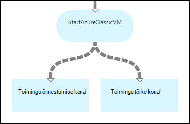
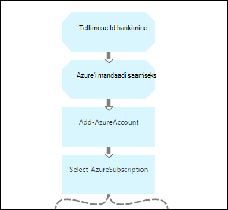
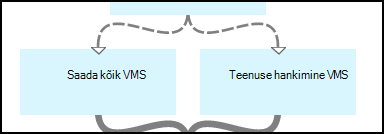
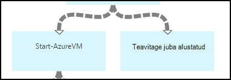
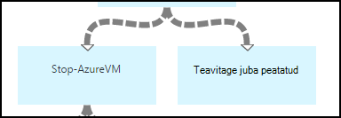
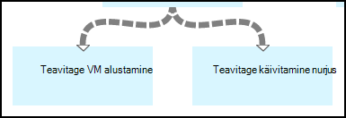
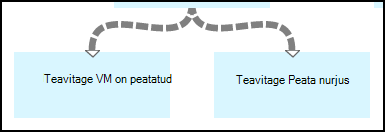

<properties 
    pageTitle="Käivitamine ja seiskamine virtuaalmasinates - graafik | Microsoft Azure'i"
    description="Azure'i automaatika stsenaarium, mis hõlmab tegevusraamatud käivitamine ja peatamine klassikaline virtuaalmasinates PowerShelli töövoo versiooni."
    services="automation"
    documentationCenter=""
    authors="mgoedtel"
    manager="jwhit"
    editor="tysonn" />
<tags 
    ms.service="automation"
    ms.devlang="na"
    ms.topic="article"
    ms.tgt_pltfrm="na"
    ms.workload="infrastructure-services"
    ms.date="07/06/2016"
    ms.author="bwren" />

# Azure'i automaatika stsenaarium - käivitamine ja peatamine virtuaalmasinates

Selle stsenaariumi Azure automatiseerimine sisaldab tegevusraamatud käivitamine ja peatamine klassikaline virtuaalmasinates.  Saate selle stsenaariumi jaoks ühte järgmistest:  

- Kasutage oma keskkonnas tegevusraamatud muutmata kujul. 
- Muutke tegevusraamatud kohandatud funktsionaalsust sooritamiseks.  
- Kõne on tegevusraamatud teise käitusjuhendi raames üldise lahenduse. 
- Kasutage funktsiooni tegevusraamatud õpetused teavet käitusjuhendi loome põhimõtet. 

> [AZURE.SELECTOR]
- [Graafilise](automation-solution-startstopvm-graphical.md)
- [PowerShelli töövoo](automation-solution-startstopvm-psworkflow.md)

See on graafiline käitusjuhendi versioon seda stsenaariumi. See on saadaval [PowerShelli töövoo tegevusraamatud](automation-solution-startstopvm-psworkflow.md)abil.

## Saada stsenaarium

Selle stsenaariumi koosneb kahest kaks graafiline tegevusraamatud, mille saate alla laadida järgmistest linkidest.  Lugege teemat [PowerShelli töövoo versioon](automation-solution-startstopvm-psworkflow.md) selle stsenaariumi PowerShelli töövoo tegevusraamatud linke.

| Käitusjuhendi | Link | Tüüp | Kirjeldus |
|:---|:---|:---|:---|
| StartAzureClassicVM | [Azure'i klassikaline VM graafilise Käitusjuhendi käivitamine](https://gallery.technet.microsoft.com/scriptcenter/Start-Azure-Classic-VM-c6067b3d) | Graafilise | Käivitab kõigi klassikaline virtuaalmasinates Azure tellimuse või kõigi virtuaalmasinates konkreetse teenuse nimega. |
| StopAzureClassicVM | [Azure'i klassikaline VM graafilise Käitusjuhendi peatamine](https://gallery.technet.microsoft.com/scriptcenter/Stop-Azure-Classic-VM-397819bd) | Graafilise | Lõpetab kõik virtuaalmasinates automatiseerimise kontol või kõigi virtuaalmasinates konkreetse teenuse nimega.  |

## Installimine ja konfigureerimine stsenaarium

### 1. selle tegevusraamatud installimine

Pärast allalaadimist selle tegevusraamatud, saate need protseduur [graafilise käitusjuhendi toimingute](automation-graphical-authoring-intro.md#graphical-runbook-procedures)abil importida.

### 2 läbi vaadata, kirjeldus ja nõuded
Funktsiooni tegevusraamatud sisaldavad nimetatakse **lugeda minu** kirjeldus ja nõutav varasid sisaldav tegevus.  Saate vaadata seda teavet **lugeda minu** tegevuse ja seejärel **Töövoo skripti** parameetri valides.  Samuti saate sama teavet sellest artiklist. 

### 3. varad konfigureerimine
Funktsiooni tegevusraamatud vaja järgmised varad, mida peate looma ja asustada väärtused.  Vaikimisi on nimed.  Saate kasutada varad erineva nimega, kui määrate käitusjuhendi käivitamisel [sisendparameetrite](#using-the-runbooks) nende nimed.

| Varade tüüp | Vaikenime | Kirjeldus |
|:---|:---|:---|:---|
| [Mandaadi](automation-credentials.md) | AzureCredential | Sisaldab kontoga, millel on õigus käivitamine ja peatamine tellimuse Azure'i virtuaalmasinates mandaat.  |
| [Muutuja](automation-variables.md) | AzureSubscriptionId | Sisaldab Azure tellimuse Tellimuse ID-d. |

## Selle stsenaariumi abil

### Parameetrid

Iga tegevusraamatud on [sisendparameetrid](automation-starting-a-runbook.md#runbook-parameters).  Peate sisestama kõik kohustuslikud parameetrite väärtused ja soovi korral pakuvad vastavalt oma vajadustele muude parameetrite väärtused.

| Parameetri | Tüüp | Kohustusliku | Kirjeldus |
|:---|:---|:---|:---|
| Teenuse nimi | string | Ei | Kui väärtus pole, on kõik virtuaalmasinates teenuse nime alustamine või on peatatud.  Kui väärtus puudub, on kõik klassikaline virtuaalmasinates Azure tellimuse alustamine või on peatatud. |
| AzureSubscriptionIdAssetName | string | Ei | Sisaldab [muutuv varade](#installing-and-configuring-the-scenario) sisaldab tellimuse ID-d Azure tellimuse nime.  Kui väärtus pole määratud, kasutatakse *AzureSubscriptionId* .  |
| AzureCredentialAssetName | string | Ei | Sisaldab nime [mandaati varade](#installing-and-configuring-the-scenario) sisaldava käitusjuhendi kasutamise korral kasutatav mandaat.  Kui väärtus pole määratud, kasutatakse *AzureCredential* .  |

### Funktsiooni tegevusraamatud käivitamine

Saate meetodite käivitamiseks [on käitusjuhendi Azure'i automaatika](automation-starting-a-runbook.md) alustamiseks kas selle tegevusraamatud selle artikli.

Valimi järgmised käsud kasutab Windows PowerShelli **StartAzureClassicVM** kõik virtuaalmasinates alustada teenuse nimi *MyVMService*käivitamiseks.

    $params = @{"ServiceName"="MyVMService"}
    Start-AzureAutomationRunbook –AutomationAccountName "MyAutomationAccount" –Name "StartAzureClassicVM" –Parameters $params

### Väljund

Funktsiooni tegevusraamatud on [väljund sõnumi](automation-runbook-output-and-messages.md) iga virtuaalse masina, mis näitab, kas alustada või peatada käsustikuga õnnestus.  Saate vaadata kindla stringi väljund tulemi jaoks iga käitusjuhendi määramiseks.  Järgmises tabelis on loetletud võimalike väljundi stringid.

| Käitusjuhendi | Tingimus | Sõnumi |
|:---|:---|:---|
| StartAzureClassicVM | Virtuaalse masina töötab juba  | MyVM töötab juba |
| StartAzureClassicVM | Taotluse esitatud virtuaalse masina jaoks | MyVM pole alustatud |
| StartAzureClassicVM | Alusta kutse virtuaalse masina nurjus.  | MyVM käivitamine nurjus |
| StopAzureClassicVM | Virtuaalse masina töötab juba  | MyVM on juba peatatud |
| StopAzureClassicVM | Taotluse esitatud virtuaalse masina jaoks | MyVM pole alustatud |
| StopAzureClassicVM | Alusta kutse virtuaalse masina nurjus.  | MyVM käivitamine nurjus |

Järgmine on kasutamine **StartAzureClassicVM** [lapse käitusjuhendi](automation-child-runbooks.md) valimi graafilise käitusjuhendi pilt.  See kasutab tingimusvormingu linkide järgmises tabelis.

| Link | Kriteeriumid |
|:---|:---|
| Edu link | $ActivityOutput ['StartAzureClassicVM] – näiteks "\* pole alustatud"    |
| Tõrge link   | $ActivityOutput ['StartAzureClassicVM]-notlike "\* pole alustatud" |

## Üksikasjalik jaotus

Järgmisena kirjeldame üksikasjalik tegevusraamatud selle stsenaariumi.  Saate selle teabe kohandamine soovitud tegevusraamatud või lihtsalt jaoks loome oma automatiseerimise stsenaariume õppida.
 

### Autentimine

Käitusjuhendi algab tegevuste Azure'i tellimus, mida kasutatakse käitusjuhendi ülejäänud ja [mandaadi](automation-configuring.md#configuring-authentication-to-azure-resources) määramiseks.

Saate tuua kaks esimest tegevuste, **Tellimuse Id hankimine** ja **Saada Azure'i identimisteavet**, [varad](#installing-the-runbook) , mida kasutatakse kahte järgmisse tegevuste.  Need tegevused otseselt määrata vara, kuid neid varade nimed.  Kuna me võimaldab kasutajal määrata nende nimed [sisendparameetrid](#using-the-runbooks), läheb vaja neid tegevusi vara tuua määratud mõne sisendparameetrile nimega.

**Lisa-AzureAccount** määrab identimisteavet, mida kasutatakse ülejäänud käitusjuhendi.  Varade identimisteavet, mis toob **Azure'i mandaadi saamiseks** peab olema juurdepääs käivitamine ja peatamine virtuaalmasinates Azure'i tellimus.  Tellimus, mida kasutatakse on valitud, **Valige-AzureSubscription** , mis kasutab tellimuse Id: **Tellimuse Id hankimine**.

### Saada virtuaalmasinates

Käitusjuhendi tuleb määratleda, milline see töötamine virtuaalmasinates ja kas need on juba alustatud või peatatud (olenevalt käitusjuhendi).   Üks kahest tegevusi toob VMs.  **Teenuse hankimine VMs** käivituvad kui jaoks käitusjuhendi sisendparameetrile *teenuse nimi* sisaldab väärtust.  **Saada kõik VMs** käivitub, kui *teenuse nimi* sisendparameetrile jaoks käitusjuhendi ei sisalda väärtust.  See loogika toimub tingimusvormingu linkide eelneva iga tegevuse.

Nii tegevuste cmdletiga **Get-AzureVM** .  **Saada kõik VMs** kasutab **ListAllVMs** parameeter määrata kõik virtuaalmasinates tagastamiseks.  **Teenuse hankimine VMs** kasutab **GetVMByServiceAndVMName** parameetri määramine ja antakse **teenuse nimi** sisendparameetrile **teenuse nimi** parameetri.  

### Ühenda VMs

**Ühenda VMs** on nõutav anda oma panus **Algus-AzureVM** nimi ja teenuse nimi vm(s) käivitamiseks tuleb.  Selle sisendi võib pärineda kas **Saada kõik VMs** või **Teenuse VMs saada**, kuid **Algus-AzureVM** saate määrata ainult ühe tegevuse selle sisestamiseks.   

Stsenaarium on luua **Ühendamine VMs** töötab cmdlet-käsu **Täitmine-väljund** .  Selle cmdlet-käsk **InputObject** parameeter on PowerShelli avaldis, mis ühendab eelmise kahe tegevuste sisestatud.  Ainult ühe tegevuse käivitub ainult ühe komplekti väljundi peaks.  **Algus-AzureVM** saate kasutada selle väljundi oma sisendparameetrid. 

### Start/Stop virtuaalmasinates

 

Sõltuvalt käitusjuhendi, proovivad järgmisel tegevuse alustamine või lõpetamine käitusjuhendi **Algus-AzureVM** või **Peata-AzureVM**abil.  Kuna tegevuse ees müügivõimaluste link, see töötab üks kord iga objekti tagastatud **VMs ühendada**.  Link on tingimusvormingu nii, et tegevuse käivitub ainult siis, kui *RunningState* virtuaalse masina on *peatamiseni* **Algus-AzureVM** jaoks ja *Alustamine* **Peata-AzureVM**jaoks. Kui see tingimus on täidetud, siis **Teavitage juba käivitanud** või **Teavitamise juba lõpetanud** käivitatakse **Kirjutamine-väljund**sõnumi saatmiseks.

### Saada väljund

 

Lõplik juhises käitusjuhendi on väljundi saada, kas alustada või peatada taotlus iga virtuaalse masina õnnestus. On eraldi **Kirjutamine-väljund** tegevuse iga, ning me määrata, millise pidamine tingimusvormingu lingid.  Kui *OperationStatus* on *õnnestus*käitatakse **Teavitamise VM alustamine** või **Teavitamise VM on peatatud** .  Kui *OperationStatus* väärtus on midagi muud, on käivitage **Teavitamise nurjus alustage** või **Teavitamise ei lõpeta** .

## Järgmised sammud

- [Graafilise Azure'i automaatika koostamine](automation-graphical-authoring-intro.md)
- [Lapse tegevusraamatud Azure'i automaatika](automation-child-runbooks.md) 
- [Käitusjuhendi väljundi ja sõnumite Azure automatiseerimine](automation-runbook-output-and-messages.md)