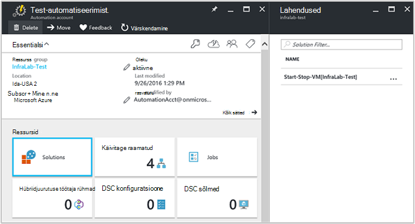

<properties
    pageTitle="Start/Stop VMs ajal off-tunni [Preview] lahenduse | Microsoft Azure'i"
    description="VM lahendusi käivitab lõpetab oma Azure'i Virtuaalmasinates ressursihaldur ajakava ja Log Analytics aktiivselt jälgimine."
    services="automation"
    documentationCenter=""
    authors="MGoedtel"
    manager="jwhit"
    editor=""
    />
<tags
    ms.service="automation"
    ms.workload="tbd"
    ms.tgt_pltfrm="na"
    ms.devlang="na"
    ms.topic="get-started-article"
    ms.date="10/07/2016"
    ms.author="magoedte"/>

# Start/Stop VMs ajal off-tunni [Preview] lahenduse automatiseerimine

Start/Stop VMs ajal off-tunni [Preview] lahenduse alustab ja lõpetab oma ressursihaldur Azure'i virtuaalmasinates kasutaja määratletud ajakava ja annab ülevaate automaatika tööd, käivitamine ja peatamine oma virtuaalmasinates OMS Log Analytics edu.  

## Eeltingimused

- Funktsiooni tegevusraamatud töötada [Azure'i Run As kontole](automation-sec-configure-azure-runas-account.md).  Konto käivitamine on eelistatud autentimise meetodit, kuna see kasutab serdi autentimist parooli aegumise või muuta sageli asemel.  

- See lahendus saate hallata ainult VMs, mis on sama tellimuse ja ressursirühma nimega automatiseerimise konto asukoht.  

- Selle lahenduse juurutamine ainult Azure järgmistes regioonides - Austraalia kodutee, Ida-USA, Kagu-Aasia ja Lääne Euroopa.  Tegevusraamatud, mis VM ajakava haldamine saate suunata VMs mis tahes ala.  

- Käivitamise ja lõpetamise VM tegevusraamatud lõpetada meiliteatiste saatmiseks on vaja Office 365 äriklassi tellimus.  

## Lahenduse komponendid

See lahendus koosneb järgmistest allikatest, mis imporditakse ja lisatud kontole automatiseerimine.

### Tegevusraamatud

Käitusjuhendi | Kirjeldus|
--------|------------|
CleanSolution MS-Mgmt VM | See käitusjuhendi eemaldab kogu materjale ja ajakava kui lähete kustutamine tellimusest lahendus.|  
SendMailO365 – MS-Mgmt | See käitusjuhendi saadab e-posti kaudu Office 365 Exchange'i.|
StartByResourceGroup MS-Mgmt VM | See käitusjuhendi on mõeldud alustada VMs (nii klassikaline ja ARM VMs) mis asub Azure ressursi rühm(ad) antud loendis.
StopByResourceGroup MS-Mgmt VM | See käitusjuhendi on mõeldud VMs peatamine (nii klassikaline ja ARM VMs) mis asub Azure ressursi rühm(ad) antud loendis.|
 

### Muutujad

Muutuja | Kirjeldus|
---------|------------|
**SendMailO365 – MS-Mgmt** Käitusjuhendi ||
SendMailO365 IsSendEmail – MS Mgmt | Saate määrata, kui StartByResourceGroup MS-Mgmt VM ja StopByResourceGroup MS-Mgmt VM tegevusraamatud saata meiliteatise lõpetamisel.  Valige **tõene** lubamiseks ja **False** keelamiseks e-posti teavitamine. Vaikeväärtus on **False**.| 
**StartByResourceGroup MS-Mgmt VM** Käitusjuhendi ||
StartByResourceGroup-ExcludeList – MS-Mgmt-VM | Sisestage VM nimed ei kuulu halduse toiming; eraldades nimed, kasutades semi-colon(;). Väärtused on tõstutundlikud ja metamärkide (tärn) on toetatud.|
StartByResourceGroup-SendMailO365-EmailBodyPreFix – MS-Mgmt | Tekst, mida saate lisada meilisõnumi sisust alguseni.|
StartByResourceGroup-SendMailO365-EmailRunBookAccount – MS-Mgmt | Saate määrata automatiseerimise konto, mis sisaldab e-posti käitusjuhendi nimi.  **Muutke muutuja.**|
StartByResourceGroup-SendMailO365-EmailRunbookName – MS-Mgmt | Määrab nime, e-posti käitusjuhendi.  Seda kasutatakse StartByResourceGroup MS-Mgmt VM-ja StopByResourceGroup MS-Mgmt VM tegevusraamatud meilisõnumi saatmine.  **Muutke muutuja.**|
StartByResourceGroup-SendMailO365-EmailRunbookResourceGroup – MS-Mgmt | Määrab nime ressursirühm, mis sisaldab e-posti käitusjuhendi.  **Muutke muutuja.**|
StartByResourceGroup-SendMailO365-EmailSubject – MS-Mgmt | Määrab teksti meilisõnumi teema.|  
StartByResourceGroup-SendMailO365-EmailToAddress – MS-Mgmt | Saate määrata e-posti adressaat.  Sisestage eraldi nimed, kasutades semi-colon(;).|
StartByResourceGroup-TargetResourceGroups – MS-Mgmt-VM | Sisestage VM nimed ei kuulu halduse toiming; eraldades nimed, kasutades semi-colon(;). Väärtused on tõstutundlikud ja metamärkide (tärn) on toetatud.  Tellimus sisaldab kõigi vaikeväärtus (tärn).|
StartByResourceGroup-TargetSubscriptionID – MS-Mgmt-VM | Saate määrata tellimuse, mis sisaldab VMs juhtida seda lahendust.  See peab olema sama tellimuse automatiseerimise konto selle lahenduse asukoht.|
**StopByResourceGroup MS-Mgmt VM** Käitusjuhendi ||
StopByResourceGroup-ExcludeList – MS-Mgmt-VM | Sisestage VM nimed ei kuulu halduse toiming; eraldades nimed, kasutades semi-colon(;). Väärtused on tõstutundlikud ja metamärkide (tärn) on toetatud.|
StopByResourceGroup-SendMailO365-EmailBodyPreFix – MS-Mgmt | Tekst, mida saate lisada meilisõnumi sisust alguseni.|
StopByResourceGroup-SendMailO365-EmailRunBookAccount – MS-Mgmt | Saate määrata automatiseerimise konto, mis sisaldab e-posti käitusjuhendi nimi.  **Muutke muutuja.**|
StopByResourceGroup-SendMailO365-EmailRunbookResourceGroup – MS-Mgmt | Määrab nime ressursirühm, mis sisaldab e-posti käitusjuhendi.  **Muutke muutuja.**|
StopByResourceGroup-SendMailO365-EmailSubject – MS-Mgmt | Määrab teksti meilisõnumi teema.|  
StopByResourceGroup-SendMailO365-EmailToAddress – MS-Mgmt | Saate määrata e-posti adressaat.  Sisestage eraldi nimed, kasutades semi-colon(;).|
StopByResourceGroup-TargetResourceGroups – MS-Mgmt-VM | Sisestage VM nimed ei kuulu halduse toiming; eraldades nimed, kasutades semi-colon(;). Väärtused on tõstutundlikud ja metamärkide (tärn) on toetatud.  Tellimus sisaldab kõigi vaikeväärtus (tärn).|
StopByResourceGroup-TargetSubscriptionID – MS-Mgmt-VM | Saate määrata tellimuse, mis sisaldab VMs juhtida seda lahendust.  See peab olema sama tellimuse automatiseerimise konto selle lahenduse asukoht.|  
 

### Ajakava

Ajakava | Kirjeldus|
---------|------------|
StartByResourceGroup ajakava – MS Mgmt | Ajakava StartByResourceGroup käitusjuhendi, mis käivitus vms haldab seda lahendust.|
StopByResourceGroup ajakava – MS Mgmt | Ajakava StopByResourceGroup käitusjuhendi, mis täidab sulgumist vms haldab see lahendus.|

### Identimisteave

Mandaadi | Kirjeldus|
-----------|------------|
O365Credential | Saate määrata kehtiv Office 365 kasutaja konto meilisõnumi saatmine.  Ainult nõutav, kui muutuv SendMailO365-IsSendEmail – MS-Mgmt väärtuseks **True**.

## Konfigureerimine

Järgmiste toimingute Start/Stop VMs ajal off-tunni [Preview] lahenduse automatiseerimise kontole lisada ja seejärel konfigureerimiseks muutujate kohandamiseks lahendus.

1. Valige Avakuva-Azure'i portaalis, **turuplatsi** paan.  Kui paan pole enam kinnitatud teie avakuva vasakpoolselt navigeerimispaanilt valige **Uus**.  
2. Turuplatsi labale **VM alustamiseks** tippige otsinguväljale ja valige otsingu tulemuste seast lahenduse **Start/Stop VMs off [Preview]-tunni jooksul** .  
3. Valitud lahenduse **Start/Stop VMs off [Preview]-tunni jooksul** labale läbi kokkuvõtlik teave ja klõpsake nuppu **Loo**.  
4. **Lahendus lisage** tera kuvatakse, kui teil palutakse konfigureerimine lahenduse, enne kui saate importida tellimuse automatiseerimine.     
5.  Enne **Lahenduse lisada** , valige **tööruumi** ja siin valida OMS tööruum, mis on seotud sama Azure tellimus, mis on automatiseerimine konto või OMS uue tööruumi loomine.  Kui teil on mõne OMS tööruumi, saate valida **Uue tööruumi loomine** ja enne **Tööruumi OMS** teha järgmist: 
   - Määrake uue **OMS tööruumi**nimi.
   - Valige **tellimus** , valides rippmenüü loendist, kui see on vaikimisi valitud ei sobi linkida.
   - **Ressursirühm**, saate luua uue ressursirühma või valige olemasoleva ressursi rühma.  
   - Valige **asukoht**.  Praegu on ainult asukohtade valiku **Austraalia kodutee**, **Ida-USA**, **Kagu-Aasia**ja **Lääne Euroopa**.
   - Valige soovitud **taseme hinnakirjad**.  Lahendus on saadaval kaks astme: vaba ja OMS makstud taseme.  Tasuta taseme on piiratud hulk kogutud andmete iga päev, säilitusperiood ja käitusjuhendi töö kestus minutit.  Makstud OMS taseme pole on piiratud andmehulga kogutud iga päev.  

        > [AZURE.NOTE]
        > Kui makstud taseme autonoomses kuvatakse suvandina, pole rakendatav.  Kui valite selle ja jätkata selle lahenduse loomine teie tellimus, see ei õnnestu.  See käsitletakse kui see lahendus on ametliku välja. Kui kasutate seda lahendust, see ainult kasutada automatiseerimist töö minutit ning logige manustamisest.  Lahendus lisada täiendavad OMS sõlmed keskkonna.  

6. Pärast vajalik teave enne **OMS tööruumi** , klõpsake nuppu **Loo**.  Kuigi teave on kinnitatud ja tööruum on loodud, saate jälgida menüüst edenemisega jaotises **teatised** .  Saate tagastatakse **Lisada lahenduse** tera.  
7. Enne **Lahenduse lisada** , valige **Automatiseerimise konto**.  Kui loote uue OMS tööruumi, on teil vaja luua ka uuele automatiseerimise kontole, mille seostatakse sh Azure'i tellimus, ressursirühm ja regiooni uue OMS tööruumi määratud varem.  Saate valida **automatiseerimise konto loomine** ja **lisamine automatiseerimise konto** enne, esitada järgmine: 
  - Sisestage väljale **nimi** automatiseerimise konto nimi.

    Kõik muud võimalused täidetakse automaatselt vastavalt valitud OMS tööruumi ja need suvandid ei saa muuta.  Azure'i käivitada nagu konto on tegevusraamatud, mis sisaldab seda lahendust autentimise vaikemeetod.  Pärast nupu **OK**klõpsamist konfiguratsiooni suvandid on kinnitatud, ning automatiseerimine konto loomist.  Saate jälgida menüüst edenemisega jaotises **teatised** . 

    Muul juhul võite valida olemasoleva automatiseerimine käivitada nimega konto.  Teate, et valite konto ei saa juba linkida teise OMS tööruumi, muidu sõnumi esitatakse tera teatada.  Kui see on juba lingitud, peate valige mõne muu automatiseerimise käivitada nimega kontoga või looge uus.    

8. Lõpuks enne **Lahenduse lisada** , valige **Konfiguratsioon** ning **parameetrite** tera kuvatakse.  Enne **Parameetrid** , palutakse teil:  
   - Määrake **Target ResourceGroup nimed**, mis on ressursi rühma nimi, mis sisaldab VMs juhtida seda lahendust.  Saate sisestada rohkem kui üks nime ja eraldada semikooloniga (väärtused on tõstutundlik) abil.  Metamärkide kasutamine on toetatud, kui soovite target VMs ressursi rühmades tellimus.
   - Valige **ajakava** , mis on korduva kuupäev ja kellaaeg käivitamiseks ja seiskamiseks VM target ressursi rühm(ad) sisse.  

10. Kui olete lõpetanud, lahenduse jaoks nõutavad algse sätete konfigureerimine, valige **Loo**.  Kontrollimiseks kõik sätted ja seejärel proovib see teie tellimus lahenduse juurutamine.  Selleks võib kuluda mitu sekundit täita ja jaotises **teatised** edenemisega saate jälgida menüüst. 

## Saidikogumi sagedus

Automatiseerimise töö registri ja töö voo andmed on märkimisväärselt OMS hoidlasse iga viie minuti järel.  

## Lahendus abil

Kui lisate VM halduse lahenduse, OMS tööruumis **StartStopVM vaate** paan lisatakse OMS armatuurlauale.  Sellel paanil kuvatakse count ja graafiliselt tegevusraamatud tööd lahenduse, mis on alustanud ja on lõpule viidud.     

Automaatika kontol pääsete juurde ja haldamine lahendus keelest **lahendusi** , valides **lahenduste** paani ja seejärel valige loendist lahendus **Algus-Peata-VM [tööruumi]** .     

Valides lahendus kuvab **Start-stopp-VM [tööruumi]** lahenduse tera, kus saate vaadata olulistest üksikasjadest, nt **StartStopVM** paanil, nagu OMS tööruumis, mis kuvab count ja graafiliselt tegevusraamatud tööd lahenduse, mis on alustanud ja on lõpule viidud.     

Siit saate oma OMS tööruumi avada ja teha täiendavaid analüüsi töö kirjeid.  Lihtsalt nuppu **Kõik sätted**ja tera **sätted** , valige **Kiirkäivituse** ja valige **Kiirkäivituse** tera **OMS portaalis**.   See avada uue vahekaardi või uus brauseriseanss ja esitada oma OMS tööruumi automatiseerimise konto ja tellimusega seotud.  

### Meiliteatised konfigureerimine

Meiliteatised lõpule jõudnud, on vaja muuta **O365Credential** käivitamise ja lõpetamise VM tegevusraamatud mandaat ja vähemalt järgmiste muutujate lubamine

 - SendMailO365 IsSendEmail – MS Mgmt
 - StartByResourceGroup-SendMailO365-EmailToAddress – MS-Mgmt
 - StopByResourceGroup-SendMailO365-EmailToAddress – MS-Mgmt

Konfigureerige **O365Credential** identimisteavet, tehke järgmist.

1. Valige konto automatiseerimine **Kõik sätted** akna ülaservas. 
2. Valige **sätted** enne jaotises **Automatiseerimise ressursid**, **varad**. 
3. **Varad** enne, valige **mandaati** paan ja keelest **identimisteavet** , valige **O365Credential**.  
4. Sisestage kehtiv Office 365 kasutajanimi ja parool ja klõpsake siis nuppu **Salvesta** muudatuste salvestamiseks.  

Varem esile tõstetud muutujate konfigureerimiseks tehke järgmist:

1. Valige konto automatiseerimine **Kõik sätted** akna ülaservas. 
2. Valige **sätted** enne jaotises **Automatiseerimise ressursid**, **varad**. 
3. **Varade** enne, valige **muutujate** paan ja valige keelest **muutujate** eelnimetatud muutuja ja seejärel muuta oma väärtus pärast seda kirjeldus jaotises [Muutuja](##variables) määratud varasemas versioonis.  
4. Klõpsake nuppu **Salvesta** muudatused salvestada muutuja.   

### Käivitamine ja sulgemine ajakava muutmine

See lahendus käivitamise ja seiskamise ajakava haldamise järgib samu juhiseid [plaanimine on käitusjuhendi Azure'i automaatika](automation-scheduling-a-runbook.md)kirjeldatud.  Pidage meeles, et te ei saa muuta ajakava konfigureerimine.  Peate olemasoleva ajakava keelamine ja seejärel looge uus linkida **StartByResourceGroup MS-Mgmt VM** või **StopByResourceGroup MS-Mgmt VM** käitusjuhendi soovitud ajakava rakendamiseks.   

## Kasutusanalüüsi kirjed

Automaatika loob OMS hoidla kahte tüüpi kirjeid.

### Töö logid

Atribuut | Kirjeldus|
----------|----------|
Helistaja |  Kes algatatud toiming.  Võimalikud väärtused on e-posti aadress või süsteemi ajastatud tööd.|
Kategooria | Liigitus andmete tüüpi.  Automaatika, väärtus JobLogs.|
CorrelationId | GUID, mis on käitusjuhendi töö korrelatsiooni ID-d.|
JobId | GUID, mis on käitusjuhendi töö ID-d.|
operationName | Saate määrata Azure sooritatud toimingu tüüp.  Automaatika, saab töö väärtus.|
ResourceIdkasutamisel | Saate määrata Azure'i ressursi tüüp.  Automaatika, väärtus on seotud käitusjuhendi automatiseerimine konto.|
ResourceGroup | Saate määrata käitusjuhendi töö ressursi rühma nime.|
ResourceProvider | Saate määrata Azure'i teenus, mis varustab ressursid saate juurutada ja hallata.  Automaatika, väärtus on Azure automatiseerimine.|
ResourceType | Saate määrata Azure'i ressursi tüüp.  Automaatika, väärtus on seotud käitusjuhendi automatiseerimine konto.|
resultType | Käitusjuhendi töö olek.  Võimalikud väärtused on: – Alustamine -On peatatud -Peatatud -Nurjus. -Õnnestus|
resultDescription | Kirjeldatakse käitusjuhendi töö tulemi olekus.  Võimalikud väärtused on: – Töö käivitamist -Töö nurjus -Töö lõpetatud|
RunbookName | Määrab nime käitusjuhendi raames.|
SourceSystem | Saate määrata andmete allikas süsteemi.  Automaatika, väärtuse puhul: OpsManager|
StreamType | Saate määrata sündmuse tüüp. Võimalikud väärtused on: -Paljusõnaline -Väljund -Tõrge -Hoiatus|
SubscriptionId | Saate määrata tellimuse ID töö.
Aeg | Kuupäev ja kellaaeg, millal käitusjuhendi töö käivitada.|

### Töö voogu

Atribuut | Kirjeldus|
----------|----------|
Helistaja |  Kes algatatud toiming.  Võimalikud väärtused on e-posti aadress või süsteemi ajastatud tööd.|
Kategooria | Liigitus andmete tüüpi.  Automaatika, väärtus JobStreams.|
JobId | GUID, mis on käitusjuhendi töö ID-d.|
operationName | Saate määrata Azure sooritatud toimingu tüüp.  Automaatika, saab töö väärtus.|
ResourceGroup | Saate määrata käitusjuhendi töö ressursi rühma nime.|
ResourceIdkasutamisel | Saate määrata Azure'i ressursi ID-d.  Automaatika, väärtus on seotud käitusjuhendi automatiseerimine konto.|
ResourceProvider | Saate määrata Azure'i teenus, mis varustab ressursid saate juurutada ja hallata.  Automaatika, väärtus on Azure automatiseerimine.|
ResourceType | Saate määrata Azure'i ressursi tüüp.  Automaatika, väärtus on seotud käitusjuhendi automatiseerimine konto.|
resultType | Tulemus on loodud sündmuse ajal käitusjuhendi töö.  Võimalikud väärtused on: -InProgress|
resultDescription | Sisaldab väljundi voo käitusjuhendi kaudu.|
RunbookName | Käitusjuhendi nimi.|
SourceSystem | Saate määrata andmete allikas süsteemi.  Automaatika, väärtuse puhul OpsManager|
StreamType | Töö voo tüüp. Võimalikud väärtused on: – Edenemine -Väljund -Hoiatus -Tõrge -Silumine -Paljusõnaline|
Aeg | Kuupäev ja kellaaeg, millal käitusjuhendi töö käivitada.|

Mis tahes Logi otsing, mis tagastab kirjed **JobLogs** või **JobStreams**täitmisel saate valida **JobLogs** või **JobStreams** vaade, mis kuvab kogumi paanid kokkuvõtmine tagastatud Otsi värskendusi.

## Valimi log otsingud

Järgmises tabelis toodud valimi log otsib töö kirjete kogutud seda lahendust. 

Päringu | Kirjeldus|
----------|----------|
Käitusjuhendi StartVM, mis on lõpule viidud töö otsimine | Kategooria = JobLogs RunbookName_s = "StartByResourceGroup-MS-Mgmt-VM" ResultType = õnnestus & #124; Mõõtke count() JobId_g järgi|
Käitusjuhendi StopVM, mis on lõpule viidud töö otsimine | Kategooria = JobLogs RunbookName_s = "StartByResourceGroup-MS-Mgmt-VM" ResultType = nurjus & #124; Mõõtke count() JobId_g järgi
Aja jooksul StartVM ja StopVM tegevusraamatud töö oleku kuvamine | Kategooria = JobLogs RunbookName_s = "StartByResourceGroup-MS-Mgmt-VM" või "StopByResourceGroup – MS-Mgmt-VM" NOT(ResultType="started") | mõõta Count() ResultType intervall 1 päeva|

## Järgmised sammud

- Lisateavet selle kohta, kuidas koostada erinevate otsingupäringuid ja uurimiseks automatiseerimise töö logid Log Analytics vaadata [Log otsinguid Log Analytics](../log-analytics/log-analytics-log-searches.md)
- Lisateavet käitusjuhendi täitmise, kuidas jälgida käitusjuhendi töö ja tehnilised üksikasjad leiate teemast [Jälita käitusjuhendi töö](automation-runbook-execution.md)
- OMS Log Analytics ja andmeallikate saidikogumi kohta leiate lisateavet teemast [Azure kogumise talletusmahu andmete Log Analytics ülevaade](../log-analytics/log-analytics-azure-storage.md)

   

