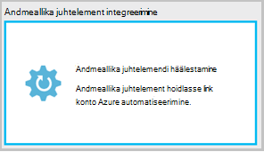

<properties 
    pageTitle=" Andmeallika juhtelement integreerimine Azure automaatika | Microsoft Azure'i"
    description="Selles artiklis kirjeldatakse Juhtelemendi allikas integreerimine Azure automaatika GitHub."
    services="automation"
    documentationCenter=""
    authors="mgoedtel"
    manager="jwhit"
    editor="tysonn" />    
<tags 
    ms.service="automation"
    ms.devlang="na"
    ms.topic="article"
    ms.tgt_pltfrm="na"
    ms.workload="infrastructure-services"
    ms.date="09/12/2016"
    ms.author="magoedte;sngun" />

# Andmeallika juhtelement integreerimise Azure automatiseerimine

Andmeallika juhtelement integreerimine võimaldab seostada tegevusraamatud hoidlasse GitHub andmeallika juhtelemendi kontol automatiseerimine. Andmeallika juhtelemendi võimaldab teil hõlpsasti koostöö meeskonnaga, muutuste jälitus ja varasemate versioonide oma tegevusraamatud tagasi pöörata. Näiteks andmeallika juhtelemendi abil saate sünkroonida eri harude, arengu, testi või tootmise automatiseerimise kontod, hõlbus esiletõstmine kood, mis on testitud oma arenduskeskkond oma tootmise automatiseerimise konto Juhtelemendi allikas.

Andmeallika juhtelemendi võimaldab push kood Azure automatiseerimine andmeallika juhtelemendi või tõmmata oma tegevusraamatud andmeallika juhtelemendi abil Azure automatiseerimine. Selles artiklis kirjeldatakse, kuidas häälestada andmeallika juhtelemendi Azure automatiseerimine-keskkonnas. Alustame Azure automatiseerimine juurdepääsu oma GitHub hoidla ja tutvustavad erinevaid toiminguid, mida saab teha konfigureerimisega andmeallika juhtelemendi integreerimise abil. 

>[AZURE.NOTE]Andmeallika juhtelement toetab tõmbamine ja lükkamine [PowerShelli töövoo tegevusraamatud](automation-runbook-types.md#powershell-workflow-runbooks) kui ka [PowerShelli tegevusraamatud](automation-runbook-types.md#powershell-runbooks). [Graafilise tegevusraamatud](automation-runbook-types.md#graphical-runbooks) veel ei toetata.  

On kaks lihtsat sammu vaja konfigureerida konto automatiseerimine ja ainult ühe andmeallika juhtelemendi, kui teil on juba GitHub konto. Need on:
## Samm 1-GitHub hoidla loomine

Kui teil on juba GitHub konto ja hoidla, mida soovite linkida Azure automatiseerimine ja seejärel olemasolevale kontole sisse logida ning Alusta etappi 2 allpool. Muul juhul Avage [GitHub](https://github.com/), logige üles uue konto ja [luua uus hoidla](https://help.github.com/articles/create-a-repo/).

## Samm 2 – andmeallika juhtelemendi Azure'i automaatika häälestamine

1. Azure'i portaalis keelest automatiseerimise konto nuppu **andmeallika juhtelemendi.** 
 
    

2. **Andmeallika juhtelemendi** tera avaneb, kus saate konfigureerida oma GitHub konto üksikasjad. Allpool on parameetrite konfigureerimiseks:  

  	|**Parameetri**            |**Kirjeldus** |
  	|:---|:---| 
  	|Valige allikas   | Valige allikas. Praegu on toetatud ainult **GitHub** . |
  	|Luba | Klõpsake nuppu **Autoriseerin** juurdepääsu oma GitHub hoidlasse Azure automatiseerimine. Kui teil on juba sisse logitud GitHub konto eraldi aknas, siis selle konto mandaate. Kui autoriseerimine on edukalt, kuvatakse tera jaotises **Luba atribuudi**GitHub kasutajanimi. |
  	|Valige hoidla | Valige loendist saadaolevad hoidlate GitHub hoidla. |
  	|Valige haru | Valige loendist saadaolevad harude on haru. Ainult **juhtslaidi** haru kuvatakse, kui te pole loonud mis tahes. |
  	|Käitusjuhendi kausta tee | Käitusjuhendi kausta tee saate määrata, kust soovite lükata või tõmmata oma kood GitHub hoidla tee. See tuleb sisestada vormingus **/foldername/subfoldername**. Ainult tegevusraamatud käitusjuhendi kausta tee sünkroonitakse kontole automatiseerimine. Tegevusraamatud käitusjuhendi kausta tee saavad **pole** alamkaustade sünkroonida. Kasutage **/** sünkroonida kõik tegevusraamatud, klõpsake jaotises hoidla. |

3. Näiteks, kui teil on nimega kaust nimega **atribuudi RootFolder** **PowerShellScripts** hoidla, mis sisaldab kausta nimega **alamkausta**. Saate iga taseme kausta sünkroonimine stringid järgmist:

    1. **Hoidla**tegevusraamatud sünkroonimiseks käitusjuhendi kausta tee on*/*
    2. **Atribuudi RootFolder**kaudu tegevusraamatud sünkroonimiseks käitusjuhendi kausta tee on */RootFolder*
    3. Tegevusraamatud kaudu **alamkausta**sünkroonimiseks käitusjuhendi kausta tee on */RootFolder/SubFolder*.
  

4. Kui olete parameetrid, kuvatakse need on **andmeallika juhtelemendi blade.**  
 
    

5. Pärast nupu OK klõpsamist andmeallika juhtelemendi integreerimine on nüüd konfigureeritud konto automatiseerimine ja GitHub teabe ei värskendata. Võite klõpsata kohe vaadata kõiki andmeallika juhtelemendi sünkroonimine töö ajaloo selle osa.  

    

6. Kui olete häälestanud andmeallika juhtelemendi, luuakse kontol automatiseerimise automatiseerimise järgmistest allikatest:  
 Luuakse kaks [muutuv varad](automation-variables.md) .  
      
    * Muutuv **Microsoft.Azure.Automation.SourceControl.Connection** sisaldab ühendusstring, väärtused, nagu allpool näidatud.  

  	|**Parameetri**            |**Väärtus** |
  	|:---|:---|
  	| Nimi  | Microsoft.Azure.Automation.SourceControl.Connection |
  	| Tüüp | String |
  	| Väärtus  | {"Haru":\<*oma haru nimi*>, "RunbookFolderPath":\<*Käitusjuhendi kausta tee*>, "ProviderType":\<*on väärtus 1 GitHub*>, "Hoidla":\<*oma andmebaasi nimi*>, "Kasutajanimi":\<*teie GitHub kasutajanimi*>} |   

    * Muutuv **Microsoft.Azure.Automation.SourceControl.OAuthToken**sisaldab teie OAuthToken turvaline krüptitud väärtus.  

  	|**Parameetri**            |**Väärtus** |
  	|:---|:---|
  	| Nimi  | Microsoft.Azure.Automation.SourceControl.OAuthToken |
  	| Tüüp | Unknown(encrypted) |
  	| Väärtus | <*Krüptitud OAuthToken*> |  

      

    * **Automaatika andmeallika juhtelemendi** lisatakse volitatud rakenduse GitHub kontole. Rakenduse: GitHub avalehel liikuge oma **profiili** > **sätted** > **rakendused**. See rakendus võimaldab sünkroonida oma GitHub hoidla automatiseerimise konto Azure automatiseerimine.  

    

## Andmeallika juhtelemendi kasutamine automatiseerimine

### Sisse-ja: Azure'i automaatika andmeallika juhtelemendi lisamine käitusjuhendi

Käitusjuhendi sisse-ja võimaldab push oma andmeallika juhtelemendi andmebaasi abil soovitud käitusjuhendi Azure'i automaatika tehtud muudatusi. Allpool toodud juhiseid sisse-ja käitusjuhendi on:

1. Oma automatiseerimise konto, [saate luua uue teksti käitusjuhendi](automation-first-runbook-textual.md)või [muuta mõne olemasoleva, teksti käitusjuhendi](automation-edit-textual-runbook.md). See käitusjuhendi võib olla PowerShelli töövoo või PowerShelli skripti käitusjuhendi.  

2. Pärast seda, kui redigeerite oma käitusjuhendi, salvestage see ja klõpsake käsku **sisse** keelest **redigeerimine** .  

    

     >[AZURE.NOTE] Sisse: Azure'i automaatika kirjutab koodi, mis on praegu teie andmeallika juhtelemendi olemas. Git võrdväärse käsurea juhiseid sisse on **git lisamine + git Kinnita + git tõuketeatised**  

3. Kui klõpsate **sisse**, küsitakse kinnitusteade, jätkamiseks klõpsake nuppu Jah.  

    

4. Käivitab sisse andmeallika juhtelemendi käitusjuhendi: **Sünkroonimine-MicrosoftAzureAutomationAccountToGitHubV1**. See käitusjuhendi github loob ja sunnib muudatusi teie hoidlasse: Azure'i automatiseerimine. Sisse töö ajalugu vaatamiseks minge tagasi vahekaardile **Andmeallika juhtelemendi integreerimine** ja hoidla sünkroonimise tera avamiseks klõpsake seda. See blade kuvatakse kõigi teie andmeallika juhtelemendi tööde haldamine.  Valige töö, mida soovite vaadata ja üksikasjade kuvamiseks klõpsake nuppu.  

    

    >[AZURE.NOTE] Andmeallika juhtelement tegevusraamatud on teisiti automaatika tegevusraamatud, mida te ei saa vaadata või redigeerida. Samal ajal, kui nad ei kuvata käitusjuhendi loendis, näete oma tööd loendis kuvatakse sünkroonimise töö.
 
5. Muudetud käitusjuhendi nime saadetakse kui ka sisendparameetrile käitusjuhendi sisse. Saate [projekti üksikasjade kuvamine](automation-runbook-execution.md#viewing-job-status-using-the-azure-management-portal) laiendamine käitusjuhendi **Hoidla sünkroonimine** tera sisse.  

    

6. Värskendage oma GitHub hoidla pärast töö lõpulejõudmist muutuste kuvamisviisi.  Oma hoidla Kinnita sõnumiga peaks olema on kinnitamine: * *Värskendatud *Käitusjuhendi nimi* on Azure Automation.* *  

### Sünkroonimine tegevusraamatud andmeallika juhtelemendi abil Azure automatiseerimine 

Hoidla sünkroonimise enne nuppu Sünkrooni võimaldab tõmmata kõik tegevusraamatud käitusjuhendi kausta tee oma andmebaasi kontole automatiseerimine. Sama hoidla saate sünkroonitud rohkem kui ühe automatiseerimise kontoga. Allpool on mõned toimingud sünkroonimine on käitusjuhendi:

1. Automatiseerimise kontolt, kus häälestamine andmeallika juhtelemendi, avage **andmeallika juhtelemendi integreerimine/hoidla sünkroonimise tera** ja siis, kui teil palutakse kinnitusteade, klõpsake nuppu **Sünkrooni** , klõpsake nuppu **Jah** jätkata.  

    

2. Sünkroonimine algab käitusjuhendi: **Sünkroonimine-MicrosoftAzureAutomationAccountFromGitHubV1**. See käitusjuhendi github loob ja tõmbab muudatusi teie hoidla Azure automatiseerimine. Peaksite nägema uus töökoht **Hoidla sünkroonimist** enne selle toimingu jaoks. Töö üksikasjad tera avamiseks klõpsake sünkroonimise töö üksikasjade kuvamiseks.  
 
    

 
    >[AZURE.NOTE] Andmeallika juhtelemendi sünkroonimine kirjutab mustand versiooni tegevusraamatud, **Kõik** tegevusraamatud, mis on praegu andmeallika juhtelemendi konto automatiseerimise versioonis. Git võrdväärse käsurea juhendamine sünkroonimine on **git tõmbamise**

## Andmeallika juhtelement seotud probleemide tõrkeotsing

Kui vigu sisse- või sünkroonimise töö, tuleks töö oleku peatada ja töö tera tõrke üksikasjade kuvamiseks.  **Kõik logid** osa kuvatakse PowerShelli voole seotud selle töö. See annab teile aitavad lahendada probleeme oma sisse- või sünkroonimine vajalikke üksikasju. See näitab ka saate toimingud, mille sünkroonimise või kontrollimine lisandmooduli lisamine käitusjuhendi ilmnes jada.  

## Andmeallika juhtelemendi lahutamine

Katkestamine konto GitHub, avage hoidla sünkroonimine tera, ja klõpsake nuppu **Katkesta ühendus**. Kui katkestate andmeallika juhtelemendi, tegevusraamatud varem sünkroonitud jäävad teie automatiseerimise konto, kuid hoidla sünkroonimine tera pole lubatud.  

  

## Järgmised sammud

Andmeallika juhtelement integreerimise kohta leiate lisateavet leiate järgmistest teemadest.  
- [Azure'i automaatika: Andmeallika juhtelemendi integreerimise Azure automatiseerimine](https://azure.microsoft.com/blog/azure-automation-source-control-13/)  
- [Hääletamiseks arvutisüsteemi lemmik andmeallika juhtelement](https://www.surveymonkey.com/r/?sm=2dVjdcrCPFdT0dFFI8nUdQ%3d%3d)  
- [Azure'i automaatika: Integreerimise Käitusjuhendi andmeallika juhtelemendi Visual Studio meeskonnatöö teenuste kaudu](https://azure.microsoft.com/blog/azure-automation-integrating-runbook-source-control-using-visual-studio-online/)  
