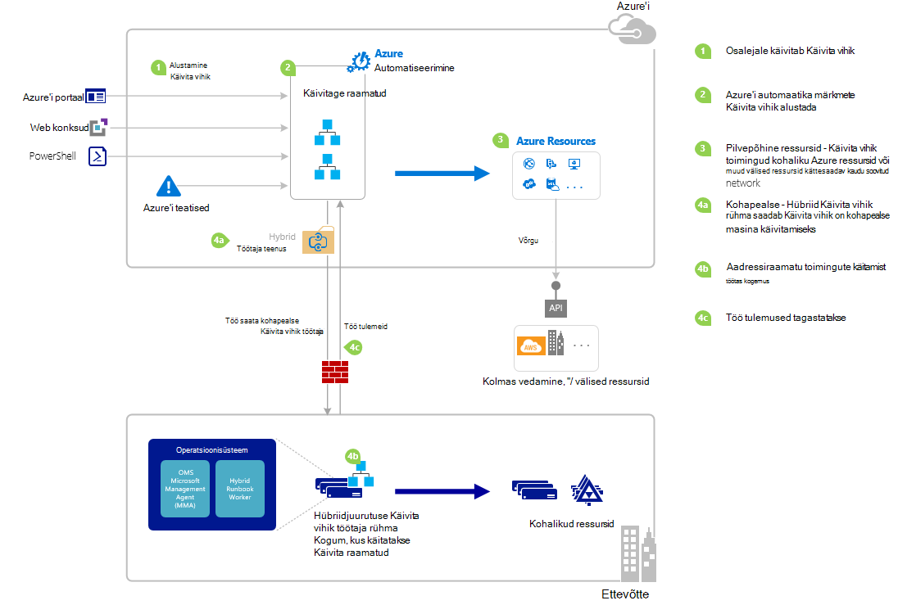

<properties
   pageTitle="Azure'i automaatika lisamine käitusjuhendi alates | Microsoft Azure'i"
   description="Kokkuvõte erinevaid viise, mida saab kasutada alustamiseks on käitusjuhendi Azure automatiseerimine ja sisaldab üksikasju Azure portaali ja Windows PowerShelli abil."
   services="automation"
   documentationCenter=""
   authors="mgoedtel"
   manager="jwhit"
   editor="tysonn" />
<tags
   ms.service="automation"
   ms.devlang="na"
   ms.topic="article"
   ms.tgt_pltfrm="na"
   ms.workload="infrastructure-services"
   ms.date="10/08/2016"
   ms.author="magoedte;bwren"/>

# <a name="starting-a-runbook-in-azure-automation"></a>Alates on käitusjuhendi Azure automatiseerimine

Järgmine tabel aitab teil kindlaks alustamiseks on käitusjuhendi Azure'i automaatika, mis sobib kõige kindla stsenaariumist. See artikkel sisaldab täpsemat alustades on käitusjuhendi Azure portaali ja Windows PowerShelli abil. Muud võimalused andmed on esitatud dokumentides, mida saate juurdepääsu saamiseks allpool olevaid linke.

| **MEETOD**                                                                    | **OMADUSED**                                                                                                                                                                                                                                                                                                                                                |
|-------------------------------------------------------------------------------|--------------------------------------------------------------------------------------------------------------------------------------------------------------------------------------------------------------------------------------------------------------------------------------------------------------------------------------------------------------------|
| [Azure'i portaal](#starting-a-runbook-with-the-azure-portal)                     | <li>Lihtsaim viis interaktiivne kasutajaliides.<br> <li>Vormi esitada lihtsa parameetrite väärtused.<br> <li>Hõlpsalt jälgida töö olek.<br> <li>Juurdepääs autenditud Azure sisselogimine.                                                                                                                                                                               |
| [Windows PowerShelli](https://msdn.microsoft.com/library/dn690259.aspx)        | <li>Helistage käsureal Windows PowerShelli cmdlet-käskude abil.<br> <li>Saate kaasata automaatse lahenduse koos mitme juhiseid.<br> <li>Kutse on autenditud serdi või OAuthi kasutaja põhisumma / teenus põhisumma.<br> <li>Sisestage lihtsaid ja keerukate parameetrite väärtused.<br> <li>Töö oleku jälgimine.<br> <li>Kliendi nõutaks PowerShelli cmdlet-käsud. |
| [Azure'i automaatika API](https://msdn.microsoft.com/library/azure/mt662285.aspx) | <li>Kõige paindlik meetod, kuid ka kõige keerulisem.<br> <li>Kõne kohandatud koodi, mida saab teha HTTP päringuid.<br> <li>Serdi või OAuthi kasutaja põhisumma / teenusepakkuja juures autentida taotluse põhisumma.<br> <li>Sisestage lihtsaid ja keerukate parameetrite väärtused.<br> <li>Töö oleku jälgimine.                                                                          |
| [Webhooks](automation-webhooks.md)                                            | <li>Käivitage käitusjuhendi ühe HTTP-päring.<br> <li>Autenditud Turbeloa URL-is.<br> <li>Klient ei saa alistada parameetrite väärtused määratud webhook loomisel. Käitusjuhendi saate määratleda ühe parameetri, mis lisatakse HTTP taotluse üksikasjad.<br> <li>Puudub võimalus jälgida töö oleku webhook URL-i kaudu.                                      |
| [Azure'i teatise vastamine](../log-analytics/log-analytics-alerts.md)               | <li>Alustage mõne käitusjuhendi vastuseks Azure teatise.<br> <li>Konfigureerige webhook käitusjuhendi-ja link, et teavitada.<br> <li>Turbeloa URL-is juures autentida.<br> <li>Praegu toetab teatise mõõdikute ainult.                                                                                                                                                       |
| [Ajakava](automation-schedules.md)                                | <li>Käivita käitusjuhendi automaatselt kord tunnis, igapäevaselt või iganädalaselt ajakava.<br> <li>Töödelda ajakava Azure portaali, PowerShelli cmdlet-käskude või Azure API kaudu.<br> <li>Sisestage parameetrite väärtused koos ajakava.                                                                                                                                               |
| [Mõne muu Käitusjuhendi kaudu](automation-child-runbooks.md)                          | <li>Kasutage mõnda käitusjuhendi käitusjuhendi mõne muu toimingu.<br> <li>Funktsioonid, mis kasutavad mitu tegevusraamatud kasulik.<br> <li>Parameetrite väärtused lapse käitusjuhendi pakkuda ja väljundi kasutamine vanem käitusjuhendi.                                                                                                                                                               |

Järgmisel pildil on näidatud üksikasjalikud samm-sammult on käitusjuhendi elutsükkel. See sisaldab mõnda käitusjuhendi käivitatakse Azure'i automaatika, hü Käitusjuhendi töötaja jaoks nõutavad komponendid käivitada tegevusraamatud Azure automatiseerimine ja eri osade vahel erineval viisil. Käivitamist automaatika tegevusraamatud oma andmekeskuse kohta lisateabe saamiseks vaadake [hübriid käitusjuhendi töötajate](automation-hybrid-runbook-worker.md)



## <a name="starting-a-runbook-with-the-azure-portal"></a>Mõne käitusjuhendi alustades Azure'i portaal

1.  Azure'i portaalis valige **automatiseerimine** ja klõpsake seejärel automatiseerimise konto nimi.
2.  Valige vahekaart **tegevusraamatud** .
3.  Valige soovitud käitusjuhendi ja klõpsake nuppu **Alusta**.
4.  Kui käitusjuhendi on parameetrid, küsitakse teilt, kas soovite luua väärtusi tekstivälja iga parameetri jaoks. Täpsemat teavet parameetrite abil, vt [Käitusjuhendi parameetrite](#Runbook-parameters) all.
5.  Valige **Kuva töö** **algus** käitusjuhendi sõnumi kõrval olev või valige **jaoks käitusjuhendi käitusjuhendi töö oleku vaatamiseks klõpsake vahekaarti** .

## <a name="starting-a-runbook-with-the-azure-portal"></a>Mõne käitusjuhendi alustades Azure'i portaal

1.  Klõpsake automatiseerimise kontolt **tegevusraamatud** osa **tegevusraamatud** tera avamiseks.
2.  Klõpsake käitusjuhendi, selle **Käitusjuhendi** tera avamiseks.
3.  Klõpsake käsku **Käivita**.
4.  Kui käitusjuhendi pole parameetreid, palutakse teil kinnitada, kas soovite käivitada. Kui käitusjuhendi on parameetrid, avatakse **Käivitamine Käitusjuhendi** tera nii, et saate sisestada parameetrite väärtused. Täpsemat teavet parameetrite abil, vt [Käitusjuhendi parameetrite](#Runbook-parameters) all.
5.  **Töö** tera avatakse nii, et saate jälgida projekti olek.

## <a name="starting-a-runbook-with-windows-powershell"></a>Windows PowerShelli on käitusjuhendi alustades

Saate [Algus-AzureRmAutomationRunbook](https://msdn.microsoft.com/library/mt603661.aspx) alustamiseks on käitusjuhendi Windows PowerShelli abil. Järgmine proovi kood käivitatakse käitusjuhendi, mis on nimega Käitusjuhendi-testi.

```
Start-AzureRmAutomationRunbook -AutomationAccountName "MyAutomationAccount" -Name "Test-Runbook" -ResourceGroupName "ResourceGroup01"
```

Algus-AzureRmAutomationRunbook tagastab töö objekti, mille abil saate jälgida oma oleku käitusjuhendi on käivitatud. Seejärel saate seda töö objekti [Get-AzureRmAutomationJob](https://msdn.microsoft.com/library/mt619440.aspx) koos töö ja [Get-AzureRmAutomationJobOutput](https://msdn.microsoft.com/library/mt603476.aspx) saamiseks selle väljundi oleku määramiseks. Järgmine proovi kood käivitatakse käitusjuhendi, mis on nimega Test-Käitusjuhendi, kuni see on lõpule viidud ja kuvab selle väljundi ootab.

```
$runbookName = "Test-Runbook"
$ResourceGroup = "ResourceGroup01"
$AutomationAcct = "MyAutomationAccount"

$job = Start-AzureRmAutomationRunbook –AutomationAccountName $AutomationAcct -Name $runbookName -ResourceGroupName $ResourceGroup

$doLoop = $true
While ($doLoop) {
   $job = Get-AzureRmAutomationJob –AutomationAccountName $AutomationAcct -Id $job.JobId -ResourceGroupName $ResourceGroup
   $status = $job.Status
   $doLoop = (($status -ne "Completed") -and ($status -ne "Failed") -and ($status -ne "Suspended") -and ($status -ne "Stopped"))
}

Get-AzureRmAutomationJobOutput –AutomationAccountName $AutomationAcct -Id $job.JobId -ResourceGroupName $ResourceGroup –Stream Output
```

Kui käitusjuhendi nõuab parameetrid, siis peate sisestama need nimega [Hashtable talletatakse](http://technet.microsoft.com/library/hh847780.aspx) , kus on Hashtable talletatakse võti vastab parameetri nimi ja väärtus on parameetri väärtuse. Järgmises näites kujutatakse kahe päringustringi parameetrite nimega eesnimi ja perekonnanimi, nimega RepeatCount täisarv ja nimega Näita kahendmuutujaga parameeter on käitusjuhendi alustada. Parameetrite kohta lisateabe saamiseks vt [Käitusjuhendi parameetrid](#Runbook-parameters) .

```
$params = @{"FirstName"="Joe";"LastName"="Smith";"RepeatCount"=2;"Show"=$true}
Start-AzureRmAutomationRunbook –AutomationAccountName "MyAutomationAccount" –Name "Test-Runbook" -ResourceGroupName "ResourceGroup01" –Parameters $params
```

## <a name="runbook-parameters"></a>Käitusjuhendi parameetrid

Mõne käitusjuhendi käivitamisel Azure portaali või Windows PowerShelli kaudu saadetakse juhiseid Azure automatiseerimine veebiteenuse kaudu. See teenus ei toeta parameetrite keerukate andmetüüpidega. Kui peate sisestama keerukate parameetri väärtuse, siis peab helistate see Tekstisisese kaudu teise käitusjuhendi [lapse tegevusraamatud Azure'i automaatika](automation-child-runbooks.md)kirjeldatud.

Azure'i automaatika veebiteenuse annab erifunktsioone parameetrite abil teatud andmetüüpe, nagu on kirjeldatud järgmistes lõikudes.

### <a name="named-values"></a>Nimega väärtused

Kui parameetri andmetüüp [objekti], siis järgmised JSON-vormingus abil saate saata selle nimega väärtuste loendi: *{nimi1: "Väärtus1", nimi2: "Väärtus2", Name3: "Value3"}*. Need väärtused peavad olema lihtne tüübid. Käitusjuhendi saadetakse parameetri [PSCustomObject](https://msdn.microsoft.com/library/system.management.automation.pscustomobject%28v=vs.85%29.aspx) omadused, mis vastavad iga nimega väärtust.

Võtke arvesse järgmist testi käitusjuhendi, mida aktsepteerib nimega kasutaja parameeter.

```
Workflow Test-Parameters
{
   param (
      [Parameter(Mandatory=$true)][object]$user
   )
    $userObject = $user | ConvertFrom-JSON
    if ($userObject.Show) {
        foreach ($i in 1..$userObject.RepeatCount) {
            $userObject.FirstName
            $userObject.LastName
        }
    }
}
```

Parameetri kasutaja saab järgmine tekst.

```
{FirstName:'Joe',LastName:'Smith',RepeatCount:'2',Show:'True'}
```

Selle tulemusena järgmine väljund.

```
Joe
Smith
Joe
Smith
```

### <a name="arrays"></a>Massiivid

Kui parameeter on massiiv, nt [massiiv] ja [string []], siis saate kasutada järgmisi JSON-vormingus saatmiseks väärtuste loendi: *[väärtus1; väärtus2; Value3]*. Need väärtused peavad olema lihtne tüübid.

Võtke arvesse järgmist testi käitusjuhendi, mida aktsepteerib nimega *kasutaja*parameeter.

```
Workflow Test-Parameters
{
   param (
      [Parameter(Mandatory=$true)][array]$user
   )
    if ($user[3]) {
        foreach ($i in 1..$user[2]) {
            $ user[0]
            $ user[1]
        }
    }
}
```

Parameetri kasutaja saab järgmine tekst.

```
["Joe","Smith",2,true]
```

Selle tulemusena järgmine väljund.

```
Joe
Smith
Joe
Smith
```

### <a name="credentials"></a>Identimisteave

Kui parameeter on andmetüüp **PSCredential**, saate sisestada Azure automatiseerimine [mandaati varade](automation-credentials.md)nimi. Käitusjuhendi toob mandaati teie määratud nimi.

Võtke arvesse järgmist testi käitusjuhendi, mida aktsepteerib parameetri ehk mandaadi.

```
Workflow Test-Parameters
{
   param (
      [Parameter(Mandatory=$true)][PSCredential]$credential
   )
   $credential.UserName
}
```

Eeldades, et esines mandaati varade, nimega *Minu mandaadi*parameetri kasutaja saab järgmine tekst.

```
My Credential
```

Eeldades, et kasutajanime mandaadi oli *jsmith*, tulemuseks järgmine väljund.

```
jsmith
```

## <a name="next-steps"></a>Järgmised sammud

-   Praeguse artikli käitusjuhendi arhitektuur üksikasjalik ülevaade tegevusraamatud Azure ja kohapealne töötajaga hübriid Käitusjuhendi ressursside haldamise.  Käivitamist automaatika tegevusraamatud oma andmekeskuse kohta lisateabe saamiseks vaadake [Hü Käitusjuhendi töötajad](automation-hybrid-runbook-worker.md).
-   Loomise muutuv tegevusraamatud kasutavad muude tegevusraamatud teatud või levinumate funktsioonide kohta lisateabe saamiseks vaadake [Lapse tegevusraamatud](automation-child-runbooks.md).
