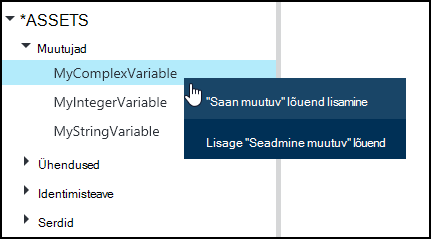
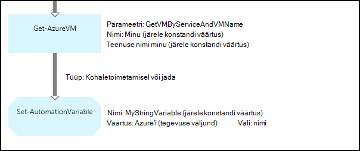
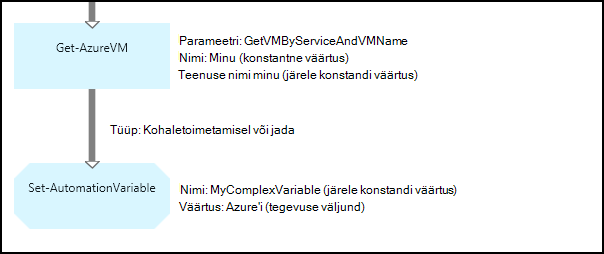
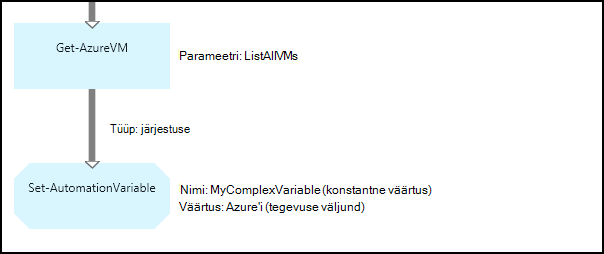
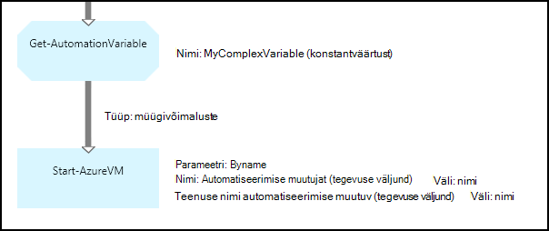
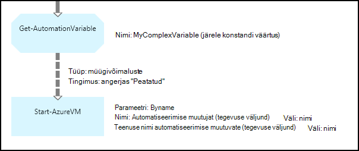

<properties 
   pageTitle="Muutuv varasid Azure automatiseerimine | Microsoft Azure'i"
   description="Muutuv on väärtused, mis on saadaval kõigi tegevusraamatud ja DSC konfiguratsioone Azure'i automaatika.  Selles artiklis selgitatakse muutujate ja kuidas nendega töötada nii teksti kui ka graafilise loome üksikasjad."
   services="automation"
   documentationCenter=""
   authors="mgoedtel"
   manager="jwhit"
   editor="tysonn" />
<tags 
   ms.service="automation"
   ms.devlang="na"
   ms.topic="article"
   ms.tgt_pltfrm="na"
   ms.workload="infrastructure-services"
   ms.date="05/24/2016"
   ms.author="magoedte;bwren" />

# Muutuv varasid Azure automatiseerimine

Muutuv on väärtused, mis on saadaval kõigi tegevusraamatud ja DSC konfiguratsioone kontol automatiseerimine. Ta saab luua, muuta, ja tuua Azure'i portaalis Windows PowerShelli, ning rakenduses käitusjuhendi või DSC konfigureerimine. Automaatika muutujad on kasulik järgmistel juhtudel:

- Mitme tegevusraamatud või DSC konfiguratsioone vahemikus jagada.

- Mitme töö sama käitusjuhendi või DSC konfiguratsiooni vahemikus jagada.

- Halda väärtus portaalist või tegevusraamatud või DSC konfiguratsioone kasutatava Windows PowerShelli käsurea kaudu.

Automatiseerimise muutujat on jätkunud nii, et isegi juhul, kui käitusjuhendi või DSC konfigureerimine nurjub.  See lubab ka väärtuse, mis määrab ühe käitusjuhendi kasutatakse teise või kasutatakse sama käitusjuhendi või DSC konfiguratsioon järgmine kord, kui seda ei käivitata.

Kui muutuja on loodud, saate määrata, et salvestatakse krüptitud.  Kui muutuja on krüptitud, siis salvestatakse turvaliselt Azure automatiseerimine ja selle väärtus ei saa taastada teenusega Azure PowerShelli mooduli osana [Get-AzureAutomationVariable](http://msdn.microsoft.com/library/dn913772.aspx) cmdlet-käsk.  **Get-AutomationVariable** tegevuse käitusjuhendi või DSC konfigureerimine on ainus viis on krüptitud väärtus taastada.

>[AZURE.NOTE]Turvaline varasid Azure automatiseerimine kaasata mandaat, serdid, ühendused ja krüptitud muutujate. Varade krüptitud ning talletatud Azure'i automaatika kordumatu võti, mis luuakse iga automatiseerimise konto abil. See võti krüptitud juhtslaidi sertifikaadiga ja talletatud Azure automatiseerimine. Kui kavatsete turvaline vara, automatiseerimise konto võti on lahtikrüptitud juhtslaidi serdiga ja seejärel kasutatud vara krüptimiseks.

## Tüübid

Azure'i portaalis muutuja loomisel peate määrama ripploendist soovitud andmetüüp nii portaali saab kuvada vastava juhtelemendi sisestamise muutuja väärtuse. Muutuja pole piiratud seda tüüpi, kuid peate seadma Windows PowerShelli kaudu, kui soovite määrata mõnda muud tüüpi muutuja. Kui määrate **pole määratud**, siis muutuja väärtus väärtuseks **$null**ning peate seadma väärtuse cmdlet-käsu [Set-AzureAutomationVariable](http://msdn.microsoft.com/library/dn913767.aspx) või **Set-AutomationVariable** tegevus.  Ei saa luua või muuta kompleksarvu muutuja tüübi portaalis väärtus, kuid saate sisestada väärtuse, mis tahes tüüpi Windows PowerShelli kaudu. Keerukate tüüpi tagastatakse on [PSCustomObject](http://msdn.microsoft.com/library/system.management.automation.pscustomobject.aspx)nimega.

Saate salvestada mitu väärtust ühte massiivi või Hashtable talletatakse loomise ja salvestage see muutujat.

## Cmdlet-käskude ja töövootoiminguid

Loomine ja haldamine Windows PowerShelli abil automatiseerimise muutujate kasutatakse cmdletid järgmises tabelis. Need saata osana [Azure PowerShelli moodul](../powershell-install-configure.md) , mis on automaatika tegevusraamatud ja DSC konfiguratsiooni kasutamiseks saadaval.

|Cmdlet-käsud|Kirjeldus|
|:---|:---|
|[Get-AzureAutomationVariable](http://msdn.microsoft.com/library/dn913772.aspx)|Toob mõne olemasoleva muutuja väärtus.|
|[Uue AzureAutomationVariable](http://msdn.microsoft.com/library/dn913771.aspx)|Loob uue ning määrab väärtusega.|
|[Eemalda – AzureAutomationVariable](http://msdn.microsoft.com/library/dn913775.aspx)|Eemaldab mõne olemasoleva muutujana.|
|[Set-AzureAutomationVariable](http://msdn.microsoft.com/library/dn913767.aspx)|Määrab mõne olemasoleva muutuja väärtus.|

Töövoo toiminguid järgmises tabelis kasutatakse automatiseerimise muutujad on käitusjuhendi juurde. Need on ainult kasutatavad käitusjuhendi või DSC konfigureerimine ja mitte saata Azure PowerShelli mooduli osana.

|Töövoo toiminguid|Kirjeldus|
|:---|:---|
|Get-AutomationVariable|Toob mõne olemasoleva muutuja väärtus.|
|Set-AutomationVariable|Määrab mõne olemasoleva muutuja väärtus.|

>[AZURE.NOTE] Peaks Vältige muutujat – nimi parameeter **Get-AutomationVariable** käitusjuhendi või DSC konfiguratsiooni, kuna see võib raskendada avastanud sõltuvuste tegevusraamatud või DSC konfigureerimine ja automatiseerimise muutujate koostamise ajal.

## Uue automatiseerimise muutujat loomine

### Luua uue Azure'i portaal

1. Klõpsake konto automatiseerimise **varasid** akna ülaosas.
1. Klõpsake akna allosas **Lisada säte**.
1. Klõpsake **Lisa muutujana**.
1. Viisardi lõpuleviimine ja märkige ruut uue muutuja salvestamiseks.

### Luua uue Azure'i portaal

1. Klõpsake automatiseerimise kontolt **varad** osa **varad** tera avamiseks.
1. Klõpsake **muutujate** osa **muutujate** tera avamiseks.
1. Klõpsake nuppu **Lisa muutuja** tera ülaosas.
1. Täitke vorm ja klõpsake nuppu **Loo** uus muutuja salvestamiseks.

### Luua uue Windows PowerShelli abil

Cmdlet-käsu [New-AzureAutomationVariable](http://msdn.microsoft.com/library/dn913771.aspx) loob uue ja määrab selle algväärtus. Saate tuua abil [Get-AzureAutomationVariable](http://msdn.microsoft.com/library/dn913772.aspx)väärtus. Kui väärtus on lihtne tüüp, tagastatakse see sama tüüpi. Kui see on keerukas tüüp, tagastatakse on **PSCustomObject** .

Valimi järgmised käsud Kuva string-tüüpi muutuja loomise ja seejärel selle tagastusväärtus.

    New-AzureAutomationVariable –AutomationAccountName "MyAutomationAccount" –Name 'MyStringVariable' –Encrypted $false –Value 'My String'
    $string = (Get-AzureAutomationVariable –AutomationAccountName "MyAutomationAccount" –Name 'MyStringVariable').Value

Valimi järgmised käsud näitab, kuidas luua muutuja keerukas tüüp ja tagastab selle atribuute. Selles näites kasutatakse virtuaalse masina objekti: **Get-AzureVM** .

    $vm = Get-AzureVM –ServiceName "MyVM" –Name "MyVM"
    New-AzureAutomationVariable –AutomationAccountName "MyAutomationAccount" –Name "MyComplexVariable" –Encrypted $false –Value $vm
    
    $vmValue = (Get-AzureAutomationVariable –AutomationAccountName "MyAutomationAccount" –Name "MyComplexVariable").Value
    $vmName = $vmValue.Name
    $vmIpAddress = $vmValue.IpAddress

## Muutuja käitusjuhendi või DSC konfigureerimise abil

**Set-AutomationVariable** tegevuse abil saate määrata väärtus on automatiseerimise muutujat mõne käitusjuhendi või DSC konfigureerimine ja **Get-AutomationVariable** tuua.  **Set-AzureAutomationVariable** või **Get-AzureAutomationVariable** cmdlet-käskude käitusjuhendi või DSC konfiguratsiooni ei tohiks kasutada, kuna need on nii tõhus kui töövoo toiminguid.  Samuti ei saa tuua turvaline muutujate **Get-AzureAutomationVariable**väärtus.  Kasutage cmdletti [New-AzureAutomationVariable](http://msdn.microsoft.com/library/dn913771.aspx) on ainus võimalus luua uue muutuja kaudu käitusjuhendi või DSC konfigureerimine.

### Teksti käitusjuhendi näidised

#### Seadmine ja muutuja kaudu lihtne väärtuse toomine

Valimi järgmised käsud Kuva seada ja tuua teksti käitusjuhendi muutuja. Selles näites eeldatakse, et muutujate on tippige täisarv nimega *NumberOfIterations* ja *NumberOfRunnings* ja muutuja nimega *SampleMessage* on juba loodud string-tüüpi.

    $NumberOfIterations = Get-AutomationVariable -Name 'NumberOfIterations'
    $NumberOfRunnings = Get-AutomationVariable -Name 'NumberOfRunnings'
    $SampleMessage = Get-AutomationVariable -Name 'SampleMessage'
    
    Write-Output "Runbook has been run $NumberOfRunnings times."
    
    for ($i = 1; $i -le $NumberOfIterations; $i++) {
       Write-Output "$i`: $SampleMessage"
    }
    Set-AutomationVariable –Name NumberOfRunnings –Value ($NumberOfRunnings += 1)

#### Seada ja allalaadimine keerulise objekti muutuja

Järgmine proovi kood näitab, kuidas värskendada muutujat teksti käitusjuhendi keerukate väärtuse. Selles näites on Azure virtuaalse masina funktsiooniga **Get-AzureVM** ja salvestada mõne olemasoleva automatiseerimise muutujat.  Nagu on selgitatud [tüübid](#variable-types), talletatakse see on PSCustomObject.

    $vm = Get-AzureVM -ServiceName "MyVM" -Name "MyVM"
    Set-AutomationVariable -Name "MyComplexVariable" -Value $vm

Järgmine kood on väärtus muutuja ning kasutatakse virtuaalse masina käivitamiseks.

    $vmObject = Get-AutomationVariable -Name "MyComplexVariable"
    if ($vmObject.PowerState -eq 'Stopped') {
       Start-AzureVM -ServiceName $vmObject.ServiceName -Name $vmObject.Name
    }

#### Seada ja allalaadimine kogumi muutuja

Järgmine proovi kood näitab, kuidas kasutada muutuja teksti käitusjuhendi keerukate väärtuste kogumi. Selles näites on mitme Azure'i virtuaalmasinates funktsiooniga **Get-AzureVM** ja mõne olemasoleva automatiseerimise muutujat salvestatud.  Nagu on selgitatud [tüübid](#variable-types), talletatakse see PSCustomObjects kogum.

    $vms = Get-AzureVM | Where -FilterScript {$_.Name -match "my"}     
    Set-AutomationVariable -Name 'MyComplexVariable' -Value $vms

Järgmine kood on selle saidikogumi muutuja ning kasutatakse iga virtuaalse masina käivitamiseks.

    $vmValues = Get-AutomationVariable -Name "MyComplexVariable"
    ForEach ($vmValue in $vmValues)
    {
       if ($vmValue.PowerState -eq 'Stopped') {
          Start-AzureVM -ServiceName $vmValue.ServiceName -Name $vmValue.Name
       }
    }

### Graafilised käitusjuhendi näidised

Graafiline käitusjuhendi, saate lisada **Get-AutomationVariable** või **Set-AutomationVariable** , paremklõpsates muutuja pildiredaktor teek paanil ja valides soovitud tegevus.

#### Muutuja väärtused

Järgmisel pildil on kujutatud tegevuste värskendada muutuja graafilise käitusjuhendi lihtsa väärtuse. Selles näites ühe Azure virtuaalse masina tuuakse **Get-AzureVM** abil ja arvuti nimi on salvestatud mõne olemasoleva automatiseerimine muutuja stringi tüüpi.  Pole oluline, kas selle [link on kohaletoimetamisel või järjestust](automation-graphical-authoring-intro.md#links-and-workflow) , kuna ainult ühe objekti väljund.

Järgmisel pildil on kujutatud tegevuste värskendada muutuja graafilise käitusjuhendi keerukate väärtusega. Ainult üleminek eelmises näites on määrab **välja tee** nii, et objekt on talletatud asemel ainult objekti atribuudi **tegevuse väljundi** **Set-AutomationVariable** tegevuste jaoks.  Nagu on selgitatud [tüübid](#variable-types), talletatakse see on PSCustomObject.

Järgmisel pildil on kujutatud koos mitme virtuaalmasinates salvestatud muutuja eelmise näitega sarnast funktsionaalsust.  [Sequence link](automation-graphical-authoring-intro.md#links-and-workflow) tuleb kasutada siin nii, et saab **Set-AutomationVariable** tegevust terve kogumi virtuaalmasinates ühe saidikogumi.  [Müügivõimaluste link](automation-graphical-authoring-intro.md#links-and-workflow) kasutamisel siis **Set-AutomationVariable** tegevuse läheks eraldi iga objekti tulemiga on see, et salvestatakse ainult viimase virtuaalse masina kogumist.  Nagu on selgitatud [tüübid](#variable-types), talletatakse see PSCustomObjects kogum.

#### Muutuja väärtused allalaadimine

Järgmisel pildil on kujutatud valimi tegevused, mida tuua ja kasutada graafilise käitusjuhendi muutujat.  Esimese tegevusega toob muutuja eelmises näites salvestatud virtuaalmasinates.  Link peab olema [müügivõimaluste](automation-graphical-authoring-intro.md#links-and-workflow) nii, et **Algus-AzureVM** tegevuse töötab üks kord iga saadetud **Get-AutomationVariable** tegevuse objekti.  See töötab sama kas lisamine ühele objektile või mitme objekti talletatakse muutuja.  **Algus-AzureVM** tegevuse kasutatakse atribuutide PSCustomObject, mis tähistab iga virtuaalse masina. 

Järgmisel pildil on kujutatud graafiline käitusjuhendi muutuja talletatud objektide filtreerimine.  [Tingimus](automation-graphical-authoring-intro.md#links-and-workflow) on lisatud link filtreerimiseks ainult need virtuaalmasinates, mis on peatatud muutuja määramisel eelmises näites.

## Järgmised sammud

- Tegevuste koos graafilise loome ühenduse loomise kohta lisateabe saamiseks lugege teemat [linkide graafiline koostamine](automation-graphical-authoring-intro.md#links-and-workflow)
- Alustamine graafiline tegevusraamatud, lugege teemat [minu esimene graafiline käitusjuhendi](automation-first-runbook-graphical.md) 
