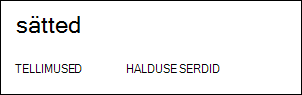
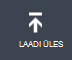
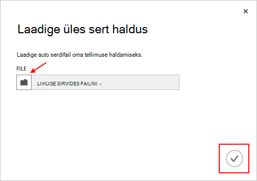

<properties 
    pageTitle="Mõne Azure'i Management API serdi üleslaadimine | Microsoft Azure'i" 
    description="Saate teada, kuidas üles laadida athe haldamine API surmatõend / Azure klassikaline portaali." 
    services="cloud-services" 
    documentationCenter=".net" 
    authors="Thraka" 
    manager="timlt" 
    editor=""/>

<tags 
    ms.service="na" 
    ms.workload="tbd" 
    ms.tgt_pltfrm="na" 
    ms.devlang="na" 
    ms.topic="article" 
    ms.date="04/18/2016"
    ms.author="adegeo"/>

# Mõne Azure'i Management API halduse serdi üleslaadimine

Halduse serdid võimaldavad Azure'i esitatud teenuse juhtimise API autentimiseks. Palju programmid ja tööriistad (nt Visual Studio või Azure SDK) kasutab neid certficates konfigureerimine ja erinevate Azure'i teenuste automatiseerimiseks. **See kehtib ainult Azure klassikaline portaali**. 

>[AZURE.WARNING] Ole ettevaatlik! Järgmist tüüpi tunnistuste luba kõigile, kellel autendib neid need on seostatud tellimuse haldamiseks. 

Lisateavet Azure serdid (sh iseallkirjastatud serdi loomine) on [saadaval](cloud-services/cloud-services-certs-create.md#what-are-management-certificates) , kui teil on vaja.

[Azure Active Directory](/services/active-directory/) abil autentida isikukood eesmärgil automatiseerimine.

## Laadige üles sert haldus

Kui olete loonud halduse surmatõend /, (ainult avalik võti CER-fail) saate selle laadida portaali sisse. Kui sert on portaalis, igaüks, kellel on kattuvad certficiate (privaatvõti) saate ühendada halduse API kaudu ning juurdepääs seotud tellimuse ressursid.

1. [Azure'i klassikaline portaali](http://manage.windowsazure.com)sisse logida.

2. Veenduge, et valida õige tellimus, mida soovite siduda serti. Vajutage teksti **tellimuste** portaali paremas ülanurgas.

    

3. Kui olete valinud õige tellimus, vajutage **sätted** vasakus servas portaali (võib-olla peate allapoole kerima). 
    
    

4. Vajutage klahvi tab **Halduse serdid** .

    
    
5. Klõpsake nuppu **üles laadida** .

    
    
6. Sisestage dialoogiboksi teave ja vajutage teha **märke**.

    

## Järgmised sammud

Nüüd, kui teil on halduse surmatõend /, mis on tellimusega seostatud, saate (kui olete installinud kattuvad serdi kohalikult) programatically ühenduse [Teenuse haldamine REST API](https://msdn.microsoft.com/library/azure/mt420159.aspx) ja erinevate Azure ressursse, mis on lisaks selle tellimusega seostatud automatiseerida. 