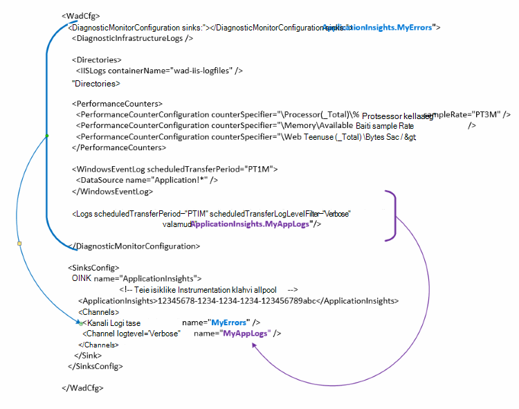

<properties
   pageTitle="Azure'i diagnostika andmeid saata rakenduse ülevaated konfigureerimine | Microsoft Azure'i"
   description="Värskendage Azure'i diagnostika avaliku konfiguratsiooni rakenduse ülevaated andmeid saata."
   services="multiple"
   documentationCenter=".net"
   authors="sbtron"
   manager="douge"
   editor="" />
<tags
   ms.service="application-insights"
   ms.devlang="na"
   ms.topic="article"
   ms.tgt_pltfrm="na"
   ms.workload="na"
   ms.date="12/15/2015"
   ms.author="saurabh" />

# Azure'i diagnostika andmeid saata rakenduse ülevaated konfigureerimine

Azure'i diagnostika salvestab andmed Azure Storage tabelitele.  Siiski saate ka kõik Triibu või rakenduse ülevaated andmete alamhulga konfigureerida "vajub" ja "kanalid" konfiguratsioonist kasutamisel Azure'i diagnostika laiend 1,5 või uuem versioon.

Selles artiklis kirjeldatakse, kuidas luua avaliku konfiguratsiooni Azure'i diagnostika pikendamise eest, et konfigureeritud rakenduse ülevaated andmeid saata.

## Kui valamu rakenduse ülevaated konfigureerimine

Azure'i diagnostika laiend 1,5 toob selle **<SinksConfig>** elemendi avaliku konfiguratsiooni. See määratleb täiendavad *valamu* kus Azure diagnostika andmeid saab saata. Saate määrata rakenduse ülevaated ressursi, kuhu soovite saada Azure diagnostika andmeid selle üksikasju **<SinksConfig>**.
Näide **SinksConfig** näeb välja umbes järgmine-  

    <SinksConfig>
        <Sink name="ApplicationInsights">
          <ApplicationInsights>{Insert InstrumentationKey}</ApplicationInsights>
          <Channels>
            <Channel logLevel="Error" name="MyTopDiagData"  />
            <Channel logLevel="Verbose" name="MyLogData"  />
          </Channels>
        </Sink>
      </SinksConfig>

**Valamu** elemendi *nime* atribuut määrab valamu kordumatult viidata kasutatud stringiväärtus.
**ApplicationInsights** elemendi määrab instrumentation klahvi rakenduse ülevaateid ressursi kuhu saadetakse Azure diagnostika andmed. Kui teil pole olemasoleva rakenduse ülevaated ressurss, lugege teemat [uue rakenduse ülevaated ressursi loomine](./application-insights/app-insights-create-new-resource.md) ressursi loomise ja saada instrumentation klahvi kohta lisateabe saamiseks.

Kui arendate pilveteenuses projekti Azure'i SDK 2,8 see instrumentation võti lisatakse automaatselt avaliku konfiguratsiooni põhjal **APPINSIGHTS_INSTRUMENTATIONKEY** teenuse konfiguratsioon sätte kui pakendamine pilvepõhise teenuse projekt. Vt [Rakenduse kasutamine arusaamiseks Azure'i diagnostika pilveteenuses probleemide tõrkeotsingut](./cloud-services/cloud-services-dotnet-diagnostics-applicationinsights.md).

**Kanalite** element võimaldab määrata **ühe või mitme elemendid andmeid, mis saadetakse valamu** . Kanali käitub nagu filtri ja võimaldab valida kindla log tasemed, mille soovite saata valamu. Näiteks võib Paljusõnaline logid koguda ja saata salvestusruumi, kuid võite määrata, et määratleda kanali log taseme tõrke ja kui saadate logid kaudu saadetakse ainult Tõrkelogide kanali selle valamu.
**Kanali** atribuut *name* kasutatakse selle kanali kordumatult viidata.
Atribuut *loglevel* saate määrata Logi tase, mis võimaldab kanali. Saadaval log järjestuses kõige vähemalt teabe tasemed
 - Paljusõnaline
 - Teave
 - Hoiatus
 - Tõrge
 - Kriitiline

## Andmete saatmine rakenduse ülevaated valamu
Kui rakenduse ülevaated valamu on määratletud saate saata andmed selle valamu, lisades *valamu* atribuut elementide **DiagnosticMonitorConfiguration** sõlme all. *Valamud* elemendi lisamine iga sõlme määrab, et soovite sõlme ja mis tahes sõlme all määratud valamu saatmise kogutud andmete.

Näiteks, kui soovite saada kõik andmed, mis on Azure diagnostika abil kogutud seejärel saate lisada atribuudi *valamu* otse **DiagnosticMonitorConfiguration** sõlm. Määrake väärtus *valamud* **SinkConfig**määratud valamu nime.

    <DiagnosticMonitorConfiguration overallQuotaInMB="4096" sinks="ApplicationInsights">

Kui soovite saada ainult Tõrkelogide rakenduse ülevaated valamu seejärel saate määrata *valamud* väärtus valamu nime, millele järgneb eraldatud perioodi kanali nimi ("."). Näiteks ainult Tõrkelogide saatmiseks rakenduse ülevaated valamu kasutada MyTopDiagdata kanalit, mis on määratletud ülaltoodud SinksConfig.  

    <DiagnosticMonitorConfiguration overallQuotaInMB="4096" sinks="ApplicationInsights.MyTopDiagdata">

Kui soovite rakenduse ülevaated Paljusõnaline logid saata oleks *valamud* atribuut **logid** sõlme lisada.

    <Logs scheduledTransferPeriod="PT1M" scheduledTransferLogLevelFilter="Verbose" sinks="ApplicationInsights.MyLogData"/>

Saate lisada ka mitme valamud konfiguratsiooni hierarhia erinevatel tasanditel. Sel juhul toimib määratud ülatasemel hierarhia valamu üldise sätte ja ühte määratud üksikute elemendi elemendi toiminguid nagu mõne alistamine selle globaalne säte.    

Siin on lõpule viidud näide avaliku konfiguratsioonifail, mis saadab kõik vead (määratud **DiagnosticMonitorConfiguration** sõlm) rakenduse ülevaated ja lisaks Paljusõnaline taseme logid rakenduse logide (sõlme **logid** määratud).

    <WadCfg>
      <DiagnosticMonitorConfiguration overallQuotaInMB="4096"
           sinks="ApplicationInsights.MyTopDiagData"> <!-- All info below sent to this channel -->
        <DiagnosticInfrastructureLogs />
        <PerformanceCounters>
          <PerformanceCounterConfiguration counterSpecifier="\Processor(_Total)\% Processor Time" sampleRate="PT3M" sinks="ApplicationInsights.MyLogData/>
          <PerformanceCounterConfiguration counterSpecifier="\Memory\Available MBytes" sampleRate="PT3M" />
          <PerformanceCounterConfiguration counterSpecifier="\Web Service(_Total)\Bytes Total/Sec" sampleRate="PT3M" />
        </PerformanceCounters>
        <WindowsEventLog scheduledTransferPeriod="PT1M">
          <DataSource name="Application!*" />
        </WindowsEventLog>
        <Logs scheduledTransferPeriod="PT1M" scheduledTransferLogLevelFilter="Verbose"
                sinks="ApplicationInsights.MyLogData"/> <!-- This specific info sent to this channel -->
      </DiagnosticMonitorConfiguration>

    <SinksConfig>
        <Sink name="ApplicationInsights">
          <ApplicationInsights>{Insert InstrumentationKey}</ApplicationInsights>
          <Channels>
            <Channel logLevel="Error" name="MyTopDiagData"  />
            <Channel logLevel="Verbose" name="MyLogData"  />
          </Channels>
        </Sink>
      </SinksConfig>
    </WadCfg>

Kehtivad teatud piirangud, millega peaks arvestama see funktsioon

- Kanalite on mõeldud ainult Logi tüüp ja pole jõudluse hinnale töötamine. Kui määrate kanali jõudluse counter element, siis seda ignoreeritakse.
- Kanali Logi tase ei tohi ületada Logi tase mis kogutakse Azure diagnostika. Näide: ei saa kogute rakenduse tõrked logid elementi ja saatmisel Verbose logid rakenduse ülevaade valamu. Atribuut *scheduledTransferLogLevelFilter* peab alati kogumise võrdne või rohkem kui logid logid saata valamu üritate.
- Ei saa saata bloobimälu andmeid kogutud Azure diagnostika laiend rakenduse ülevaated. Näiteks midagi määratud *kataloogide* sõlme all. Krahh puistab tegelik krahh dump endiselt saadetakse Bloobivahemälu salvestusruumi ja rakenduse ülevaated saadetakse ainult krahh dump loodud teatis.

## Järgmised sammud

- [PowerShelli](./cloud-services/cloud-services-diagnostics-powershell.md) kasutamine Azure diagnostika laiendamiseks rakenduse. 
- Azure'i diagnostika laiendamiseks rakenduse [Visual Studio](vs-azure-tools-diagnostics-for-cloud-services-and-virtual-machines.md) abil
