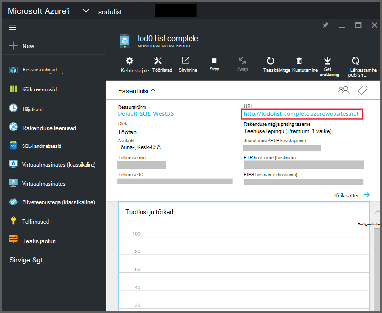
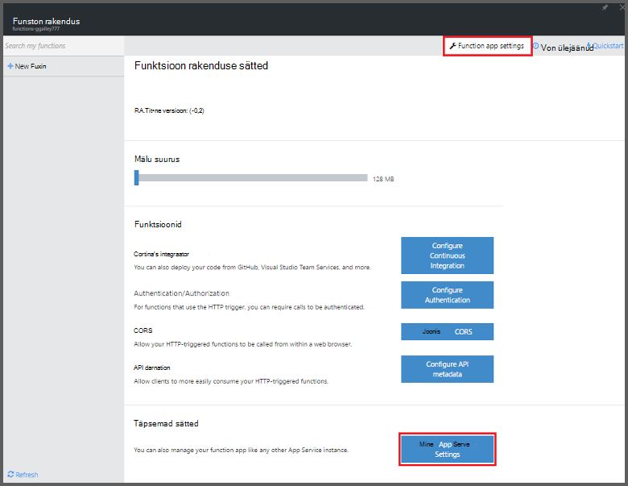
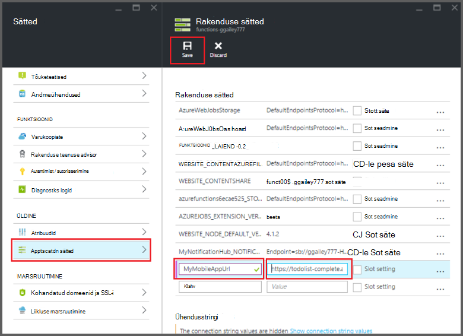

<properties
    pageTitle="Azure'i funktsioonide mobiilirakenduste sidumiste | Microsoft Azure'i"
    description="Mõista, kuidas kasutada Azure mobiilirakenduste sidumiste Azure'i funktsioonid."
    services="functions"
    documentationCenter="na"
    authors="ggailey777"
    manager="erikre"
    editor=""
    tags=""
    keywords="Azure'i töötab, funktsioonide, sündmuse töötlemiseks, dünaamiline Arvuta, serverless arhitektuur"/>

<tags
    ms.service="functions"
    ms.devlang="multiple"
    ms.topic="reference"
    ms.tgt_pltfrm="multiple"
    ms.workload="na"
    ms.date="08/30/2016"
    ms.author="glenga"/>

# Azure'i funktsioonide mobiilirakenduste seosed

[AZURE.INCLUDE [functions-selector-bindings](../../includes/functions-selector-bindings.md)]

Selles artiklis selgitatakse, kuidas konfigureerida ja koodi Azure'i mobiilirakenduste sidumiste Azure'i funktsioonides. 

[AZURE.INCLUDE [intro](../../includes/functions-bindings-intro.md)] 

Azure'i rakenduse teenuse mobiilirakenduste saate seada tabeli lõpp-punkti andmed mobiilikliendid. Sama tabelina esitatud andmed saab kasutada nii sisend ja väljund sidumiste Azure'i funktsioonides. Kuna see toetab dünaamiline skeemi, Node.js kirjutamata mobiilirakenduse sobib asetades tabelina esitatud andmed oma funktsioonide kasutamiseks. Dünaamiline skeemi on vaikimisi ja peaks on keelatud tootmise mobiilirakenduse. Tabeli lõpp-punktid Node.js taustväärtus kohta leiate lisateavet teemast [Ülevaade: tabeli toimingud](../app-service-mobile/app-service-mobile-node-backend-how-to-use-server-sdk.md#TableOperations). Mobiilirakenduste, toetab Node.js kirjutamata-portaali sirvimise ja tabelite redigeerimine. Lisateabe saamiseks lugege teemat teemas Node.js SDK [- portaali redigeerimine](../app-service-mobile/app-service-mobile-node-backend-how-to-use-server-sdk.md#in-portal-editing) . Azure'i funktsioonide .NET kirjutamata mobiilirakenduse kasutamisel ei andmemudeli vastavalt vajadusele oma funktsiooni käsitsi värskendada. Tabeli lõpp-punktid .NET kirjutamata mobiilirakenduse kohta leiate lisateavet teemast [kohta: määratlemine tabeli kontrolleril](../app-service-mobile/app-service-mobile-dotnet-backend-how-to-use-server-sdk.md#define-table-controller) .NET taustväärtus SDK teema. 

## Mõne muutuja mobiilirakenduse kirjutamata URL-i loomine

Mobiilirakenduste sidumiste nõuavad praegu keskkonna muutuja, mis tagastab URL-i mobiilirakenduse kirjutamata, ise luua. Seda URL-i leiate [Azure'i portaalis](https://portal.azure.com) leidmine oma mobiilirakenduse ja avades tera.

Seda URL-i kui ka muutuja funktsioon rakenduse määramine

1. Valige [Azure funktsioonide portaali](https://functions.azure.com/signin)funktsioon rakenduse **funktsioon rakenduse sätted** > **avage rakendus Teenusesätted**. 

    

2. Funktsioon rakenduse **Kõik**sätted, liikuge kerides allapoole jaotiseni **rakenduse sätted**, seejärel klõpsake jaotises **rakenduse sätted** tüüp keskkonna muutuja jaoks uus **nimi** , **väärtuse**, alustades seda kindlasti HTTPS rakendamise ja seejärel klõpsake nuppu **Salvesta** ja Sule funktsioon rakenduse tera funktsioonide portaali URL-i kleepida.   

    

Nüüd saab määrata uue keskkonna muutuja väljana *ühenduse* seosed.

## Kasutage mõnda API võti turvaline juurdepääs mobiilirakenduste tabeli lõpp-punktid.

Azure'i funktsioonides, mobiilsideseadmete tabeli seosed abil saate määrata API võti, mis on jagatud salajane, rakendustest peale teie funktsioonide soovimatu juurdepääsu vältimiseks kasutatavate. Mobiilirakenduste ei saa API võti autentimise tugi. Siiski saate rakendada mõne API võti oma Node.js kirjutamata mobiilirakenduse järgides näidetes [Azure'i rakenduse teenuse mobiilirakenduste kirjutamata rakendada mõne API võti](https://github.com/Azure/azure-mobile-apps-node/tree/master/samples/api-key). Samuti saate rakendada mõne API võti [.NET kirjutamata mobiilirakenduse](https://github.com/Azure/azure-mobile-apps-net-server/wiki/Implementing-Application-Key).

>[AZURE.IMPORTANT] See API võti peab olema jaotatud mobiilirakenduse kaudu klientidega, seda ainult jaotada turvaliselt teenuse-side klientidega, nt Azure funktsioonid. 

## Azure'i mobiilirakenduste sisestusmeetodi sidumine

Sisestuskeel sidumiste saate mobiilse tabeli lõpp kirje laadimine ja edastama otse oma sidumine. Kirje ID määratakse põhjal päästik, mida kasutada funktsiooni. C# funktsiooni puhul – kirjesse tehtud muudatused saadetakse automaatselt uuesti tabeli funktsiooni väljumisel edukalt.

#### mobiilirakenduste function.JSON sisestusmeetodi sidumine

Faili *function.json* toetab järgmised atribuudid.

- `name`: Muutuja nimi funktsioon koodi uue kirje jaoks kasutada.
- `type`: Biding tüüp peab olema seatud *mobileTable*.
- `tableName`: Tabel, kus luuakse uus kirje.
- `id`: Kirje ID tuua. Selle atribuudi toetab sidumiste sarnaselt `{queueTrigger}`, mis kasutab stringiväärtus järjekorda sõnumi kirje ID-ga.
- `apiKey`: String, mis on rakenduse säte, mis määrab valikuline API võti mobiilirakenduse kaudu. See on vajalik, kui teie Mobile'i rakendus kasutab mõnda API võti kliendi juurdepääsu piiramise.
- `connection`: String, mis on keskkonna muutuja rakenduse sätted saate määrata oma mobiilirakenduse kirjutamata URL-i nimi.
- `direction`: Sidumine suunas, mis peab olema seatud *sisse*.

Näiteks *function.json* faili:

    {
      "bindings": [
        {
          "name": "record",
          "type": "mobileTable",
          "tableName": "MyTable",
          "id" : "{queueTrigger}",
          "connection": "My_MobileApp_Url",
          "apiKey": "My_MobileApp_Key",
          "direction": "in"
        }
      ],
      "disabled": false
    }

#### Azure'i mobiilirakenduste koodi näide C# järjekorra päästiku

Näide function.json eeltoodud Sisestuskeel sidumine toob, kirje Mobile'i rakenduste tabeli lõpp-punkti ID, mis vastab järjekorda sõnumi string ja edastab selle *kirje* parameetri alusel. Kui kirje ei leitud, parameeter on tühi. Kirje värskendatakse siis uus *tekst* väärtus funktsiooni väljumisel.

    #r "Newtonsoft.Json"    
    using Newtonsoft.Json.Linq;
    
    public static void Run(string myQueueItem, JObject record)
    {
        if (record != null)
        {
            record["Text"] = "This has changed.";
        }    
    }

#### Azure'i mobiilirakenduste koodi näide päästiku Node.js järjekord

Näide function.json eeltoodud Sisestuskeel sidumine toob, kirje Mobile'i rakenduste tabeli lõpp-punkti ID, mis vastab järjekorda sõnumi string ja edastab selle *kirje* parameetri alusel. Node.js funktsioonides, ei saadeta värskendatud kirjete uuesti tabelisse. Selles näites kood kirjutab Logi kirje.

    module.exports = function (context, input) {    
        context.log(context.bindings.record);
        context.done();
    };

## Azure'i mobiilirakenduste väljund sidumine

Funktsiooni saate kirjutada kirje mobiilirakenduste tabeli lõpp-punkti on väljundi sidumine abil. 

#### mobiilirakenduste function.JSON väljund sidumine

Faili function.json toetab järgmised atribuudid.

- `name`: Muutuja nimi funktsioon koodi uue kirje jaoks kasutada.
- `type`: Sidumine tüüp, mis peab olema seatud *mobileTable*.
- `tableName`: Tabel, kus on loodud uue kirje.
- `apiKey`: String, mis on rakenduse säte, mis määrab valikuline API võti mobiilirakenduse kaudu. See on vajalik, kui teie mobiilirakenduse kasutab mõnda API võti kliendi juurdepääsu piiramise.
- `connection`: String, mis on keskkonna muutuja rakenduse sätted saate määrata oma mobiilirakenduse kirjutamata URL-i nimi.
- `direction`: Sidumine suunas, mis peab olema seatud *välja*.

Näide function.json:

    {
      "bindings": [
        {
          "name": "record",
          "type": "mobileTable",
          "tableName": "MyTable",
          "connection": "My_MobileApp_Url",
          "apiKey": "My_MobileApp_Key",
          "direction": "out"
        }
      ],
      "disabled": false
    }

#### Azure'i mobiilirakenduste koodi näide C# järjekorda päästiku

C# koodi näites lisab uue kirje mobiilirakenduste tabeli endpoint *teksti* atribuut on määratud ülaltoodud sidumine tabelisse.

    public static void Run(string myQueueItem, out object record)
    {
        record = new {
            Text = $"I'm running in a C# function! {myQueueItem}"
        };
    }

#### Azure'i mobiilirakenduste koodi näide päästiku Node.js järjekord

Näites Node.js kood lisab uue kirje mobiilirakenduste tabeli endpoint *teksti* atribuut on määratud ülaltoodud sidumine tabelisse.

    module.exports = function (context, input) {
    
        context.bindings.record = {
            text : "I'm running in a Node function! Data: '" + input + "'"
        }   
    
        context.done();
    };

## Järgmised sammud

[AZURE.INCLUDE [next steps](../../includes/functions-bindings-next-steps.md)]
