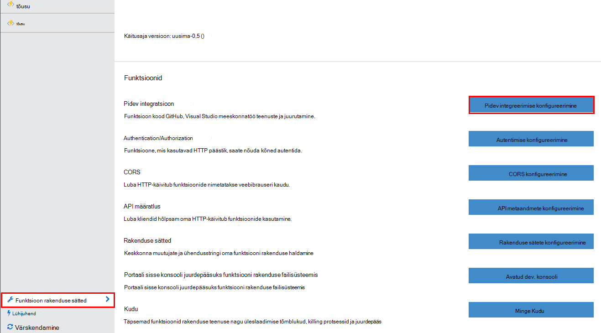
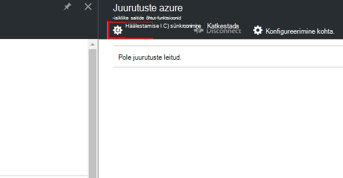
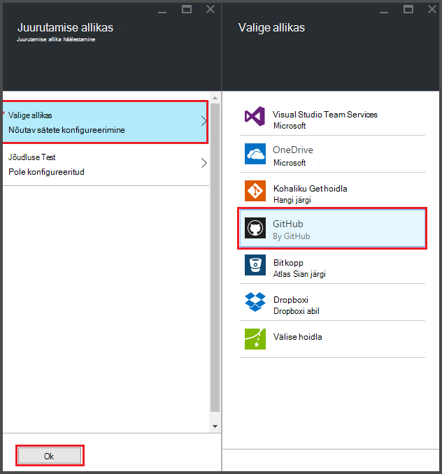
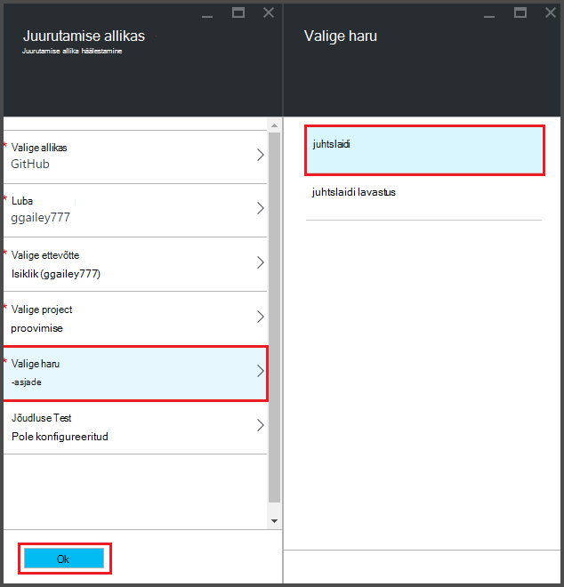
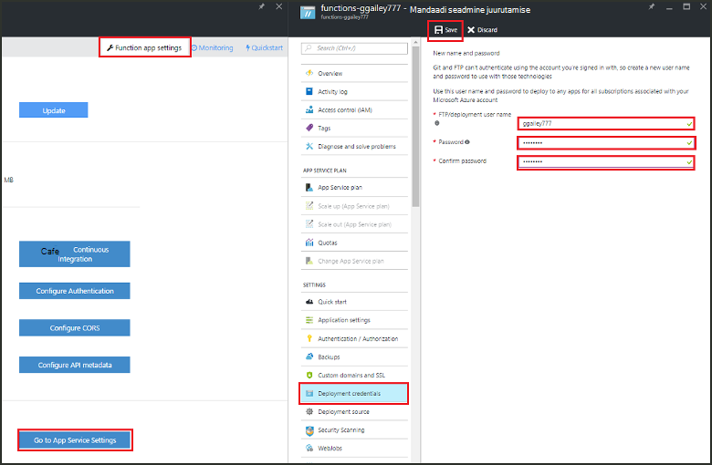
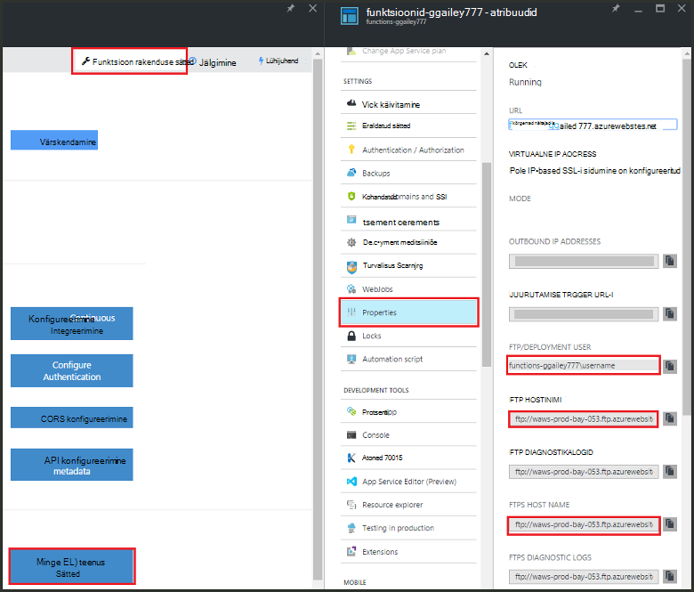
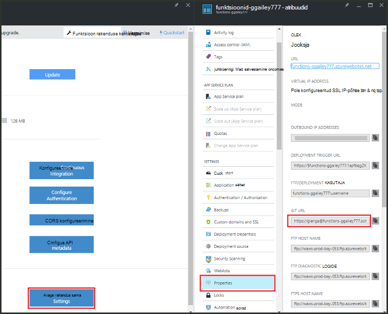

<properties
   pageTitle="Pidev juurutamise Azure'i funktsioonide | Microsoft Azure'i"
   description="Kasutada pideva Azure'i rakendust Service avaldada oma Azure'i funktsioonid."
   services="functions"
   documentationCenter="na"
   authors="ggailey777"
   manager="erikre"
   editor=""
   tags=""
   />

<tags
   ms.service="functions"
   ms.devlang="multiple"
   ms.topic="article"
   ms.tgt_pltfrm="multiple"
   ms.workload="na"
   ms.date="09/25/2016"
   ms.author="glenga"/>

# Azure'i funktsioonide pidev juurutamine 

Azure'i funktsioonide abil on lihtne konfigureerida pidev juurutuse rakenduse funktsioon. Funktsioonide mõjutab Azure'i rakendust Service integreerimine BitBucket, Dropboxi, GitHub ja Visual Studio meeskonnatöö teenused (VSTS) pideva töövoo, kus Azure'i tõmbab värskendused oma funktsioonide koodi kui need on avaldatud mõne sellise teenuse lubamiseks. Kui olete uus Azure'i funktsioone, alustage [Azure funktsioonide ülevaate](functions-overview.md).

Pideva on hea valik projektide jaoks, kus mitu ja sagedased osakaalu integreeritakse. Samuti saate säilitada oma funktsioonide kood Juhtelemendi allikas. Praegu toetatud juurutamise järgmistest allikatest:

+ [Bitbucket](https://bitbucket.org/)
+ [Dropboxi](https://bitbucket.org/)
+ [Kohaliku Git repo](../app-service-web/app-service-deploy-local-git.md)
+ Git välise repo
+ [GitHub]
+ Mercurial välise repo
+ [OneDrive'i](https://onedrive.live.com/)
+ Visual Studio Team Services

Juurutuste on konfigureeritud iga funktsioon rakenduse alusel. Pärast pideva on lubatud, funktsioon koodi portaalis juurdepääs on seatud *kirjutuskaitstud*.

## Pidev juurutamine nõuded

Juurutamise allikas enne saate seadistada pidev juurutamine peab olema konfigureeritud juurutamise allikas ja funktsioonide kood. Rakenduses rakendusejuurutuse antud funktsiooni, iga funktsiooni rakenduses nimega alamkausta, seal kaustanimi on funktsiooni nime. See kaust struktuur on põhiosas saidi kood. 

[AZURE.INCLUDE [functions-folder-structure](../../includes/functions-folder-structure.md)]

## Pidev juurutamise loomine

Pidev juurutamise olemasoleva funktsioon rakenduse konfigureerimiseks toimige järgmiselt:

1. Klõpsake [Azure funktsioonide portaali](https://functions.azure.com/signin)funktsioon rakenduse **funktsioon rakenduse sätete** > **konfigureerimine pidev integratsioon** > **häälestus**.

    
    
    
    
    Te saate ka juurutuste tera funktsioonide Kiirjuhend kaudu, klõpsates nuppu **Alusta Juhtelemendi allikas**.

2. Juurutuste labale nuppu **Vali allikas**, seejärel fill-in teie valitud juurutamise andmeallika teave ja klõpsake nuppu **OK**.

    

Pärast pidev juurutusega on konfigureeritud, funktsioon rakenduse kopeeritakse kõik muudatused failid oma juurutamise allikas ja terve saidi juurutamise käivitatakse. Saidi on asjaomases kui allikas failid on värskendatud.

##Juurutussuvandid

Järgnevalt on toodud mõned tüüpilised juurutamise stsenaariumide.

+ 

###Looge lavastus juurutamine

Funktsioon rakendused ei toeta veel juurutamine. Siiski saate endiselt hallata eraldi lavastus ja tootmise juurutuste pidev integreerimise abil.

Protsessi töötamine lavastus juurutamise ja konfigureerimiseks on tavaliselt järgmine:

1. Teie tellimus, üks soovitud kood ja üks lavastus kaks funktsioon rakenduste loomine 

2. Looge juurutamise allikas, kui teil pole veel üks. Kasutame [GitHub].
 
3. Oma tootmise funktsioon rakenduse **loomine pidev juurutamise** ülaltoodud juhiseid ja juurutamise haru määramine teie GitHub Repo juhtslaidi haru.

    

4. Korrake seda toimingut lavastus funktsioon rakenduse, kuid seekord valige lavastus haru oma GitHub repo. Kui juurutamise allikas ei toeta harude, kasutage mõnda muud kausta.
 
5. Värskendusi tegema oma koodi lavastus haru või kausta, siis veenduge, et need muudatused kajastuvad lavastus juurutamise.

6. Pärast katsetamine, Ühenda muutub lavastus kontorist juhtslaidi haru. See käivitab juurutamise tootmise funktsioon rakendus. Kui juurutamise allikas ei toeta harude, kirjutada kaustas tootmise lavastus kaustast failidega.

###Pideva olemasolevate funktsioonide teisaldamine

Kui teil on olemasolevaid funktsioonid, mida olete loonud ja säilitada portaalis, peate alla laadima olemasoleva funktsioon koodi faile FTP kaudu või kohaliku Git hoidla, enne kui saate seadistada pidev juurutamise eespool kirjeldatud. Saate seda teha rakenduse seadete rakenduse funktsioon. Pärast failide laaditakse, saate need teie valitud pidev juurutamise allikas üles laadida.

>[AZURE.NOTE]Pärast pidev integreerimise konfigureerimiseks enam võimalik redigeerida oma lähtefailid funktsioonide portaalis.

####Kuidas: juurutamise mandaadi konfigureerimine
Enne faile saate alla laadida rakenduse funktsioon, tuleb konfigureerida saidi, mida saate teha portaalist mandaat. Funktsioon rakenduse tasemel määratakse mandaat.

1. Klõpsake [Azure funktsioonide portaali](https://functions.azure.com/signin)funktsioon rakenduse **funktsioon rakenduse sätete** > **avage rakendus Teenusesätted** > **juurutamise mandaat**.

    

2. Tippige väljale Kasutajanimi ja parool ja seejärel klõpsake nuppu **Salvesta**. Nüüd saate neid mandaate juurde pääseda rakenduse funktsioon FTP või sisseehitatud Git repo.

####Kuidas: abil FTP-failide allalaadimiseks

1. Klõpsake [Azure funktsioonide portaali](https://functions.azure.com/signin)funktsioon rakenduse **funktsioon rakenduse sätete** > **avage rakendus Teenusesätted** > **Atribuudid** ja kopeerige väärtused **FTP/juurutamise kasutaja**, **FTP Host Name**ja **FTPS hosti nimi**.  
**Juurutamise/FTP kasutaja** peavad olema sisestatud kuvatud portaalis, sh rakenduse nime tagamiseks proper kontekstis FTP-serveris.

    
    
2. Ühendusteabe kliendilt FTP kasutamiseks saate kogutud ühenduse rakenduse ja allikas faile oma funktsioonide jaoks alla laadida.

####Kuidas: kohaliku Git hoidla kasutamine failide allalaadimine

1. Klõpsake [Azure funktsioonide portaali](https://functions.azure.com/signin)funktsioon rakenduse **funktsioon rakenduse sätete** > **konfigureerimine pidev integratsioon** > **häälestus**.

2. Juurutuste labale nuppu **Vali allikas**, **kohaliku Git hoidla**, seejärel klõpsake nuppu **OK**.
 
3. **Avage rakenduse sätted**nuppu > **Atribuudid** ja Git URL-i väärtust. 
    
    

4. Klooni repo oma kohalikus arvutis Git arvestada käsurea või oma lemmik Git tööriista abil. Käsk Git klooni näeb välja umbes selline:

        git clone https://username@my-function-app.scm.azurewebsites.net:443/my-function-app.git

5. Failide toomise funktsioon rakenduste abil klooni kohalikus arvutis, nagu järgmises näites:

        git pull origin master

    Nõudmisel esitama kasutajanimi ja parool, funktsioon rakenduse juurutamiseks.  

[GitHub]: https://github.com/
