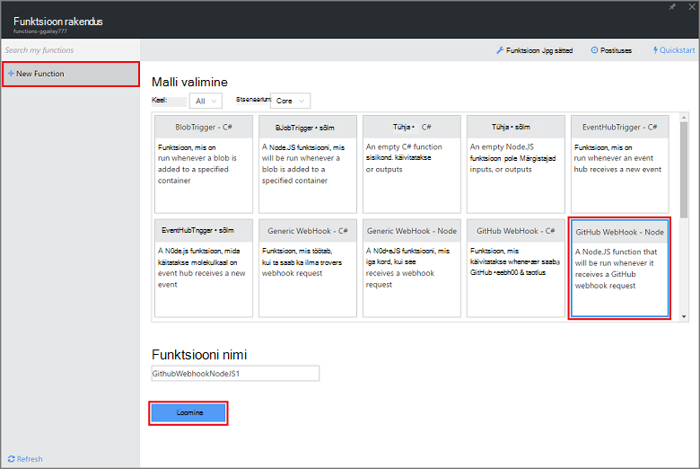
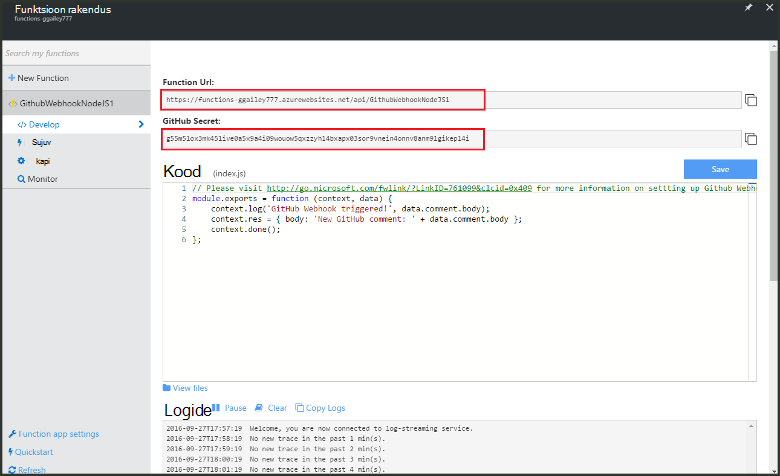
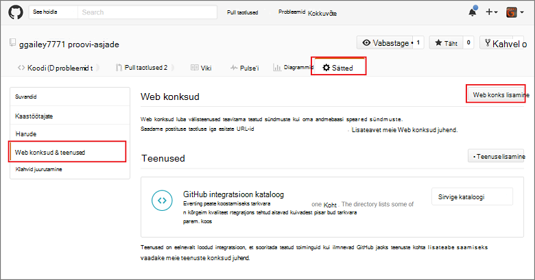
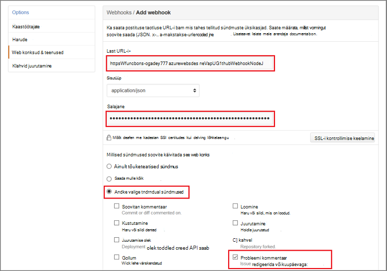

<properties
   pageTitle="Web konks või API Azure'i funktsiooni loomine | Microsoft Azure'i"
   description="Azure'i kasutage funktsioone luua funktsioon, mis kasutavad WebHook või API kõne."
   services="azure-functions"
   documentationCenter="na"
   authors="ggailey777"
   manager="erikre"
   editor=""
   tags=""
   />

<tags
   ms.service="functions"
   ms.devlang="multiple"
   ms.topic="get-started-article"
   ms.tgt_pltfrm="multiple"
   ms.workload="na"
   ms.date="08/30/2016"
   ms.author="glenga"/>
   
# Webhook või API Azure'i funktsiooni loomine

Azure'i funktsioonid on sündmuse põhinev, Arvuta nõudmisel kogemus, mis võimaldab teil luua ajastatud või vallandanud tähis rakendada erinevaid programmeerimise keeled. Azure'i funktsioonide kohta leiate lisateavet teemast [Azure funktsioonide ülevaate](functions-overview.md).

See teema näitab, kuidas luua uus Node.js funktsioon, mis kasutavad GitHub webhook. Uue funktsiooni luuakse Azure'i funktsioonide portaalis eelmääratletud malli põhjal. Samuti saate vaadake lühikest videot, et näha, kuidas need juhised on läbi portaalis.

## Vaadake videot

Järgmises videos näitab, kuidas teha selles õpetuses põhitoimingud 

[AZURE.VIDEO create-a-web-hook-or-api-azure-function]

##Funktsiooni webhook vallandanud loomine mallist

Funktsioon rakenduse majutab Azure oma ülesannete täitmise. Enne kui saate luua funktsiooni, peate olema aktiivne Azure'i konto. Kui teil pole veel Azure'i konto puhul [on saadaval tasuta kontod](https://azure.microsoft.com/free/). 

1. [Azure'i funktsioonide portaali](https://functions.azure.com/signin) ja logige sisse oma Azure'i konto.

2. Kui teil on funktsioon olemasoleva rakendust kasutada, valige see **funktsioon rakenduste** seejärel klõpsake nuppu **Ava**. Uus funktsioon rakenduse loomine, tippige uus funktsioon rakendus kordumatu **nimi** või nõustuda loodud üks, valige oma eelistatud **piirkond**, siis klõpsake **loomine + alustamine**. 

3. Funktsioon rakenduste korral valige **+ Uus funktsioon** > **GitHub Webhook - sõlm** > **loomine**. See loob funktsiooni vaikenime, mis on määratud malli põhjal. 

     

4. Märkus **töötada**, funktsioon sample express.js aknas **koodi** . Seda funktsiooni saab taotluse GitHub on probleem kommentaari webhook, logib probleemi teksti ja saadab vastuseks webhook nimega `New GitHub comment: <Your issue comment text>`.

     

5. Kopeerige **URL funktsioon** ja **GitHub salajane** väärtused. Peate need GitHub soovitud webhook loomisel. 

6. Kerige allapoole suvandini **käivitada**, Märkus mõne probleemi kommentaari koosolekukutse kehasse eelmääratletud JSON keha ja seejärel käsku **Käivita**. 
 
    Saate alati testida uue malli põhjal funktsiooni esitades mõnda vahekaarti **töötada** otse oodatud keha JSON andmed ja klõpsake nuppu **Käivita** . Sel juhul mall on eelmääratletud keha probleemi kommentaari. 
 
Järgmiseks loote tegelik webhook oma GitHub hoidla.

##Funktsiooni webhook konfigureerimine

1. GitHub, liikuge hoidla, mille omanik te olete; See hõlmab mis tahes hoidlate, mida teil on kahestunud.
 
2. Klõpsake nuppu **sätted** > **Webhooks ja teenuste** > **lisamine webhook**.

       

3. Kleepige oma funktsioon URL-i ja salajane **Last URL** ja **salajane**, klõpsake **lase mul valida üksikuid sündmusi**, valige **probleemi kommentaari** ja klõpsake nuppu **Lisa webhook**.

     

Selles etapis GitHub webhook on konfigureeritud käivitamiseks oma funktsioon, kui lisatakse uus probleemi kommentaar.  
Nüüd on aeg katsetada seda.

##Funktsiooni testimine

1. Teie GitHub repo, **probleemid** vahekaardi avamine uues brauseriaknas, **Uus teema**, tippige pealkiri seejärel käsku **Edasta uus teema**. Samuti saate avada olemasoleva probleemi.

2. Probleem, tippige kommentaar ja klõpsake nuppu **kommentaar**. Selles etapis saate tagasi minna oma uue webhook ka GitHub jaotises **Viimatised tarnete** vt webhook taotluse saadetud ja keha vastus on `New GitHub comment: <Your issue comment text>`.

3. Tagasi funktsioonide portaali, liikuge kerides jaotiseni logid ja leiate, et funktsioon on käivitanud ja väärtuse `New GitHub comment: <Your issue comment text>` kirjutatakse streaming logid.

##Järgmised sammud

Nende teemadest leiate Azure'i funktsioonide kohta.

+ [Azure'i funktsioonide tootearendusmaterjal](functions-reference.md)  
Programmeerija viide kodeerimise funktsioonide jaoks.
+ [Azure'i funktsioonide testimine](functions-test-a-function.md)  
Kirjeldatakse mitmesuguste tööriistade ja meetodite testimiseks oma funktsioonide abil.
+ [Kuidas mastaapimiseks Azure funktsioonid](functions-scale.md)  
Käsitletakse teenuse lepingute Azure'i funktsioonidega dünaamiline teenusleping, ja kuidas valida õige leping saadaval.  

[AZURE.INCLUDE [Getting Started Note](../../includes/functions-get-help.md)]
