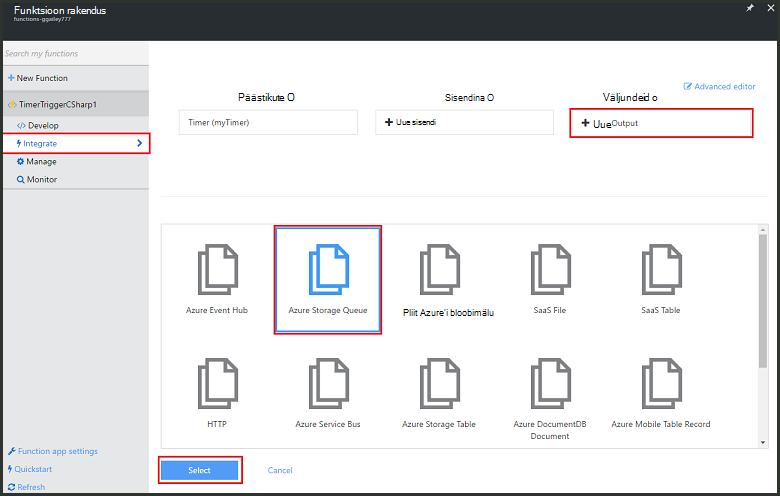
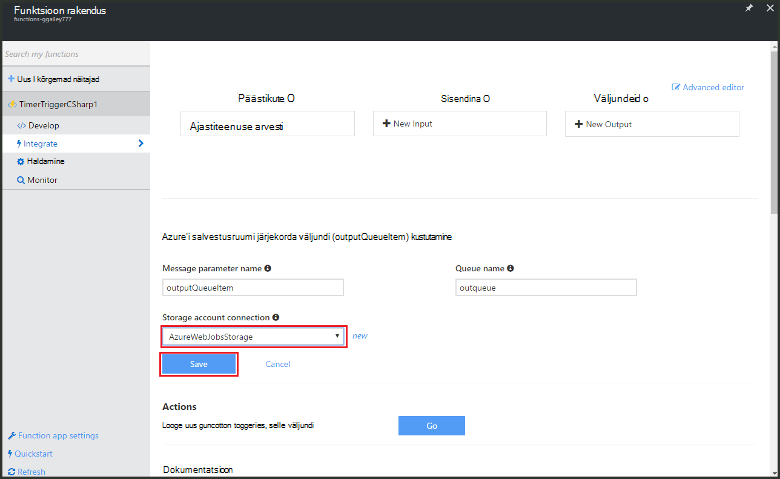

<properties
   pageTitle="Funktsioon töötlemine sündmuse loomine | Microsoft Azure'i"
   description="Funktsioonide kasutamine Azure luua funktsioon C#, mis töötab vastavalt ka sündmuse timer."
   services="functions"
   documentationCenter="na"
   authors="ggailey777"
   manager="erikre"
   editor=""
   tags=""
   />

<tags
   ms.service="functions"
   ms.devlang="multiple"
   ms.topic="get-started-article"
   ms.tgt_pltfrm="multiple"
   ms.workload="na"
   ms.date="09/25/2016"
   ms.author="glenga"/>
   
# Azure'i funktsioon töötlemine sündmuse loomine

Azure'i funktsioonid on sündmuse põhinev, Arvuta nõudmisel kogemus, mis võimaldab teil luua ajastatud või vallandanud tähis rakendada erinevaid programmeerimise keeled. Azure'i funktsioonide kohta leiate lisateavet teemast [Azure funktsioonide ülevaate](functions-overview.md).

See teema näitab, kuidas luua uus funktsioon C# mis käivitab põhjal mõni sündmus timer sõnumite salvestusruumi järjekorda lisada. 

## Eeltingimused 

Enne kui saate luua funktsiooni, peate olema aktiivne Azure'i konto. Kui teil pole veel Azure'i konto puhul [on saadaval tasuta kontod](https://azure.microsoft.com/free/).

## Funktsioon timer vallandanud loomine mallist

Funktsioon rakenduse majutab Azure oma ülesannete täitmise. Enne kui saate luua funktsiooni, peate olema aktiivne Azure'i konto. Kui teil pole veel Azure'i konto puhul [on saadaval tasuta kontod](https://azure.microsoft.com/free/). 

1. [Azure'i funktsioonide portaali](https://functions.azure.com/signin) ja logige sisse oma Azure'i konto.

2. Kui teil on funktsioon olemasoleva rakendust kasutada, valige see **funktsioon rakenduste** seejärel klõpsake nuppu **Ava**. Uus funktsioon rakenduse loomine, tippige uus funktsioon rakendus kordumatu **nimi** või nõustuda loodud üks, valige oma eelistatud **piirkond**, siis klõpsake **loomine + alustamine**. 

3. Funktsioon rakenduste korral valige **+ Uus funktsioon** > **TimerTrigger - C#** > **loomine**. See loob funktsiooni vaikenime, mida käitatakse iga minuti järel vaikeajakava. 

    

4. Teie uus funktsioon, klõpsake vahekaarti **integreerida** > **Uus väljundi** > **Azure salvestusruumi järjekorra** > **Valige**.

    

5. **Azure'i salvestusruumi järjekorda väljundi**, valige olemasoleva **salvestusruumi konto ühenduse**, või looge uus ja seejärel klõpsake nuppu **Salvesta**. 

    

6. Uuesti sisse **töötada** vahekaarti Asenda olemasolev C# skripti aknas **koodi** järgmine kood:

        using System;
        
        public static void Run(TimerInfo myTimer, out string outputQueueItem, TraceWriter log)
        {
            // Add a new scheduled message to the queue.
            outputQueueItem = $"Ping message added to the queue at: {DateTime.Now}.";
            
            // Also write the message to the logs.
            log.Info(outputQueueItem);
        }

    Järgmine kood lisab uue sõnumi järjekorda vastavalt praeguse kuupäeva ja kellaaja, kui funktsioon on täidetud.

7. Klõpsake nuppu **Salvesta** ja vaadake **logid** windows järgmise funktsiooni täitmiseks.

8. (Valikuline) Liikuge salvestusruumi konto ja veenduge, et sõnumite lisatakse järjekorda.

9. Minge tagasi vahekaardile **integreerida** ja muuta ajakava välja `0 0 * * * *`. Funktsioon töötab nüüd kord tunnis. 

See on väga lihtsustatud näide timer päästik nii salvestusruumi järjekorda väljund sidumine. Lisateabe saamiseks vt nii [Azure'i funktsioonide timer päästik](functions-bindings-timer.md) ja [Azure funktsioonide päästikute ja Azure Storage sidumiste](functions-bindings-storage.md) teemadest.

##Järgmised sammud

Nende teemadest leiate Azure'i funktsioonide kohta.

+ [Azure'i funktsioonide tootearendusmaterjal](functions-reference.md)  
Programmeerija viide kodeerimine funktsioonid ja määratlemine päästikute ja seosed.
+ [Azure'i funktsioonide testimine](functions-test-a-function.md)  
Kirjeldatakse mitmesuguste tööriistad ja nippidega, mis aitavad teie funktsioonide testimine.
+ [Kuidas mastaapimiseks Azure funktsioonid](functions-scale.md)  
Käsitletakse teenuse lepingute Azure'i funktsioonidega dünaamiline teenusleping, ja kuidas valida õige leping saadaval.  

[AZURE.INCLUDE [Getting Started Note](../../includes/functions-get-help.md)]
