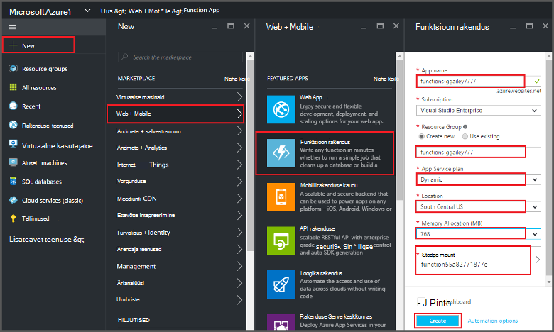
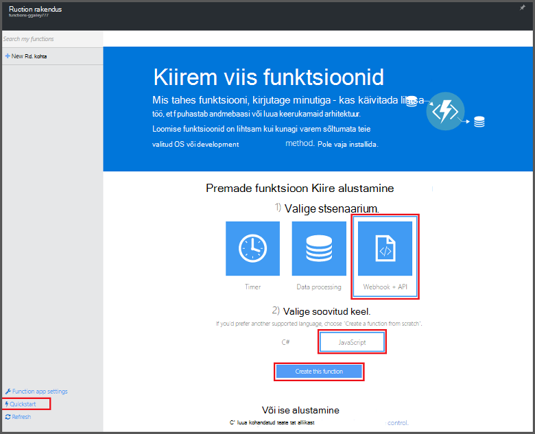
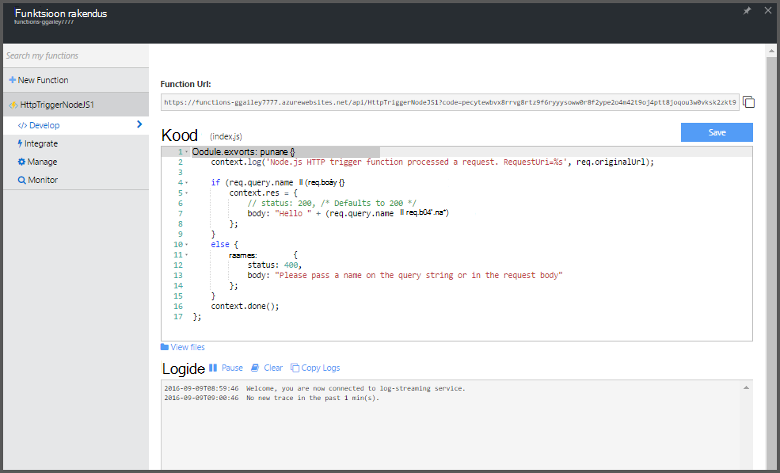

<properties
   pageTitle="Funktsiooni loomine Azure'i portaalis | Microsoft Azure'i"
   description="Koostage oma esimese Azure'i funktsioon serverless rakenduses kahest minutist."
   services="functions"
   documentationCenter="na"
   authors="ggailey777"
   manager="erikre"
   editor=""
   tags=""
/>

<tags
   ms.service="functions"
   ms.devlang="multiple"
   ms.topic="article"
   ms.tgt_pltfrm="multiple"
   ms.workload="na"
   ms.date="09/08/2016"
   ms.author="glenga"/>

#Funktsiooni Azure portaali loomine

##Ülevaade
Azure'i funktsioonid on sündmuse põhinev, Arvuta nõudmisel kogemus, mis laiendab olemasolevat Azure rakenduse platvormi rakendada koodi käivitada muude Azure'i teenuste, toodete SaaS ning kohapealse süsteemide sündmused võimalustega. Azure'i funktsioonidega nõudmisel põhineva oma rakenduste skaala ja maksate ainult ressursse, saate kasutada. Azure'i funktsioonide võimaldab teil luua ajastatud või vallandanud tähis programmeerimise erinevates keeltes rakendada. Azure'i funktsioonide kohta leiate lisateavet teemast [Azure funktsioonide ülevaate](functions-overview.md).

Selles teemas kirjeldatakse, kuidas kasutada Azure portaali luua lihtne "Tere, maailm" Node.js Azure'i funktsioon, mis kasutavad HTTP-lisamispäästiku. Enne kui saate luua funktsiooni Azure'i portaalis, peate looma konkreetselt funktsiooni rakenduse Azure'i rakendust Service. On teie jaoks automaatselt loodud funktsioon rakendus, lugege teemat [muude funktsioonide Azure'i Kiirjuhend õpetuse](functions-create-first-azure-function.md), mis on lihtsam Kiirjuhend kogemus ja sisaldab video.

##Funktsioon rakenduse loomine

Funktsioon rakenduse majutab Azure oma ülesannete täitmise. Järgmiste juhiste abil funktsioon rakenduse Azure portaali loomine.

Enne kui saate luua oma esimese funktsioon, peate olema aktiivne Azure'i konto. Kui teil pole veel Azure'i konto puhul [on saadaval tasuta kontod](https://azure.microsoft.com/free/).

1. [Azure'i portaali](https://portal.azure.com) ja logige sisse oma Azure'i konto.

2. Valige **+ Uus** > **Web + Mobile** > **Funktsioon rakendus**, valige oma **tellimuse**, tippige kordumatu **rakenduse nime** , milles kajastub rakenduse funktsioon ja seejärel määrake järgmised sätted:

    + **[Ressursirühm](../azure-portal/resource-group-portal.md/)**: valige **Loo uus** ja sisestage nimi uue ressursirühma. Olemasoleva ressursirühma, võite ka siis, kuid te ei saa luua dünaamiline teenuse rakendus kava funktsioon rakenduse.
    + **[Rakenduse teenusleping](../app-service/azure-web-sites-web-hosting-plans-in-depth-overview.md)**: valige *dünaamiline* või *klassikaline*. 
        + **Dünaamiliste**: Azure'i funktsioonide vaikimisi lepingu tüüp. Kui valite dünaamiline leping, peate ka valige **asukoht** ja määramine **Mälu jaotamine** (MB). Lisateavet selle kohta, kuidas mõjutab mälu kulud, leiate [Azure'i funktsioonide hinnad](https://azure.microsoft.com/pricing/details/functions/). 
        + **Klassikaline**: klassikaline rakenduse teenusleping jaoks on vaja luua oma **rakenduse leping/asukoht** või valige olemasoleva. Nende sätete kindlaks [asukoht, funktsioonide maksumus ja arvutada ressursid](https://azure.microsoft.com/pricing/details/app-service/) oma rakendusega seotud.  
    + **Salvestusruumi konto**: iga funktsioon rakenduse jaoks on vaja salvestusruumi konto. Saate valida olemasoleva salvestusruumi konto või luua. 

    

3. Klõpsake käsku **Loo** ettevalmistamine ja uus funktsioon minirakenduse juurutamine.  

Nüüd, kui funktsioon rakendus on ette valmistatud, saate luua oma esimese funktsioon.

## Funktsiooni loomine

Need juhised luua funktsiooni Kiirjuhend Azure'i funktsioonid.

1. Klõpsake menüüs **Kiirjuhend** **WebHook + API** ja **JavaScripti**, seejärel käsku **Loo funktsiooni.** Luuakse uus eelmääratletud Node.js funktsiooni. 

    

2. (Valikuline) Sel hetkel sisse Kiirjuhend, saate võtta kiirülevaate Azure'i funktsioonide funktsioonid portaalis.   Kui teil on lõpetatud või vahele tutvustuse, saate oma uue funktsiooni abil HTTP päästik testida.

##Funktsiooni testimine

Kuna Azure'i funktsioonide quickstarts sisaldavad otstarbekas koodi, saate oma uue funktsiooni kohe testida.

1. **Töötada** klõpsake menüüs läbivaatus **koodiakna** ja pange tähele, et see Node.js kood eeldab, et HTTP-päring sõnumi kehasse või päringustringi *nimi* väärtusega. Kui funktsioon töötab, tagastatakse see väärtus vastuse sõnumis.

    

2. Kerige allapoole suvandini **koosolekukutse kehasse** tekstivälja, *nime* atribuudi väärtust muuta oma nimi ja klõpsake nuppu **Käivita**. Näete, et täitmise käivitab testi HTTP päringu, teave on kirjutatud streaming logid ja "Tere" vastus ei kuvata **väljund**. 

3. Täitmise sama funktsiooni mõnest muust brauseriaknas või menüü käivitamiseks **töötada** menüü **Funktsioon URL-i** väärtus kopeerida ja kleepida brauseri aadressiribal, siis lisamine päringu stringi väärtuse `&name=yourname` ja vajutage enter. Sama teabega kirjutatakse logid ja brauseris kuvatakse enne tagasiside "Tere".

##Järgmised sammud

See Kiirjuhend näitab väga lihtne täitmine põhifunktsiooni HTTP-käivitub. Teemast Azure funktsioonide oma rakendustes power kasutamise kohta leiate lisateavet teemadest.

+ [Azure'i funktsioonide tootearendusmaterjal](functions-reference.md)  
Programmeerija viide kodeerimine funktsioonid ja määratlemine päästikute ja seosed.
+ [Azure'i funktsioonide testimine](functions-test-a-function.md)  
Kirjeldatakse mitmesuguste tööriistad ja nippidega, mis aitavad teie funktsioonide testimine.
+ [Kuidas mastaapimiseks Azure funktsioonid](functions-scale.md)  
Käsitletakse teenuse lepingute Azure'i funktsioonidega dünaamiline teenusleping, ja kuidas valida õige leping saadaval. 
+ [Mis on Azure rakenduse teenust?](../app-service/app-service-value-prop-what-is.md)  
Azure'i funktsioonide kasutab Azure'i rakendust Service platform põhifunktsioone, nagu juurutuste, keskkonna muutujate ja diagnostika. 

[AZURE.INCLUDE [Getting Started Note](../../includes/functions-get-help.md)]
