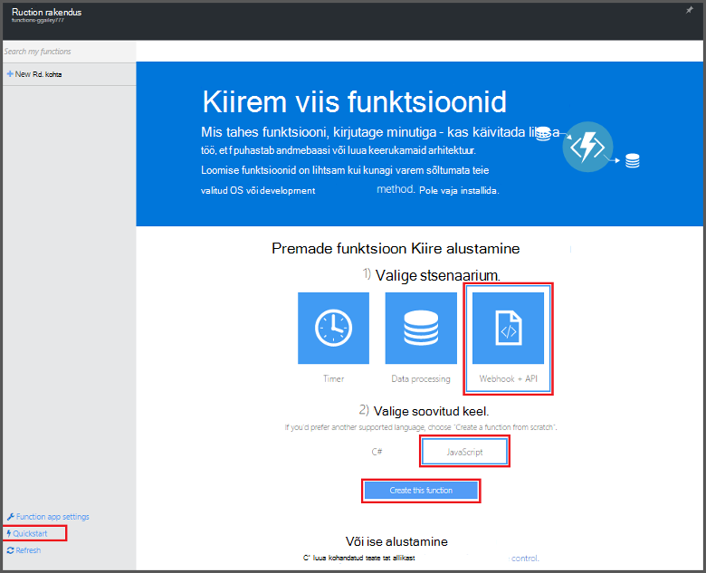
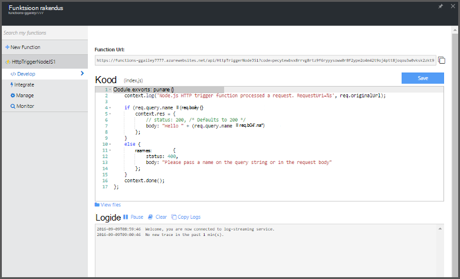

<properties
   pageTitle="Luua oma esimese Azure'i funktsioon | Microsoft Azure'i"
   description="Koostage oma esimese Azure'i funktsioon serverless rakenduses kahest minutist."
   services="functions"
   documentationCenter="na"
   authors="ggailey777"
   manager="erikre"
   editor=""
   tags=""
/>

<tags
   ms.service="functions"
   ms.devlang="multiple"
   ms.topic="hero-article"
   ms.tgt_pltfrm="multiple"
   ms.workload="na"
   ms.date="09/08/2016"
   ms.author="glenga"/>

#Oma esimese Azure'i funktsioon loomine

##Ülevaade
Azure'i funktsioonid on sündmuse põhinev, Arvuta nõudmisel kogemus, mis laiendab olemasolevat Azure rakenduse platvormi rakendada koodi käivitada muude Azure'i teenuste, toodete SaaS ning kohapealse süsteemide sündmused võimalustega. Azure'i funktsioonidega nõudmisel põhineva oma rakenduste skaala ja maksate ainult ressursse, saate kasutada. Azure'i funktsioonide võimaldab teil luua ajastatud või vallandanud tähis rakendada erinevaid programmeerimise keeled. Azure'i funktsioonide kohta leiate lisateavet teemast [Azure funktsioonide ülevaate](functions-overview.md).

Selles teemas näidatakse, kuidas kasutada Azure funktsioonide Kiirjuhend portaalis luua lihtsa "Tere, maailm" Node.js funktsiooni, mis kasutavad HTTP-lisamispäästiku. Samuti saate vaadake lühikest videot, et näha, kuidas need juhised on läbi portaalis.

## Vaadake videot

Järgmises videos näitab, kuidas teha põhitoimingud selles õpetuses. 

[AZURE.VIDEO create-your-first-azure-function-simple]

##Funktsiooni koostada on Kiirjuhend

Funktsioon rakenduse majutab Azure oma ülesannete täitmise. Järgmiste juhiste abil luua uus funktsioon rakendus kui ka uut funktsiooni. Uus funktsioon rakendus luuakse vaikimisi konfiguratsiooni. Näide sellest, kuidas funktsioon rakenduse loomine, vaadake [muid Azure'i funktsioonide Kiirjuhend õpetus](functions-create-first-azure-function-azure-portal.md).

Enne kui saate luua oma esimese funktsioon, peate olema aktiivne Azure'i konto. Kui teil pole veel Azure'i konto puhul [on saadaval tasuta kontod](https://azure.microsoft.com/free/).

1. [Azure'i funktsioonide portaali](https://functions.azure.com/signin) ja logige sisse oma Azure'i konto.

2. Tippige uus funktsioon rakendus kordumatu **nimi** või nõustuda loodud üks, valige oma eelistatud **piirkond**ja klõpsake nuppu **loomine + alustamine**. 

3. Klõpsake menüüs **Kiirjuhend** **WebHook + API** ja **JavaScripti**, seejärel käsku **Loo funktsiooni.** Luuakse uus eelmääratletud Node.js funktsiooni. 

    

4. (Valikuline) Sel hetkel sisse Kiirjuhend, saate võtta kiirülevaate Azure'i funktsioonide funktsioonid portaalis.   Kui teil on lõpetatud või vahele tutvustuse, saate oma uue funktsiooni abil HTTP päästik testida.

##Funktsiooni testimine

Kuna Azure'i funktsioonide quickstarts sisaldavad otstarbekas koodi, saate oma uue funktsiooni kohe testida.

1. **Töötada** klõpsake menüüs läbivaatus **koodiakna** ja pange tähele, et see Node.js kood eeldab, et HTTP-päring sõnumi kehasse või päringustringi *nimi* väärtusega. Kui funktsioon töötab, tagastatakse see väärtus vastuse sõnumis.

    

2. Kerige allapoole suvandini **koosolekukutse kehasse** tekstivälja, *nime* atribuudi väärtust muuta oma nimi ja klõpsake nuppu **Käivita**. Näete, et täitmise käivitab testi HTTP päringu, teave on kirjutatud streaming logid ja "Tere" vastus ei kuvata **väljund**. 

3. Täitmise sama funktsiooni mõnest muust brauseriaknas või menüü käivitamiseks **töötada** menüü **Funktsioon URL-i** väärtus kopeerida ja kleepida brauseri aadressiribal, siis lisamine päringu stringi väärtuse `&name=yourname` ja vajutage enter. Sama teabega kirjutatakse logid ja brauseris kuvatakse enne tagasiside "Tere".

##Järgmised sammud

See Kiirjuhend näitab väga lihtne täitmine põhifunktsiooni HTTP-käivitub. Vaadake järgmisi teemasid Lisateavet kasutamine power Azure'i funktsioonide oma rakendustes.

+ [Azure'i funktsioonide tootearendusmaterjal](functions-reference.md)  
Programmeerija viide kodeerimine funktsioonid ja määratlemine päästikute ja seosed.
+ [Azure'i funktsioonide testimine](functions-test-a-function.md)  
Kirjeldatakse mitmesuguste tööriistad ja nippidega, mis aitavad teie funktsioonide testimine.
+ [Kuidas mastaapimiseks Azure funktsioonid](functions-scale.md)  
Käsitletakse teenuse lepingute Azure'i funktsioonidega dünaamiline teenusleping, ja kuidas valida õige leping saadaval. 
+ [Mis on Azure rakenduse teenust?](../app-service/app-service-value-prop-what-is.md)  
Azure'i funktsioonide mõjutab Azure'i rakendust Service platvormi põhifunktsioone, nagu juurutuste, keskkonna muutujate ja diagnostika. 

[AZURE.INCLUDE [Getting Started Note](../../includes/functions-get-help.md)]
