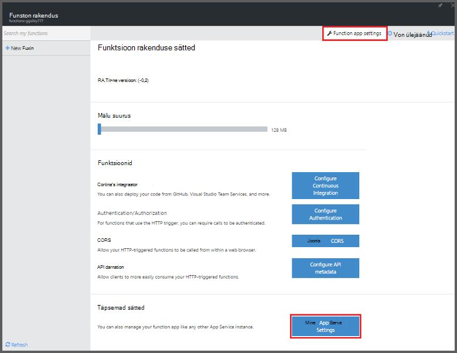
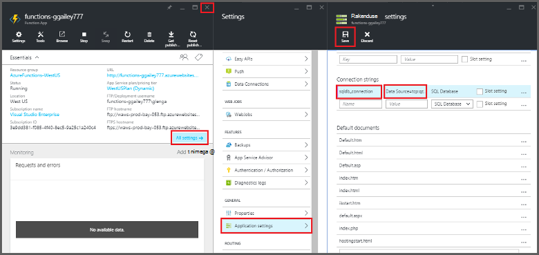
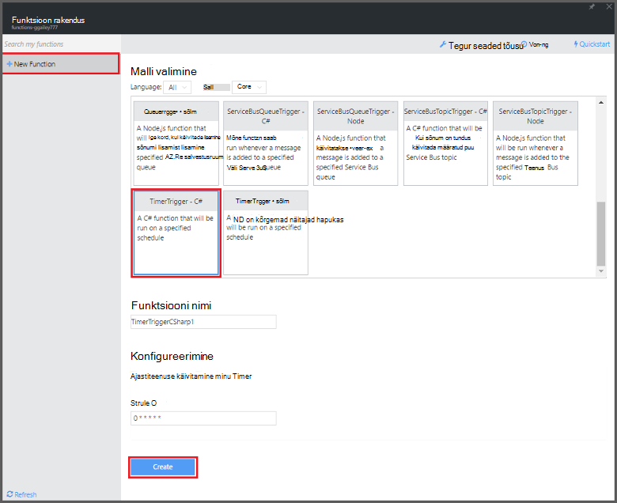

<properties
   pageTitle="Azure'i funktsioonide abil saate teha puhastamine ajastatud | Microsoft Azure'i"
   description="Funktsioonide kasutamine Azure luua funktsioon C#, mis töötab vastavalt ka sündmuse timer."
   services="functions"
   documentationCenter="na"
   authors="ggailey777"
   manager="erikre"
   editor=""
   tags=""
   />

<tags
   ms.service="functions"
   ms.devlang="multiple"
   ms.topic="article"
   ms.tgt_pltfrm="multiple"
   ms.workload="na"
   ms.date="09/26/2016"
   ms.author="glenga"/>
   
# Azure'i funktsioonide abil saate teha ajastatud puhastamine

Selles teemas kirjeldatakse, kuidas Azure'i funktsioonide abil saate luua uue funktsiooni C#, mis töötab vastavalt ka sündmuse timer puhastamiseks andmebaasi tabeli ridade. Uue funktsiooni luuakse Azure'i funktsioonide portaalis eelmääratletud malli põhjal. Toeta seda stsenaariumi, et peate määrama argumendi andmebaasi ühendusstringi rakenduse teenust seadmine rakenduses funktsioon. 

## Eeltingimused 

Enne kui saate luua funktsiooni, peate olema aktiivne Azure'i konto. Kui teil pole veel Azure'i konto puhul [on saadaval tasuta kontod](https://azure.microsoft.com/free/).

See teema näitab Transact-SQL-i käsk, mis käivitab hulgi cleanup toimingut tabelis nimega *TodoItems* SQL-andmebaasis. Kui täidate [Azure'i rakenduse teenuse mobiilirakenduste Kiirjuhend õpetuse](../app-service-mobile/app-service-mobile-ios-get-started.md)luuakse selle sama TodoItems tabel. Abil saate ka näidisandmebaasi, kui kasutate teine tabel, peate käsu Muuda.

Saate avada ühendusstringi kasutavad mobiilirakenduse kirjutamata portaalis **Kõik sätted**jaotises > **rakenduse sätted** > **ühendusstringi** > **ühenduse stringi väärtuste kuvamiseks** > **MS_TableConnectionString**. Samuti saate ühendusstringi otse portaalis **Kõik sätted**jaotises SQL-i andmebaasist > **Atribuudid** > **Kuva andmebaasi ühendusstringi** > **ADO.NET (SQL-i autentimise)**.

Sel juhul kasutab hulgi toiming andmebaasist. Kas teie funktsioon protsessi üksikute CRUD toimingud mobiilirakenduste kohta tabelis, kasutage selle asemel Mobile tabeli sidumine.

## Funktsioon rakenduses SQL-andmebaasi ühendusstringi seadmine

Funktsioon rakenduse majutab Azure oma ülesannete täitmise. See on parim salvestada ühendusstringi ja muude saladused funktsioon rakenduse sätted. See takistab juhusliku avaldamine, kui funktsioon koodi lõpetatakse-up repo kuhugi. 

1. [Azure'i funktsioonide portaali](https://functions.azure.com/signin) ja logige sisse oma Azure'i konto.

2. Kui teil on funktsioon olemasoleva rakendust kasutada, valige see **funktsioon rakenduste** seejärel klõpsake nuppu **Ava**. Uus funktsioon rakenduse loomine, tippige uus funktsioon rakendus kordumatu **nimi** või nõustuda loodud üks, valige oma eelistatud **piirkond**, siis klõpsake **loomine + alustamine**. 

3. Klõpsake rakenduse funktsioon **funktsioon rakenduse sätete** > **avage rakendus Teenusesätted**. 

    

4. Funktsioon rakenduse nuppu **Kõik sätted**, liikuge kerides allapoole **rakenduse sätted**ja seejärel klõpsake jaotises **ühendusstringi** tüüp `sqldb_connection` **nimi** **väärtus**ühendusstringi kleepida, klõpsake nuppu **Salvesta**ning sulgege funktsioon rakenduse tera funktsioonide portaali naasmiseks.

    

Nüüd saate lisada C# funktsioon koodi, mis loob ühenduse SQL-andmebaasi.

## Funktsioon timer vallandanud loomine mallist

1. Funktsioon rakenduste korral valige **+ Uus funktsioon** > **TimerTrigger - C#** > **loomine**. See loob funktsiooni vaikenime, mida käitatakse iga minuti järel vaikeajakava. 

    

2. **Töötada** menüü paanil **koodi** lisada järgmised komplekti viited ülaosas funktsioon kood:

        #r "System.Configuration"
        #r "System.Data"

3. Lisage järgmine `using` lauseid funktsiooni:

        using System.Configuration;
        using System.Data.SqlClient;
        using System.Threading.Tasks; 

4. Asendage olemasolevad **käivitage** funktsioon järgmine kood:

        public static async Task Run(TimerInfo myTimer, TraceWriter log)
        {
            var str = ConfigurationManager.ConnectionStrings["sqldb_connection"].ConnectionString;
            using (SqlConnection conn = new SqlConnection(str))
            {
                conn.Open();
                var text = "DELETE from dbo.TodoItems WHERE Complete='True'";
                using (SqlCommand cmd = new SqlCommand(text, conn))
                {
                    // Execute the command and log the # rows deleted.
                    var rows = await cmd.ExecuteNonQueryAsync();
                    log.Info($"{rows} rows were deleted");
                }
            }
        }

5. Klõpsake nuppu **Salvesta**, vaadake **logid** windows järgmise funktsiooni täitmise ja seejärel Märkus kustutatud TodoItems tabeli ridade arv.

6. (Valikuline) Täiendavate üksuste [mobiilirakenduste Kiirjuhend rakenduse](../app-service-mobile/app-service-mobile-ios-get-started.md)abil märkida, nagu "lõpule viia" seejärel **logid** aknasse naasmiseks ja vaadake sama arv ridu kustutada funktsiooni järgmise täitmise ajal. 

##Järgmised sammud

Nende teemadest leiate Azure'i funktsioonide kohta.

+ [Azure'i funktsioonide tootearendusmaterjal](functions-reference.md)  
Programmeerija viide kodeerimine funktsioonid ja määratlemine päästikute ja seosed.
+ [Azure'i funktsioonide testimine](functions-test-a-function.md)  
Kirjeldatakse mitmesuguste tööriistad ja nippidega, mis aitavad teie funktsioonide testimine.
+ [Kuidas mastaapimiseks Azure funktsioonid](functions-scale.md)  
Käsitletakse teenuse lepingute Azure'i funktsioonidega dünaamiline teenusleping, ja kuidas valida õige leping saadaval.  

[AZURE.INCLUDE [Getting Started Note](../../includes/functions-get-help.md)]